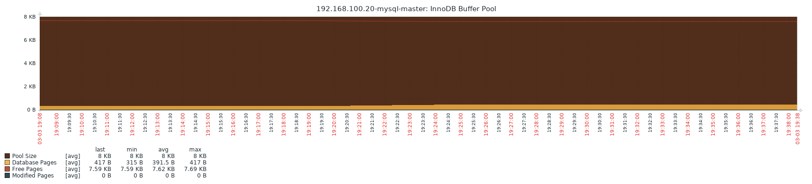

# 一. 部署 MySQL 主从环境

通过 percona 公司提供的 zabbix 监控 mysql 的监控模板和自定义脚本来
监控 MySQL 连接数、主从同步信息、同步延迟等状态信息。

环境：

| hostname       | IP             |
| :------------- | :------------- |
| zabbix-server1 | 192.168.100.17 |
| mysql-master   | 192.168.100.20 |
| mysql-slave    | 192.168.100.22 |

## 1.1 部署 MySQL master

使用 mysql 预编译的二进制包安装 mysql-5.7.28，使用脚本一键安装
部署 mysql 主从同步，需要配置不同的 server id 并开启 binlog

```bash
[root@mysql-master ~]# ip addr show eth0 | grep inet
    inet 192.168.100.20/24 brd 192.168.100.255 scope global noprefixroute eth0
    inet6 fe80::20c:29ff:fecc:2161/64 scope link

[root@mysql-master src]# pwd
/usr/local/src
[root@mysql-master src]# ll
total 795400
-rwxr--r--  1 root root          8683 Mar  3 15:59 auto_install_mysql.sh
-rw-r--r--  1 root root     811676432 Nov 18 14:03 mysql-5.7.28-el7-x86_64.tar.gz
...

[root@mysql-master src]# ./auto_install_mysql.sh
1.mysql-5.6.46-linux-glibc2.12-x86_64.tar.gz
2.mysql-5.7.26-el7-x86_64.tar.gz
3.mariadb-10.2.29-linux-x86_64.tar.gz
Select a version to install(1|2|3|q:quit):2
SElinux has been disabled.                                 [PASSED]
FireWall  disabled.                                        [  OK  ]
User mysql exists.                                         [PASSED]
Installing some deps and libs...
Deps and libs installed.                                   [  OK  ]
Extracting "mysql-5.7.28-el7-x86_64.tar.gz"...
Done, all files alocated in /usr/local/mysql-5.7.28-el7-x86[  OK  ]
/etc/my.cnf configured.                                    [  OK  ]
PATH variable configured.                                  [  OK  ]
Databases installed.                                       [  OK  ]
Starting MySQL. SUCCESS!
COMMAND  PID  USER   FD   TYPE DEVICE SIZE/OFF NODE NAME
mysqld  2335 mysql   20u  IPv6  27654      0t0  TCP *:mysql (LISTEN)
mysqld started successfully.                               [  OK  ]
sed: can't read /tmp/mysql5.7_databases_install.log: No such file or directory
Please input the passwd you want to set:stevenux
Enter password:
mysqladmin: connect to server at 'localhost' failed
error: 'Access denied for user 'root'@'localhost' (using password: YES)\'
You password for mysql5.7 are now stevenux.
Please run: source /etc/profile.d/mysql.sh
Default password for "mysql-5.7.28-el7-x86_64" please check: "/tmp/mysql-5.7.28-el7-x86_64_databases_install.log"
# 安装ok


# 密码未修改成功可以查看/mysql-5.7.28-el7-x86_64" please check: "/tmp/mysql-5.7.28-el7-x86_64_databases_install.log获取随机密码
# mysql -uroot -pPASS
# mysql> ALTER USER USER() IDENTIFIED BY 'stevenux'; 修改当前登录用户的密码


[root@mysql-master ~]# vim /etc/my.cnf

[mysqld]
datadir=/data/mysql
socket=/data/mysql/mysql.sock
user=mysql
# Disabling symbolic-links is recommended to prevent assorted security risks
symbolic-links=0
datadir=/data/mysql
innodb_file_per_table=1
server-id=20
log-bin=/data/mysql/master-log

[mysqld_safe]
log-error=/var/log/mysql.log
pid-file=/var/run/mysql/mysql.pid

[client]
port=3306
socket=/data/mysql/mysql.sock

# 将mysql安装包和脚本拷贝到slave：192.168.100.22
[root@mysql-master src]# scp auto_install_mysql.sh mysql-5.7.28-el7-x86_64.tar.gz 192.168.100.22:/usr/local/src
The authenticity of host '192.168.100.22 (192.168.100.22)' can't be established.
ECDSA key fingerprint is SHA256:Th4hwF8/bfgThJ5IrqAGh3GSsasTSmHmPfVNDI6EKss.
ECDSA key fingerprint is MD5:fb:cf:db:aa:73:87:4c:8f:4e:bb:c3:d8:45:14:20:0e.
Are you sure you want to continue connecting (yes/no)? yes
Warning: Permanently added '192.168.100.22' (ECDSA) to the list of known hosts.
root@192.168.100.22's password:
auto_install_mysql.sh                                                                                                 100% 8683     1.6MB/s   00:00
mysql-5.7.28-el7-x86_64.tar.gz                                                                                        100%  774MB  75.8MB/s   00:10
```

## 1.2 部署 MySQL slave

```bash
[root@mysql-master ~]# ip addr show eth0 | grep inet
    inet 192.168.100.20/24 brd 192.168.100.255 scope global noprefixroute eth0
    inet6 fe80::20c:29ff:fecc:2161/64 scope link

[root@mysql-slave src]# pwd
/usr/local/src
[root@mysql-slave src]# ll
total 795400
-rwxr--r--  1 root root          8683 Mar  3 16:20 auto_install_mysql.sh
-rw-r--r--  1 root root     811676432 Mar  3 16:21 mysql-5.7.28-el7-x86_64.tar.gz
...

# 安装
[root@mysql-slave src]# ./auto_install_mysql.sh
1.mysql-5.6.46-linux-glibc2.12-x86_64.tar.gz
2.mysql-5.7.28-el7-x86_64.tar.gz
3.mariadb-10.2.29-linux-x86_64.tar.gz
Select a version to install(1|2|3|q:quit):2
SElinux has been disabled.                                 [PASSED]
FireWall  disabled.                                        [  OK  ]
User mysql exists.                                         [PASSED]
Installing some deps and libs...
Deps and libs installed.                                   [  OK  ]
Extracting "mysql-5.7.28-el7-x86_64.tar.gz"...
Done, all files alocated in /usr/local/mysql-5.7.28-el7-x86[  OK  ]
/etc/my.cnf configured.                                    [  OK  ]
PATH variable configured.                                  [  OK  ]
Databases installed.                                       [  OK  ]
Starting MySQL. SUCCESS!
COMMAND  PID  USER   FD   TYPE DEVICE SIZE/OFF NODE NAME
mysqld  2252 mysql   20u  IPv6  26470      0t0  TCP *:mysql (LISTEN)
mysqld started successfully.                               [  OK  ]
sed: can't read /tmp/mysql5.7_databases_install.log: No such file or directory
Please input the passwd you want to set:stevenux
Enter password:
mysqladmin: connect to server at 'localhost' failed
error: 'Access denied for user 'root'@'localhost' (using password: YES)\'
You password for mysql5.7 are now stevenux.
Please run: source /etc/profile.d/mysql.sh
Default password for "mysql-5.7.28-el7-x86_64" please check: "/tmp/mysql-5.7.28-el7-x86_64_databases_install.log"
[root@mysql-slave src]# source /etc/profile.d/mysql.sh


# 修改配置文件
[root@mysql-slave ~]# vim /etc/my.cnf
[mysqld]
datadir=/data/mysql
socket=/data/mysql/mysql.sock
user=mysql
# Disabling symbolic-links is recommended to prevent assorted security risks
symbolic-links=0

datadir=/data/mysql
innodb_file_per_table=1
relay-log = /data/mysql
server-id=22

[mysqld_safe]
log-error=/var/log/mysql.log
pid-file=/var/run/mysql/mysql.pid

[client]
port=3306
socket=/data/mysql/mysql.sock
```

## 1.3 Master 授权 slave 和备份数据

```bash
[root@mysql-master ~]# mysql -uroot -p
Enter password:
Welcome to the MySQL monitor.  Commands end with ; or \g.
Your MySQL connection id is 2
Server version: 5.7.28-log MySQL Community Server (GPL)

mysql> create database stevenux;
Query OK, 1 row affected (0.00 sec)

mysql> show databases;
+--------------------+
| Database           |
+--------------------+
| information_schema |
| mysql              |
| performance_schema |
| stevenux           |
| sys                |
+--------------------+
5 rows in set (0.01 sec)

mysql> GRANT REPLICATION SLAVE,REPLICATION CLIENT ON *.* TO 'stevenux'@'192.168.100.22' IDENTIFIED BY 'stevenux';
Query OK, 0 rows affected, 1 warning (0.01 sec)

mysql> exit
Bye

# 备份数据
[root@mysql-master ~]# mysqldump -uroot -p --all-databases  --single_transaction --flush-logs --master-data=2 --lock-tables > /opt/backup.sql
Enter password:
[root@mysql-master ~]# ll /opt/backup.sql
-rw-r--r-- 1 root root 848205 Mar  3 16:31 /opt/backup.sql
[root@mysql-master ~]# scp /opt/backup.sql 192.168.100.22:/opt/
root@192.168.100.22's password:
backup.sql
```

## 1.4 Slave 导入 master 备份数据

在 master 上确认 binlog 文件名和位置

```bash
mysql> SHOW MASTER STATUS;
+-------------------+----------+--------------+------------------+-------------------+
| File              | Position | Binlog_Do_DB | Binlog_Ignore_DB | Executed_Gtid_Set |
+-------------------+----------+--------------+------------------+-------------------+
| master-log.000002 |      154 |              |                  |                   |
+-------------------+----------+--------------+------------------+-------------------+
1 row in set (0.00 sec)

```

在 slave 上执行`CHANGE MASTER TO`命令

```bash
[root@mysql-slave ~]# mysql -uroot -p
Enter password:

mysql> source /opt/backup.sql
mysql> show databases;
+--------------------+
| Database           |
+--------------------+
| information_schema |
| mysql              |
| performance_schema |
| stevenux           |
| sys                |
+--------------------+
5 rows in set (0.00 sec)

mysql> CHANGE MASTER TO MASTER_HOST='192.168.100.20',MASTER_USER='stevenux',MASTER_PASSWORD='stevenux',MASTER_LOG_FILE='master-log.000002',MASTER_LOG_POS=154;

mysql> start slave;

mysql> show slave status\G
*************************** 1. row ***************************
               Slave_IO_State: Waiting for master to send event
                  Master_Host: 192.168.100.20
                  Master_User: stevenux
                  Master_Port: 3306
                Connect_Retry: 60
              Master_Log_File: master-log.000003
          Read_Master_Log_Pos: 1043
               Relay_Log_File: mysql.000002
                Relay_Log_Pos: 1210
        Relay_Master_Log_File: master-log.000003
             Slave_IO_Running: Yes
            Slave_SQL_Running: Yes
            ...
     Slave_SQL_Running_State: Slave has read all relay log; waiting for more updates
     ...

mysql> use stevenux;
Reading table information for completion of table and column names
You can turn off this feature to get a quicker startup with -A

Database changed
mysql> show tables;
+--------------------+
| Tables_in_stevenux |
+--------------------+
| stevenux           |
+--------------------+
1 row in set (0.00 sec)
```

# 二. 使用 Percona 监控插件

官方文档及下载地址：

[插件地址](https://www.percona.com/doc/percona-monitoring-plugins/LATEST/zabbix/index.html)
[安装包下载地址](https://www.percona.com/downloads/)
[安装教程](https://www.percona.com/doc/percona-monitoring-plugins/LATEST/zabbix/index.html)

## 2.1 Master 安装 zabbix agent

```bash
[root@mysql-master ~]# rpm -Uvh https://repo.zabbix.com/zabbix/4.0/rhel/7/x86_64/zabbix-release-4.0-2.el7.noarch.rpm
Retrieving https://repo.zabbix.com/zabbix/4.0/rhel/7/x86_64/zabbix-release-4.0-2.el7.noarch.rpm
warning: /var/tmp/rpm-tmp.qOXY8I: Header V4 RSA/SHA512 Signature, key ID a14fe591: NOKEY
Preparing...                          ################################# [100%]
Updating / installing...
   1:zabbix-release-4.0-2.el7         ################################# [100%]
[root@mysql-master ~]# yum install zabbix-agent -y

[root@mysql-master ~]# vim /etc/zabbix/zabbix_agentd.conf
[root@mysql-master ~]#  grep "^[a-Z]" /etc/zabbix/zabbix_agentd.conf
PidFile=/var/run/zabbix/zabbix_agentd.pid
LogFile=/var/log/zabbix/zabbix_agentd.log
LogFileSize=0
Server=192.168.100.17
StartAgents=5
ServerActive=127.0.0.1
Hostname=192.168.100.20
AllowRoot=1
User=root
Include=/etc/zabbix/zabbix_agentd.d/*.conf

[root@mysql-master ~]# systemctl restart zabbix-agent.service
[root@mysql-master ~]# systemctl enable zabbix-agent.service
Created symlink from /etc/systemd/system/multi-user.target.wants/zabbix-agent.service to /usr/lib/systemd/system/zabbix-agent.service.
```

## 2.2 Master 安装 Percona

修改 zabbix agent 启动用户为 root，包括 zabbix agent 配置文件和服务启动文件。

Ubuntu:

```bash
安装Percona软件包：
# dpkg -i percona-zabbix-templates_1.1.8-1.artful_all.deb
# cp /var/lib/zabbix/percona/templates/userparameter_percona_mysql.conf
/etc/zabbix/zabbix_agentd.d/
# systemctl  restart zabbix-agent
安装php环境： 目前Percona与ubuntu 自带的php 7.2不兼容，需要安装php 5.6版本
# add-apt-repository ppa:ondrej/php
# apt-get -y update
# apt install -y php5.6 php5.6-mysql
创建mysql认证文：
# cat  /var/lib/zabbix/percona/scripts/ss_get_mysql_stats.php.cnf 件
<?php
$mysql_user = 'root';
$mysql_pass = '';
```

Centos:

```bash
# 安装percona源
[root@mysql-master ~]# yum install http://www.percona.com/downloads/percona-release/redhat/0.1-4/percona-release-0.1-4.noarch.rpm
[root@mysql-master ~]# yum install percona-zabbix-templates

# 安装监控插件
[root@mysql-master ~]# rpm -ql percona-zabbix-templates
/var/lib/zabbix/percona
/var/lib/zabbix/percona/scripts
/var/lib/zabbix/percona/scripts/get_mysql_stats_wrapper.sh  ## 是监控获取MySQL状态的
/var/lib/zabbix/percona/scripts/ss_get_mysql_stats.php      ## 是配置连接数据库用户名密码等，用shell来调用该PHP文件
/var/lib/zabbix/percona/templates
/var/lib/zabbix/percona/templates/userparameter_percona_mysql.conf    ## 实际zabbix agent需要的配置文件
/var/lib/zabbix/percona/templates/zabbix_agent_template_percona_mysql_server_ht_2.0.9-sver1.1.8.xml


# 安装php环境
[root@mysql-master ~]# yum list php php-mysql
Loaded plugins: fastestmirror
Loading mirror speeds from cached hostfile
Available Packages
php.x86_64                                                                5.4.16-46.el7                                                           ALIYUN
php-mysql.x86_64                                                          5.4.16-46.el7                                                           ALIYUN
[root@mysql-master ~]# yum install j-y php php-mysql
```

拷贝监控项到 agent 配置文件包含目录，创建 mysql 认证文件

```bash
[root@mysql-master ~]# cp /var/lib/zabbix/percona/templates/userparameter_percona_mysql.conf /etc/zabbix/zabbix_agentd.d/
[root@mysql-master ~]# vim /var/lib/zabbix/percona/scripts/ss_get_mysql_stats.php.conf
[root@mysql-master ~]# cat /var/lib/zabbix/percona/scripts/ss_get_mysql_stats.php.cnf
<?php
$mysql_user = 'root';
$mysql_pass = '';
```

修改 zabbix agent 启动用户为 root:

```bash
[root@mysql-master ~]# vim /etc/zabbix/zabbix_agentd.conf
...
### Option: AllowRoot
#       Allow the agent to run as 'root'. If disabled and the agent is started by 'root', the agent
#       will try to switch to the user specified by the User configuration option instead.
#       Has no effect if started under a regular user.
#       0 - do not allow
#       1 - allow
#
# Mandatory: no
# Default:
AllowRoot=1

### Option: User
#       Drop privileges to a specific, existing user on the system.
#       Only has effect if run as 'root' and AllowRoot is disabled.
#
# Mandatory: no
# Default:
User=root
...

[root@mysql-master ~]# vim /usr/lib/systemd/system/zabbix-agent.service
[Unit]
Description=Zabbix Agent
After=syslog.target
After=network.target

[Service]
Environment="CONFFILE=/etc/zabbix/zabbix_agentd.conf"
EnvironmentFile=-/etc/sysconfig/zabbix-agent
Type=forking
Restart=on-failure
PIDFile=/run/zabbix/zabbix_agentd.pid
KillMode=control-group
ExecStart=/usr/sbin/zabbix_agentd -c $CONFFILE
ExecStop=/bin/kill -SIGTERM $MAINPID
RestartSec=10s
User=root     # 不用忘了启动文件
Group=root

[Install]
WantedBy=multi-user.target

[root@mysql-master ~]# ps -ef | grep zabbix
root       5140      1  0 17:53 ?        00:00:00 /usr/sbin/zabbix_agentd -c /etc/zabbix/zabbix_agentd.conf
root       5141   5140  0 17:53 ?        00:00:00 /usr/sbin/zabbix_agentd: collector [idle 1 sec]
root       5142   5140  0 17:53 ?        00:00:00 /usr/sbin/zabbix_agentd: listener #1 [waiting for connection]
root       5143   5140  0 17:53 ?        00:00:00 /usr/sbin/zabbix_agentd: listener #2 [waiting for connection]
root       5144   5140  0 17:53 ?        00:00:00 /usr/sbin/zabbix_agentd: listener #3 [waiting for connection]
root       5145   5140  0 17:53 ?        00:00:00 /usr/sbin/zabbix_agentd: listener #4 [waiting for connection]
root       5146   5140  0 17:53 ?        00:00:00 /usr/sbin/zabbix_agentd: listener #5 [waiting for connection]
root       5147   5140  0 17:53 ?        00:00:00 /usr/sbin/zabbix_agentd: active checks #1 [idle 1 sec]
root       5179   2413  0 17:55 pts/1    00:00:00 grep --color=auto zabbix
```

测试：

```bash
# 下面的测试无数据，也不报错
[root@mysql-master opt]# /var/lib/zabbix/percona/scripts/get_mysql_stats_wrapper.sh gg
[root@mysql-master opt]# /var/lib/zabbix/percona/scripts/get_mysql_stats_wrapper.sh ov
[root@mysql-master opt]# /var/lib/zabbix/percona/scripts/get_mysql_stats_wrapper.sh nm

[root@mysql-master opt]# /var/lib/zabbix/percona/scripts/get_mysql_stats_wrapper.sh nm

# 看一下脚本源码
[root@mysql-master opt]# cat /var/lib/zabbix/percona/scripts/get_mysql_stats_wrapper.sh
#!/bin/sh
...
CMD="/usr/bin/php -q $DIR/ss_get_mysql_stats.php --host $HOST --items gg"
...
else
    echo "ERROR: run the command manually to investigate the problem: $CMD"
    # 出错了后提示使用运行CMD变量保存的命令来看看错误。
fi
...

# 使用脚本中的命令来测试，包出错信息了
[root@mysql-master etc]# /usr/bin/php -q /var/lib/zabbix/percona/scripts/ss_get_mysql_stats.php --host localhost --items gg
ERROR: Can't connect to local MySQL server through socket '/var/lib/mysql/mysql.sock\' (2)

# 解决
[root@mysql-master opt]# vim /etc/my.cnf
[mysqld]
#socket=/data/mysql/mysql.sock
socket=/var/lib/mysql/mysql.sock
...

[mysqld_safe]
...

[client]
#socket=/data/mysql/mysql.sock
socket=/var/lib/mysql/mysql.sock
...

[root@mysql-master opt]# systemctl restart mysqld.service

# 卧槽，有数据了
[root@mysql-master opt]# /var/lib/zabbix/percona/scripts/get_mysql_stats_wrapper.sh gg
18
[root@mysql-master opt]# /var/lib/zabbix/percona/scripts/get_mysql_stats_wrapper.sh hk
0
[root@mysql-master opt]# /var/lib/zabbix/percona/scripts/get_mysql_stats_wrapper.sh mn
0
[root@mysql-master opt]# /var/lib/zabbix/percona/scripts/get_mysql_stats_wrapper.sh ji
0
[root@mysql-master opt]# /var/lib/zabbix/percona/scripts/get_mysql_stats_wrapper.sh jt
1048576
[root@mysql-master opt]# /var/lib/zabbix/percona/scripts/get_mysql_stats_wrapper.sh oj
0
[root@mysql-master opt]# /var/lib/zabbix/percona/scripts/get_mysql_stats_wrapper.sh op
0
[root@mysql-master opt]# /var/lib/zabbix/percona/scripts/get_mysql_stats_wrapper.sh oq
0
[root@mysql-master opt]# /var/lib/zabbix/percona/scripts/get_mysql_stats_wrapper.sh or
0
[root@mysql-master opt]# /var/lib/zabbix/percona/scripts/get_mysql_stats_wrapper.sh os
0
[root@mysql-master opt]# /var/lib/zabbix/percona/scripts/get_mysql_stats_wrapper.sh ot
0
[root@mysql-master opt]# /var/lib/zabbix/percona/scripts/get_mysql_stats_wrapper.sh ou
```

## 2.3 zabbix web 导入 Percona 模板


## 2.4 添加 master 主机


## 2.5 关联模板到主机


## 2.6 验证监控数据

### 2.6.1 查看最新数据


### 2.6.2 查看图形





# 三. 编写脚本监控 MySQL slave

## 3.1 Slave 安装 zabbix agent

```bash
[root@mysql-slave ~]# rpm -Uvh https://repo.zabbix.com/zabbix/4.0/rhel/7/x86_64/zabbix-release-4.0-2.el7.noarch.rpm
Retrieving https://repo.zabbix.com/zabbix/4.0/rhel/7/x86_64/zabbix-release-4.0-2.el7.noarch.rpm
warning: /var/tmp/rpm-tmp.TEwN5P: Header V4 RSA/SHA512 Signature, key ID a14fe591: NOKEY
Preparing...                          ################################# [100%]
Updating / installing...
   1:zabbix-release-4.0-2.el7         ################################# [100%]
[root@mysql-slave ~]# yum install zabbix-agent -y
```

## 3.2 编写脚本

编写脚本获取 slave 复制延后 master 的值和 slave 的 IO 及 SQL 线程运行状态

编写脚本思路：

```bash
[root@mysql-slave ~]# mysql -uroot -e "show slave status\G;" | grep Seconds_Behind_Master
        Seconds_Behind_Master: 0
[root@mysql-slave ~]# mysql -uroot -e "show slave status\G;" | grep "Seconds_Behind_Master"
        Seconds_Behind_Master: 0
[root@mysql-slave ~]# mysql -uroot -e "show slave status\G;" | grep "Seconds_Behind_Master" | awk '{print $2}'
0
[root@mysql-slave ~]# mysql -uroot -e "show slave status\G;" | grep "Slave_IO_Running" | awk '{print $2}'
Yes
[root@mysql-slave ~]# mysql -uroot -e "show slave status\G;" | grep "Slave_SQL_Running" | awk -w '{print $2}'
Yes
...
```

编写脚本：

```bash
[root@mysql-slave zabbix_agentd.d]# vim get_mysql_slave_status.sh
#!/bin/bash
#
# Edited on 2020.03.03 by suosuoli.cn
#

get_sec_behind_master(){

    SEC=`mysql -uroot -e "show slave status\G;" | grep "Seconds_Behind_Master" | awk '{print $2}'`
    echo $SEC

}

get_slave_repl_status(){

IO_T=`mysql -uroot -e "show slave status\G;" | grep "Slave_IO_Running" | awk '{print $2}'`
SQL_T=`mysql -uroot -e "show slave status\G;" | grep -w "Slave_SQL_Running" | awk '{print $2}'`

if [[ $IO_T == "Yes" ]] && [[  $SQL_T == "Yes" ]]; then
    # echo "Yes"
    echo 1
else
    # echo "No"
    echo 0
fi

}

main(){

case $1 in
    sec_behind)
        get_sec_behind_master;
    ;;
    repl_status)
        get_slave_repl_status;
    ;;
esac

}

main $1
```

## 3.3 在 agent 配置文件加监控入口

```bash
[root@mysql-slave zabbix_agentd.d]# pwd
/etc/zabbix/zabbix_agentd.d

[root@mysql-slave zabbix_agentd.d]# ip addr show eth0 | grep inet
    inet 192.168.100.22/24 brd 192.168.100.255 scope global noprefixroute eth0
    inet6 fe80::20c:29ff:fed8:fdd1/64 scope link

[root@mysql-slave zabbix_agentd.d]# cat userParams.conf
UserParameter=MySQLCheck[*],/etc/zabbix/zabbix_agentd.d/get_mysql_slave_status.sh "$1"

[root@mysql-slave zabbix_agentd.d]# systemctl restart zabbix-agent.service
```

## 3.4 在 zabbix server 测试获取数据

```bash
[root@zabbix-server1 ~]# ip addr show eth0 | grep inet
    inet 192.168.100.17/24 brd 192.168.100.255 scope global noprefixroute eth0
    inet6 fe80::20c:29ff:feb3:288f/64 scope link
[root@zabbix-server1 ~]# /apps/zabbix_server/bin/zabbix_get  -s 192.168.100.22 -p 10050 -k "MySQLCheck["repl_status"]"
1
[root@zabbix-server1 ~]# /apps/zabbix_server/bin/zabbix_get  -s 192.168.100.22 -p 10050 -k "MySQLCheck["sec_behind"]"
0

```

## 3.5 自定义模板

### 2.5.1 创建模板


### 2.5.2 添加监控项

数据同步延迟


slave 线程状态


### 2.5.3 添加触发器

IO 线程或 SQL 线程停止触发器


复制延迟 300s 触发器


两个触发器


## 3.6 添加 slave 主机并关联模板到其

### 3.6.1 添加 slave 主机


### 3.6.2 关联模板


## 3.7 验证监控数据

### 3.7.1 最新数据


### 3.7.2 查看看图形形


