# 一. 安装 grafana 并启用 zabbix 插件

```bash
# 下载grafana二进制rpm包
[root@zabbix-server1 ~]# wget wget https://dl.grafana.com/oss/release/grafana-6.6.2-1.x86_64.rpm

# 安装
[root@zabbix-server1 ~]# yum install grafana-6.6.2-1.x86_64.rpm

# 安装zabbix插件
[root@zabbix-server1 ~]# grafana-cli plugins  install alexanderzobnin-zabbix-app

# 重启grafana
[root@zabbix-server1 ~]# systemctl  restart grafana-server

```

# 二. 登录 grafana 启用 zabbix 插件

使用 3000 端口访问 grafana 登录页面:http://192.168.100.17/login
默认用户名和密码均为 admin
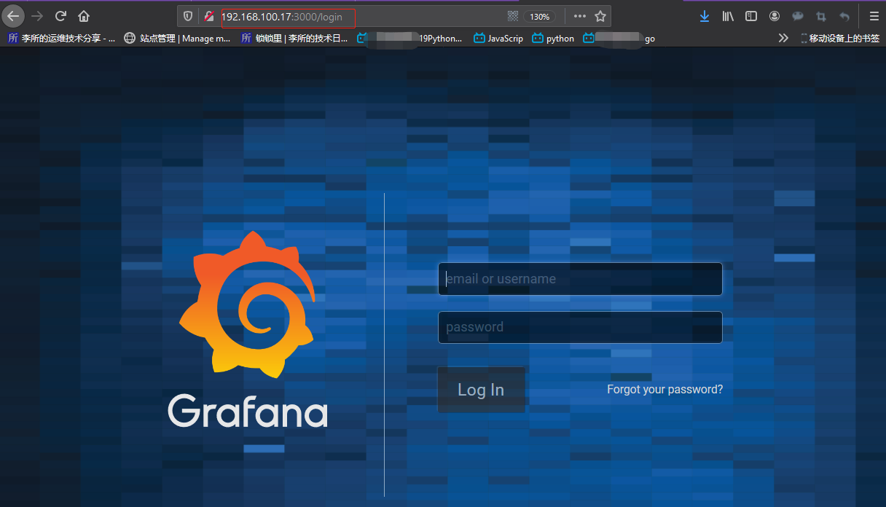

提示是否重置密码


进入主界面
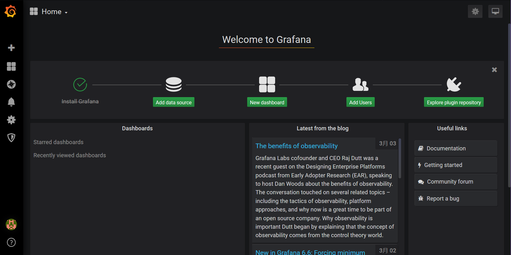

# 三. 添加 MySQL 数据源

## 3.1 添加数据源

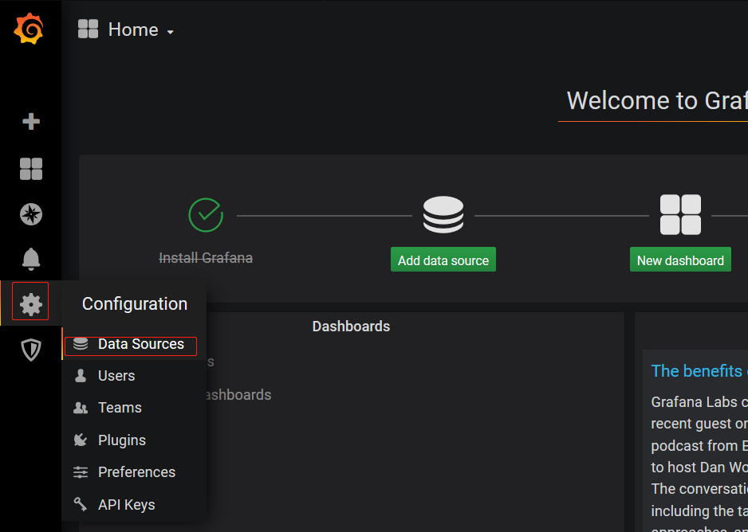

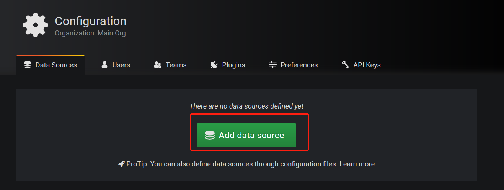

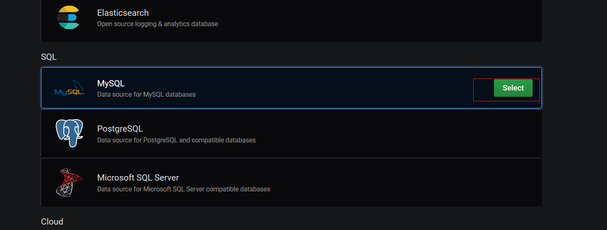

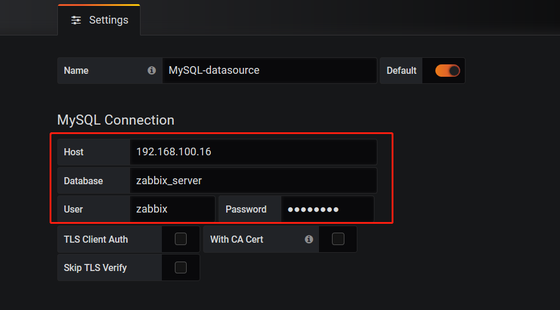

## 3.2 测试保存数据源


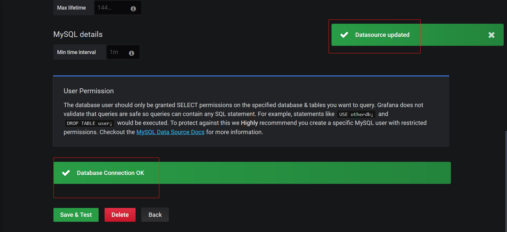

# 四. 添加 zabbix 数据源

红框中`http://192.168.100.17/zabbix/api_jsonrpc.php`

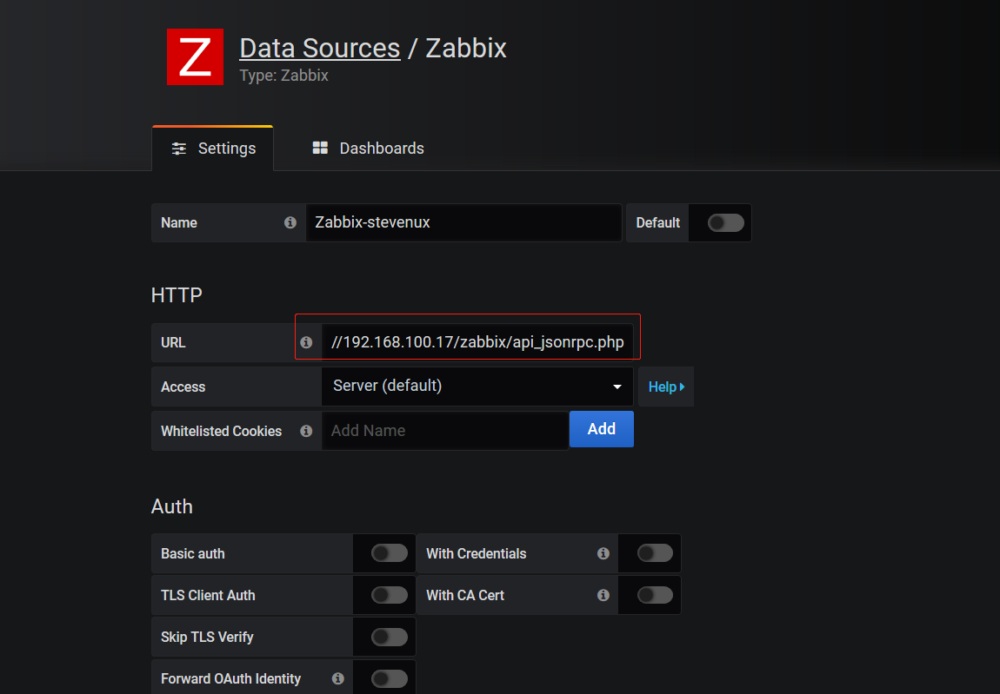
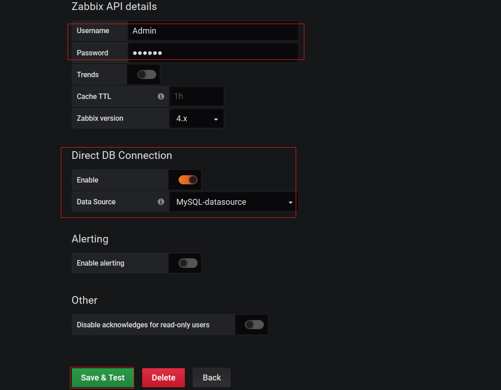

点击测试
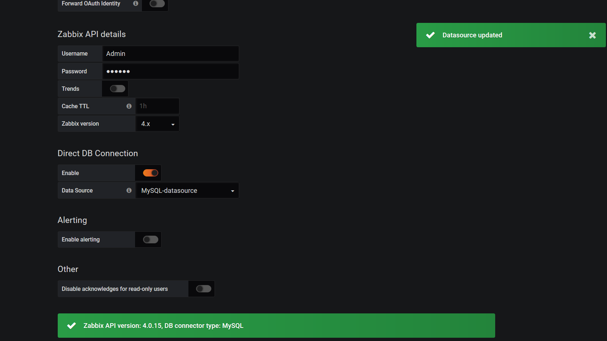

# 五. 添加 Dashboard

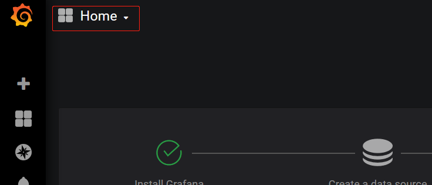

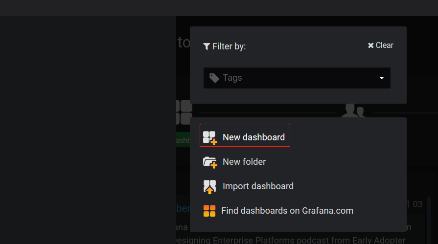

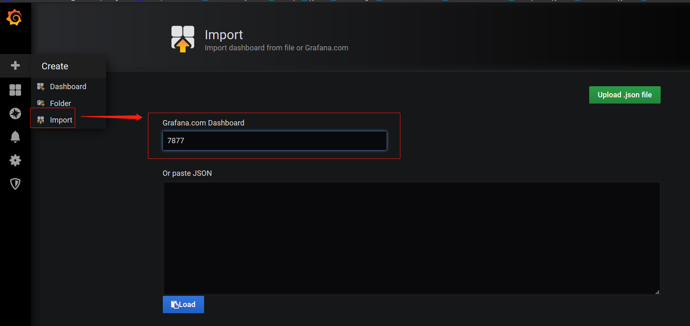

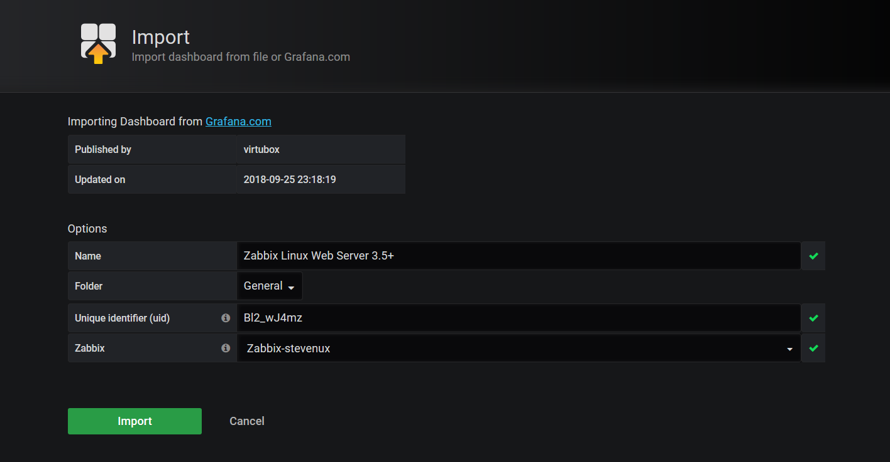

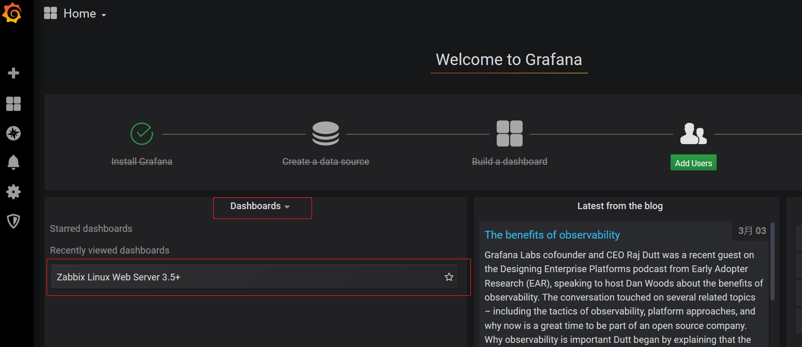

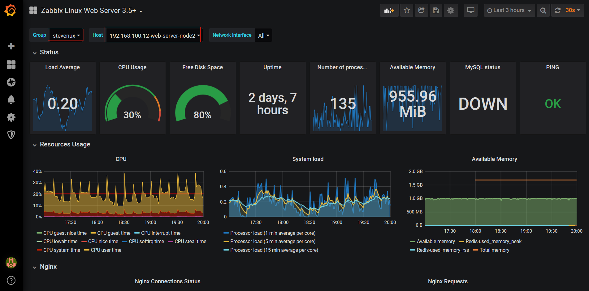
