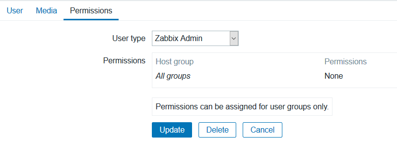
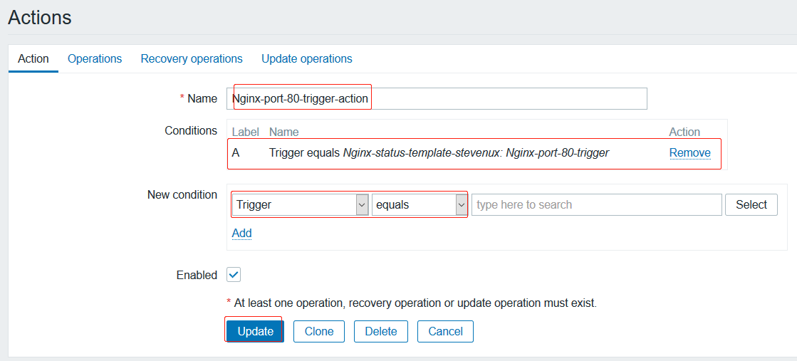
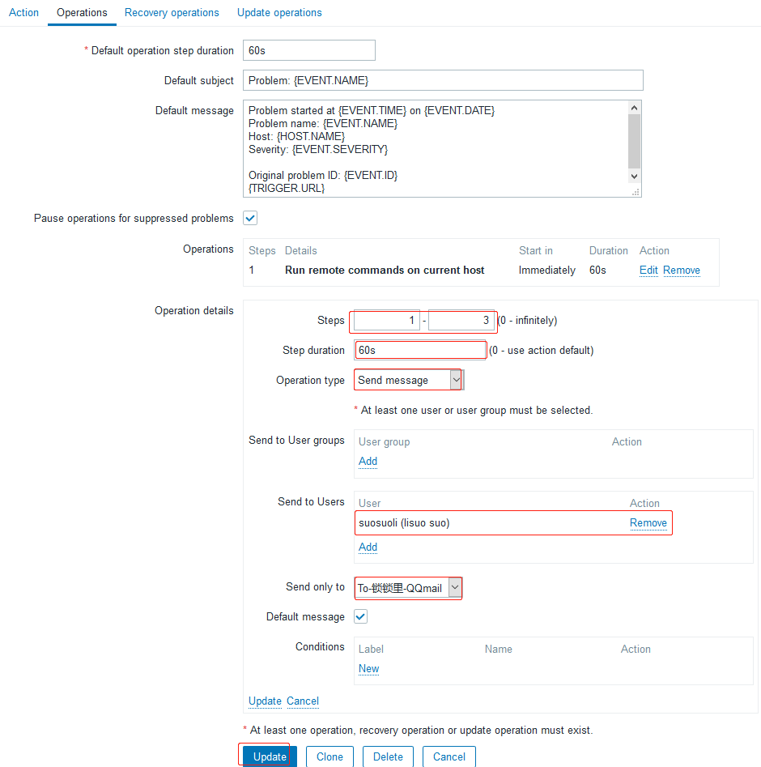
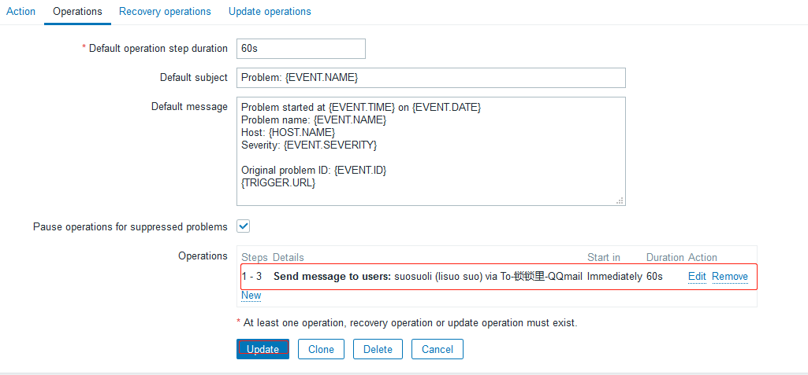
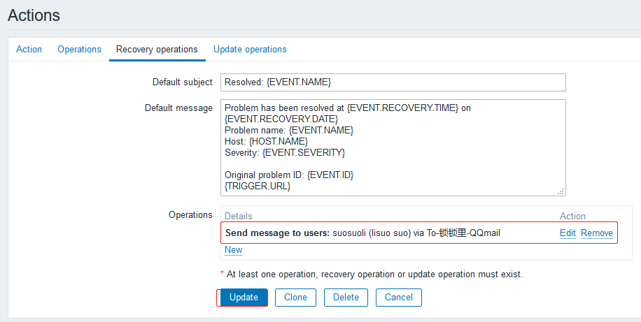
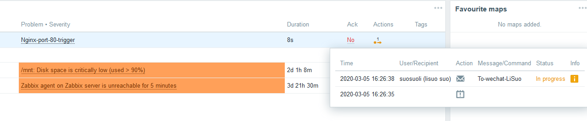

# 一. 邮件通知

## 1.1 邮箱设置

## 1.1.1 开启邮件 SMTP 服务


## 1.1.2 获取授权码


## 1.2 报警媒介

报警媒介类型是一种给运维工程师发送消息通知的渠道，即当 zabbix 的触发器
触发一个事件后，怎么才能把这个事件通过某些方式通知给运维工程师呢？

媒介类型就起到这样的作用，媒介类型创建好之后，需要在每个账户里面添加相
应的收件配置，比如邮件类型的媒介类型要给 zabbix 账户添加邮箱，如果是微
信类型的媒介类型那么就要在 zabbix 账户设置微信号，同样的到来，短信类型
的媒介类型那就得给 zabbix 账户设置手机号用于接收报警消息内容。

管理-->报警媒介类型-->创建报警媒介类型：

https://service.mail.qq.com/cgi-bin/help?subtype=1&&id=28&&no=371

### 1.2.1 创建报警媒介


### 1.2.1 给用户添加报警媒介

创建一个用户


给该用户管理员权限


添加报警媒介


### 1.2.2 更新报警媒介


## 1.3 创建动作

动作是对 zabbix 触发器触发后生成的事件的具体处理操作，可以是远程执行
命令，也可以是发送通知 指定的管理员进行故障处理，发送命令是调用的上一
步骤创建好的报警媒介类型。配置-->动作-->创建动作：

### 1.3.1 创建动作




### 1.3.2 配置动作信息



### 1.3.3 查看添加的动作

查看当前动作信息，并点击恢复操作，配置故障恢复的具体动作内容



## 1.4 配置故障恢复信息并添加动作



## 1.5 验证

正在发送告警信息


第一封告警信息发送成功


### 1.5.1 验证事件状态

在 zabbix web 界面，验证当事件触发后所有邮件通知有没有发送成功


### 1.5.2 邮箱验证

告警信息内容


三封告警信息


### 1.5.3 恢复通知

重新开启 nginx 并监听 80 端口，收到恢复邮件


每三个告警信息，一个恢复信息


# 二. 短信通知

## 2.1 注册短信服务

### 2.1.1 云片

https://www.yunpian.com/

### 2.1.2 阿里大于

https://dysms.console.aliyun.com/

## 2.2 签名和模板

### 2.2.1 新增签名

签名用于显示在短信内容的最前面，显示这条短信来自哪家公司/产品/网站。
运营商要求签名需经过审核。如下面的短信内容：

```ruby
【阿里大于】: 你的验证码是XXXXX，打死不能告诉比尔哦！
```

“阿里大于”就是签名。


### 2.2.2 新增模板

模板的使用前提是必须要有签名，所以要先申请报备签名


## 2.3 查询短信服务 API

### 2.3.1 阿里大于

https://api.aliyun.com/new#/market

### 2.3.2 云片

https://www.yunpian.com/official/document/sms/zh_CN/domestic/single_send

## 2.4 zabbix web 添加短信报警媒介


## 2.5 创建短信通知动作


## 2.6 配置短信发送内容


## 2.7 配置恢复操作


## 2.8 测试短信告警通知

略

# 三. 微信通知

## 3.1 注册企业微信


## 3.2 创建一个 app 用于发送信息


红框信息使用 API 时需要用到


## 3.3 部门和人员信息配置

### 3.3.1 新增部门


### 3.3.2 新增人员


账户名在整个公司中必须保持唯一


## 3.4 测试发送消息

### 3.4.1 测试发送信息


### 3.4.2 手机上使用企业微信查看信息


### 3.4.3 查看企业信息

企业 ID 在发送微信报警信息的时候会调用


## 3.4 zabbix server 配置

zabbix server 实现微信通知基于 python 调用脚本实现且需要使用 pip 安装
requests 模块：

```bash
[root@web-server-node2 zabbix_agentd.d]# yum install python3-pip
[root@web-server-node2 zabbix_agentd.d]# pip3 install requests
```

[简易教程](https://work.weixin.qq.com/api/doc#90000/90003/90487)

先获取 token，token 是通过 corpid(企业 ID)和 corpsecret(应用 Secret)获
取到的，然后通过 API 发送消息，根据官方文档可以看到，发送的消息其实就是一
个 post 请求，请求方式如下：

```bash
请求方式：POST（HTTPS）
请求地址： https://qyapi.weixin.qq.com/cgi-bin/message/send?
access_token=ACCESS_TOKEN

post 参数为 access_token 和 消息体。
```

[服务端 API 调用说明](https://work.weixin.qq.com/api/doc#90000/90135/90664)


[快速入门入口](https://work.weixin.qq.com/api/doc/90000/90003/90487)

### 3.4.1 编写 python 程序

在 zabbix server 安装基础模块并编写 pyhton 脚本，python 脚本通过调用
企业微信的 API 实现自动发送通知消息:

#### 3.4.1.1 测试获取 token

此处需要使用`corpid`和`corpsecret`，就是下图红框中的内容:


```bash
[root@web-server-node2 zabbix_agentd.d]# which python3
/usr/bin/python3
[root@web-server-node2 zabbix_agentd.d]# vim get_token.py
#!/usr/bin/python3
import requests
corpid = "你公司的ID"
corpsecret = "你的app的corpsecret"
url = "https://qyapi.weixin.qq.com/cgi-bin/gettoken?corpid=" + corpid + \
      "&corpsecret=" + corpsecret
token = requests.get(url)
values = list(token.json().values())
print(values[2])

[root@web-server-node2 zabbix_agentd.d]# python3 get_token.py
fM9CDxh1d9wJonD1PrBN4I22_6MjuLLRNN1jGyolgAY5QX-Dk0m6qEm1c4dLbi2PhNzmuiSj2lQCnPZSzcSAAv91Px2MtrNg2a5mZivTB0wkyCo1vdK1-5rMjRrvjcC5p6ZObaq9_QrVKLtU6Y5-WJ2lrT3BnIM8cL8F9o7nT0yvXlvTUTGrB0dfXFUG7-zty3vQz9ppbLPt16yMsiKhoA
# 获取到可token，可以使用该token调用API发信息了。
```

#### 3.4.1.2 先在 pycharm 调用 API 测试发送信息

```py
import os
import sys
import json
import logging
import requests as req

corpid = "wwf05d6d6460f360c6"
corpsecret = "9YX0uoLFqbtYJhFmZGBAzT9jMtKxVgHAuIz3jkrR2h0"
agentid = "1000002"
token_url = "https://qyapi.weixin.qq.com/cgi-bin/gettoken?corpid=" + corpid + \
            "&corpsecret=" + corpsecret


logging.basicConfig(level=logging.DEBUG,
                    format='%(asctime)s:%(levelname)s:%(name)s:%(message)s',
                    datefmt="%a, %d %b %Y %H:%M:%S",
                    filename=os.path.join("e:/log", "wx_message.log"),
                    filemode='a')


def get_token(url):
    r = req.get(url)
    token_value = list(r.json().values())[2]
    return token_value


token = get_token(token_url)
msg_url = "https://qyapi.weixin.qq.com/cgi-bin/message/send?access_token=" + token

msg_to = "LiSuo"
subject = "A message"
msg_body = "Hello, Zabbix!"   # 消息内容

post_body = {
    "touser": msg_to,
    "msgtype": "text",
    "agentid": agentid,
    "text": {
        "content": msg_body
    },
    "safe": 0
}


def send_msg(url, p_body):
    post = req.post(msg_url, data=json.dumps(p_body))


send_msg(msg_url, post_body)
logging.info('msg_to:' + msg_to + ';;suject:' + subject + ';;msg:' + msg_body)
```

测试结果：


查看 log 日志：


#### 3.4.1.3 在 linux 系统下测试

在 zabbix agent 所在的 linux 服务器编写的发送信息的 python 程序：

```bash
[root@web-server-node2 zabbix_agentd.d]# vim sent_wechat_msg.py
```

在 linux 下，将消息发送的必要信息改为获取命令行的参数，以便在 zabbix
使用宏来代替消息内容等信息。

```py
msg_to = "LiSuo"
subject = "A message"
msg_body = "Hello, Zabbix!"   # 消息内容

# 改为下面的内容即可
msg_to = sys.argv[1]
subject = sys.argv[2]
msg_body = sys.argv[2] + "\n\n" +sys.argv[3]
```

测试一下：

```bash
[root@web-server-node2 zabbix_agentd.d]# python3 sent_wechat_msg.py "LiSuo" "Warning" "Run.(: A long run."

[root@web-server-node2 zabbix_agentd.d]# cat /tmp/wx_message.log
Thu, 05 Mar 2020 15:56:58:DEBUG:urllib3.connectionpool:Starting new HTTPS connection (1): qyapi.weixin.qq.com:443
Thu, 05 Mar 2020 15:56:58:DEBUG:urllib3.connectionpool:https://qyapi.weixin.qq.com:443 "GET /cgi-bin/gettoken?corpid=wwf05d6d6460f360c6&corpsecret=9YX0uoLFqbtYJhFmZGBAzT9jMtKxVgHAuIz3jkrR2h0 HTTP/1.1" 200 277
Thu, 05 Mar 2020 15:56:58:DEBUG:urllib3.connectionpool:Starting new HTTPS connection (1): qyapi.weixin.qq.com:443
Thu, 05 Mar 2020 15:56:59:DEBUG:urllib3.connectionpool:https://qyapi.weixin.qq.com:443 "POST /cgi-bin/message/send?access_token=fM9CDxh1d9wJonD1PrBN4I22_6MjuLLRNN1jGyolgAY5QX-Dk0m6qEm1c4dLbi2PhNzmuiSj2lQCnPZSzcSAAv91Px2MtrNg2a5mZivTB0wkyCo1vdK1-5rMjRrvjcC5p6ZObaq9_QrVKLtU6Y5-WJ2lrT3BnIM8cL8F9o7nT0yvXlvTUTGrB0dfXFUG7-zty3vQz9ppbLPt16yMsiKhoA HTTP/1.1" 200 44
Thu, 05 Mar 2020 15:56:59:INFO:root:msg_to:LiSuo||suject:Warning||msg:Warning

Run.(: A long run. # 日志记录了详细信息
```


#### 3.4.1.4 最终的 python 程序

```py
[root@web-server-node2 zabbix_agentd.d]# cat sent_wechat_msg.py
#!/usr/bin/python3
# Edited by suosuoli.cn on 2020.03.5
#

import os
import sys
import json
import logging
import requests as req

corpid = "wwf05d6d6460f360c6"
corpsecret = "9YX0uoLFqbtYJhFmZGBAzT9jMtKxVgHAuIz3jkrR2h0"
agentid = "1000002"
token_url = "https://qyapi.weixin.qq.com/cgi-bin/gettoken?corpid=" + corpid + \
            "&corpsecret=" + corpsecret


logging.basicConfig(level=logging.DEBUG,
                    format='%(asctime)s:%(levelname)s:%(name)s:%(message)s',
                    datefmt="%a, %d %b %Y %H:%M:%S",
                    filename=os.path.join("/tmp", "wx_message.log"),
                    filemode='a')


def get_token(url):
    r = req.get(url)
    token_value = list(r.json().values())[2]
    return token_value


token = get_token(token_url)
msg_url = "https://qyapi.weixin.qq.com/cgi-bin/message/send?access_token=" + token
msg_to = sys.argv[1]
subject = sys.argv[2]
msg_body = sys.argv[2] + "\n\n" +sys.argv[3]

post_body = {
    "touser": msg_to,
    "msgtype": "text",
    "agentid": agentid,
    "text": {
        "content": msg_body
    },
    "safe": 0
}


def send_msg(url, p_body):
    post = req.post(msg_url, data=json.dumps(p_body))


send_msg(msg_url, post_body)
logging.info('msg_to:' + msg_to + ';;suject:' + subject + ';;msg:' + msg_body)
```

### 3.4.2 添加微信报警媒介

下图中`Script parameters`表示 zabbix 的宏，zabbix 会在调用该 python
程序时，使用图中的三个宏的内容分别填充到三个命令行参数中，实现将告警
信息发送给企业微信用户。


### 3.4.3 给 zabbix 管理员添加报警媒介

添加通过微信发送消息的媒介


### 3.4.3 添加报警动作

定义消息内容细节和收件人及发送方式


### 3.4.4 添加报警恢复操作


## 3.5 最终测试告警信息


测试失败，python 程序放错位置，将 python 程序从`/etc/zabbix/zabbix_agentd.dsent_wechat_msg.py`
搬到 zabbix server 的：`/apps/zabbix_server/share/zabbix/alertscripts/sent_wechat_msg.py`


尝试解决：

```bash
[root@web-server-node2 zabbix_agentd.d]# pwd
/etc/zabbix/zabbix_agentd.d
[root@web-server-node2 zabbix_agentd.d]# scp sent_wechat_msg.py 192.168.100.17:/apps/zabbix_server/share/zabbix/alertscripts/
root@192.168.100.17's password:
Permission denied, please try again.
root@192.168.100.17's password:
Permission denied, please try again.
root@192.168.100.17's password:
sent_wechat_msg.py                                                                   100% 1239     1.4MB/s   00:00

```

```bash
[root@zabbix-server1 ~]# cd /apps/zabbix_server/share/zabbix/alertscripts/
[root@zabbix-server1 alertscripts]# ll
total 0
[root@zabbix-server1 alertscripts]# ll
total 4
-rwxr-xr-x 1 root root 1239 Mar  5 16:24 sent_wechat_msg.py
```

再测试：

```bash
[root@web-server-node2 zabbix_agentd.d]# nginx -s stop
```



又出错


zabbix server 端还没安装 requests 包，我跳！！

```bash
[root@zabbix-server1 alertscripts]# pip3 install requests
```

接着测试：

```bash
[root@web-server-node2 zabbix_agentd.d]# nginx -s stop
```

成功发送告警：


查看消息


