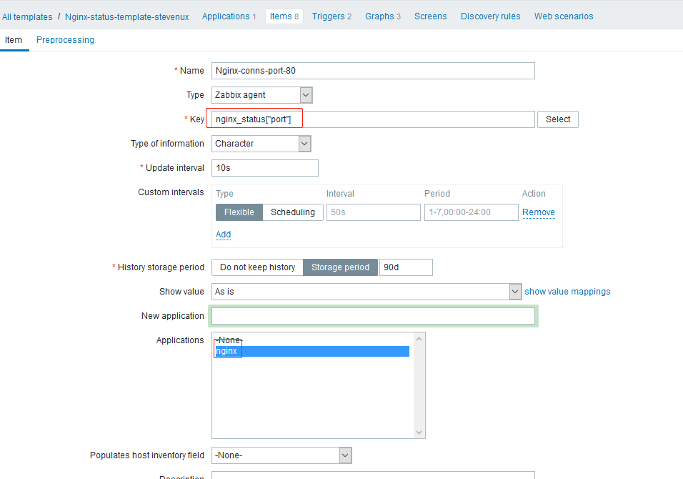
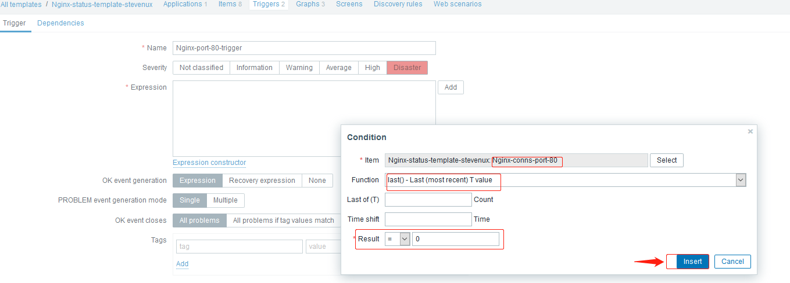
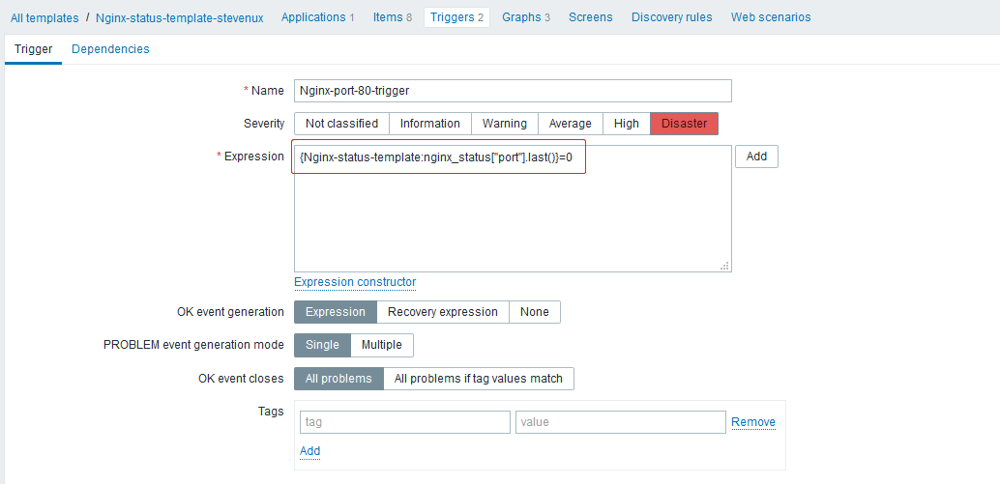
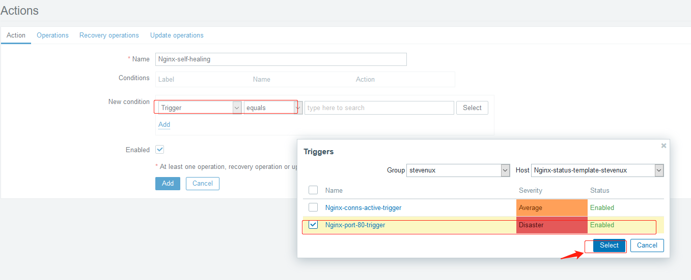
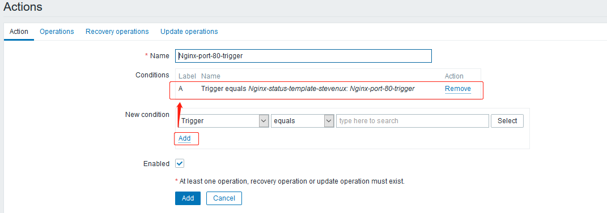
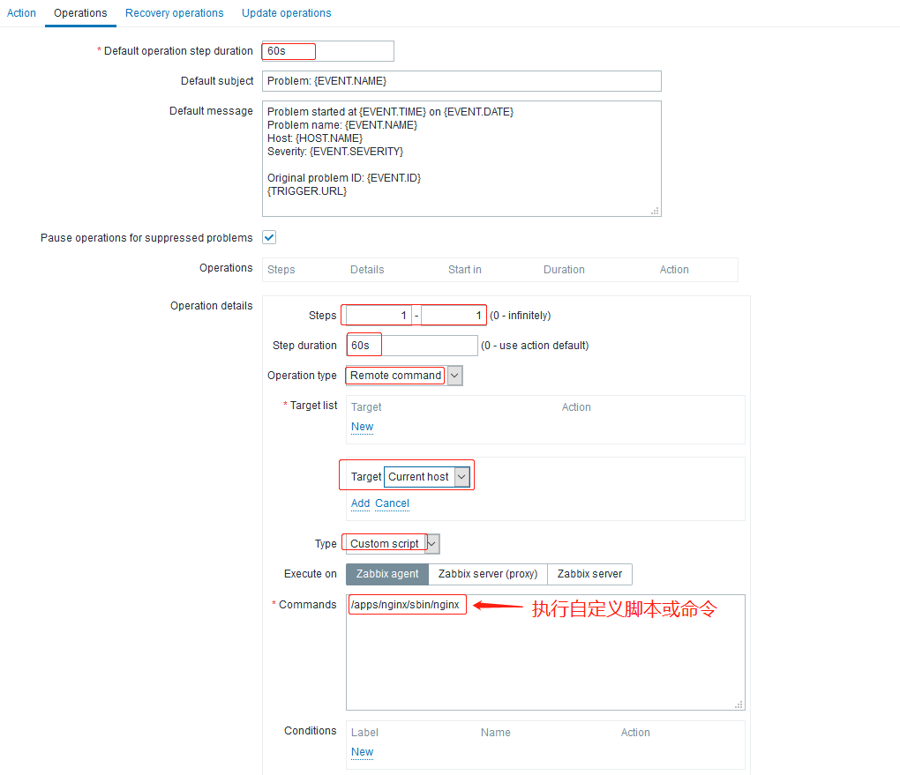
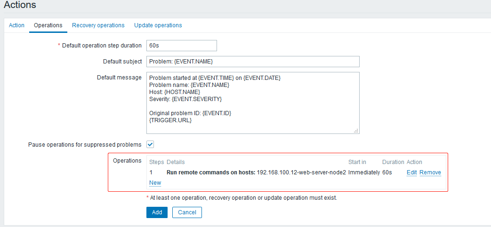
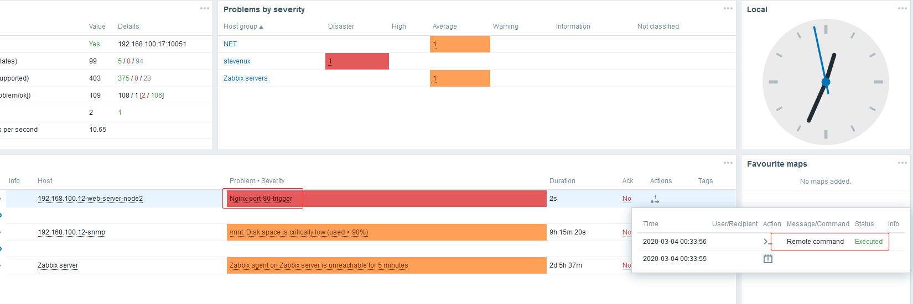
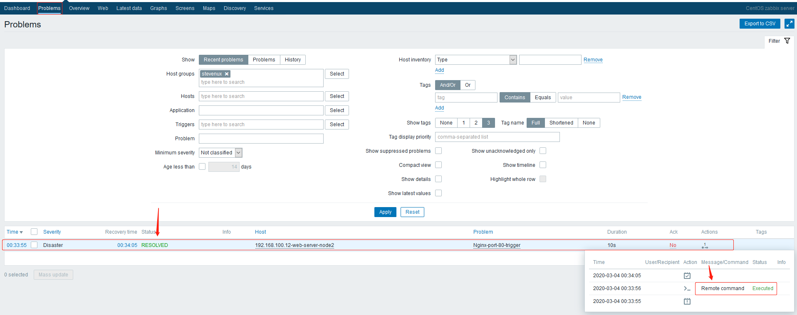
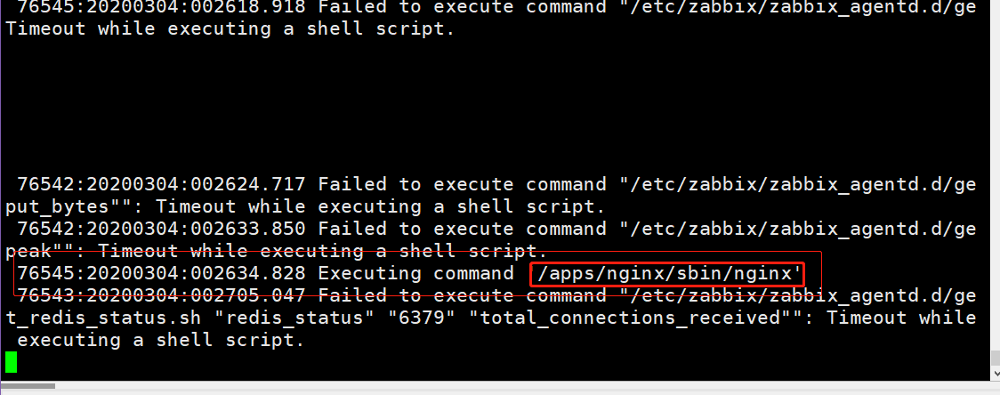

环境：

| hostname                        | IP             |
| :------------------------------ | :------------- |
| zabbix-server1                  | 192.168.100.17 |
| web-server-node2 (zabbix agent) | 192.168.100.12 |

# 一. 故障自治愈介绍

故障自治愈功能实际上是多种功能的集合，是 zabbix 内的多个模块之间交互
提供的功能，当 zabbix 监控到指定的监控项异常的时候，通过指定的操作使
故障自动恢复，通常是重启服务等一些简单的操作，也可以调用脚本执行比较
复杂的操作。

具体的操作就是：
`设置监控项和触发器 --> 新建动作 --> 在触发条件里面添加操作 --> 在远程`
`主机通过 zabbix 客户端执行命令或脚本`

大概的步骤如下：

```bash
1.开启zabbix sudu权限
2.配置允许允许特殊字符
3.配置远程命令
4.验证和测试
```

# 二. 故障自治愈前提

## 2.1 zabbix agent 允许远程执行命令

```bash
[root@web-server-node2 zabbix_agentd.d]# ip addr show eth0 | grep inet
    inet 192.168.100.12/24 brd 192.168.100.255 scope global noprefixroute eth0
    inet6 fe80::250:56ff:fe2e:7cd6/64 scope link
[root@web-server-node2 zabbix_agentd.d]# vim /etc/zabbix/zabbix_agentd.conf
[root@web-server-node2 zabbix_agentd.d]# grep "^[a-Z]" /etc/zabbix/zabbix_agentd.conf
PidFile=/var/run/zabbix/zabbix_agentd.pid
LogFile=/var/log/zabbix/zabbix_agentd.log
LogFileSize=0
EnableRemoteCommands=1
LogRemoteCommands=1
Server=192.168.100.17
ListenPort=10050
ListenIP=0.0.0.0
StartAgents=5
Hostname=192.168.100.12
RefreshActiveChecks=60
Include=/etc/zabbix/zabbix_agentd.d/*.conf
UnsafeUserParameters=1

[root@web-server-node2 zabbix_agentd.d]# systemctl restart zabbix-agent.service
```

## 2.2 给 zabbix 用户 sudo 权限

```bash
[root@web-server-node2 zabbix_agentd.d]# vim /etc/sudoers
...
# Refuse to run if unable to disable echo on the tty.
#######################
#Defaults   !visiblepw  # 不强制使用tty
...
## Allow root to run any commands anywhere
root    ALL=(ALL)       ALL

zabbix  ALL = NOPASSWD: ALL  # 授权指定用户执行特殊命令不再需要密码，比如sudo等
...
```

# 三. 创建动作

## 3.1 创建动作

### 3.1.1 添加 port 监控项



该监控项对应的 agent 配置选项和脚本：

```bash
[root@web-server-node2 zabbix_agentd.d]# pwd
/etc/zabbix/zabbix_agentd.

# 监控项入口
[root@web-server-node2 zabbix_agentd.d]# cat customizedParams.conf | tail -n4
#$1 --> active|accepts|handled|requests|reading|writing|waiting
UserParameter=nginx_status[*],/etc/zabbix/zabbix_agentd.d/get_nginx_status.sh "$1"
###################### Nginx Status Params Stop    ##############################

# 脚本
[root@web-server-node2 zabbix_agentd.d]# cat get_nginx_status.sh
#!/bin/bash
#
# Edited on 2020.03.3 by suosuoli.cn
#

if [[ $# -eq 0 ]]; then
    echo "Usage: `basename $0` get_nginx_status.sh STATS"
fi

save_status(){
    /usr/bin/curl http://192.168.100.12/nginx_status 2> /dev/null > /tmp/nginx_status.log
}

    # 该函数获取port 80 是否被监听的信息
get_port(){

    PORT=`ss -ntl | grep -w "80" | awk -F: '{print $2}' | cut -c1-2`
    if [[ "$PORT" = "80" ]]; then
        echo 1
    else
        echo 0
    fi
}

get_status(){
case $1 in
    active)
        active_conns=`/usr/bin/cat /tmp/nginx_status.log | grep -i "active" | awk '{print $3}'`;
        echo $active_conns;
;;
    accepts)
        accepts_conns=`/usr/bin/cat /tmp/nginx_status.log | grep  "^ [0-9]" | awk '{print $1}'`;
        echo $accepts_conns;
;;
    handled)
        handled_conns=`/usr/bin/cat /tmp/nginx_status.log | grep  "^ [0-9]" | awk '{print $2}'`;
        echo $handled_conns;
;;
    requests)
        requests_conns=`/usr/bin/cat /tmp/nginx_status.log | grep  "^ [0-9]" | awk '{print $3}'`;
        echo $requests_conns;
;;
    reading)
        reading_conns=`/usr/bin/cat /tmp/nginx_status.log | tail -n1 | awk '{print $2}'`;
        echo $reading_conns;
;;
    writing)
        writing_conns=`/usr/bin/cat /tmp/nginx_status.log | tail -n1 | awk '{print $4}'`;
        echo $writing_conns;
;;
    waiting)
        waiting_conns=`/usr/bin/cat /tmp/nginx_status.log | tail -n1 | awk '{print $6}'`;
        echo $waiting_conns;
;;
    port)
        get_port;
;;
esac
}

main(){
    save_status
    get_status $1
}

main $1

```

### 3.1.2 添加触发器





### 3.1.3 创建动作





## 3.2 指定远程操作





# 四. 验证

将被测试的服务手动停止运行，验证能否自动启动或重启，更多操作可以远程执行脚本。
如下：手动将 Nginx、Tomcat 等 web 服务停止后，验证 zabbix agent 能否自动启
动或重启。

在 zabbix agent 主机上测试：

```bash
# 停了nginx
[root@web-server-node2 zabbix_agentd.d]# nginx -s stop
[root@web-server-node2 zabbix_agentd.d]# ./get_nginx_status.sh port
0  # 为0表示nginx已经down了
[root@web-server-node2 zabbix_agentd.d]# ./get_nginx_status.sh port
0
[root@web-server-node2 zabbix_agentd.d]# ./get_nginx_status.sh port
1  # 过一会为1表示nginx已经起来了
[root@web-server-node2 zabbix_agentd.d]# ./get_nginx_status.sh port
1
[root@web-server-node2 zabbix_agentd.d]# ./get_nginx_status.sh port
```

## 查看 zabbix dashboard

出现业务报警问题



自动解决故障历史



## 查看 agent 日志

```bash
[root@web-server-node2 zabbix_agentd.d]# tail -f /var/log/zabbix/zabbix_agentd.log
...
76542:20200304:002624.717 Failed to execute command "/etc/zabbix/zabbix_agentd.d/get_put_bytes"": Timeout while executing a shell script.
 76542:20200304:002633.850 Failed to execute command "/etc/zabbix/zabbix_agentd.d/getpeak"": Timeout while executing a shell script.
##########
 76545:20200304:002634.828 Executing command '/apps/nginx/sbin/nginx'  # 执行命令
##########
 76543:20200304:002705.047 Failed to execute command "/etc/zabbix/zabbix_agentd.d/get_redis_status.sh "redis_status" "6379" "total_connections_received"": Timeout while executing a shell script.
 76546:20200304:002711.378 Failed to execute command "/etc/zabbix/zabbix_agentd.d/get_memcache_status.sh "mem_status" "11211" "accepting_conns"": Timeout while executing a shell script.
 ...
```


