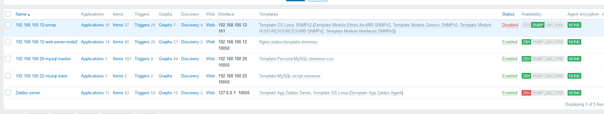
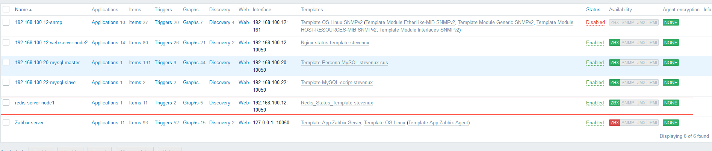
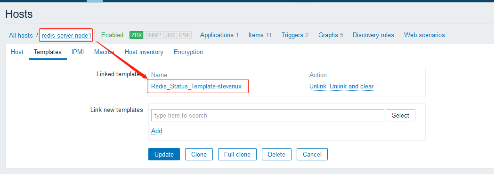
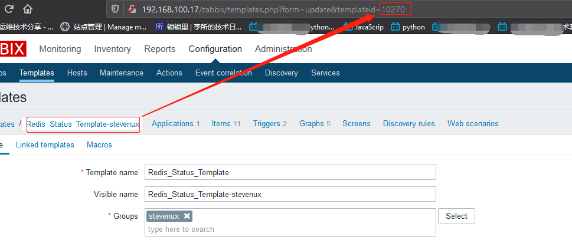
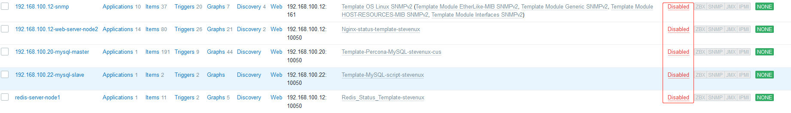
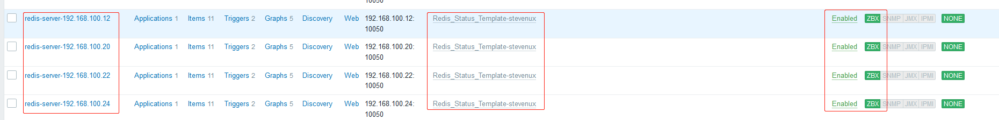

# 一. zabbix 自动化部署

zabbix 自动化部署主要指自动化的部署 zabbix agent 主机，由于 zabbix server
主机或者 zabbix proxy 主机的数量往往比较少，而生产实践中要监控的主机往往
很多，如果一台一台的安装 zabbix agent 则不现实，这时可以考虑使用脚本通过
ssh 批量部署，或者使用 ansible 批量部署安装 zabbix agent。

## 1.1 编写脚本使用源码编译安装 zabbix agent

### 1.1.1 编写脚本

```bash
[root@zabbix-agent-node1 src]# cat compile_install_zabbix.sh
#!/bin/bash
#
# Edited by suosuoli.cn on 2020.03.05
#

WORK_DIR="/usr/local/src"
ZABBIX_VER="zabbix-4.0.15"

if [[ ! -e "${WORK_DIR}" ]]; then
    WORK_DIR=`pwd`
fi

## install some libs and deps.
if grep -iq "ubuntu" /etc/issue; then
    apt update
    apt -y install iproute2 ntpdate tcpdump telnet \
    apt -y install traceroute nfs-kernel-server nfs-common lrzsz tree \
    apt -y install openssl libssl-dev libpcre3 libpcre3-dev zlib1g-dev \
    apt -y install ntpdate tcpdump telnet traceroute gcc openssh-server \
    apt -y install lrzsz tree openssl libssl-dev libpcre3 libpcre3-dev   \
    apt -y install zlib1g-dev ntpdate tcpdump telnet traceroute iotop unzip zip make
else
    yum install -y vim iotop bc gcc gcc-c++ glibc glibc-devel \
    yum install -y pcre  pcre-devel openssl  openssl-devel zip unzip zlib-devel\
    yum install -y net-tools lrzsz tree ntpdate telnet lsof tcpdump wget libevent \
    yum install -y libevent-devel bc systemd-devel bash-completion traceroute
fi


## compile zabbix and install
cd ${WORK_DIR}
tar -xf ${ZABBIX_VER}.tar.gz && \
            cd ${ZABBIX_VER} && \
            ./configure --prefix=/apps/zabbix_agent --enable-agent && \
            make && make install

## add user and create dir for pid file and log file
useradd zabbix
mkdir /apps/zabbix_agent/pid
mkdir /apps/zabbix_agent/logs

# copy conf file to the app folder
\cp ${WORK_DIR}/zabbix-agent.service    /lib/systemd/system/zabbix-agent.service
\cp ${WORK_DIR}/zabbix_agentd.conf      /apps/zabbix_agent/etc/zabbix_agentd.conf
\cp ${WORK_DIR}/zabbix_agentd.conf.d/*  /apps/zabbix_agent/etc/zabbix_agentd.conf.d/

## modify the zabbix hostname to ip.
HOST_IP=`ifconfig  eth0 | grep -w inet  | awk '{print $2}'`
sed -i "s/Hostname=/Hostname=${HOST_IP}/g" /apps/zabbix_agent/etc/zabbix_agentd.conf

chown zabbix.zabbix -R /apps/zabbix_agent/

systemctl daemon-reload
systemctl enable zabbix-agent
systemctl restart zabbix-agent
```

### 1.1.2 准备部署需要的文件

从原来的受 zabbix 监控的主机将监控脚本和 agent 监控入口配置文件拷贝到
新加的主机，此处`web-server-node2`为原有的受监控主机，`zabbix-agetn-node1`
为新加主机。

```bash
[root@web-server-node2 zabbix_agentd.d]# ll
total 32
-rw-r--r-- 1 root root 1479 Mar  3 11:09 customizedParams.conf
-rwxr-xr-x 1 root root  703 Mar  2 19:52 get_memcache_status.sh
-rwxr-xr-x 1 root root 1504 Mar  4 00:08 get_nginx_status.sh
-rwxr-xr-x 1 root root  563 Mar  2 21:50 get_redis_status.sh
-rwxr-xr-x 1 root root  524 Mar  1 18:29 get_tcp_status.sh
-rw-r--r-- 1 root root  319 Mar  5 15:10 get_token.py
-rw-r--r-- 1 root root  365 Mar  5 16:37 README.md
-rwxr-xr-x 1 root root 1239 Mar  5 15:56 sent_wechat_msg.py
[root@web-server-node2 zabbix_agentd.d]# scp get* cus* 192.168.100.24:/usr/local/src/
root@192.168.100.24's password:
get_memcache_status.sh     100%  703   234.8KB/s   00:00
get_nginx_status.sh        100% 1504     1.7MB/s   00:00
get_redis_status.sh        100%  563   542.9KB/s   00:00
get_tcp_status.sh          100%  524   210.2KB/s   00:00
get_token.py               100%  319   210.4KB/s   00:00
customizedParams.conf

[root@web-server-node2 zabbix_agentd.d]# scp /usr/lib/systemd/system/zabbix-agent.service 192.168.100.24:/usr/local/src/
root@192.168.100.24's password:
zabbix-agent.service       100%  434   196.2KB/s   00:00

[root@web-server-node2 zabbix_agentd.d]# scp /etc/zabbix/zabbix_agentd.conf 192.168.100.24:/usr/local/src/
root@192.168.100.24's password:
zabbix_agentd.conf           100%   11KB   2.7MB/s   00:00
```

```bash
[root@zabbix-agent-node1 src]# ll
[root@zabbix-agent-node1 src]# ll
total 16784
-rw-r--r--  1 root   root       1967 Mar  5 20:46 compile_install_zabbix.sh  # 部署安装脚本

# zabbix源码
-rw-r--r-- 1 root root 17163059 Feb 26 22:56 zabbix-4.0.15.tar.gz

# zabbix agent配置文件
-rw-r--r-- 1 root root    10864 Mar  5 21:06 zabbix_agentd.conf
drwxr-xr-x 2 root root      144 Mar  5 21:15 zabbix_agentd.conf.d

# zabbix systemd service文件
-rw-r--r-- 1 root root      474 Mar  5 21:05 zabbix-agent.service
[root@zabbix-agent-node1 src]# ll zabbix_agentd.conf.d/
total 20
-rw-r--r--  1 root   root       1544 Mar  5 20:49 customizedParams.conf  # 自定义监控项入口

# 各服务的监控脚本
-rwxr-xr-x 1 root root  703 Mar  5 20:40 get_memcache_status.sh
-rwxr-xr-x 1 root root 1504 Mar  5 20:40 get_nginx_status.sh
-rwxr-xr-x 1 root root  563 Mar  5 20:40 get_redis_status.sh
-rwxr-xr-x 1 root root  524 Mar  5 20:40 get_tcp_status.sh
-rw-r--r--  1 root   root   17163059 Feb 26 22:56 zabbix-4.0.15.tar.gz
```

#### 1.1.2.1 agent 配置文件

```bash
[root@zabbix-agent-node1 src]# grep "^[a-Z]" zabbix_agentd.conf
PidFile=/apps/zabbix_agent/pid/zabbix_agentd.pid
LogFile=/apps/zabbix_agent/logs/zabbix_agentd.log
DebugLevel=4
EnableRemoteCommands=1
LogRemoteCommands=1
Server=192.168.100.17
ListenPort=10050
ListenIP=0.0.0.0
StartAgents=5
ServerActive=127.0.0.1
Hostname=192.168.100.24  # 部署时会被脚本替换为相应主机ip
```

#### 1.1.2.2 agent service 文件

```bash
[root@zabbix-agent-node1 src]# cat zabbix-agent.service
[Unit]
Description=Zabbix Agent
After=syslog.target
After=network.target

[Service]
Environment="CONFFILE=/apps/zabbix_agent/etc/zabbix_agentd.conf"
EnvironmentFile=-/etc/sysconfig/zabbix-agent
Type=forking
Restart=on-failure
PIDFile=/apps/zabbix_agent/pid/zabbix_agentd.pid
KillMode=control-group
ExecStart=/apps/zabbix_agent/sbin/zabbix_agentd -c $CONFFILE
ExecStop=/bin/kill -SIGTERM $MAINPID
RestartSec=10s
User=zabbix
Group=zabbix

[Install]
WantedBy=multi-user.target
```

#### 1.1.2.3 自定义监控项入口

```bash
[root@zabbix-agent-node1 src]# cat zabbix_agentd.conf.d/customizedParams.conf
###################### TCP_STATUS Params Start ##############################
#$1 --> tcp_status
#$2 --> ESTAB|LISTEN|...
UserParameter=linux_tcp_status[*],/apps/zabbix_agent/etc/zabbix_agentd.conf.d/get_tcp_status.sh "$1" "$2"

###################### TCP_STATUS Params Stop  ##############################


###################### Memcached Status Params Start  ##############################
#$1 --> mem_status
#$2 --> 11211
#$3 --> curr_connections|uptime|threads|curr_connections|...
UserParameter=mem_status[*],/apps/zabbix_agent/etc/zabbix_agentd.conf.d/get_memcache_status.sh "$1" "$2" "$3"

###################### Memcached Status Params Stop   ##############################


###################### Redis Status Params Start  ##############################
#$1 --> redis_status
#$2 --> 6379
#$3 --> uptime_in_seconds|connected_clients|used_memory|used_memory_rss|used_memory_peak|total_connections_received|
#total_commands_processed|total_net_input_bytes|total_net_output_bytes|used_cpu_sys|used_cpu_user|...
UserParameter=redis_status[*],/apps/zabbix_agent/etc/zabbix_agentd.conf.d/get_redis_status.sh "$1" "$2" "$3"

###################### Redis Status Params Stop   ##############################


###################### Nginx Status Params Start   ##############################
#$1 --> active|accepts|handled|requests|reading|writing|waiting
UserParameter=nginx_status[*],/apps/zabbix_agent/etc/zabbix_agentd.conf.d/get_nginx_status.sh "$1"

###################### Nginx Status Params Stop    ##############################
```

#### 1.1.2.4 各监控脚本

1. TCP 状态监控

```bash
[root@zabbix-agent-node1 src]# cat zabbix_agentd.conf.d/get_tcp_status.sh
#!/bin/bash
#
# Edited on 2020.03.01 by suosuoli.cn
#
get_status(){
    STAT=$1
    STAT_NU=`ss -ant | \
	    awk 'NR!=1{ ++status[$1] }END{ for(stats in status) print stats, status[stats] }' | \
	    grep "${STAT}" | \
	    awk '{print $2}'`
    if [[ ${STAT_NU} -eq 0 ]]; then
        STAT_NU=0
    fi
    echo ${STAT_NU}
}

main(){
    if [[ $# -eq 0 ]]; then
        echo "Usage: ./`basename $0` tcp_status <ESTAB|LISTEN|...>"
    fi
    case $1 in
        tcp_status)
	    get_status $2;
	    ;;
    esac
}

main $1 $2
```

2. memcache 状态监控

```bash
root@zabbix-agent-node1 src]# cat zabbix_agentd.conf.d/get_memcache_status.sh
#!/bin/bash
#
# Edited on 2020.03.02 by suosuoli.cn
#
# ubuntu : apt install nmap  -----> ncat

	# get status
get_memcached_status(){
echo -e "stats\nquit" | ncat 127.0.0.1 "$1" | grep "STAT $2" | awk '{print $3}'
}

main(){
	# prompt usage
    if [[ $# -eq 0 ]]; then
        echo "Usage: `basename $0` get_memcached_status <port> <status>"
    fi

	# install nmap if not installed.
    cat /etc/issue | grep -iq "ubuntu" 2>&1 /dev/null
    if [[ $? -ne 0 ]]; then
        yum install -y nmap &> /dev/null
    else
        apt update &> /dev/null && apt install -y nmap &> /dev/null
    fi

	# get status
    if [[ $1 = "mem_status" ]]; then
        get_memcached_status $2 $3
    fi
}

main $1 $2 $3
```

3. nginx 状态监控

```bash
[root@zabbix-agent-node1 src]# cat zabbix_agentd.conf.d/get_memcache_status.sh
#!/bin/bash
#
# Edited on 2020.03.02 by suosuoli.cn
#
# ubuntu : apt install nmap  -----> ncat

	# get status
get_memcached_status(){
echo -e "stats\nquit" | ncat 127.0.0.1 "$1" | grep "STAT $2" | awk '{print $3}'
}

main(){
	# prompt usage
    if [[ $# -eq 0 ]]; then
        echo "Usage: `basename $0` get_memcached_status <port> <status>"
    fi

	# install nmap if not installed.
    cat /etc/issue | grep -iq "ubuntu" 2>&1 /dev/null
    if [[ $? -ne 0 ]]; then
        yum install -y nmap &> /dev/null
    else
        apt update &> /dev/null && apt install -y nmap &> /dev/null
    fi

	# get status
    if [[ $1 = "mem_status" ]]; then
        get_memcached_status $2 $3
    fi
}

main $1 $2 $3
[root@zabbix-agent-node1 src]# cat zabbix_agentd.conf.d/get_nginx_status.sh
#!/bin/bash
#
# Edited on 2020.03.3 by suosuoli.cn
#

if [[ $# -eq 0 ]]; then
    echo "Usage: `basename $0` get_nginx_status.sh STATS"
fi

save_status(){
    /usr/bin/curl http://192.168.100.12/nginx_status 2> /dev/null > /tmp/nginx_status.log
}

get_port(){

    PORT=`ss -ntl | grep -w "80" | awk -F: '{print $2}' | cut -c1-2`
    if [[ "$PORT" = "80" ]]; then
        echo 1
    else
        echo 0
    fi
}

get_status(){
case $1 in
    active)
        active_conns=`/usr/bin/cat /tmp/nginx_status.log | grep -i "active" | awk '{print $3}'`;
        echo $active_conns;
;;
    accepts)
        accepts_conns=`/usr/bin/cat /tmp/nginx_status.log | grep  "^ [0-9]" | awk '{print $1}'`;
        echo $accepts_conns;
;;
    handled)
        handled_conns=`/usr/bin/cat /tmp/nginx_status.log | grep  "^ [0-9]" | awk '{print $2}'`;
        echo $handled_conns;
;;
    requests)
        requests_conns=`/usr/bin/cat /tmp/nginx_status.log | grep  "^ [0-9]" | awk '{print $3}'`;
        echo $requests_conns;
;;
    reading)
        reading_conns=`/usr/bin/cat /tmp/nginx_status.log | tail -n1 | awk '{print $2}'`;
        echo $reading_conns;
;;
    writing)
        writing_conns=`/usr/bin/cat /tmp/nginx_status.log | tail -n1 | awk '{print $4}'`;
        echo $writing_conns;
;;
    waiting)
        waiting_conns=`/usr/bin/cat /tmp/nginx_status.log | tail -n1 | awk '{print $6}'`;
        echo $waiting_conns;
;;
    port)
        get_port;
;;
esac
}

main(){
    save_status
    get_status $1
}

main $1

```

4. Redis 状态监控

```bash
[root@zabbix-agent-node1 src]# cat zabbix_agentd.conf.d/get_redis_status.sh
#!/bin/bash
#
# Edited on 2020.03.02 by suosuoli.cn
#


get_redis_status(){
echo -en "INFO \r\n" | ncat 127.0.0.1 $1 | grep -w "$2" | awk -F: '{print $2}'
}

main(){
	# install ncat if not installed
    cat /etc/issue | grep -iq "ubuntu"
    [[ $? -ne 0 ]] && yum install nmap-ncat -y &> /dev/null || apt install nmap-ncat -y &> /dev/null

	# prompt usage
    if [[ $# -eq 0 ]]; then
        echo "`basename $0` redis_status <PORT> <STATUS>"
    fi

	# do the f* thing
    if [[ $1 = "redis_status" ]]; then
        get_redis_status $2 $3
    fi
}

main $1 $2 $3
```

## 1.2 批量部署到不同主机

### 1.2.1 通过 ssh 使用脚本批量部署

将 zabbix agent 源码和编译安装脚本推送到远程主机，批量部署 zabbix agent

1. 打包部署需要的 zabbix 源码和配置文件及监控脚本

```bash
[root@zabbix-agent-node1 src]# ll
total 16784
-rw-r--r-- 1 root root     1955 Mar  5 21:14 compile_install_zabbix.sh
-rw-r--r-- 1 root root 17163059 Feb 26 22:56 zabbix-4.0.15.tar.gz
-rw-r--r-- 1 root root    10864 Mar  5 21:06 zabbix_agentd.conf
drwxr-xr-x 2 root root      144 Mar  5 21:15 zabbix_agentd.conf.d
-rw-r--r-- 1 root root      474 Mar  5 21:05 zabbix-agent.service

[root@zabbix-agent-node1 src]# tar -czf zabbix_agent_deploy.tar.gz ./*

[root@zabbix-agent-node1 src]# ll zabbix_agent_deploy.tar.gz
-rw-r--r-- 1 root root 17089145 Mar  5 22:02 zabbix_agent_deploy.tar.gz
```

2. 编写一键部署脚本

该脚本接收一个参数:`$1`，为主机 IP 列表，每个 IP 为一行的文本文件
主机列表文件和 zabbix agent 部署打包文件与该脚本在同一目录，直接
运行该脚本，会首先分发公钥给对端主机，然后将 zabbix agent 部署文件
发送到对端，再分别解压安装。

```bash
[root@zabbix-agent-node1 src]# cat deploy_zabbix_agent_cmd.sh
#!/bin/bash
#
# Edited by suosuoli.cn on 2020.03.06
#

HOSTS="$1"
DEPLOY_TAR="zabbix_agent_deploy.tar.gz"
ZABBIX_COMPILE_SCRIPT="compile_install_zabbix.sh"
CMD1="cd /usr/local/src && tar -xf zabbix_agent_deploy.tar.gz"
CMD2="bash /usr/local/src/compile_install_zabbix.sh"


rpm -q expect &> /dev/null || yum -y install expect

if [[ ! -f /root/.ssh/id_rsa ]]; then
    ssh-keygen -P "" -f "/root/.ssh/id_rsa"
fi

userpwd="stevenux"
while read ipaddr;do
expect <<EOF
set timeout 100
spawn ssh-copy-id $ipaddr
expect {
"yes/no" {send "yes\n"; exp_continue}
"password" {send "$userpwd\n"}
}
spawn scp ${DEPLOY_TAR} ${ipaddr}:/usr/local/src
spawn ssh "${ipaddr}" "${CMD1}"
spawn ssh "${ipaddr}" "${CMD2}"
expect eof
EOF
done < ${HOSTS}
```

3. 部署测试

```bash
[root@zabbix-agent-node1 src]# cat hosts.txt
192.168.100.20
192.168.100.22
192.168.100.24

[root@zabbix-agent-node1 src]# ./deploy_zabbix_agent_cmd.sh hosts.txt
```

4. 在各主机查看 zabbix agent 是否跑起来

```bash
[root@mysql-master src]# ip addr show eth0 | grep inet
    inet 192.168.100.20/24 brd 192.168.100.255 scope global noprefixroute eth0
    inet6 fe80::20c:29ff:fecc:2161/64 scope link
[root@mysql-master src]# lsof -i:10050
COMMAND      PID   USER   FD   TYPE  DEVICE SIZE/OFF NODE NAME
zabbix_ag 125588 zabbix    4u  IPv4 1004272      0t0  TCP *:zabbix-agent (LISTEN)
zabbix_ag 125589 zabbix    4u  IPv4 1004272      0t0  TCP *:zabbix-agent (LISTEN)
zabbix_ag 125590 zabbix    4u  IPv4 1004272      0t0  TCP *:zabbix-agent (LISTEN)
zabbix_ag 125591 zabbix    4u  IPv4 1004272      0t0  TCP *:zabbix-agent (LISTEN)
zabbix_ag 125592 zabbix    4u  IPv4 1004272      0t0  TCP *:zabbix-agent (LISTEN)
zabbix_ag 125593 zabbix    4u  IPv4 1004272      0t0  TCP *:zabbix-agent (LISTEN)
zabbix_ag 125594 zabbix    4u  IPv4 1004272      0t0  TCP *:zabbix-agent (LISTEN)
zabbix_ag 125595 zabbix    4u  IPv4 1004272      0t0  TCP *:zabbix-agent (LISTEN)


[root@mysql-slave ~]# ip addr show eth0 | grep inet
    inet 192.168.100.22/24 brd 192.168.100.255 scope global noprefixroute eth0
    inet6 fe80::20c:29ff:fed8:fdd1/64 scope link
[root@mysql-slave ~]# lsof -i:10050
COMMAND     PID   USER   FD   TYPE DEVICE SIZE/OFF NODE NAME
zabbix_ag 75096 zabbix    4u  IPv4 776805      0t0  TCP *:zabbix-agent (LISTEN)
zabbix_ag 75097 zabbix    4u  IPv4 776805      0t0  TCP *:zabbix-agent (LISTEN)
zabbix_ag 75098 zabbix    4u  IPv4 776805      0t0  TCP *:zabbix-agent (LISTEN)
zabbix_ag 75099 zabbix    4u  IPv4 776805      0t0  TCP *:zabbix-agent (LISTEN)
zabbix_ag 75100 zabbix    4u  IPv4 776805      0t0  TCP *:zabbix-agent (LISTEN)
zabbix_ag 75101 zabbix    4u  IPv4 776805      0t0  TCP *:zabbix-agent (LISTEN)
zabbix_ag 75102 zabbix    4u  IPv4 776805      0t0  TCP *:zabbix-agent (LISTEN)
zabbix_ag 75103 zabbix    4u  IPv4 776805      0t0  TCP *:zabbix-agent (LISTEN)


[root@zabbix-agent-node1 src]# ip addr show eth0 | grep eth0
2: eth0: <BROADCAST,MULTICAST,UP,LOWER_UP> mtu 1500 qdisc pfifo_fast state UP group default qlen 1000
    inet 192.168.100.24/24 brd 192.168.100.255 scope global noprefixroute eth0
[root@zabbix-agent-node1 src]# lsof -i:10050
[root@zabbix-agent-node1 src]# lsof -i:10050
[root@zabbix-agent-node1 src]# lsof -i:10050
[root@zabbix-agent-node1 src]# lsof -i:10050
COMMAND     PID   USER   FD   TYPE DEVICE SIZE/OFF NODE NAME
zabbix_ag 67297 zabbix    4u  IPv4  84827      0t0  TCP *:zabbix-agent (LISTEN)
zabbix_ag 67298 zabbix    4u  IPv4  84827      0t0  TCP *:zabbix-agent (LISTEN)
zabbix_ag 67299 zabbix    4u  IPv4  84827      0t0  TCP *:zabbix-agent (LISTEN)
zabbix_ag 67300 zabbix    4u  IPv4  84827      0t0  TCP *:zabbix-agent (LISTEN)
zabbix_ag 67301 zabbix    4u  IPv4  84827      0t0  TCP *:zabbix-agent (LISTEN)
zabbix_ag 67302 zabbix    4u  IPv4  84827      0t0  TCP *:zabbix-agent (LISTEN)
zabbix_ag 67303 zabbix    4u  IPv4  84827      0t0  TCP *:zabbix-agent (LISTEN)
zabbix_ag 67304 zabbix    4u  IPv4  84827      0t0  TCP *:zabbix-agent (LISTEN)
```

### 1.2.2 使用 ansible 批量部署

使用 ansible 将安装脚本和 zabbix 源码及配置文件等推送到远程主机，
再通过 ansible 运行该编译脚本，批量部署 zabbix agent

1. 将打包好的部署文件上传到 ansible 控制端:192.168.100.13

```bash
[root@zabbix-agent-node1 src]# scp zabbix_agent_deploy.tar.gz 192.168.100.13:/usr/local/src/
root@192.168.100.13's password:
zabbix_agent_deploy.tar.gz     100%   16MB 122.3MB/s   00:00
```

2. 添加主机到 ansible 主机列表并测试是否可达

```bash
# 添加主机
root@ubuntu-suosuoli-node1:/usr/local/src# vim /etc/ansible/hosts
[zabbix_agent]
192.168.100.20
192.168.100.22
192.168.100.24

# 测试是否可达
root@ubuntu-suosuoli-node1:/usr/local/src# ansible zabbix_agent -m ping
192.168.100.24 | SUCCESS => {
    "changed": false,
    "ping": "pong"
}
192.168.100.20 | SUCCESS => {
    "changed": false,
    "ping": "pong"
}
192.168.100.22 | SUCCESS => {
    "changed": false,
    "ping": "pong"
}

```

3. 编写 playbook

```bash
root@ubuntu-suosuoli-node1:/usr/local/src# cat deploy_zabbix_agent.yaml
```

```yaml
---
- hosts: zabbix_agent
  remote_user: root
  tasks:
    - name: unarchive zabbix_agent_deploy.tar.gz
      unarchive: src=/usr/local/src/zabbix_agent_deploy.tar.gz dest=/usr/local/src
    - name: run script to install and deploy zabbix agent
      shell: chdir=/usr/local/src compile_install_zabbix.sh
```

4. 测试 playbook

```bash
root@ubuntu-suosuoli-node1:/usr/local/src# ansible-playbook -C deploy_zabbix_agent.yaml

PLAY [zabbix_agent] ***************************************************************************************************

TASK [Gathering Facts] ************************************************************************************************
ok: [192.168.100.20]
ok: [192.168.100.22]
ok: [192.168.100.24]

TASK [unarchive zabbix_agent_deploy.tar.gz] ***************************************************************************
skipping: [192.168.100.24]
skipping: [192.168.100.20]
skipping: [192.168.100.22]

TASK [run script to install and deploy zabbix agent] ******************************************************************
skipping: [192.168.100.24]
skipping: [192.168.100.22]
skipping: [192.168.100.20]

PLAY RECAP ************************************************************************************************************
192.168.100.20             : ok=1    changed=0    unreachable=0    failed=0
192.168.100.22             : ok=1    changed=0    unreachable=0    failed=0
192.168.100.24             : ok=1    changed=0    unreachable=0    failed=0
```

5. 部署

```bash
root@ubuntu-suosuoli-node1:/usr/local/src# pwd
/usr/local/src
root@ubuntu-suosuoli-node1:/usr/local/src# ll
total 16708
drwxr-xr-x  2 root root     4096 Mar  6 00:32 ./
drwxr-xr-x 10 root root     4096 Dec 30 23:20 ../
-rw-r--r--  1 root root       45 Mar  6 00:29 deploy_zabbix_agent.retry
-rw-r--r--  1 root root      404 Mar  6 00:32 deploy_zabbix_agent.yaml
-rw-r--r--  1 root root 17089145 Mar  5 22:06 zabbix_agent_deploy.tar.gz
root@ubuntu-suosuoli-node1:/usr/local/src# ansible-playbook deploy_zabbix_agent.yaml

PLAY [zabbix_agent] **********************************************************************************

TASK [Gathering Facts] *******************************************************************************
ok: [192.168.100.22]
ok: [192.168.100.20]
ok: [192.168.100.24]

TASK [unarchive zabbix_agent_deploy.tar.gz] **********************************************************
ok: [192.168.100.20]
ok: [192.168.100.22]
ok: [192.168.100.24]

TASK [change script permission] *************************************************************************************************************************************************************
 [WARNING]: Consider using the file module with mode rather than running chmod.  If you need to use command because file is insufficient you can add warn=False to this command task or set
command_warnings=False in ansible.cfg to get rid of this message.

changed: [192.168.100.20]
changed: [192.168.100.24]
changed: [192.168.100.22]

TASK [run script to install and deploy zabbix agent] ****************************************************************************************************************************************
changed: [192.168.100.24]
changed: [192.168.100.20]
changed: [192.168.100.22]

PLAY RECAP **********************************************************************************************************************************************************************************
192.168.100.20             : ok=4    changed=2    unreachable=0    failed=0
192.168.100.22             : ok=4    changed=2    unreachable=0    failed=0
192.168.100.24             : ok=4    changed=2    unreachable=0    failed=0
```

6. 查看 zabbix agent 在各主机是否以及跑起来

```bash
[root@mysql-master src]# ip addr show eth0 | grep inet ; systemctl status zabbix-agent.service ; lsof -i:10050
    inet 192.168.100.20/24 brd 192.168.100.255 scope global noprefixroute eth0
    inet6 fe80::20c:29ff:fecc:2161/64 scope link
● zabbix-agent.service - Zabbix Agent
   Loaded: loaded (/usr/lib/systemd/system/zabbix-agent.service; enabled; vendor preset: disabled)
   Active: active (running) since Fri 2020-03-06 00:33:49 CST; 1min 12s ago
  Process: 5245 ExecStop=/bin/kill -SIGTERM $MAINPID (code=exited, status=1/FAILURE)
  Process: 5247 ExecStart=/apps/zabbix_agent/sbin/zabbix_agentd -c $CONFFILE (code=exited, status=0/SUCCESS)
   CGroup: /system.slice/zabbix-agent.service
           ├─5249 /apps/zabbix_agent/sbin/zabbix_agentd -c /apps/zabbix_agent/etc/zabbix_agentd.conf
           ├─5250 /apps/zabbix_agent/sbin/zabbix_agentd: collector [idle 1 sec]
           ├─5251 /apps/zabbix_agent/sbin/zabbix_agentd: listener #1 [waiting for connection]
           ├─5252 /apps/zabbix_agent/sbin/zabbix_agentd: listener #2 [waiting for connection]
           ├─5253 /apps/zabbix_agent/sbin/zabbix_agentd: listener #3 [waiting for connection]
           ├─5254 /apps/zabbix_agent/sbin/zabbix_agentd: listener #4 [waiting for connection]
           ├─5255 /apps/zabbix_agent/sbin/zabbix_agentd: listener #5 [waiting for connection]
           └─5256 /apps/zabbix_agent/sbin/zabbix_agentd: active checks #1 [idle 1 sec]

Mar 06 00:33:49 mysql-master systemd[1]: Unit zabbix-agent.service entered failed state.
Mar 06 00:33:49 mysql-master systemd[1]: zabbix-agent.service failed.
Mar 06 00:33:49 mysql-master systemd[1]: Starting Zabbix Agent...
Mar 06 00:33:49 mysql-master systemd[1]: Permission denied while opening PID file or unsafe symlink chain: /apps/zabbix_agent/pid/zabb...entd.pid
Mar 06 00:33:49 mysql-master systemd[1]: Started Zabbix Agent.
Hint: Some lines were ellipsized, use -l to show in full.
COMMAND    PID   USER   FD   TYPE  DEVICE SIZE/OFF NODE NAME
zabbix_ag 5249 zabbix    4u  IPv4 1025292      0t0  TCP *:zabbix-agent (LISTEN)
zabbix_ag 5250 zabbix    4u  IPv4 1025292      0t0  TCP *:zabbix-agent (LISTEN)
zabbix_ag 5251 zabbix    4u  IPv4 1025292      0t0  TCP *:zabbix-agent (LISTEN)
zabbix_ag 5252 zabbix    4u  IPv4 1025292      0t0  TCP *:zabbix-agent (LISTEN)
zabbix_ag 5253 zabbix    4u  IPv4 1025292      0t0  TCP *:zabbix-agent (LISTEN)
zabbix_ag 5254 zabbix    4u  IPv4 1025292      0t0  TCP *:zabbix-agent (LISTEN)
zabbix_ag 5255 zabbix    4u  IPv4 1025292      0t0  TCP *:zabbix-agent (LISTEN)
zabbix_ag 5256 zabbix    4u  IPv4 1025292      0t0  TCP *:zabbix-agent (LISTEN)


[root@mysql-slave src]# ip addr show eth0 | grep inet ; systemctl status zabbix-agent.service ; lsof -i:10050
    inet 192.168.100.22/24 brd 192.168.100.255 scope global noprefixroute eth0
    inet6 fe80::20c:29ff:fed8:fdd1/64 scope link
● zabbix-agent.service - Zabbix Agent
   Loaded: loaded (/usr/lib/systemd/system/zabbix-agent.service; enabled; vendor preset: disabled)
   Active: active (running) since Fri 2020-03-06 00:33:49 CST; 1min 37s ago
  Process: 85441 ExecStop=/bin/kill -SIGTERM $MAINPID (code=exited, status=1/FAILURE)
  Process: 85443 ExecStart=/apps/zabbix_agent/sbin/zabbix_agentd -c $CONFFILE (code=exited, status=0/SUCCESS)
   CGroup: /system.slice/zabbix-agent.service
           ├─85445 /apps/zabbix_agent/sbin/zabbix_agentd -c /apps/zabbix_agent/etc/zabbix_agentd.conf
           ├─85446 /apps/zabbix_agent/sbin/zabbix_agentd: collector [idle 1 sec]
           ├─85447 /apps/zabbix_agent/sbin/zabbix_agentd: listener #1 [waiting for connection]
           ├─85448 /apps/zabbix_agent/sbin/zabbix_agentd: listener #2 [waiting for connection]
           ├─85449 /apps/zabbix_agent/sbin/zabbix_agentd: listener #3 [waiting for connection]
           ├─85450 /apps/zabbix_agent/sbin/zabbix_agentd: listener #4 [waiting for connection]
           ├─85451 /apps/zabbix_agent/sbin/zabbix_agentd: listener #5 [waiting for connection]
           └─85452 /apps/zabbix_agent/sbin/zabbix_agentd: active checks #1 [idle 1 sec]

Mar 06 00:33:49 mysql-slave systemd[1]: Stopped Zabbix Agent.
Mar 06 00:33:49 mysql-slave systemd[1]: Unit zabbix-agent.service entered failed state.
Mar 06 00:33:49 mysql-slave systemd[1]: zabbix-agent.service failed.
Mar 06 00:33:49 mysql-slave systemd[1]: Starting Zabbix Agent...
Mar 06 00:33:49 mysql-slave systemd[1]: Permission denied while opening PID file or unsafe symlink chain: /apps/zabbix_agent/pid/zabbix_agentd.pid
Mar 06 00:33:49 mysql-slave systemd[1]: Started Zabbix Agent.
COMMAND     PID   USER   FD   TYPE DEVICE SIZE/OFF NODE NAME
zabbix_ag 85445 zabbix    4u  IPv4 796675      0t0  TCP *:zabbix-agent (LISTEN)
zabbix_ag 85446 zabbix    4u  IPv4 796675      0t0  TCP *:zabbix-agent (LISTEN)
zabbix_ag 85447 zabbix    4u  IPv4 796675      0t0  TCP *:zabbix-agent (LISTEN)
zabbix_ag 85448 zabbix    4u  IPv4 796675      0t0  TCP *:zabbix-agent (LISTEN)
zabbix_ag 85449 zabbix    4u  IPv4 796675      0t0  TCP *:zabbix-agent (LISTEN)
zabbix_ag 85450 zabbix    4u  IPv4 796675      0t0  TCP *:zabbix-agent (LISTEN)
zabbix_ag 85451 zabbix    4u  IPv4 796675      0t0  TCP *:zabbix-agent (LISTEN)
zabbix_ag 85452 zabbix    4u  IPv4 796675      0t0  TCP *:zabbix-agent (LISTEN)


[root@zabbix-agent-node1 src]# ip addr show eth0 | grep inet ; systemctl status zabbix-agent.service ; lsof -i:10050
    inet 192.168.100.24/24 brd 192.168.100.255 scope global noprefixroute eth0
    inet6 fe80::20c:29ff:febf:c635/64 scope link
● zabbix-agent.service - Zabbix Agent
   Loaded: loaded (/usr/lib/systemd/system/zabbix-agent.service; enabled; vendor preset: disabled)
   Active: active (running) since Fri 2020-03-06 00:33:48 CST; 1min 54s ago
  Process: 77002 ExecStop=/bin/kill -SIGTERM $MAINPID (code=exited, status=0/SUCCESS)
  Process: 77006 ExecStart=/apps/zabbix_agent/sbin/zabbix_agentd -c $CONFFILE (code=exited, status=0/SUCCESS)
 Main PID: 68564 (code=exited, status=0/SUCCESS)
   CGroup: /system.slice/zabbix-agent.service
           ├─77008 /apps/zabbix_agent/sbin/zabbix_agentd -c /apps/zabbix_agent/etc/zabbix_agentd.conf
           ├─77009 /apps/zabbix_agent/sbin/zabbix_agentd: collector [idle 1 sec]
           ├─77010 /apps/zabbix_agent/sbin/zabbix_agentd: listener #1 [waiting for connection]
           ├─77011 /apps/zabbix_agent/sbin/zabbix_agentd: listener #2 [waiting for connection]
           ├─77012 /apps/zabbix_agent/sbin/zabbix_agentd: listener #3 [waiting for connection]
           ├─77013 /apps/zabbix_agent/sbin/zabbix_agentd: listener #4 [waiting for connection]
           ├─77014 /apps/zabbix_agent/sbin/zabbix_agentd: listener #5 [waiting for connection]
           └─77015 /apps/zabbix_agent/sbin/zabbix_agentd: active checks #1 [idle 1 sec]

Mar 06 00:33:48 zabbix-agent-node1 systemd[1]: Stopped Zabbix Agent.
Mar 06 00:33:48 zabbix-agent-node1 systemd[1]: Starting Zabbix Agent...
Mar 06 00:33:48 zabbix-agent-node1 systemd[1]: Can't open PID file /apps/zabbix_agent/pid/zabbix_agentd.pid (yet?) after start: No such file or directory
Mar 06 00:33:48 zabbix-agent-node1 systemd[1]: Started Zabbix Agent.
COMMAND     PID   USER   FD   TYPE DEVICE SIZE/OFF NODE NAME
zabbix_ag 77008 zabbix    4u  IPv4 102887      0t0  TCP *:zabbix-agent (LISTEN)
zabbix_ag 77009 zabbix    4u  IPv4 102887      0t0  TCP *:zabbix-agent (LISTEN)
zabbix_ag 77010 zabbix    4u  IPv4 102887      0t0  TCP *:zabbix-agent (LISTEN)
zabbix_ag 77011 zabbix    4u  IPv4 102887      0t0  TCP *:zabbix-agent (LISTEN)
zabbix_ag 77012 zabbix    4u  IPv4 102887      0t0  TCP *:zabbix-agent (LISTEN)
zabbix_ag 77013 zabbix    4u  IPv4 102887      0t0  TCP *:zabbix-agent (LISTEN)
zabbix_ag 77014 zabbix    4u  IPv4 102887      0t0  TCP *:zabbix-agent (LISTEN)
zabbix_ag 77015 zabbix    4u  IPv4 102887      0t0  TCP *:zabbix-agent (LISTEN)
```

# 二. 使用 API 管理大量主机

## 2.1 管理 agent 常用 API

### 2.1.1 获取 token

1. bash 方式

```bash
[root@zabbix-server1 alertscripts]# curl -s -X POST -H 'Content-Type:application/json' -d '
> {"jsonrpc": "2.0",
> "method": "user.login",
> "params": {"user": "Admin", # 指定用户名
> "password": "zabbix"        # 指定密码
> },"id": 1}' http://192.168.100.17/zabbix/api_jsonrpc.php | python3 -m json.tool
{
    "jsonrpc": "2.0",
    "result": "e0634039ccf4c733f6aafd90122609ee",  # 该token用来进行后续操作的验证
    "id": 1
}
[root@zabbix-server1 alertscripts]#
```

2. python 方式

```py
import json
import requests

ip = "192.168.100.17"
base_url = 'http://' + ip + '/zabbix/api_jsonrpc.php'
post_header = {'Content-Type': 'application/json'}
post_data = {
    "jsonrpc": "2.0",
    "method": "user.login",
    "params": {
        "user": "Admin",
        "password": "zabbix"
    },
    "id": 1
}


r = requests.post(base_url, data=json.dumps(post_data), headers=post_header)

return_json = json.loads(r.text)

if not return_json.get('result'):
    print('login error')
else:
    print(return_json.get('result'))

# 输出
ea2027fe236beeb636351401392bab1b   # token
```

### 2.1.2 查看指定主机的信息

1. bash

```bash
[root@web-server-node2 ~]# curl -s -X POST -H 'Content-Type:application/json' -d '{
>     "jsonrpc": "2.0",
>     "method": "host.get",
>     "params": {
>         "filter": {
>             "host": [
>                 "192.168.100.12"
>             ]
>         }
>     },
>     "auth": "ea2027fe236beeb636351401392bab1b",  # 提供token认证
>     "id": 1
> }' http://192.168.100.17/zabbix/api_jsonrpc.php | python3 -m json.tool
{
    "jsonrpc": "2.0",
    "result": [
        {
            "hostid": "10267",
            "proxy_hostid": "0",
            "host": "192.168.100.12",
            "status": "0",
            "disable_until": "0",
            "error": "",
            "available": "1",
            "errors_from": "0",
            "lastaccess": "0",
            "ipmi_authtype": "-1",
            "ipmi_privilege": "2",
            "ipmi_username": "",
            "ipmi_password": "",
            "ipmi_disable_until": "0",
            "ipmi_available": "0",
            "snmp_disable_until": "0",
            "snmp_available": "0",
            "maintenanceid": "0",
            "maintenance_status": "0",
            "maintenance_type": "0",
            "maintenance_from": "0",
            "ipmi_errors_from": "0",
            "snmp_errors_from": "0",
            "ipmi_error": "",
            "snmp_error": "",
            "jmx_disable_until": "0",
            "jmx_available": "0",
            "jmx_errors_from": "0",
            "jmx_error": "",
            "name": "192.168.100.12-web-server-node2",
            "flags": "0",
            "templateid": "0",
            "description": "",
            "tls_connect": "1",
            "tls_accept": "1",
            "tls_issuer": "",
            "tls_subject": "",
            "tls_psk_identity": "",
            "tls_psk": "",
            "proxy_address": "",
            "auto_compress": "1"
        }
    ],
    "id": 1
}

```

2. python

```py
import json
import requests
from post_data import post_data_get_host_info

ip = "192.168.100.17"
base_url = 'http://' + ip + '/zabbix/api_jsonrpc.php'
post_header = {'Content-Type': 'application/json'}

post_data_get_host_info = {
    "jsonrpc": "2.0",
    "method": "host.get",
    "params": {
        "filter": {
            "host": [
                "192.168.100.12"  # 此处也可以使用zabbix web的主机可见名称
            ]
        }
    },
    "auth": "ea2027fe236beeb636351401392bab1b",
    "id": 1
}

r = requests.post(base_url, data=json.dumps(post_data_get_host_info), headers=post_header)

return_json = json.loads(r.text)

print(json.dumps(return_json,
                 sort_keys=True,
                 indent=4,
                 separators=(',', ': ')
                 )
      )

# 输出
{
    "id": 1,
    "jsonrpc": "2.0",
    "result": [
        {
            "auto_compress": "1",
            "available": "1",
            "description": "",
            "disable_until": "0",
            "error": "",
            "errors_from": "0",
            "flags": "0",
            "host": "192.168.100.12",  # 主机ip
            "hostid": "10267",
            "ipmi_authtype": "-1",
            "ipmi_available": "0",
            "ipmi_disable_until": "0",
            "ipmi_error": "",
            "ipmi_errors_from": "0",
            "ipmi_password": "",
            "ipmi_privilege": "2",
            "ipmi_username": "",
            "jmx_available": "0",
            "jmx_disable_until": "0",
            "jmx_error": "",
            "jmx_errors_from": "0",
            "lastaccess": "0",
            "maintenance_from": "0",
            "maintenance_status": "0",
            "maintenance_type": "0",
            "maintenanceid": "0",
            "name": "192.168.100.12-web-server-node2", # 主机可见名称
            "proxy_address": "",
            "proxy_hostid": "0",
            "snmp_available": "0",
            "snmp_disable_until": "0",
            "snmp_error": "",
            "snmp_errors_from": "0",
            "status": "0",
            "templateid": "0",
            "tls_accept": "1",
            "tls_connect": "1",
            "tls_issuer": "",
            "tls_psk": "",
            "tls_psk_identity": "",
            "tls_subject": ""
        }
    ]
}
```

### 2.1.3 获取主机列表

1. bash

```bash
[root@web-server-node2 ~]# curl -s -X POST -H 'Content-Type:application/json' -d '{
>     "jsonrpc": "2.0",
>     "method": "host.get",
>     "params": {
>         "output": ["host"]
>     },
>     "auth": "ea2027fe236beeb636351401392bab1b",
>     "id": 1
> }' http://192.168.100.17/zabbix/api_jsonrpc.php | python3 -m json.tool
{
    "jsonrpc": "2.0",
    "result": [
        {
            "hostid": "10084",
            "host": "Zabbix server"
        },
        {
            "hostid": "10267",
            "host": "192.168.100.12"
        },
        {
            "hostid": "10274",
            "host": "192.168.100.12-SNMP"
        },
        {
            "hostid": "10277",
            "host": "192.168.100.20"
        },
        {
            "hostid": "10280",
            "host": "192.168.100.22"
        }
    ],
    "id": 1
}

```

2. python

```py
import json
import requests
from post_data import post_data_get_host_info

ip = "192.168.100.17"
base_url = 'http://' + ip + '/zabbix/api_jsonrpc.php'
post_header = {'Content-Type': 'application/json'}

post_data_get_all_hosts = {
    "jsonrpc": "2.0",
    "method": "host.get",
    "params": {
        "output": ["host"]
    },
    "auth": "ea2027fe236beeb636351401392bab1b",
    "id": 1
}

r = requests.post(base_url, data=json.dumps(post_data_get_all_hosts), headers=post_header)

return_json = json.loads(r.text)

print(json.dumps(return_json,
                 sort_keys=True,
                 indent=4,
                 separators=(',', ': ')
                 )
      )


# 返回数据
{
    "id": 1,
    "jsonrpc": "2.0",
    "result": [
        {
            "host": "Zabbix server",
            "hostid": "10084"
        },
        {
            "host": "192.168.100.12",
            "hostid": "10267"
        },
        {
            "host": "192.168.100.12-SNMP",
            "hostid": "10274"
        },
        {
            "host": "192.168.100.20",
            "hostid": "10277"
        },
        {
            "host": "192.168.100.22",
            "hostid": "10280"
        }
    ]
}

Process finished with exit code 0
```

### 2.1.4 获取所有用户信息

1. bash

```bash
[root@web-server-node2 ~]# curl -s -X POST -H 'Content-Type:application/json' -d '{
>     "jsonrpc": "2.0",
>     "method": "user.get",
>     "params": {
>         "output": ["extend"]
>     },
>     "auth": "ea2027fe236beeb636351401392bab1b",
>     "id": 1
> }' http://192.168.100.17/zabbix/api_jsonrpc.php | python3 -m json.tool
{
    "jsonrpc": "2.0",
    "result": [
        {
            "userid": "1"
        },
        {
            "userid": "2"
        },
        {
            "userid": "3"
        }
    ],
    "id": 1
}

```

2. python

```py
import json
import requests
from post_data import *

ip = "192.168.100.17"
base_url = 'http://' + ip + '/zabbix/api_jsonrpc.php'
post_header = {'Content-Type': 'application/json'}

# 获取所有用户信息
post_data_get_all_users = {
    "jsonrpc": "2.0",
    "method": "user.get",
    "params": {
        "output": ["extend"]
    },
    "auth": "ea2027fe236beeb636351401392bab1b",
    "id": 1
}

r = requests.post(base_url, data=json.dumps(post_data_get_all_users), headers=post_header)

return_json = json.loads(r.text)

print(json.dumps(return_json,
                 sort_keys=True,
                 indent=4,
                 separators=(',', ': ')
                 )
      )

# 返回值
{
    "id": 1,
    "jsonrpc": "2.0",
    "result": [
        {
            "userid": "1"
        },
        {
            "userid": "2"
        },
        {
            "userid": "3"
        }
    ]
}
```

### 2.1.5 获取主机所在主机组

只获取主机所在的主机组，不检查该主机情况

1. bash

```bash
[root@web-server-node2 ~]# curl -s -X POST -H 'Content-Type:application/json' -d '{
>     "jsonrpc": "2.0",
>     "method": "host.get",
>     "params": {
>         "output": ["hostid"],
>         "selectGroups": "extend",
>         "filter": {
>             "host": [
>                 "192.168.100.12"
>             ]
>         }
>     },
>     "auth": "012a8968f51309189f370ffa31a90ff9",
>     "id": 1
> }' http://192.168.100.17/zabbix/api_jsonrpc.php | python3 -m json.tool
{
    "jsonrpc": "2.0",
    "result": [
        {
            "hostid": "10267",
            "groups": [
                {
                    "groupid": "15",
                    "name": "stevenux",
                    "internal": "0",
                    "flags": "0"
                }
            ]
        }
    ],
    "id": 1
}

```

2. python

```bash
import json
import requests
from post_data import *

ip = "192.168.100.17"
base_url = 'http://' + ip + '/zabbix/api_jsonrpc.php'
post_header = {'Content-Type': 'application/json'}

#login = requests.post(base_url, data=json.dumps(post_data_login), headers=post_header)
#return_token = json.loads(login.text)
#print(return_token)

# 获取该主机所属的主机组
post_data_get_group = {
    "jsonrpc": "2.0",
    "method": "host.get",
    "params": {
        "output": ["hostid"],
        "selectGroups": "extend",
        "filter": {
            "host": [
                "192.168.100.12"
            ]
        }
    },
    "auth": "012a8968f51309189f370ffa31a90ff9",
    "id": 1
}

r = requests.post(base_url, data=json.dumps(post_data_get_group), headers=post_header)

return_json = json.loads(r.text)

print(json.dumps(return_json,
                 sort_keys=True,
                 indent=4,
                 separators=(',', ': ')
                 )
      )

# 返回数据
{
    "id": 1,
    "jsonrpc": "2.0",
    "result": [
        {
            "groups": [
                {
                    "flags": "0",
                    "groupid": "15",
                    "internal": "0",
                    "name": "stevenux"
                }
            ],
            "hostid": "10267"
        }
    ]
}

```

### 2.1.6 获取获取主机关联的模板的 ID 和名称

获取主机 ID 为 `10277` 的主机所关联的模板信息
主机 ID 可以用获取主机列表的请求获取。

1. bash

```bash
略Lue略Lue略Lue略Lue略Lue略Lue略Lue略
```

2. python

```py
import json
import requests
from post_data import *

ip = "192.168.100.17"
base_url = 'http://' + ip + '/zabbix/api_jsonrpc.php'
post_header = {'Content-Type': 'application/json'}

#login = requests.post(base_url, data=json.dumps(post_data_login), headers=post_header)
#return_token = json.loads(login.text)
#print(return_token)

# 获取某ID主机关联的模板
post_data_get_tmplate = {
    "jsonrpc": "2.0",
    "method": "host.get",
    "params": {
        "output": ["hostid"],
        "selectParentTemplates": [
            "templateid",
            "name"
        ],
        "hostids": "10277"
    },
    "id": 1,
    "auth": "012a8968f51309189f370ffa31a90ff9"
}

r = requests.post(base_url, data=json.dumps(post_data_get_tmplate), headers=post_header)

return_json = json.loads(r.text)

print(json.dumps(return_json,
                 sort_keys=True,
                 indent=4,
                 separators=(',', ': ')
                 )
      )

# 返回数据
{
    "id": 1,
    "jsonrpc": "2.0",
    "result": [
        {
            "hostid": "10277",
            "parentTemplates": [
                {
                    "name": "Template-Percona-MySQL-stevenux-cus", # 关联的模板名
                    "templateid": "10278"
                }
            ]
        }
    ]
}
```


### 2.1.7 获取模板信息

1. bash

```bash
[root@zabbix-server1 ~]# curl -s -X POST -H 'Content-Type:application/json' -d '{
>     "jsonrpc": "2.0",
>     "method": "template.get",
>     "params": {
>         "output": "extend",
>         "filter": {
>             "host": [
>                 "Template-Percona-MySQL-stevenux-cus"
> ]
>         }
>     },
>     "auth": "012a8968f51309189f370ffa31a90ff9",
>     "id": 1
> }' http://192.168.100.17/zabbix/api_jsonrpc.php | python3 -m json.tool
{
    "jsonrpc": "2.0",
    "result": [
        {
            "proxy_hostid": "0",
            "host": "Template-Percona-MySQL-stevenux-cus",
            "status": "3",
            "disable_until": "0",
            "error": "",
            "available": "0",
            "errors_from": "0",
            "lastaccess": "0",
            "ipmi_authtype": "-1",
            "ipmi_privilege": "2",
            "ipmi_username": "",
            "ipmi_password": "",
            "ipmi_disable_until": "0",
            "ipmi_available": "0",
            "snmp_disable_until": "0",
            "snmp_available": "0",
            "maintenanceid": "0",
            "maintenance_status": "0",
            "maintenance_type": "0",
            "maintenance_from": "0",
            "ipmi_errors_from": "0",
            "snmp_errors_from": "0",
            "ipmi_error": "",
            "snmp_error": "",
            "jmx_disable_until": "0",
            "jmx_available": "0",
            "jmx_errors_from": "0",
            "jmx_error": "",
            "name": "Template-Percona-MySQL-stevenux-cus",
            "flags": "0",
            "templateid": "10278",
            "description": "",
            "tls_connect": "1",
            "tls_accept": "1",
            "tls_issuer": "",
            "tls_subject": "",
            "tls_psk_identity": "",
            "tls_psk": "",
            "proxy_address": "",
            "auto_compress": "1"
        }
    ],
    "id": 1
}

```

2. python

```py
import json
import requests
from post_data import *

ip = "192.168.100.17"
base_url = 'http://' + ip + '/zabbix/api_jsonrpc.php'
post_header = {'Content-Type': 'application/json'}

#login = requests.post(base_url, data=json.dumps(post_data_login), headers=post_header)
#return_token = json.loads(login.text)
#print(return_token)

# 获取模板信息
post_data_get_tmplate_info = {
    "jsonrpc": "2.0",
    "method": "template.get",
    "params": {
        "output": "extend",
        "filter": {
            "host": [
                "Template-Percona-MySQL-stevenux-cus"
]
        }
    },
    "auth": "012a8968f51309189f370ffa31a90ff9",
    "id": 1
}

r = requests.post(base_url, data=json.dumps(post_data_get_tmplate_info), headers=post_header)

return_json = json.loads(r.text)

print(json.dumps(return_json,
                 sort_keys=True,
                 indent=4,
                 separators=(',', ': ')
                 )
      )
```

### 2.1.8 用 python 一次性获取多个信息

```py
import json
import requests

# 更改下面三个参数
ip = "192.168.100.17"
user = "Admin"
password = "zabbix"

base_url = 'http://' + ip + '/zabbix/api_jsonrpc.php'
post_header = {'Content-Type': 'application/json'}

post_data_login = {
    "jsonrpc": "2.0",
    "method": "user.login",
    "params": {
        "user": user,
        "password": password
    },
    "id": 1
}

login = requests.post(base_url, data=json.dumps(post_data_login), headers=post_header)
return_token = json.loads(login.text)
token_value = return_token['result']

# 下面的JRPC请求内容最好放在另一个文件，以导入的方式使用
# 获取某个主机信息
post_data_get_host_info = {
    "jsonrpc": "2.0",
    "method": "host.get",
    "params": {
        "filter": {
            "host": [
                "192.168.100.12"
            ]
        }
    },
    "auth": token_value,
    "id": 1
}

# 获取所有主机
post_data_get_all_hosts = {
    "jsonrpc": "2.0",
    "method": "host.get",
    "params": {
        "output": ["host"]
    },
    "auth": token_value,
    "id": 1
}

# 获取所有用户信息
post_data_get_all_users = {
    "jsonrpc": "2.0",
    "method": "user.get",
    "params": {
        "output": ["extend"]
    },
    "auth": token_value,
    "id": 1
}

# 获取该主机所属的主机组
post_data_get_group = {
    "jsonrpc": "2.0",
    "method": "host.get",
    "params": {
        "output": ["hostid"],
        "selectGroups": "extend",
        "filter": {
            "host": [
                "192.168.100.12"
            ]
        }
    },
    "auth": token_value,
    "id": 1
}

# 获取某ID主机关联的模板
post_data_get_tmplate = {
    "jsonrpc": "2.0",
    "method": "host.get",
    "params": {
        "output": ["hostid"],
        "selectParentTemplates": [
            "templateid",
            "name"
        ],
        "hostids": "10277"
    },
    "id": 1,
    "auth": token_value
}

# 获取模板信息
post_data_get_tmplate_info = {
    "jsonrpc": "2.0",
    "method": "template.get",
    "params": {
        "output": "extend",
        "filter": {
            "host": [
                "Template-Percona-MySQL-stevenux-cus"
]
        }
    },
    "auth": token_value,
    "id": 1
}

post_list = [post_data_get_host_info,
             post_data_get_all_hosts,
             post_data_get_all_users,
             post_data_get_tmplate,
             post_data_get_tmplate_info,
             post_data_get_group]

for p in post_list:
    return_data = requests.post(base_url, data=json.dumps(p), headers=post_header)
    print(json.dumps(json.loads(return_data.text),
                     sort_keys=True,
                     indent=4,
                     separators=(',', ': ')
                     )
          )
```

### 2.1.9 通过 JRPC 请求添加主机到 zabbix server

例如:创建一个具有 IP 接口的可见名为"redis-server-node1"的主机，将其添加
到主机组中并链接一个模板，请求内容如下：

```bash
{
    "jsonrpc": "2.0",
    "method": "host.create", # 定义方法，此处方法是创建主机
    "params": {
        "host": "redis-server-node1", # 添加到server后agent的显示名称
        # "proxy_hostid": "10274", # 如果有proxy，则指定proxy的id即可
        "interfaces": [
            {
                "type": 1,    # 定义接口类型1:agent;2:SNMP;3:IMPI;4:JMX
                "main": 1,    # 主要接口的类型
                "useip": 1,   # 是否使用IP地址
                "ip": "192.168.100.12", # 要添加的agent的地址
                "dns": "",    # 为空表示不用dns
                "port": "10050"
            }
        ],
        "groups": [
            {
                "groupid": "15"  # 添加agent后的属组id
            }
        ],
        "templates": [
            {
                "templateid": "10270" # 关联的模板id
            }
        ],
    },
    "auth": "038e1d7b1735c6a5436ee9eae095879e",
    "id": 1
}
```

1. bash

```bash
略
```

2. python

```bash
import json
import requests
from post_data import *

# 更改下面三个参数
ip = "192.168.100.17"
user = "Admin"
password = "zabbix"

base_url = 'http://' + ip + '/zabbix/api_jsonrpc.php'
post_header = {'Content-Type': 'application/json'}

post_data_login = {
    "jsonrpc": "2.0",
    "method": "user.login",
    "params": {
        "user": user,
        "password": password
    },
    "id": 1
}

login = requests.post(base_url, data=json.dumps(post_data_login), headers=post_header)
return_token = json.loads(login.text)
token_value = return_token['result']

# 添加主机
post_data_add_host = {
    "jsonrpc": "2.0",
    "method": "host.create", # 定义方法，此处方法是创建主机
    "params": {
        "host": "redis-server-node1", # 添加到server后agent的显示名称
        "interfaces": [
            {
                "type": 1,    # 定义接口类型1:agent;2:SNMP;3:IMPI;4:JMX
                "main": 1,    # 主要接口的类型
                "useip": 1,   # 是否使用IP地址
                "ip": "192.168.100.12", # 要添加的agent的地址
                "dns": "",    # 为空表示不用dns
                "port": "10050"
            }
        ],
        "groups": [
            {
                "groupid": "15"  # 添加agent后的属组id
            }
        ],
        "templates": [
            {
                "templateid": "10270" # 关联的模板id
            }
        ],
    },
    "auth": token_value,
    "id": 1
}

return_data = requests.post(base_url, data=json.dumps(post_data_add_host), headers=post_header)
print(json.dumps(json.loads(return_data.text),
                 sort_keys=True,
                 indent=4,
                 separators=(',', ': ')
                 )
      )

# 返回数据
{
    "id": 1,
    "jsonrpc": "2.0",
    "result": {
        "hostids": [
            "10281"
        ]
    }
}
```

加主机之前：


加主机之后：


查看是否关联模板：


查看模板 ID：


## 2.2 批量添加 agent 到 zabbix server

由于主机有限，先禁用所有主机，使用 python 脚本一次性批量添加主机



添加的主机有：
`192.168.100.12`
`192.168.100.20`
`192.168.100.22`
`192.168.100.24`

**python 脚本可以这样写：**

```py
import json
import requests

# 更改下面三个参数
server_ip = "192.168.100.17"
user = "Admin"
password = "zabbix"

agent_list = ["192.168.100.12",
              "192.168.100.20",
              "192.168.100.22",
              "192.168.100.24"]

base_url = 'http://' + server_ip + '/zabbix/api_jsonrpc.php'
post_header = {'Content-Type': 'application/json'}

post_data_login = {
    "jsonrpc": "2.0",
    "method": "user.login",
    "params": {
        "user": user,
        "password": password
    },
    "id": 1
}

login = requests.post(base_url, data=json.dumps(post_data_login), headers=post_header)
return_token = json.loads(login.text)
token_value = return_token['result']

# 添加主机
for ip in agent_list:
    post_data_add_host = {
        "jsonrpc": "2.0",
        "method": "host.create",
        "params": {
            "host": "redis-server-" + ip,
            "interfaces": [
                {
                    "type": 1,
                    "main": 1,
                    "useip": 1,
                    "ip": ip,
                    "dns": "",
                    "port": "10050"
                }
            ],
            "groups": [
                {
                    "groupid": "15"
                }
            ],
            "templates": [
                {
                    "templateid": "10270"
                }
            ],
        },
        "auth": token_value,
        "id": 1
    }
    return_data = requests.post(base_url, data=json.dumps(post_data_add_host), headers=post_header)
    print(json.dumps(json.loads(return_data.text),
                     sort_keys=True,
                     indent=4,
                     separators=(',', ': ')
                     )
          )
```

返回数据：

```json
{
    "id": 1,
    "jsonrpc": "2.0",
    "result": {
        "hostids": [
            "10283"
        ]
    }
}
{
    "id": 1,
    "jsonrpc": "2.0",
    "result": {
        "hostids": [
            "10284"
        ]
    }
}
{
    "id": 1,
    "jsonrpc": "2.0",
    "result": {
        "hostids": [
            "10285"
        ]
    }
}
{
    "id": 1,
    "jsonrpc": "2.0",
    "result": {
        "hostids": [
            "10286"
        ]
    }
}

Process finished with exit code 0
```

查看 zabbix web 情况:



## 2.3 zabbix 动态发现主机

[参考这篇文章](http://blogs.studylinux.net/?p=705)
