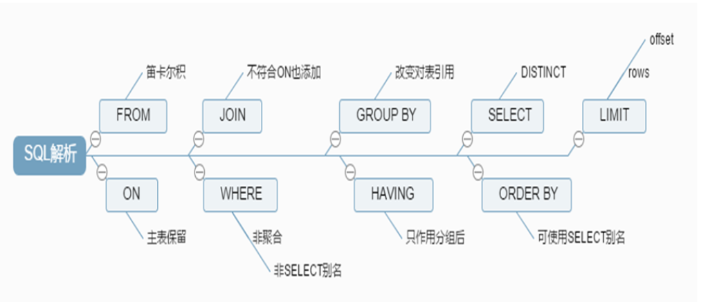

<center><font face="黑体" color="grey" size="5" >MySQL基础</font></center>

# 一.DDL

|语句|说明|
|---|---|
|CREATE TABLE [IF NOT EXISTS] tableName (col1 TYPE1 ATTR1,col2 TYPE2 ATTR2,...);|创建表tableName|
|HELP CREATE TABLE;|获取用法帮助|
|CREATE TABLE [IF NOT EXISTS] tableName [(col1 TYPE1 ATTR1,col2 TYPE2 ATTR2,...) SELECT...];|直接从查询结果创建表tableName|
|CREATE TABLE [IF NOT EXISTS] tableName {LIKE oldTableName};|复制现有的表结构创建新表，不复制数据|
|SHOW ENGINES;|查看数据库支持的存储引擎engine类型|
|SHOW TABLES [FROM databaseName];|查看数据库中的各表|
|DESC [databaseName.]tableName或者SHOW COLUMNS FROM [databaseName.]tableName;|查看表结构|
|SHOW CREATE TABLE tableName;|查看tableName表被创建的详细过程|
|SHOW TABLE STATUS LIKE 'tableName';|查看表状态|
|SHOW TABLE STATUS FROM databaseName|查看库中所有表的状态|
|DROP TABLE [IF EXISTS] 'tableName'|删除表|
|ALTER TABLE 'tableName' ADD columnName type\|DROP columnName;|添加或删除列|

- 示例

```sql
ALTER TABLE students RENAME s1;
ALTER TABLE s1 ADD phone varchar(11) AFTER name;
ALTER TABLE s1 MODIFY phone int;
ALTER TABLE s1 CHANGE COLUMN phone mobile char(11);
ALTER TABLE s1 DROP COLUMN mobile;
ALTER TABLE s1 character set utf8;
ALTER TABLE s1 change name name varchar(20) character set utf8;
ALTER TABLE students ADD gender ENUM('m','f');
ALETR TABLE students CHANGE id sid int UNSIGNED NOT NULL PRIMARY KEY;
ALTER TABLE students drop primary key ;
ALTER TABLE students drop primary key ;
DESC students;
ALTER TABLE students DROP age;
```

# 二.DML

|语句|说明|
|---|---|
|INSERT INTO tableName [(column1,column2,...)] VALUES (column1,column2,...),(),...;|在tableName插入一行或多行|
|UPDATE tableName SET columnName={expr1|DEFAULT}[, col_name2={expr2|DEFAULT}]... WHERE whereCondition;|更新tableName表的某行或某几行|
|DELETE [LOW_PRIORITY] [QUICK] [IGNORE] FROM tableName [WHERE whereCondition] [ORDER BY ...] [LIMIT rowCount]|删除tableName的某行或某几行|
|TRUNCATE TABLE tableName;|情况表数据，保留表结构|

# 三.DQL

## 3.1 SELECT句法

```sql
SELECT
    [ALL | DISTINCT | DISTINCTROW ]
    [SQL_CACHE | SQL_NO_CACHE]
    select_expr [, select_expr ...]
    [FROM table_references
    [WHERE where_condition]
    [GROUP BY {col_name | expr | position}
        [ASC | DESC], ... [WITH ROLLUP]]
    [HAVING where_condition]
    [ORDER BY {col_name | expr | position}
        [ASC | DESC], ...]
    [LIMIT {[offset,] row_count | row_count OFFSET offset}]
    [FOR UPDATE | LOCK IN SHARE MODE]

各字段说明：
1.查询结果的字段显示可以使用别名： 
    col1 AS alias1, col2 AS alias2, ...
WHERE
    指明过滤条件以实现“选择”的功能： 
        过滤条件：布尔型表达式 
                 算术操作符：+, -, *, /, %
                 比较操作符：=,<=>（相等或都为空）, <>, !=(非标准SQL), >, >=, <, <=
                 BETWEEN min_num AND max_num 
                 IN (element1, element2, ...) 
                 IS NULL 
                 IS NOT NULL 
                 SELECT DISTINCT 去除重复列
                    范例：SELECT DISTINCT gender FROM students; 
                    LIKE: % 任意长度的任意字符 _ 任意单个字符 
                    RLIKE：正则表达式，索引失效，不建议使用 
                    REGEXP：匹配字符串可用正则表达式书写模式 
                 逻辑操作符：NOT，AND，OR，XOR
GROUP：根据指定的条件把查询结果进行“分组”以用于做“聚合”运算 
      常见聚合函数：avg(), max(), min(), count(), sum() 
       HAVING: 对分组聚合运算后的结果指定过滤条件
ORDER BY: 根据指定的字段对查询结果进行排序 升序：
    ASC 降序：DESC
LIMIT [[offset,]row_count]：对查询的结果进行输出行数数量限制
对查询结果中的数据请求施加“锁” 
    FOR UPDATE: 写锁，独占或排它锁，只有一个读和写操作
    LOCK IN SHARE MODE: 读锁，共享锁，同时多个读操作
```

## 3.2 DQL-SELECT示例

```sql
DESC students;
INSERT INTO students VALUES(1,'tom'，'m'),(2,'alice','f');
INSERT INTO students(id,name) VALUES(3,'jack'),(4,'allen');
SELECT * FROM students WHERE id < 3;
SELECT * FROM students WHERE gender='m';
SELECT * FROM students WHERE gender IS NULL;
SELECT * FROM students WHERE gender IS NOT NULL;
SELECT * FROM students ORDER BY name DESC LIMIT 2;
SELECT * FROM students ORDER BY name DESC LIMIT 1,2;
SELECT * FROM students WHERE id >=2 and id <=4
SELECT * FROM students WHERE BETWEEN 2 AND 4
SELECT * FROM students WHERE name LIKE ‘t%’
SELECT * FROM students WHERE name RLIKE '.*[lo].*';
SELECT id stuid,name as stuname FROM students
```

## 3.3 子查询

```sql
1. 用于比较表达式中的子查询；子查询仅能返回单个值
SELECT Name,Age FROM students WHERE Age>(SELECT avg(Age) FROM students);
2. 用于IN中的子查询：子查询应该单键查询并返回一个或多个值从构成列表
SELECT Name,Age FROM students WHERE Age IN (SELECT Age FROM teachers);
3. 用于FROM子句中的子查询 使用格式：
SELECT tb_alias.col1,... FROM (SELECT clause) AS tb_alias WHERE Clause;
```

## 3.4 联合查询

- UNION查询将两个SELECT语句查到的行合并到一个结果表中，右边SELECT语句查到的行
追加到第一个SELECT语句的查询结果后面

```sql
SELECT Name,Age FROM students UNION SELECT Name,Age FROM teachers;
```

## 3.5 SELECT语句各部分被处理的顺序



## 3.6 使用SQL多表查询--SQL JOINS


## 3.7 mysql查询优化

- [Query Performance Optimization](https://www.oreilly.com/library/view/high-performance-mysql/9780596101718/ch04.html)

# 四.VIEW

- 视图即虚拟表，保存着基表(实表)的查询结果，修改视图会更新基表，不建议修改视图；
- 视图创建、查看、删除

```sql
CREATE VIEW view_name [(column_list)]
    AS select_statement
    [WITH [CASCADED | LOCAL] CHECK OPTION]

SHOW CREATE VIEW view_name

DROP VIEW [IF EXISTS]
    view_name [, view_name] ...
    [RESTRICT | CASCADE]
```

# 五.FUNCTION

- sql函数分为：系统函数和用户自定义函数(UDF)
- UDF保存在mysql.proc中

## 5.1 创建UDF语法

```sql
CREATE [AGGREGATE] FUNCTION function_name(parameter_name type,[parameter_name
type,...])
    RETURNS {STRING|INTEGER|REAL}
    runtime_body
参数可以有多个，也可以没有；但是必须有且只有一个返回值
```

```sql
查看函数列表：
    SHOW FUNCTION STATUS;
查看函数定义
    SHOW CREATE FUNCTION function_name;
删除UDF
    DROP FUNCTION function_name;
调用自定义函数语法:
    SELECT function_name(parameter_value,...);
```

- eg

```sql
#无参UDF
CREATE FUNCTION simpleFun() RETURNS VARCHAR(20) RETURN "Hello World";
#有参数UDF
DELIMITER //
CREATE FUNCTION deleteById(uid SMALLINT UNSIGNED) RETURNS VARCHAR(20)
BEGIN
DELETE FROM students WHERE stuid = uid;
RETURN (SELECT COUNT(*) FROM students);
END//
DELIMITER ;
```

## 5.2 在函数中定义局部变量

  - 局部变量的作用范围是在BEGIN...END程序中,而且定义局部变量语句必须在BEGIN...END的第一
行定义

```sql
DELIMITER //
CREATE FUNCTION addTwoNumber(x SMALLINT UNSIGNED, y SMALLINT UNSIGNED)
RETURNS SMALLINT
BEGIN
DECLARE a, b SMALLINT UNSIGNED;
SET a = x, b = y;
RETURN a+b;
END//
DELIMITER ;
```

- 为变量赋值

```sql
SET parameter_name = value[,parameter_name = value...]
SELECT INTO parameter_name

eg:
DECLARE x int;
SELECT COUNT(*) FROM tdb_name INTO x;
RETURN x;
END//
```

# 六.PROCEDURE

- 存储过程:多表SQL的语句的集合，可以独立执行，存储过程保存在mysql.proc表中
- 存储过程优势:与函数相比，存储过程把经常使用的SQL语句或业务逻辑封装起来,预编译保存在数据库中,当需要时
从数据库中直接调用,省去了编译的过程 提高了运行速度 同时降低网络数据传输量 存储过程与自定义函
数的区别 存储过程实现的过程要复杂一些,而函数的针对性较强 存储过程可以有多个返回值,而自定义函
数只有一个返回值 存储过程一般可独立执行,而函数往往是作为其他SQL语句的一部分来使用
- 创建存储过程

```sql
CREATE PROCEDURE sp_name ([ proc_parameter [,proc_parameter ...]])
    routime_body
    proc_parameter : [IN|OUT|INOUT] parameter_name type

说明:其中IN表示输入参数，OUT表示输出参数，INOUT表示既可以输入也可以输出；param_name
表示参数名称；type表示参数的类型 查看存储过程列表
```

- 查看存储过程
`SHOW PROCEDURE STATUS;` 查看当前数据库所定义的存储过程
`SHOW CREATE PROCEDURE procName` 查看某个存储过程的创建细节

- 调用存储过程
`CALL procName ([ proc_parameter [,proc_parameter ...]])`
  - 说明:当无参时,可以省略"()",当有参数时,不可省略"()” 
- 存储过程修改
  - ALTER语句修改存储过程只能修改存储过程的注释等无关紧要的东西,不能修改存储过程源码,
所以要修改存储过程,方法就是删除重建 
- 删除存储过程
`DROP PROCEDURE [IF EXISTS] procName`

- eg:创建无参存储过程:

```sql
delimiter //
CREATE PROCEDURE showTime()
BEGIN
SELECT now();
END//
delimiter ;
CALL showTime;
```

- eg:创建含参存储过程：只有一个IN参数

```sql
delimiter //
CREATE PROCEDURE selectById(IN uid SMALLINT UNSIGNED)
BEGIN
SELECT * FROM students WHERE stuid = uid;
END//
delimiter ;
call selectById(2);
```

- eg:使用循环

```sql
delimiter //
CREATE PROCEDURE dorepeat(n INT)
BEGIN
SET @i = 0;
SET @sum = 0;
REPEAT SET @sum = @sum+@i; SET @i = @i + 1;
UNTIL @i > n END REPEAT;
END//
delimiter ;
CALL dorepeat(100);
SELECT @sum;
```

- eg:创建含参存储过程:包含IN参数和OUT参数

```sql
delimiter //
CREATE PROCEDURE deleteById(IN uid SMALLINT UNSIGNED, OUT num SMALLINT UNSIGNED)
BEGIN
DELETE FROM students WHERE stuid >= uid;
SELECT row_count() into num;
END//
delimiter ;
call deleteById(2,@Line);
SELECT @Line;
#说明:创建存储过程deleteById,包含一个IN参数和一个OUT参数.调用时,传入删除的ID和保存
被修改的行数值的用户变量@Line,select @Line;输出被影响行数
```

- 存储过程流程控制语句

```sql
IF：用来进行条件判断。根据是否满足条件，执行不同语句
CASE：用来进行条件判断，可实现比IF语句更复杂的条件判断
LOOP：重复执行特定的语句，实现一个简单的循环
LEAVE：用于跳出循环控制
ITERATE：跳出本次循环，然后直接进入下一次循环
REPEAT：有条件控制的循环语句。当满足特定条件时，就会跳出循环语句
WHILE：有条件控制的循环语句
```

# 七.TRIGGER

- 触发器是指一个和某个表关联的已命名的数据库对象，当一个针对该表的具体的事件发生时触发器就会被
激活，触发器在其关联的表有INSERT,UPDATE和DELETE操作时被激活，这些操作就是触发事件。

- 创建触发器语法

```sql
CREATE
    [DEFINER = { user | CURRENT_USER }]
    TRIGGER trigger_name
    trigger_time trigger_event
    ON tbl_name FOR EACH ROW
    trigger_body

说明：
    trigger_name：触发器的名称 
    trigger_time：{ BEFORE | AFTER }，表示在事件之前或之后触发
    trigger_event:：{ INSERT |UPDATE | DELETE }，触发的具体事件 
    tbl_name：该触发器作用的表名
```

- eg:#创建触发器，在向学生表INSERT数据时，学生数增加，DELETE学生时，学生数减少

```sql
CREATE TABLE student_info (
    stu_id INT(11) NOT NULL AUTO_INCREMENT,
    stu_name VARCHAR(255) DEFAULT NULL,
    PRIMARY KEY (stu_id)
);
CREATE TABLE student_count (
    student_count INT(11) DEFAULT 0
);
INSERT INTO student_count VALUES(0);
CREATE TRIGGER trigger_student_count_insert
AFTER INSERT
ON student_info FOR EACH ROW
UPDATE student_count SET student_count=student_count+1;
CREATE TRIGGER trigger_student_count_delete
AFTER DELETE
ON student_info FOR EACH ROW
UPDATE student_count SET student_count=student_count-1;
```

- 查看触发器

`SHOW TRIGGERS;`

- 删除触发器

`DROP TRIGGER triggerName`

# 八.用户管理

- MySQL用户管理的元数据存放于mysql数据库中
- 相关的系统授权表：

```sql
db
host
user
columns_priv
tables_priv
procs_priv
proxies_priv
```

- 用户账号组成
`'USERNAME'@'HOST'`

```sql
@'HOST': 可以是主机名,IP地址或Network网络地址
另外：172.16.%.% 表示172.16.0.0/16网段所有网络或主机
```

- 创建用户
`CREATE USER 'USERNAME'@'HOST' [IDENTIFIED BY 'password']；`
- 用户重命名
`RENAME USER old_user_name TO new_user_name;`
- 删除用户
`DROP USER 'USERNAME'@'HOST'`
eg:`DROP USER ''@'localhost';` 删除默认的空用户
- 修改用户密码
  - 法1
    `SET PASSWORD FOR 'user'@'host' = PASSWORD(‘password');`
  - 法2:需要刷新权限
    `UPDATE mysql.user SET password=PASSWORD('password') WHERE clause;`
    `FLUSH PRIVILEGES;`

- 忘记管理员密码解决方法

```sql
1. 启动mysqld进程时，为其使用如下选项： --skip-grant-tables --skip-networking
或者临时在配置文件中指定：
vim /etc/my.cnf.d/server.cnf
...
skip-grant-tables
skip-networking
...
2. 使用UPDATE命令修改管理员密码
    UPDATE mysql.user SET password=PASSWORD('PASSWD') WHERE user='root';
    FLUSH PRIVILEGES;
3. 关闭mysqld进程，移除上述两个选项，重启mysqld
```

# 九.权限管理

- MySQL权限管理粒度可以达到字段级别，其权限类型有:
  - 管理类
  - 程序类
  - 数据库级别
  - 表级别
  - 字段级别

- 授权所有权限使用ALL PRIVILEGES关键字
- 管理类权限

```sql
CREATE TEMPORARY TABLES
CREATE USER
FILE
SUPER
SHOW DATABASES
RELOAD
SHUTDOWN
REPLICATION SLAVE
REPLICATION CLIENT
LOCK TABLES
PROCESS
```

- 程序类权限

```sql
## 针对 FUNCTION、PROCEDURE、TRIGGER
CREATE
ALTER
DROP
EXECUTE
```

- 库和表级别权限：针对 DATABASE、TABLE

```sql
ALTER
CREATE
CREATE VIEW
DROP INDEX
SHOW VIEW
GRANT OPTION：将自己获得的权限转赠给其他用户
```

- 数据操作权限

```sql
SELECT
INSERT
DELETE
UPDATE
```

- 字段级别权限

```sql
SELECT(col1,col2,...)
UPDATE(col1,col2,...)
INSERT(col1,col2,...)
```

- 授权操作语法

```sql
GRANT priv_type [(column_list)],... ON [object_type] priv_level TO 'user'@'host'
[IDENTIFIED BY 'password'] [WITH GRANT OPTION];
priv_type: ALL [PRIVILEGES]
object_type:TABLE | FUNCTION | PROCEDURE
priv_level: *(所有库) | . | db_name.* | db_name.tbl_name | tbl_name(当前库的
表) | db_name.routine_name(指定库的函数,存储过程,触发器)
with_option: GRANT OPTION
    | MAX_QUERIES_PER_HOUR count
    | MAX_UPDATES_PER_HOUR count
    | MAX_CONNECTIONS_PER_HOUR count
    | MAX_USER_CONNECTIONS count
```

> [参考](https://dev.mysql.com/doc/refman/5.7/en/grant.html)

- 权限授权示例
`GRANT SELECT (col1), INSERT (col1,col2) ON mydb.mytbl TO 'someuser'@'somehost‘;`

- 取消授权:REVOKE

```sql
REVOKE priv_type [(column_list)] [, priv_type [(column_list)]] ... ON
[object_type] priv_level FROM user [, user] ...

eg:
REVOKE DELETE ON testdb.* FROM 'testuser'@‘172.16.0.%’;
```

- 查看指定用户获得的授权

```sql
Help SHOW GRANTS
SHOW GRANTS FOR 'user'@'host';
SHOW GRANTS FOR CURRENT_USER[()];
```

- 注意：MariaDB服务进程启动时会读取mysql库中所有授权表至内存 
  - (1) GRANT或REVOKE等执行权限操作会保存于系统表中，MariaDB的服务进程通常会自动重读授权表，使之生效 
  - (2) 对于不能够或不能及时重读授权表的命令，可手动让MariaDB的服务进程重读授权表
`mysql> FLUSH PRIVILEGES;`

# MySQL-client命令

|命令|说明|
|---|---|
|mysql -uroot -p|使用用户root登录，使用密码|
|mysql -h hostName -uroot -p|使用root用户登录远程mysql服务器，使用密码|
|mysql -U \| --safe-updates\| --i-am-a-dummy|在使用UPDATE更新数据表时，必须指明WHERE条件|