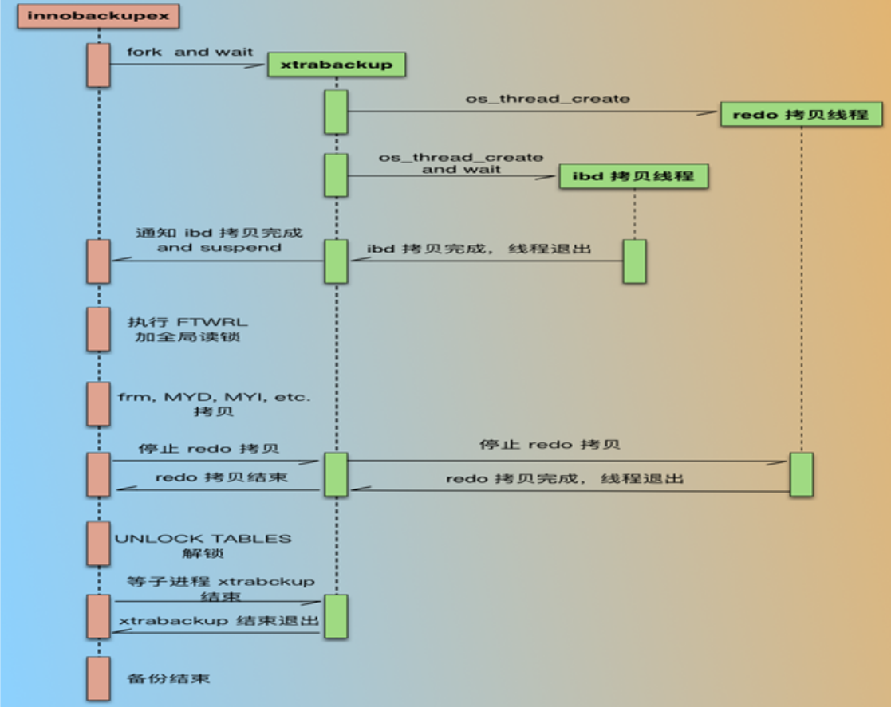
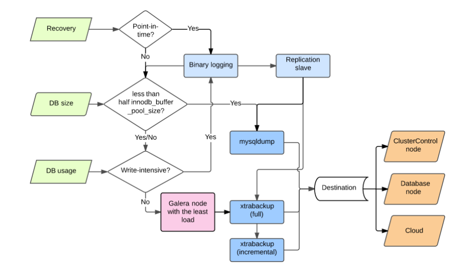

<center><font face="黑体" color="grey" size="5" >MySQL备份和恢复</font></center>

# 一.备份和恢复概述

## 1.1 为何备份?

- 灾难恢复
当出现严重的硬件故障、或者某个无耻的软件错误损坏了关键数据，或者服务器抽风，突然数据无法读取；
又或者黑客攻击、人员无操作等不幸发生时，此时如果没有备份数据，那就完蛋了。

- 审计
有时，有需要知道数据在过去的某个时间点是怎样的，例如：有人发现你的软件中的某个BUG，需要知道
代码在过去干了些啥(总有些时候你的软件仅仅有版本控制是不够的)

- 测试
在实际产生的数据上测试往往要频繁的将最新的产品数据放到测试服务器上，一个非常方便的做法是周期性
的使用最新的产品的数据备份恢复到测试服务器上。

- 某些人总是改变想法
你会惊讶于某些人删除了数据后反悔的速度有多快。

## 1.2 备份什么?

- 首要的是数据
对于MySQL来说，日志即代表了数据，包括：二进制日志(binary log)和InnoDB的事务日志(transaction log)

- 代码
目前的数据库产品如MySQL，都会存有大量的代码，如触发器和存储过程；备份mysql数据库可以备份大
部分触发器和存储过程，因为大部分的类似的代码都被存在系统数据库mysql中；但是没法独立的恢复
某个表，因为该表的某些“数据”(如存储过程)实际上存放于mysql数据库中。

下面展示了存储过程sp_testlog关联的数据存放在hellodb数据库的testlog表；而sp_testlog自身的
定义则被存放在mysql数据库的proc表

```sql
MariaDB [mysql]> USE mysql; SHOW TABLES;
Database changed
+---------------------------+
| Tables_in_mysql           |
+---------------------------+
| columns_priv              |
| db                        |
| event                     |
| func                      |
| general_log               |
| help_category             |
| help_keyword              |
| help_relation             |
| help_topic                |
| host                      |
| ndb_binlog_index          |
| plugin                    |
| proc                      |   # 此表存放sp_testlog存储过程
| procs_priv                |
| proxies_priv              |
| servers                   |
| slow_log                  |
| tables_priv               |
| time_zone                 |
| time_zone_leap_second     |
| time_zone_name            |
| time_zone_transition      |
| time_zone_transition_type |
| user                      |
+---------------------------+
24 rows in set (0.00 sec)

MariaDB [mysql]> SHOW PROCEDURE STATUS\G
*************************** 1. row ***************************
                  Db: hellodb       # sp_testlog存储过程关联的数据表
                Name: sp_testlog    # sp_testlog存储过程
                Type: PROCEDURE
             Definer: root@localhost
            Modified: 2019-11-27 08:47:42
             Created: 2019-11-27 08:47:42
       Security_type: DEFINER
             Comment: 
character_set_client: utf8
collation_connection: utf8_general_ci
  Database Collation: utf8_general_ci
1 row in set (0.00 sec)

MariaDB [mysql]> USE hellodb; SHOW tables;
Reading table information for completion of table and column names
You can turn off this feature to get a quicker startup with -A

Database changed
+-------------------+
| Tables_in_hellodb |
+-------------------+
| classes           |
| coc               |
| courses           |
| scores            |
| students          |
| testlog           |           # sp_testlog存储过程关联的数据表
+-------------------+
6 rows in set (0.00 sec)


MariaDB [mysql]> SELECT * FROM proc\G
*************************** 1. row ***************************
                  db: hellodb
                name: sp_testlog
                type: PROCEDURE
       specific_name: sp_testlog
            language: SQL
     sql_data_access: CONTAINS_SQL
    is_deterministic: NO
       security_type: DEFINER
          param_list: 
             returns: 
                body:               # 存储过程定义
begin;
declare i int;
set i = 1; 
while i <= 100000 
do  insert into testlog(name,age) values (concat('wang',i),i); 
set i = i +1; 
end while; 
end
...
1 row in set (0.00 sec)

```

- 数据复制相关的配置文件
如果涉及到主从复制的数据库备份和恢复(实际生产环境常见)，那最好把涉及到的配置文件全部包括到
备份计划中；如：二进制日志，中继日志，日志索引文件和.info文件等。

- 服务器配置文件
如果可能必须从严重的灾难恢复，需要配置一个全新的服务器，那最好连服务器配置文件备份。

- 和服务器紧密相关的系统配置文件
如涉及到备份计划的cron事务，用户和组配置，管理性脚本和sudo规则等。

## 1.3 备份要考虑哪些因素？

### 1.3.1  恢复点目标(RPO:recovery point objective)和恢复时间目标(RTO:recovery time objective)

- 在没有严重后果的情况下容忍多少数据丢失？
- 数据恢复时速度要多快才行？数据库不可访问时，什么时间范围内可以接受？用户能接受的时间长短？
- 需要恢复什么？
整个服务器？单个数据库？单张表？或者单个语句和事务？

### 1.3.2 备份策略

- 温备时加锁多久？

- 备份产生的负载服务器在该时段是否能够承载？

- 备份脚本的严格性？

### 1.3.3 备份和恢复的挑战

- 某个人可以计划，设计，实施备份；但是灾难恢复时未必是同一个人？

- 执着于备份，未进行恢复测试和演练？

## 1.4  备份的类型?

### 1.4.1 完全备份

完全备份：整个数据集,包括配置文件，全部数据库，全部日志。

### 1.4.2 部分备份

部分备份：只备份数据子集，如部分库或表或者某些SQL语句

### 1.4.3 增量备份和差异备份

增量备份:仅备份最近一次完全备份或增量备份（如果存在增量）以来变化的数据，备份较快，还原复杂
差异备份:仅备份最近一次完全备份以来变化的数据，备份较慢，还原简单

<center><font face="黑体" color="grey" size="2" >上:增量 下:差异</font></center>

### 1.4.4 冷备 温备 热备

冷备:对数据库的读、写操作均不可进行,相当于停数据库；完全停业务；也叫离线备份
温备:对数据库的读操作可执行,但写操作不可执行;影响业务
热备:对数据库的读、写操作均可执行;不影响业务

InnoDB：支持以上三种备份方式
MyISAM：只支持冷备和温备，不支持热备

### 1.4.5 物理备份

- 直接复制数据文件进行备份，与存储引擎有关，占用较多的空间，速度快
- 物理备份的优势：
1.备份操作简单，直接拷贝需要备份的文件到备份服务器
2.恢复物理备份亦简单，MyISAM的存储引擎直接放到相应的位置；InnoDB的存储引擎则需要停止MySQL
服务和其他的简单步骤。
3.InnoDB和MyISAM的数据库的物理备份可以跨平台、跨操作系统和跨MySQL版本兼容(逻辑备份亦可以)。
4.恢复物理备份的时间极短，因为MySQL服务器不用执行任何SQL语句或者构建索引；相比逻辑备份来说，
比较可怕的一点就是无法预估逻辑备份恢复的时间。
- 物理备份的劣势：
1.基于InnoDB数据库的物理备份文件往往远大于相对应的逻辑备份文件。InnoDB的表空间有很多未使用的
磁盘空间，有部分空间用来实现其他功能而不是存储数据(如：插入缓存，回滚段空间等)
2.由于文件名大小写敏感和不同的系统浮点数格式不一样等问题，物理备份也不是能够跨所有平台和系统。

### 1.4.6 逻辑备份

从数据库中“导出”数据另存而进行的备份，与存储引擎无关，占用空间少，速度慢，可能丢失精度

- 逻辑备份的优势:
1.逻辑备份是普通的文本文件，可以编辑查看修改。如使用grep和sed等工具处理后再恢复，或者在不
恢复的情况下查看数据。
2.还原方便，简单的使用管道传给mysql或使用mysqlimport命令就可以。
3.可以远程通过网络恢复数据。
4.配合mysqldump等恢复工具，可以非常灵活。
5.几乎与存储引擎无关的。可以备份InnoDB的数据表还原到使用MyISAM引擎的数据库中，几乎不要额外的工作。

- 逻辑备份的缺陷:
1.备份时，占用额外的服务器资源来产生备份文件。
2.逻辑备份有时会比物理文件大很多，使用压缩又会消耗CPU资源。
3.还原逻辑备份时需要MySQL解释执行SQL语句，转换为存储格式，并且重建索引；很慢。

# 二.mysqldump备份工具

## 2.1 mysqldump

> [官网使用手册](https://dev.mysql.com/doc/refman/5.7/en/mysqldump.html)

- mysqldump为mysql的客户端工具之一，用于实现逻辑备份功能；其通过产生可执行的SQL语句来备份一个
或多个数据库；mysqldump也可以产生CSV或者XML格式的文件。由于每次备份其都会使用mysql协议连接到mysql
服务器，所以有需要提供相关的认证信息，包括用户名、密码和主机(-uUSERNAME -p)，本地连接mysql服务器默认
主机为localhost。

## 2.2 用法及选项

```bash
mysqldump [OPTIONS] database [tables]
mysqldump [OPTIONS] –B DB1 [DB2 DB3...]
mysqldump [OPTIONS] –A [OPTIONS]

-A, --all-databases           #备份所有数据库，含create database
-B, --databases db_name…      #指定备份的数据库，包括create database语句
-E, --events                  #备份相关的所有event scheduler
-R, --routines                #备份所有存储过程和自定义函数
--triggers                    #备份表相关触发器，默认启用,用--skip-triggers，不备份触发器
--default-character-set=utf8  #指定字符集
--master-data[=#]             #此选项须启用二进制日志
                                 # 1：所备份的数据之前加一条记录为CHANGE MASTER TO语句，非注释，不指定#，默认为1
                                 # 2：记录为注释的CHANGE MASTER TO语句
                                 # 此选项会自动关闭--lock-tables功能，自动打开-x | --lock-all-tables功能（除非开启--single-transaction）
-F, --flush-logs              #备份前滚动日志，锁定表完成后，执行flush logs命令,生成新的二进制日志文
                               # 件，配合-A 或 -B 选项时，会导致刷新多次数据库。建议在同一时刻执行转储和
                               # 日志刷新，可通过和--single-transaction或-x，--master-data 一起使用实现，
                               # 此时只刷新一次二进制日志
--compact                    #去掉注释，适合调试，生产不使用
-d, --no-data                #只备份表结构
-t, --no-create-info         #只备份数据,不备份create table 
-n,--no-create-db            #不备份create database，可被-A或-B覆盖
--flush-privileges           #备份mysql或相关时需要使用
-f, --force                  #忽略SQL错误，继续执行
--hex-blob                   #使用十六进制符号转储二进制列，当有包括BINARY， VARBINARY，BLOB，BIT的数据类型的列时使用，避免乱码
-q, --quick                  #不缓存查询，直接输出，加快备份速度
```

## 2.3 备份示例

- 分库备份并压缩

```sql
法一：
[root@centos7 ~]$ll /backup/
total 0
[root@centos7 ~]$mysql -uroot -p -e "SHOW DATABASES;" | sed -rn '/^(Database|information_schema|performance_schema)$/!s#(.*)#mysqldump -B \1 | gzip > /backup/\1.sql.gz#p' | bash
Enter password: 
[root@centos7 ~]$ll /backup/
total 156
-rw-r--r-- 1 root root    513 Nov 30 13:05 db4.sql.gz
-rw-r--r-- 1 root root    514 Nov 30 13:05 db5.sql.gz
-rw-r--r-- 1 root root    514 Nov 30 13:05 db6.sql.gz
-rw-r--r-- 1 root root 139585 Nov 30 13:05 mysql.sql.gz
-rw-r--r-- 1 root root    514 Nov 30 13:05 test.sql.gz
[root@centos7 ~]$

法二：
[root@centos7 ~]$rm -f /backup/*
[root@centos7 ~]$ll /backup/
total 0
[root@centos7 ~]$for DB in `mysql -uroot -p -e "SHOW DATABASES;" | grep -Ev '^(Database|information_schema|performance_schema)$'`; do mysqldump -B $DB | gzip > /backup/$DB.sql.gz; done
Enter password:
[root@centos7 ~]$ll /backup/
total 156
-rw-r--r-- 1 root root    516 Nov 30 13:11 db4.sql.gz
-rw-r--r-- 1 root root    516 Nov 30 13:11 db5.sql.gz
-rw-r--r-- 1 root root    516 Nov 30 13:11 db6.sql.gz
-rw-r--r-- 1 root root 139586 Nov 30 13:11 mysql.sql.gz
-rw-r--r-- 1 root root    516 Nov 30 13:11 test.sql.gz

```

- 使用完全备份和二进制日志，还原数据库最新状态

```sql
# 1.完全备份
[root@centos7 ~]$mysqldump -A -F --single-transaction --master-data=2 | gzip > /backup/base-`date +%F-%T`.sql.gz
[root@centos7 ~]$ll /backup/
-rw-r--r-- 1 root root 139761 Nov 30 13:15 base-2019-11-30-13:15:43.sql.gz
[root@centos7 ~]$gunzip base-2019-11-30-13:15:43.sql.gz
# 2.确定二进制日志大小位置
[root@centos7 ~]$grep -nC 3 "\-\- CHANGE MASTER TO" /backup/base-2019-11-30-13\:15\:43.sql
19--- Position to start replication or point-in-time recovery from
20---
21-
22:-- CHANGE MASTER TO MASTER_LOG_FILE='mariadb-bin.000006', MASTER_LOG_POS=245;
23-
24---
25--- Current Database: `db4`
# 3.修改数据库
[root@centos7 ~]$mysql -p
Enter password:
...
MariaDB [(none)]> show databases;
+--------------------+
| Database           |
+--------------------+
| information_schema |
| db4                |
| db5                |
| db6                |
| mysql              |
| performance_schema |
| test               |
+--------------------+
7 rows in set (0.00 sec)

MariaDB [(none)]> drop database db4;
Query OK, 0 rows affected (0.00 sec)

MariaDB [(none)]> drop database db6;
Query OK, 0 rows affected (0.00 sec)

MariaDB [(none)]> show databases;
+--------------------+
| Database           |
+--------------------+
| information_schema |
| db5                |
| mysql              |
| performance_schema |
| test               |
+--------------------+
5 rows in set (0.00 sec)

# 4 查看完全备份后数据库更改后的二进制日志位置,并根据第2步得到的日志位置信息备份更改后的数据
MariaDB [(none)]> SHOW MASTER logs;
+--------------------+-----------+
| Log_name           | File_size |
+--------------------+-----------+
| mariadb-bin.000001 |       533 |
| mariadb-bin.000002 |       551 |
| mariadb-bin.000003 |       527 |
| mariadb-bin.000004 |       326 |
| mariadb-bin.000005 |       326 |
| mariadb-bin.000006 |       326 |
+--------------------+-----------+
4 rows in set (0.00 sec)
[root@centos7 ~]$mysqlbinlog mysql-bin.000006 --start-position=245 > /backup/inc.sql

# 5.干掉数据库
[root@centos7 ~]$ll /var/lib/mysql/
aria_log.00000001         ib_logfile0               mariadb-bin.000003        mariadb-bin.index         mysql/                    relay-log.000012
aria_log_control          ib_logfile1               mariadb-bin.000004        mariadb-relay-bin.000001  mysql.sock                relay-log.index
db5/                      mariadb-bin.000001        mariadb-bin.000005        mariadb-relay-bin.index   performance_schema/       relay-log.info
ibdata1                   mariadb-bin.000002        mariadb-bin.000006        master.info               relay-log.000011          test/
[root@centos7 ~]$rm -rf /var/lib/mysql/
[root@centos7 ~]$ll /var/lib/mysq/
ls: cannot access /var/lib/mysq/: No such file or directory
[root@centos7 ~]$ll /var/lib/mysql/
total 0

# 6.重新生成系统数据库
mysql_install_db --user=mysql
systemctl restart mariadb
[root@centos7 ~]$mysql -p
Enter password:
MariaDB [(none)]> show databases;
+--------------------+
| Database           |
+--------------------+
| information_schema |
| mysql              |
| performance_schema |
| test               |
+--------------------+
4 rows in set (0.00 sec)

MariaDB [(none)]> set sql_log_bin=0;  # 关闭二进制日志
Query OK, 0 rows affected (0.00 sec)

MariaDB [(none)]> select @@sql_log_bin;
+---------------+
| @@sql_log_bin |
+---------------+
|             0 |
+---------------+
1 row in set (0.00 sec)

MariaDB [(none)]> source /backup/base-2019-11-30-13:15:43.sql
Query OK, 0 rows affected (0.00 sec)

Query OK, 0 rows affected (0.00 sec)

Query OK, 0 rows affected (0.00 sec)

Query OK, 0 rows affected (0.00 sec)
...

# 7.数据库回到完全备份时状态
MariaDB [test]> show databases;
+--------------------+
| Database           |
+--------------------+
| information_schema |
| db4                |
| db5                |
| db6                |
| mysql              |
| performance_schema |
+--------------------+
7 rows in set (0.00 sec)

# 8.使用第4步得到的增量备份还原从完全备份后到数据库被干掉前的数据
Bye
[root@master ~]#mysql -p
Enter password:
...
MariaDB [test]> source /backup/inc.sql
MariaDB [test]> SET sql_log_bin=1;
MariaDB [(none)]> SHOW DATABASES;
+--------------------+
| Database           |
+--------------------+
| information_schema |
| db5                |
| mysql              |
| performance_schema |
+--------------------+
5 rows in set (0.00 sec)
```

## 2.4 基于MyISAM的MySQL使用mysqldump

- MyISAM不支持事务,只能支持温备；不支持热备，所以必须先锁定要备份的库，而后启动备份操作

```sqll
-x,--lock-all-tables # 加全局读锁，锁定所有库的所有表，同时加--single-transaction或--lock-tables选项
                     会关闭此选项功能
                     # 注意：数据量大时，可能会导致长时间无法并发访问数据库
-l,--lock-tables     # 对于需要备份的每个数据库，在启动备份之前分别锁定其所有表，默认为on,
--skip-lock-tables选项可禁用,对备份MyISAM的多个库,可能会造成数据不一致
# 注：以上选项对InnoDB表一样生效，实现温备，但不推荐使用
```

## 2.5 基于InnoDB的数据库使用mysqldump

- InnoDB 存储引擎支持事务,可以利用事务的相应的隔离级别,实现热备，也可以实现温备但不建议用

```sql
--single-transaction
# 此选项Innodb中推荐使用，不适用MyISAM，此选项会开始备份前，先执行START TRANSACTION指令开启事务
# 此选项通过在单个事务中转储所有表来创建一致的快照。 仅适用于存储在支持多版本控制的存储引擎中的表
（目前只有InnoDB可以）; 转储不保证与其他存储引擎保持一致。 在进行单事务转储时，要确保有效的转储
文件（正确的表内容和二进制日志位置），没有其他连接应该使用以下语句：ALTER TABLE，DROP 
TABLE，RENAME TABLE，TRUNCATE TABLE,此选项和--lock-tables（此选项隐含提交挂起的事务）选
项是相互排斥,备份大型表时，建议将--single-transaction选项和--quick结合一起使用
```

## 2.6 生产环境实战备份策略

- InnoDB建议备份策略

```sql
mysqldump –uroot -p –A –F –E –R  --single-transaction --master-data=1 --flush-privileges  --triggers --default-character-set=utf8 --hex-blob > ${BACKUP}/fullbak_${BACKUP_TIME}.sql
```

- MyISAM建议备份策略

```sql
mysqldump –uroot -p –A –F –E –R –x --master-data=1 --flush-privileges  --triggers  --default-character-set=utf8  --hex-blob > ${BACKUP}/fullbak_${BACKUP_TIME}.sql
```

# 三.xtrabackup备份工具

> [官网使用手册](https://www.percona.com/doc/percona-xtrabackup/2.4/index.html)

## 3.1 xtrabackup介绍

- xtrabackup备份工具是[percona公司](https://www.percona.com)提供的mysql数据库备份工具，惟一开源的能够
对innodb和xtradb数据库进行热备的工具。

- xtrabackup具有如下优点:

||
|---|
|1.备份还原过程快速、可靠
|2.备份过程不会打断正在执行的事务
|3.能够基于压缩等功能节约磁盘空间和流量
|4.自动实现备份检验
|5.开源，免费

- 免费的Percona XtraBackup和收费的MySQL Enterprise backup对比
[借一步到官网](https://www.percona.com/doc/percona-xtrabackup/LATEST/intro.html#mysql-backup-tool-feature-comparison)

- xtrabackup备份工具的文件组成---Xtrabackup2.2版之前包括4个可执行文件：

```sql
innobackupex:     主备份程序:Perl 脚本
xtrabackup:       主备份程序:C/C++，编译的二进制程序
xbcrypt:          用于加解密备份
xbstream:         支持并发写的流文件格式的备份工具
```

- xtrabackup的新版变化
xtrabackup版本升级到2.4后，相比之前的2.1有了比较大的变化：innobackupex功能全部集成到trabackup里面，只有一个 
binary程序，另外为了兼容考虑，innobackupex作为 xtrabackup 的软链接，即xtrabackup现在支持非Innodb表备份，
并且 Innobackupex 在下一版本中移除，建议通过xtrabackup替换innobackupex

- xtrabackup备份过程



- 备份后生成的文件：
  - 使用innobackupex备份时，其会调用xtrabackup备份所有的InnoDB表，复制所有关于表结构定义的相关文件(.frm)、以及MyISAM、MERGE、  
  CSV和ARCHIVE表的相关文件，同时还会备份触发器和数据库配置信息相关的文件。这些文件会被保存至一个以时间命名的目录中,在备份时，
  innobackupex还会在备份目录中创建如下文件：
  - (1)xtrabackup_info：文本文件，innobackupex工具执行时的相关信息，包括版本，备份选项，备份时长，备份LSN(log sequence number日志序列号)，BINLOG的位置
  - (2)xtrabackup_checkpoints：文本文件，备份类型（如完全或增量）、备份状态（如是否已经为prepared状态）和LSN范围信息,每个InnoDB页
(通常为16k大小)都会包含一个日志序列号LSN。LSN是整个数据库系统的系统版本号，每个页面相关的LSN能够表明此页面最近是如何发生改变的
  - (3)xtrabackup_binlog_info：文本文件，MySQL服务器当前正在使用的二进制日志文件及至备份这一刻为止二进制日志事件的位置，可利用
  实现基于binlog的恢复
  - (4)backup-my.cnf：文本文件，备份命令用到的配置选项信息
  - (5)xtrabackup_logfile：备份生成的二进制日志文件

## 3.2 xtrabackup使用

- 使用xtrabackup工具备份和还原，大体分三步实现:

1. 备份：   对数据库做完全或增量备份
`xtrabackup --backup --target-dir=/data/backups/`
2. 预准备： 还原前，先对备份的数据，整理至一个临时目录;整理后的已经是数据库可用数据
`xtrabackup --prepare --target-dir=/data/backups/`或`rsync -avrP /data/backup/ /var/lib/mysql/`
3. 还原：   将整理好的数据，复制回数据库目录中
`xtrabackup --copy-back --target-dir=/data/backups/`
`chown -R mysql:mysql /var/lib/mysql`

- [用法参考](https://www.percona.com/doc/percona-xtrabackup/LATEST/genindex.html) 

# 四.备份策略选择

- 根据数据库的大小、是否写密集、或者是否需要时间点回复等方面决定使用的备份恢复策略
- xtrabackup适用于大多数情况
