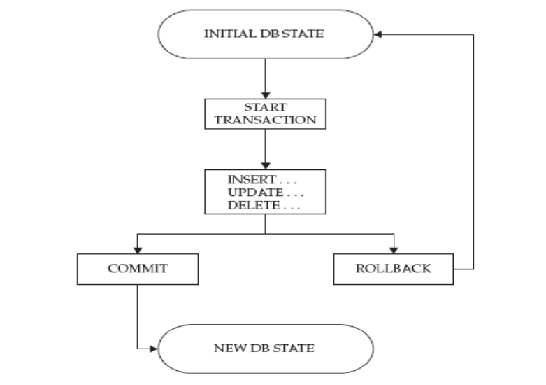
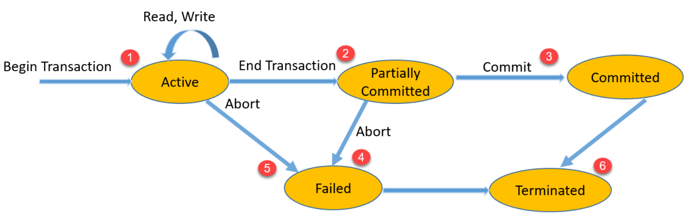
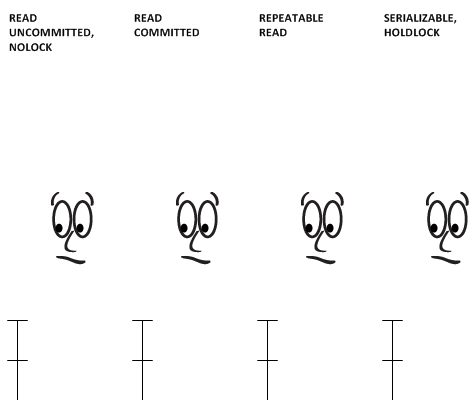

<center><font face="黑体" color="grey" size="5" >MySQL并发控制</font></center>

- MySQL的并发控制使用锁机制和事务相配合实现，几乎所有数据库都需要有并发控制能力，数据库的作用
决定了其工作时必须能够处理大量的并发读和写。至于并发控制用到什么技术取决于各个数据库的数据
存储引擎，在MySQL的InnoDB数据存储引擎中，其支持锁机制和事务机制。而MyISAM数据引擎则不支持
事务，但是其支持锁机制。

# 一.MySQL的锁机制

- 几乎所有需要处理并发读/写的系统都会实现相应的锁系统，一般锁系统包含两类锁:共享锁(shared locks)
和排他锁(exclusive locks)， 或者叫读锁(read locks)和写锁(write locks)。

## 1.1 锁分类

- 基于锁的功能：共享锁(shared locks)和排他锁(exclusive locks)， 或者叫读锁(read locks)和
写锁(write locks)

- 是否显式指定：
  - 隐式锁：由存储引擎自动施加锁
  - 显式锁：用户手动请求

## 1.2 锁粒度(Lock Granularity)

一种提高共享资源的并发性的做法是让资源具有更多的选择性，或者说以更小的粒度来区分资源；只对包含
需要改变的数据的部分进行加锁，而不是锁定整个资源块。但是锁是需要占用系统资源，需要开销的机制；
每个锁操作如:获取锁、检查某个锁是否是可用、释放锁等多种都会有额外开销。如果系统花费大量资源
在处理锁机制上而不实实在在的存储数据，那就会适得其反，拖累系统。

- 行级锁：InnoDB存储引擎提供到行级别的锁机制，也就是可以针对某个表的某个行或者某些行施加锁。

- 表级锁：MyISAM存储引擎提供到表级别的锁机制，也就是可以针对某个表施加锁。

- 另外在MySQL中支持MVCC:Multiversion Concurrency Control，其允许多个操作执行在某个表的同一行。

## 1.3 锁策略

- 锁策略是一种在锁机制的粒度和数据的安全性之间的平衡机制,该机制会影响性能

- 大部分商业数据库不会提供用户可控制的锁策略，MySQL的InnoDB自己会实现基于引擎存储层的锁策略和锁粒度。

- 在用户层和服务层则使用表级锁(MyISAM)和行级锁(InnoDB)

# 二.在MySQL中使用锁

- 加锁

```sql
LOCK TABLES tbl_name [[AS] alias] lock_type [, tbl_name [[AS] alias]
lock_type] ... 
lock_type: READ ， WRITE
eg:
LOCK TABLES mysql.user READ;
LOCK TABLES mysql.user WRITE;
```

- 解锁
`UNLOCK TABLES;`

- 关闭正在打开的表（清除查询缓存），通常在备份前加全局读锁
`FLUSH TABLES [tb_name[,...]] [WITH READ LOCK]`

- 查询时加写或读锁
`SELECT clause [FOR UPDATE | LOCK IN SHARE MODE]`


# 三.MySQL中的事务

## 3.1 事务概念

在MySQL中，事务(Transactions)表示一组原子性的SQL语句，或一个独立工作单元

## 3.2 事务的特性

- ACID特性
  - A：atomicity--原子性；整个事务中的所有操作要么全部成功执行，要么全部失败后回滚
  - C：consistency--一致性；数据库总是从一个一致性状态转换为另一个一致性状态
  - I：Isolation--隔离性；一个事务所做出的操作在提交之前，是不能为其它事务所见；隔离有多种隔离级别，实现并发
  - D：durability--持久性；一旦事务提交，其所做的修改会永久保存于数据库中

## 3.3 Transaction 生命周期

- Transaction 生命周期


<center><font face="黑体" color="grey" size="3" >图1 Transaction 生命周期</font></center>

- Transaction 可能出现的状态

<center><font face="黑体" color="grey" size="3" >图2 Transaction 可能出现的状态</font></center>

1.一旦开始事务，就意味着对数据的读写，此时事务是活动状态  
2.读写操作完成后，事务变为部分提交状态  
3.接着，检查系统是否能够确保刷写数据到磁盘，如果检查OK；就提交所有更改，此时事务为提交状态
4.如果3中的检查失败，那事务就会变为失败状态
5.如果事务在活动状态由于某种原因被取消(abort),也会变为失败状态。此时该事务应该被回滚，确保未更改磁盘状态
6.最后的terminated状态表示事务完成，已经不存在于当前系统

## 3.4 管理事务

- 显式启动事务

```sql
三种语句都可以开启事务:只有事务型存储引擎中的DML语句方能支持此类操作(InnoDB)
BEGIN
BEGIN WORK
START TRANSACTION
```

- 结束事务
`COMMIT`

- 回滚某个事务
`ROLLBACK`

- 设置事务自动提交
`SET autocommit=1` 不建议使用默认的自动提交功能，在/etc/my.cnf.d/server.cnf配置设置为0

- 事务支持保存点

```sql
SAVEPOINT identifier
ROLLBACK [WORK] TO [SAVEPOINT] identifier
RELEASE SAVEPOINT identifier
```

- 查看事务

```sql
#查看当前的事务
SELECT * FROM INFORMATION_SCHEMA.INNODB_TRX;
#查看当前锁定的事务
SELECT * FROM INFORMATION_SCHEMA.INNODB_LOCKS;
#查看当前等锁的事务
SELECT * FROM INFORMATION_SCHEMA.INNODB_LOCK_WAITS;
```

- 查看事务锁的超时时长，默认50s

```sql
MariaDB [hellodb]> show global variables like 'innodb_lock_wait_timeout';
+--------------------------+-------+
| Variable_name            | Value |
+--------------------------+-------+
| innodb_lock_wait_timeout | 50    |
+--------------------------+-------+
1 row in set (0.001 sec)
```

### 3.4.1 事务隔离级别

- MySQL 支持四种隔离级别


<center><font face="黑体" color="grey" size="3" >图3 四种隔离级别</font></center>

|隔离级别|说明|
|:---|:---|
|READ UNCOMMITTED |可读取到未提交数据，产生脏读(Dirty reads)
|READ COMMITTED |可读取到提交数据，但未提交数据不可读，产生不可重复读(Non-repeatable reads)，即可读取到多个提交数据，导致每次读取数据不一致
|REPEATABLE READ |可重复读，多次读取数据都一致，产生幻读(Phantom reads)，即读取过程中，即使有其它提交的事务修改数据，仍只能读取到未修改前的旧数据。此为MySQL默认设置
|SERIALIZABLE |可串行化，未提交的读事务阻塞修改事务（加读锁，但不阻塞读事务），或者未提交的修改事务阻塞读事务（加写锁，其它事务的读，写都不可以执行）。会导致并发性能差




- MVCC和事务的隔离级别
  - MVCC（多版本并发控制机制）只在REPEATABLE READ和READ COMMITTED两个隔离级别下工作。其
他两个隔离级别都和MVCC不兼容,因为READUNCOMMITTED总是读取最新的数据行，而不是符合当前
事务版本的数据行。而SERIALIZABLE则会对所有读取的行都加锁

- 指定事务隔离级别：

1. 服务器变量tx_isolation指定，默认为REPEATABLE-READ，可在GLOBAL和SESSION级进行设置
`SET tx_isolation='READ-UNCOMMITTED|READ-COMMITTED|REPEATABLE-READ|SERIALIZABLE'`
2. 服务器选项中指定

```sql
vim /etc/my.cnf
[mysqld]
transaction-isolation=SERIALIZABLE
```

- 死锁
两个或多个事务在同一资源相互占用，并请求锁定对方占用的资源的状态

