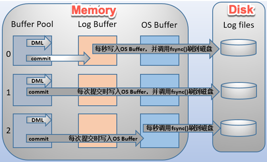

<center><font face="黑体" color="grey" size="5" >MySQL日志管理</font></center>

- MySQL支持丰富的日志类型，包括：

|||
|:---|:---|
|事务日志|transaction log 事务日志的写入类型为“追加”，因此其操作为“顺序IO”；通常也被称为：预写式日志 write ahead logging
||事务日志文件: /var/lib/mysql/ib_logfile0, /var/lib/mysql/ib_logfile1
|错误日志 |error log
|通用日志 |general log
|慢查询日志 |slow query log
|二进制日志 |binary log
|中继日志 |reley log，在主从复制架构中，从服务器用于保存从主服务器的二进制日志中读取的事件

# 一.事务日志

## 1.1 事务日志

- 事务日志(transaction log)是事务型存储引擎(InnoDB)自行管理和使用的一种日志，默认在MySQL的数据库所在的文件夹；
实际使用时建议和数据文件分开存放
- 事务日志又分为redo log和undo log

## 1.2 InnoDB事务日志配置

- InnoDB事务配置项
`SHOW VARIABLES LIKE '%innodb_log%';`

```sql
innodb_log_file_size 50331648              # 定义每个日志文件大小
innodb_log_files_in_group 2                # 日志组成员个数
innodb_log_group_home_dir ./               # 事务文件路径,该相对路径是相对于mysql数据库所在目录
innodb_flush_log_at_trx_commit=0|1|2     # 决定innodb在多I/O操作的事务进行过程中ACID符合度和系统性能的参数默认为1
```

## 1.3 配置innodb处理事务日志的行为优化性能

- innodb_flush_log_at_trx_commit 取不同值时InnoDB对数据的不同操作


<center><font face="黑体" color="grey" size="3" >innodb_flush_log_at_trx_commit</font></center>

```sql
1: 默认情况下，日志缓冲区将写入日志文件，并在每次事务后执行刷新到磁盘。 完全遵守ACID特性
    innodb_flush_log_at_trx_commit设置为1，同时配合sync_binlog = 1表示最高级别的容错能力
    另一项参数：innodb_use_global_flush_log_at_trx_commit的值确定是否可以使用SET语句重置innodb_flush_log_at_trx_commit变量
0: 提交时没有写磁盘的操作; 而是每秒执行一次将日志缓冲区的提交的事务写入刷新到磁盘。 这样可提
供更好的性能，但服务器崩溃可能丢失最后一秒的事务
2: 每次提交后都会写入OS的缓冲区但是不立即3刷新到磁盘，每秒才会进行一次刷新到磁盘文件中。 性能
比值为0略差一些，但操作系统或停电可能导致最后一秒的交易丢失
3: 模拟MariaDB 5.5组提交（每组提交3个同步），此项MariaDB 10.0支持
```

- 性能从高到低:`0--->2--->1` 但是是以最后一秒的数据可能丢失的代价换取的
- `innodb_flush_log_at_trx_commit=2`是比较折中的方案

# 二.错误日志

## 错误日志

- 错误日志为mysqld启动和关闭过程中输出的事件信息、mysqld运行中产生的错误信息、event scheduler
运行一个event时产生的日志信息及在主从复制架构中的从服务器上启动从服务器线程时产生的信息

- 错误日志文件路径

`SHOW GLOBAL VARIABLES LIKE 'log_error';`

```sql
MariaDB [hellodb]> SHOW GLOBAL VARIABLES LIKE 'log_error';
+---------------+------------------------------+
| Variable_name | Value                        |
+---------------+------------------------------+
| log_error     | /var/log/mariadb/mariadb.log |
+---------------+------------------------------+
1 row in set (0.00 sec)
```

错误日志配合log_warnings系统变量，log_warnings表示是否将更多的包括警告的日志输出到/var/log/mariadb/mariadb.log
文件中,默认为启用，指定任何大于1的数表示将尝试连接失败等的信息一并记录到错误日志文件中。0表示不输出
错误日志。

```sql
log_error=/PATH/TO/ERR0R_LOG_FILE
log_warnings=1
```

# 三.通用日志

## 3.1 通用日志

- 通用日志用于记录对数据库的通用操作，包括错误的SQL语句
- 通用日志可以保存在文件或者数据库中:file(默认值)或table(mysql.general_log)

## 3.2 通用日志相关设置

- 配置选项

```sql
general_log=ON|OFF
general_log_file=HOSTNAME.log
log_output=TABLE|FILE|NONE
```

- 开启通用日志

```sql
MariaDB [hellodb]> SET GLOBAL log_output="table";
Query OK, 0 rows affected (0.00 sec)

MariaDB [hellodb]> SHOW VARIABLES LIKE 'log_output';
+---------------+-------+
| Variable_name | Value |
+---------------+-------+
| log_output    | TABLE |
+---------------+-------+
1 row in set (0.00 sec)

MariaDB [hellodb]> SET GLOBAL general_log=ON;
Query OK, 0 rows affected (0.00 sec)

MariaDB [hellodb]> SELECT * FROM mysql.general_log\G
*************************** 1. row ***************************
  event_time: 2019-11-27 12:44:42.881291
   user_host: root[root] @ localhost []
   thread_id: 37
   server_id: 1
command_type: Query
    argument: SELECT * FROM mysql.general_log
1 row in set (0.00 sec)

MariaDB [hellodb]> SELECT * FROM mysql.general_log;
+----------------------------+---------------------------+-----------+-----------+--------------+---------------------------------+
| event_time                 | user_host                 | thread_id | server_id | command_type | argument                        |
+----------------------------+---------------------------+-----------+-----------+--------------+---------------------------------+
| 2019-11-27 12:44:42.881291 | root[root] @ localhost [] |        37 |         1 | Query        | SELECT * FROM mysql.general_log |
| 2019-11-27 12:46:21.332561 | root[root] @ localhost [] |        37 |         1 | Query        | SELECT * FROM mysql.general_log |
+----------------------------+---------------------------+-----------+-----------+--------------+---------------------------------+
2 rows in set (0.00 sec)
```

# 四.慢查询日志

## 4.1 慢查询日志

- 慢查询日志用来记录SQL语句执行时长超出指定时长的操作,这样有利于找到执行速度较慢的语句，以便针对性
优化查询性能。

## 4.2 慢查询日志配置项

```sql
slow_query_log=ON|OFF #开启或关闭慢查询
long_query_time=N #慢查询的阀值，单位秒
slow_query_log_file=HOSTNAME-slow.log #慢查询日志文件
log_slow_filter = admin,filesort,filesort_on_disk,full_join,full_scan,
query_cache,query_cache_miss,tmp_table,tmp_table_on_disk
#上述查询类型且查询时长超过long_query_time，则记录日志
log_queries_not_using_indexes=ON #不使用索引或使用全索引扫描，不论是否达到慢查询阀值的语
句是否记录日志，默认OFF，即不记录
log_slow_rate_limit = 1 #多少次查询才记录，mariadb特有
log_slow_verbosity= Query_plan,explain #记录内容
log_slow_queries = OFF 同slow_query_log #MariaDB 10.0/MySQL 5.6.1 版后已删除
```

# 五.profile工具

## 5.1 profile

- profile 工具用来显示指明某SQL语句在当前session执行过程中所使用的资源情况的信息。可以使用下面的句
子开启profile功能。其显示的SQL语句都是在最近发送给服务器执行的，显示SQL语句的多少由
`profiling_history_size`会话及参数确定。默认为100，设置为0失能profile功能。

```sql
SHOW PROFILE [type [, type] ... ]
    [FOR QUERY n]
    [LIMIT row_count [OFFSET offset]]

type: {
    ALL
  | BLOCK IO
  | CONTEXT SWITCHES
  | CPU
  | IPC
  | MEMORY
  | PAGE FAULTS
  | SOURCE
  | SWAPS
}
```

`SET profiling=ON;`

- 查看SQL语句的ID和总的执行时间等信息使用
`SHOW profile;`或`SHOW profiles;`

- 具体查看某个SQL语句的详细执行过程和资源使用情况使用
`SHOW profile FOR QUERY ID`  # ID为`SHOW profile;`命令显示的第一列

- 查看具体对某种资源的使用情况和时间用
`SHOW profile CPU[|IPC...] FOR QUERY n;`

- 例子

```sql
mysql> SELECT @@profiling;
+-------------+
| @@profiling |
+-------------+
|           0 |
+-------------+
1 row in set (0.00 sec)

mysql> SET profiling = 1;
Query OK, 0 rows affected (0.00 sec)

mysql> DROP TABLE IF EXISTS t1;
Query OK, 0 rows affected, 1 warning (0.00 sec)

mysql> CREATE TABLE T1 (id INT);
Query OK, 0 rows affected (0.01 sec)

mysql> SHOW PROFILES;
+----------+----------+--------------------------+
| Query_ID | Duration | Query                    |
+----------+----------+--------------------------+
|        0 | 0.000088 | SET PROFILING = 1        |
|        1 | 0.000136 | DROP TABLE IF EXISTS t1  |
|        2 | 0.011947 | CREATE TABLE t1 (id INT) |
+----------+----------+--------------------------+
3 rows in set (0.00 sec)

mysql> SHOW PROFILE;
+----------------------+----------+
| Status               | Duration |
+----------------------+----------+
| checking permissions | 0.000040 |
| creating table       | 0.000056 |
| After create         | 0.011363 |
| query end            | 0.000375 |
| freeing items        | 0.000089 |
| logging slow query   | 0.000019 |
| cleaning up          | 0.000005 |
+----------------------+----------+
7 rows in set (0.00 sec)

mysql> SHOW PROFILE FOR QUERY 1;
+--------------------+----------+
| Status             | Duration |
+--------------------+----------+
| query end          | 0.000107 |
| freeing items      | 0.000008 |
| logging slow query | 0.000015 |
| cleaning up        | 0.000006 |
+--------------------+----------+
4 rows in set (0.00 sec)

mysql> SHOW PROFILE CPU FOR QUERY 2;
+----------------------+----------+----------+------------+
| Status               | Duration | CPU_user | CPU_system |
+----------------------+----------+----------+------------+
| checking permissions | 0.000040 | 0.000038 |   0.000002 |
| creating table       | 0.000056 | 0.000028 |   0.000028 |
| After create         | 0.011363 | 0.000217 |   0.001571 |
| query end            | 0.000375 | 0.000013 |   0.000028 |
| freeing items        | 0.000089 | 0.000010 |   0.000014 |
| logging slow query   | 0.000019 | 0.000009 |   0.000010 |
| cleaning up          | 0.000005 | 0.000003 |   0.000002 |
+----------------------+----------+----------+------------+
7 rows in set (0.00 sec)
```

# 六.二进制日志

## 6.1 二进制日志

- 二进制日志用来记录导致数据改变或潜在导致数据改变的SQL语句,也记录已提交的日志;其不依赖于存储引擎类型
- 功能：通过“重放”日志文件中的事件来生成数据副本,是数据库恢复必不可少的日志文件
- 由于二进制日志文件及其重要，建议将二进制日志和数据文件分开存放,最好放到不同磁盘；备份好的二进制文件
放在远程服务器。

## 6.2 二进制日志记录可以配置三种格式

> [官方手册参考](https://dev.mysql.com/doc/refman/5.7/en/replication-options-binary-log.html#sysvar_binlog_format)

|||
|:---|:---|
|STATEMENT|基于"语句"记录：记录语句，默认模式(MariaDB 10.2.3 版本以下)，日志量较少
|ROW|基于"行"记录：记录数据，日志量较大
|MIXED|混合模式：让系统自行判定该基于哪种方式进行，默认模式(MariaDB 10.2.4及版本以上)

- STATEMENT-BASED:当使用基于STATEMENT(语句)的二进制日志时，从主到从的复制通过主服务器将SQL语句
写入二进制log。从服务器将二进制记录的SQL语句在其数据运行来生成原来数据库，该行为对应于基于statement
的二进制日志。
- ROW-BASED:当使用基于ROW(行/记录)的二进制日志时，主服务器将事务写入二进制log，意味这可以精确的
确定每个表的某个行是如何变更的。主到从的复制通过将反映每个表的行更改的事务复制到到从服务器并执行
生成原来的表和数据库，该过程就对应于基于ROW(行/记录)的二进制日志。
- MIXED:当指定为基于MIXED的二进制日志格式时，默认是使用基于STATEMENT的记录格式；二进制日志自动切换为ROW-
BASED时取决于特定的SQL语句和特定的存储引擎。

- MySQL 5.7.7 之前, 基于STATEMENT的二进制格式为默认格式；MySQL 5.7.7 及更新的版本使用ROW-BASED格式为
默认。

- 三种格式的指定方式
  - 启动服务加选项：`--binlog-format=STATEMENT|ROW|MIXED`
  - 配置文件：`binlog_format=STATEMENT|ROW|MIXED`
  - session中：

```sql
MariaDB [hellodb]> select @@binlog_format;
+-----------------+
| @@binlog_format |
+-----------------+
| STATEMENT       |
+-----------------+
1 row in set (0.00 sec)

MariaDB [hellodb]> set binlog_format=ROW;
Query OK, 0 rows affected (0.00 sec)

MariaDB [hellodb]> select @@binlog_format;
+-----------------+
| @@binlog_format |
+-----------------+
| ROW             |
+-----------------+
1 row in set (0.00 sec)
```

## 6.3 二进制日志文件构成

- 二进制文件由两种文件构成，日志文件和索引文件：一个或多个二进制日志文件，一个索引文件；日志文件存放真正的
二进制日志，索引文件存放目前的所有二进制文件的文件名列表。
 
- 日志文件:mysql|mariadb-bin.000*   # 二进制格式
        如:mariadb-bin.000001
- 索引文件:mysql|mariadb-bin.index  # 文本格式

## 6.4 二进制日志相关变量

|变量|含义|
|:---|:---|
|sql_log_bin=ON\|OFF|是否记录二进制日志，默认ON
|log_bin=/PATH/TO/BIN_LOG_FILE|指定文件位置；默认OFF，表示不启用二进制日志功能，上述两项都开启才可
|binlog_format=STATEMENT\|ROW\|MIXED|二进制日志记录的格式
|max_binlog_size=1073741824|单个二进制日志文件的最大体积，到达最大值会自动滚动，默认为1G;文件达到上限时的大小未必为指定的精确值
|sync_binlog=1\|0|设定是否启动二进制日志即时同步磁盘功能，默认0，由操作系统负责同步日志到磁盘
|expire_logs_days=N|二进制日志可以自动删除的天数。 默认为0，即不自动删除

## 6.5 二进制日志配置

- 查看mariadb自行管理使用中的二进制日志文件列表，及大小
`SHOW {BINARY | MASTER} LOGS;`

```sql
MariaDB [hellodb]> SHOW BINARY LOGS;
+--------------------+-----------+
| Log_name           | File_size |
+--------------------+-----------+
| mariadb-bin.000001 |  29086832 |
| mariadb-bin.000002 |       502 |
| mariadb-bin.000003 |       264 |
| mariadb-bin.000004 |       290 |
| mariadb-bin.000005 |  67634113 |
| mariadb-bin.000006 |       924 |
| mariadb-bin.000007 |       668 |
| mariadb-bin.000008 |       290 |
| mariadb-bin.000009 |       290 |
| mariadb-bin.000010 |       245 |
+--------------------+-----------+
10 rows in set (0.00 sec)
```

- 查看使用中的二进制日志文件
`SHOW MASTER STATUS`

```sql
MariaDB [hellodb]> SHOW MASTER STATUS;
+--------------------+----------+--------------+------------------+
| File               | Position | Binlog_Do_DB | Binlog_Ignore_DB |
+--------------------+----------+--------------+------------------+
| mariadb-bin.000010 |      245 |              |                  |
+--------------------+----------+--------------+------------------+
1 row in set (0.00 sec)
```

- 查看二进制文件中的指定内容
`SHOW BINLOG EVENTS [IN 'log_name'] [FROM pos] [LIMIT [offset,] row_count]`

```sql
MariaDB [hellodb]> SHOW BINLOG EVENTS IN 'mariadb-bin.000010';
+--------------------+-----+-------------+-----------+-------------+-------------------------------------------+
| Log_name           | Pos | Event_type  | Server_id | End_log_pos | Info                                      |
+--------------------+-----+-------------+-----------+-------------+-------------------------------------------+
| mariadb-bin.000010 |   4 | Format_desc |         1 |         245 | Server ver: 5.5.64-MariaDB, Binlog ver: 4 |
+--------------------+-----+-------------+-----------+-------------+-------------------------------------------+
1 row in set (0.00 sec)
```
```sql
MariaDB [(none)]> SHOW BINLOG EVENTS IN 'mariadb-bin.000005' FROM 2583366 LIMIT 4;
+--------------------+---------+------------+-----------+-------------+------------------------------------------------------------------------------------------------------------------+
| Log_name           | Pos     | Event_type | Server_id | End_log_pos | Info                                                                                                             |
+--------------------+---------+------------+-----------+-------------+------------------------------------------------------------------------------------------------------------------+
| mariadb-bin.000005 | 2583366 | Xid        |         1 |     2583393 | COMMIT /* xid=27253 */                                                                                           |
| mariadb-bin.000005 | 2583393 | Query      |         1 |     2583464 | BEGIN                                                                                                            |
| mariadb-bin.000005 | 2583464 | Intvar     |         1 |     2583492 | INSERT_ID=108946                                                                                                 |
| mariadb-bin.000005 | 2583492 | Query      |         1 |     2583655 | use `hellodb`; insert into testlog(name,age) values (concat('wang', NAME_CONST('i',8946)), NAME_CONST('i',8946)) |
+--------------------+---------+------------+-----------+-------------+------------------------------------------------------------------------------------------------------------------+
4 rows in set (0.00 sec)
```

- 清除指定二进制日志

`PURGE { BINARY | MASTER } LOGS  { TO 'log_name' | BEFORE datetime_expr }`

```sql
PURGE BINARY LOGS TO 'mariadb-bin.000003'; #删除mariadb-bin.000003之前的日志
PURGE BINARY LOGS BEFORE '2019-12-23';
PURGE BINARY LOGS BEFORE '2018-12-22 04:22:30';
```

- 删除所有二进制日志，index文件重新记数

```sql
RESET MASTER [TO #]; #删除所有二进制日志文件，并重新生成日志文件，文件名从#开始记数，
默认从1开始，一般是master主机第一次启动时执行，MariaDB10.1.6开始支持TO #
```

- 使用二进制日志的客户端命令工具:mysqlbinlog
  - 用法

```sh
mysqlbinlog [OPTIONS] log_file…
    --start-position=#  指定开始位置
    --stop-position=#
    --start-datetime=     #时间格式：YYYY-MM-DD hh:mm:ss
    --stop-datetime=
    --base64-output[=name]
    -v -vvv
```

- 例：

```sql
mysqlbinlog --start-position=334 --stop-position=556 /var/lib/mysql/mariadb-bin.000003 -v
mysqlbinlog  --start-datetime="2019-09-18 20:33:10" --stop-datetime="2019-11-27 22:35:22" mariadb-bin.000003 -vvv
```

- 二进制日志事件的格式

```sql
[root@old_centos7 /backup]#mysqlbinlog  /var/lib/mysql/mariadb-bin.000010 
...
# at 766
#191127 21:47:08 server id 1  end_log_pos 879   Query   thread_id=2     exec_time=0     error_code=0
SET TIMESTAMP=1574909228/*!*/;
DROP TABLE `teachers` /* generated by server */
/*!*/;
...
#############################################
事件发生的日期和时间：191127 21:47:08
事件发生的服务器标识：server id 1
事件的结束位置：end_log_pos 879
事件的类型：Query 
事件发生时所在服务器执行此事件的线程的ID：thread_id=2
语句的时间戳与将其写入二进制文件中的时间差：exec_time=0
错误代码：error_code=0
事件内容：DROP TABLE `teachers`
GTID：Global Transaction ID，mysql5.6以mariadb10以上版本专属属性：GTID
```

- 切换日志文件
`FLUSH LOGS;`
