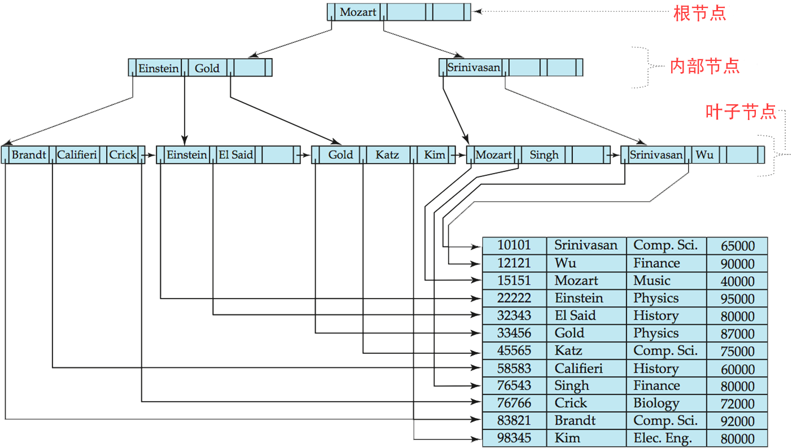

<center><font face="黑体" color="grey" size="5" >MySQL索引</font></center>

# 一.索引介绍

## 1.1 索引概念

索引是数据存储引擎用来快速查找数据表的记录(数据表的每一行)的数据结构，在MySQL中也叫'Keys'。索引在MySQL的性能表现中起着关键作用，特别是随着数据量的增长，索引越发显得重要。

## 1.2 索引基础

理解索引的一个比较容易的方式就是想一下书本的目录，通过目录可以快速找到某个书中所讨论的主题，特别是非常
厚的书，目录可以极大的加快找到某个话题的速度。

MySQL中的索引包含来自数据表的某个或多个字段的值，如果在不同的字段上使用看了索引，那么字段的顺序是非常
重要的,因为MySQL只能在索引的最左前缀快速的搜索。

### 1.2.1 索引类型

索引种类很多，不同的索引针对不同的目的而设计。索引在数据存储引擎层实现，不是所有数据引擎都支持所有索引，不同的数据引擎对于自己支持的索引的实现也不一样。

- B-Tree 索引

B树是一种常见的数据结构，其设计目的是为了加快数据库中数据引擎对于数据的存取速度，使用其来定位数据在
磁盘的位置。在MySQL中使用的Innodb数据引擎使用页(page)的概念管理磁盘，默认Innodb的页大小为16K，也可以
通过系统参数innodb_page_size来设置页大小(4K,8K,16K)。在连接到mysql的session中使用如下命令查看当前页大小:
> mysql> SHOW VARIABLES LIKE 'innodb_page_size';

```sql
MariaDB [mysql]> SHOW VARIABLES LIKE 'innodb_page%';;
+------------------+-------+
| Variable_name    | Value |
+------------------+-------+
| innodb_page_size | 16384 |
+------------------+-------+
1 row in set (0.00 sec)
```

而一般操作系统文件系统所使用的最小磁盘管理单位为512字节或者2K或者4K，不会到16K。此时如果InnoDB每次申请
磁盘空间，都会顺序的使用多个文件系统的块来凑成16K，可以想象的是如果没有索引，查找某条数据时可能要读取
多个16K的磁盘页面，此时在操作系统层面实际上读取了多个更小的磁盘块，将会产生大量的磁盘I/O，很影响性能；
引入索引后，某个16K的页内的数据项可以记录其它数据项的位置，可以方便的找到其它数据项，大幅减少磁盘I/O，
提高查询效率。B-Tree在数据库中的结构如图1中的上部分。下部分为B+Tree,B+Tree与B-Tree的主要区别在于：B-Tree
中每个节点(叶节点和非叶子节点)都包含key和指向数据的指针，一旦定位某个节点后就可以根据该节点存储的指针找到
数据存储的地址；而B+Tree则是将所有数据指针存放在叶子节点中，其它节点只存放索引。

<center><font face="黑体" color="grey" size="2" >图1 B-Tree在数据库中和数据表关联后的结构</font></center>

- B+Tree 索引

<center><font face="黑体" color="grey" size="2" >图2 B+Tree在数据库中和数据表关联后的结构</font></center>

由图2可以看出由于非叶子节点没有存储指向数据的指针，所以可以存储更多的索引加载进内存。而不用数据来占用宝贵的内存资源。

### 1.2.2 索引的好处

索引可以降低服务需要扫描的数据量，减少了IO次数
索引可以帮助服务器避免排序和使用临时表
索引可以帮助将随机I/O转为顺序I/O


# 二.索引的类型和结构


# 三.MySQL索引优化