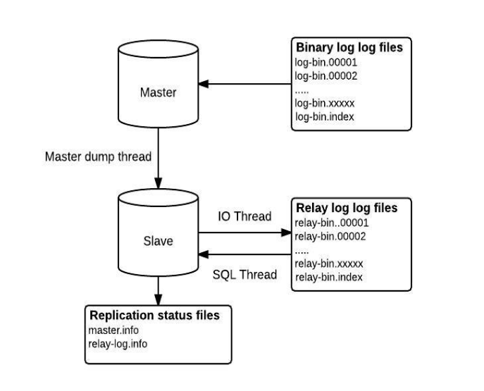
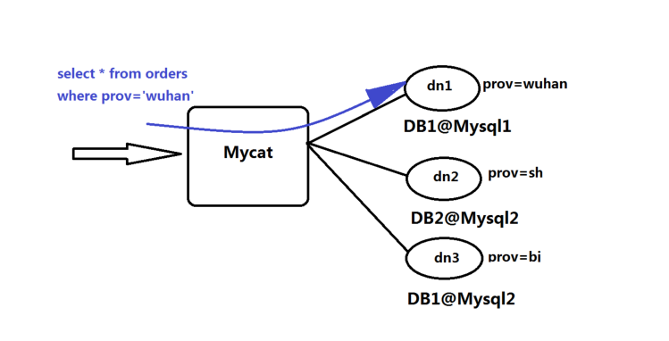
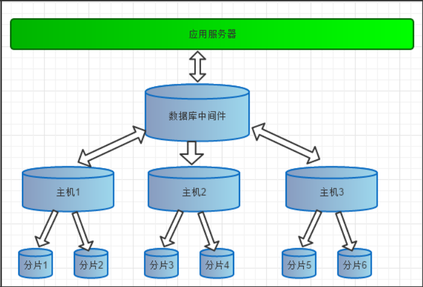
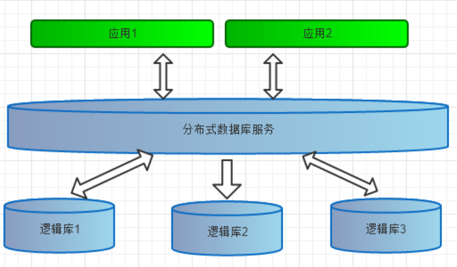
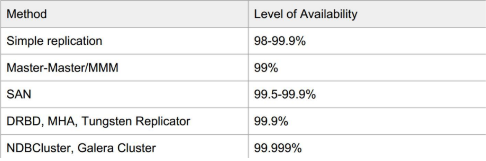
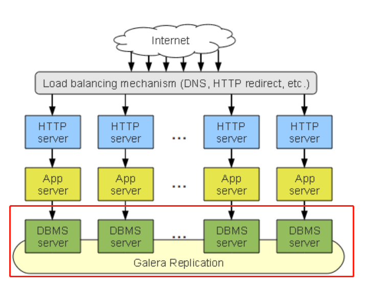
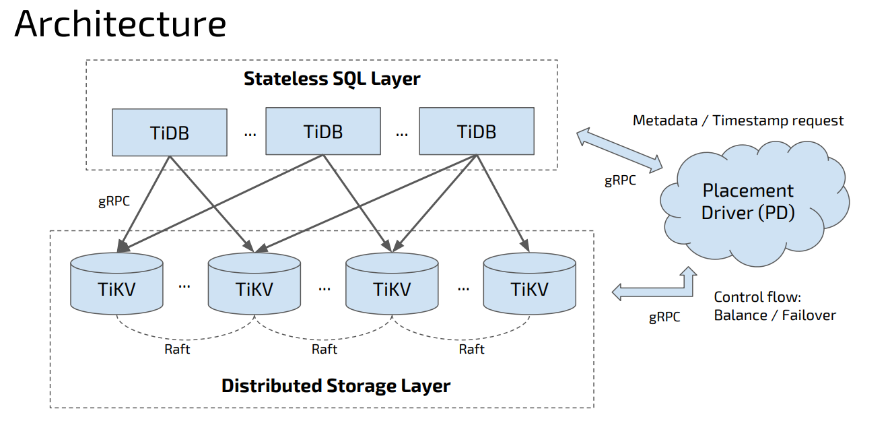
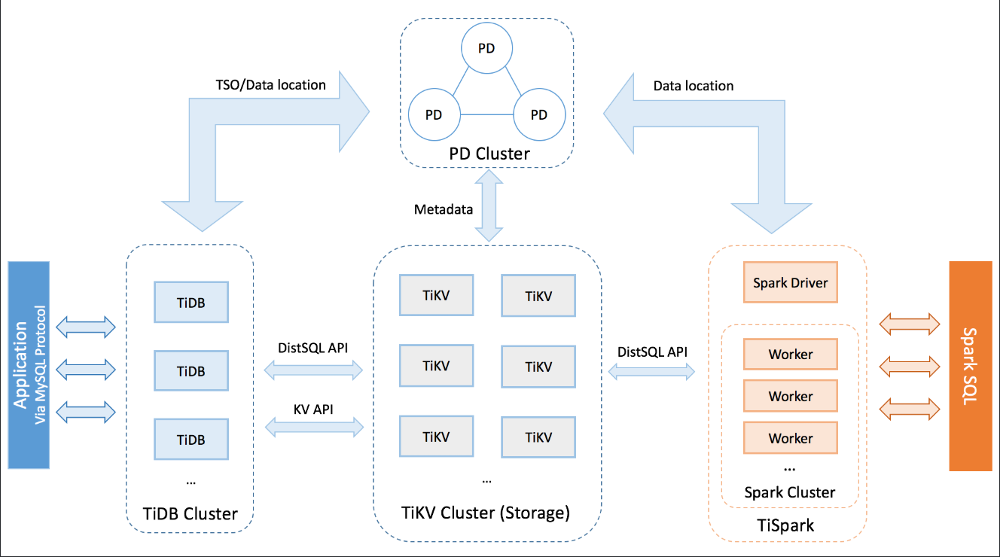

<center><font face="黑体" color="grey" size="5" >MySQL集群</font></center>

# 一.MySQL 主从复制

## 1.1 主从复制概念

### 1.1.1 主从复制原理

- MySQL 主从复制原理如图 1
  

  <center><font face="黑体" color="grey" size="3" >MySQL主从复制原理</font></center>

- 如上图示，主从复制相关概念有:Master server(主服务器)、Slave server(从服务器)、
  Binary logs(二进制日志)、Relay logs(中继日志)及相关的信息文件。

- 主服务器数据变动后，二进制日志记录下来，主服务器的 Binlog Dump 线程将二进制日志
  发送给从服务器的 I/O Thread。接着从服务器 I/O 线程将其写入中继日志 Relay log。后面的
  SQL Thread 将中继日志应用到从服务器，执行相应的 SQL 语句生成同步数据。

### 1.1.2 二进制日志类型

- 基于 STATEMENT 格式---binlog_format=STATEMENT

```sql
# at 237
#150416 18:30:21 server id 1  end_log_pos 316 CRC32 0x54b3fd07 Query thread_id=3 exec_time=0 error_code=0
SET TIMESTAMP=1429209021/*!*/;
BEGIN
/*!*/;
# at 316
#150416 18:30:21 server id 1  end_log_pos 440 CRC32 0x23bfcad7 Query thread_id=3 exec_time=0 error_code=0
SET TIMESTAMP=1429209021/*!*/;
insert into t1 (f1,f2) values(17650, 'hohdeal3lo')
/*!*/;
# at 440
#150416 18:30:21 server id 1  end_log_pos 471 CRC32 0x569c6fe3 Xid = 19
COMMIT/*!*/;
DELIMITER ;
```

- 基于 ROW 格式---binlog_format=ROW

```sql
# at 311
#130419 16:27:17 server id 1  end_log_pos 385 CRC32 0x572186a8 Rows_query
# insert into t1 (f1,f2) values(17650, 'hohdeal3lo') <- 5.6 only – binlog_rows_query_log_events needs to be ON
# at 385
#130419 16:27:17 server id 1  end_log_pos 433 CRC32 0x538010c4 Table_map: `test`.`t1` mapped to number 70
# at 433
#130419 16:27:17 server id 1  end_log_pos 484 CRC32 0x44f810d4 Write_rows: table id 70 flags: STMT_END_F
BINLOG '
tbZxUR0BAAAASgAAAIEBAACAADJpbnNlcnQgaW50byB0MSAoZjEsZjIpIHZhbHVlcygxNzY1MCwg
J2hvaGRlYWwzbG8nKaiGIVc=
tbZxURMBAAAAMAAAALEBAAAAAEYAAAAAAAEABHRlc3QAAnQxAAIDDwItAADEEIBT
tbZxUR4BAAAAMwAAAOQBAAAAAEYAAAAAAAEAAgAC//zyRAAACmhvaGRlYWwzbG/UEPhE
'/*!*/;
### INSERT INTO `test`.`t1`
### SET
###   @1=17650 /* INT meta=0 nullable=0 is_null=0 */
###   @2='hohdeal3lo' /* VARSTRING(45) meta=45 nullable=0 is_null=0 */
# at 48
```

### 1.1.3 主从复制所涉及的线程

- Master server
  - Binlog dump thread:进行主从复制时主服务器上启动的进程，用于发送二进制日志内容到从服务器，
    该进程可以在主服务器上执行`SHOW PROCESSLIST`命令看到，叫 Binlog Dump 线程如:`Command: Binlog Dump`。

```sql
  MariaDB [(none)]> SHOW PROCESSLIST\G
*************************** 1. row ***************************
      Id: 10
    User: root
    Host: localhost
      db: NULL
 Command: Query
    Time: 0
   State: NULL
    Info: show processlist
Progress: 0.000
*************************** 2. row ***************************
      Id: 202
    User: repluser1
    Host: 172.20.1.40:35346        # 从服务器1号
      db: NULL
 Command: Binlog Dump              # Binlog Dump线程
    Time: 214
   State: Master has sent all binlog to slave; waiting for binlog to be updated
    Info: NULL
Progress: 0.000
*************************** 3. row ***************************
      Id: 204
    User: repluser1
    Host: 172.20.1.43:49098        # 从服务器2号
      db: NULL
 Command: Binlog Dump              # Binlog Dump线程
    Time: 163
   State: Master has sent all binlog to slave; waiting for binlog to be updated
    Info: NULL
Progress: 0.000
3 rows in set (0.00 sec)
```

- Slaver server
  - I/O Thread:该线程为从服务器接收主服务器的二进制更新日志的线程，在从服务器上执行`START SLAVE`命令时其就
    会创建该线程，该线程连接到主服务器并请求主服务器发送二进制更新的部分日志。
    `(Master:Binlog Dump Thread ----> binlog ----> Slave:I/O Thread)`
  - I/O 线程状态可以使用`SHOW SLAVE STATUS`命令查看

```sql
MariaDB [(none)]> SHOW SLAVE STATUS\G
*************************** 1. row ***************************
               Slave_IO_State: Waiting for master to send event
                  Master_Host: 172.20.4.74
                  Master_User: repluser1
                  Master_Port: 3306
                Connect_Retry: 60
              Master_Log_File: mariadb-bin.000005
          Read_Master_Log_Pos: 245
               Relay_Log_File: slave-relay-bin.000005
                Relay_Log_Pos: 546
        Relay_Master_Log_File: mariadb-bin.000005
             Slave_IO_Running: Yes            # I/O Thread status
            Slave_SQL_Running: Yes
              ......略部分信息
                    SQL_Delay: 0
          SQL_Remaining_Delay: NULL
      Slave_SQL_Running_State: Slave has read all relay log; waiting for the slave I/O thread to update it
1 row in set (0.00 sec)
```

- SQL Thread:从服务器创建一个 SQL 线程读取被 I/O 线程写入磁盘的中继日志 Relay log,并执行其中记录的事务，生成数据。

- **每个主/从复制结构都涉及到三个线程:Master:Binlog dump thread;Slave:Slave I/O thread 和 Slave SQL thread**
  **主服务器为每个从服务器创建一个 Binlog dump thread;每个从服务器自己创建两个线程。**

## 1.2 主从复制涉及的变量

### 1.2.1 Master

```sql
bin-log
server-id=#
    1 to 4294967295 (>= MariaDB 10.2.2)，默认值为1
    0 to 4294967295 (<= MariaDB 10.2.1)，默认值为0，如果从节点为0，所有master都将拒绝此slave的连接
sync_binlog=1 每次写后立即同步二进制日志到磁盘，性能差
# 如果用到的为InnoDB存储引擎：建议如下
    innodb_flush_log_at_trx_commit=1    #每次事务提交立即同步日志写磁盘
    innodb_support_xa=ON        #分布式事务MariaDB10.3.0废除
    sync_master_info=#          #次事件后master.info同步到磁盘

master<---->master
    auto_increment_offset=1         #开始点
    auto_increment_increment=2      #增长幅度

semi-replication
    #主服务器配置:
    INSTALL PLUGIN rpl_semi_sync_master SONAME  'semisync_master.so';
    UNINSTALL PLUGIN rpl_semi_sync_master ;
    SHOW PLUGINS; #查看插件
    SET GLOBAL rpl_semi_sync_master_enabled=1;
    SET GLOBAL rpl_semi_sync_master_timeout = 1000;  #超时长1s,默认值为10s
    SHOW GLOBAL VARIABLES LIKE '%semi%';
    SHOW GLOBAL STATUS LIKE '%semi%';

semi-replication----mariadb-10.3版以后
    #主服务器配置:
    [mysqld]
    plugin_load_add = semisync_master
    #从服务器配置:
    [mysqld]
    plugin_load_add = semisync_slave

replication filter
    binlog-do-db =  #数据库白名单列表，多个数据库需多行实现
    binlog-ignore-db =  #数据库黑名单列表

GTID
    gtid_mode=ON                   #gtid模式
    enforce_gtid_consistency    #保证GTID安全的参数
```

- 级联复制时，中间的服务器配置项

```sql
    log_bin
    log_slave_updates
```

### 1.2.2 Slave

```sql
server-id=#
read_only=ON
relay_log=relay-log
relay_log_file=relay-log.index
sync_relay_log=#        #次写后同步relay log到磁盘
sync_relay_log_info=#   #次事务后同步relay-log.info到磁盘

master<---->master
    auto_increment_offset=2         #开始点
    auto_increment_increment=2      #增长幅度

semi-replica
    #从服务器配置:
    INSTALL PLUGIN rpl_semi_sync_slave SONAME 'semisync_slave.so';
    SET GLOBAL rpl_semi_sync_slave_enabled=1;

replication filter
    replicate_do_db=                #指定复制库的白名单
    replicate_ignore_db=            #指定复制库黑名单
    replicate_do_table=             #指定复制表的白名单
    replicate_ignore_table=         #指定复制表的黑名单
    replicate_wild_do_table= foo%.bar%    #支持通配符
    replicate_wild_ignore_table=

GTID
    gtid_mode=ON                   #gtid模式
    enforce_gtid_consistency    #保证GTID安全的参数

    mysql>CHANGE MASTER TO  MASTER_HOST='192.168.110.112',
      MASTER_USER='repluser',
      MASTER_PASSWORD='passwd',
      MASTER_PORT=3306,
      MASTER_AUTO_POSITION=1;  ## Enable GTID
```

### 1.2.3 Best Practices

```sql
#打开独立表空间
innodb_file_per_table = 1

#MySQL 服务所允许的同时会话数的上限，经常出现Too Many Connections的错误提示，则需要增大此值
max_connections = 8000

#所有线程所打开表的数量
open_files_limit = 10240

#back_log 是操作系统在监听队列中所能保持的连接数
back_log = 300

#每个客户端连接最大的错误允许数量，当超过该次数，MYSQL服务器将禁止此主机的连接请求，直到MYSQL
服务器重启或通过flush hosts命令清空此主机的相关信息
max_connect_errors = 1000

#每个连接传输数据大小.最大1G，须是1024的倍数，一般设为最大的BLOB的值
max_allowed_packet = 32M

#指定一个请求的最大连接时间
wait_timeout = 10

# 排序缓冲被用来处理类似ORDER BY以及GROUP BY队列所引起的排序
sort_buffer_size = 16M

#不带索引的全表扫描.使用的buffer的最小值
join_buffer_size = 16M

#查询缓冲大小
query_cache_size = 128M

#指定单个查询能够使用的缓冲区大小，缺省为1M
query_cache_limit = 4M    

# 设定默认的事务隔离级别
transaction_isolation = REPEATABLE-READ

# 线程使用的堆大小. 此值限制内存中能处理的存储过程的递归深度和SQL语句复杂性，此容量的内存在每次连接时被预留.
thread_stack = 512K

# 二进制日志功能
log-bin=/data/mysqlbinlogs/

#二进制日志格式
binlog_format=row

#InnoDB使用一个缓冲池来保存索引和原始数据, 可设置这个变量到物理内存大小的80%
innodb_buffer_pool_size = 24G

#用来同步IO操作的IO线程的数量
innodb_file_io_threads = 4

#在InnoDb核心内的允许线程数量，建议的设置是CPU数量加上磁盘数量的两倍
innodb_thread_concurrency = 16

# 用来缓冲日志数据的缓冲区的大小
innodb_log_buffer_size = 16M

在日志组中每个日志文件的大小
innodb_log_file_size = 512M

# 在日志组中的文件总数
innodb_log_files_in_group = 3

# SQL语句在被回滚前,InnoDB事务等待InnoDB行锁的时间
innodb_lock_wait_timeout = 120

#慢查询时长
long_query_time = 2

#将没有使用索引的查询也记录下来
log-queries-not-using-indexes
```

## 1.3 监控和管理复制

```sql
#查看进程信息
SHOW PROCESSLIST;

#查看当前的事务
SELECT * FROM INFORMATION_SCHEMA.INNODB_TRX;

#查看当前锁定的事务
SELECT * FROM INFORMATION_SCHEMA.INNODB_LOCKS;

#查看当前等锁的事务
SELECT * FROM INFORMATION_SCHEMA.INNODB_LOCK_WAITS;

#查看错误日志
SHOW GLOBAL VARIABLES LIKE 'log_error'

#查看从节点信息
SHOW SLAVE STATUS;

#查看主节点信息
SHOW MASTER STATUS;

#查看二进制文件和位置
SHOW MASTER LOGS;

#查看插件情况
SHOW PLUGINS;

#查看半同步复制变量和信息
SHOW GLOBAL VARIABLES LIKE '%semi%';
SHOW GLOBAL STATUS LIKE '%semi%';

#查看所有的二进制文件信息
SHOW BINARY LOGS

#查看二进制日志事件
SHOW BINLOG EVENTS
```

## 1.4 检查数据一致性

> [Percona Tookit---Percona 官网提供的工具集](https://www.percona.com/doc/percona-toolkit/LATEST/index.html)

- 可以使用工具:pt-table-checksum 检查从节点数据是否和主节点数据一致
- 用法

```sh
pt-table-checksum [OPTIONS] [DSN]
```

- pt-table-checksum 通过在主节点上执行校验和查询来完成数据复制一致性检查，在数据与主节点
  不一致的从节点上的到的结果与主节点不一致。[DSN]用来指明主节点，如果数据不一致则该工具的退出
  状态为非 0 值。

\$pt-table-checksum --replicate=test.cksums --create-replicate-table

```sql
    TS ERRORS
DIFFS     ROWS  CHUNKS SKIPPED    TIME TABLE
  04-30T11:31:50      0      0   633135       8       0   5.400 sakila.actor
04-30T11:31:52      0      0   290859       1       0   2.692 sakila.film
Checksumming sakila.film:  16% 02:27 remain
Checksumming sakila.film:  55% 01:58 remain
Checksumming sakila.film:  86% 00:24 remain
04-30T11:34:38      2      0 22187768     126       0 165.216 sakila.film
...
04-30T11:38:09      0      0        0       1       0   0.033 mysql.time_zone_name
04-30T11:38:09      0      0        0       1       0   0.052 mysql.time_zone_transition
04-30T11:38:09      0      0        0       1       0   0.054 mysql.time_zone_transition_type
04-30T11:38:09      0      0        8       1       0   0.064 mysql.user
...
```

- 使用--replicate-chheck-only 选项不显示详细内容

```sql
$pt-table-checksum --replicate-check-only --replicate=test.cksums
Differences on h=127.0.0.1
TABLE CHUNK CNT_DIFF CRC_DIFF CHUNK_INDEX LOWER_BOUNDARY UPPER_BOUNDARY
sakila.film 1 0 1 PRIMARY 1 100
```

- 如果检查到数据不一致，可以使用 pt-table-sync 再次同步数据

- 用法

```sh
pt-table-sync [OPTIONS] DSN [DSN]
```

- 一些示例：
- Sync db.tbl on host1 to host2:

```sh
pt-table-sync --execute h=host1,D=db,t=tbl h=host2
```

- Sync all tables on host1 to host2 and host3:

```sh
pt-table-sync --execute host1 host2 host3
```

- Make slave1 have the same data as its replication master:

```sh
pt-table-sync --execute --sync-to-master slave1
```

例如：

```sh
$pt-table-sync --print --verbose --replicate=test.cksums --sync-to-master slave_server
# Syncing via replication h=slave_server
# DELETE REPLACE INSERT UPDATE ALGORITHM START    END      EXIT DATABASE.TABLE
REPLACE INTO `sakila`.`film`(`film_id`, `title`, `description`, `release_year`, `language_id`,
òriginal_language_id`, `rental_duration`, `rental_rate`, `length`, `replacement_cost`, `rating`,
`special_features`, `last_update`) VALUES ('1', 'ACADEMY DINOSAUR', 'A Epic Drama of a Feminist And a Mad
Scientist who must Battle a Teacher in The Canadian Rockies', '2006', '1', NULL, '6', '0.99', '86', '20.99',
'PG', 'Deleted Scenes,Behind the Scenes', '2006-02-15 05:03:42') /*percona-toolkit src_db:sakila src_tbl:film
src_dsn:P=3306,h=192.168.70.2 dst_db:sakila dst_tbl:film dst_dsn:h=192.168.70.3 lock:1 transaction:1
changing_src:test.cksums replicate:test.cksums bidirectional:0 pid:10109 user:root
host:localhost.localdomain*/;
REPLACE INTO `sakila`.`film`(`film_id`, `title`, `description`, `release_year`, `language_id`,
òriginal_language_id`, `rental_duration`, `rental_rate`, `length`, `replacement_cost`, `rating`,
`special_features`, `last_update`) VALUES ('2', 'ACE GOLDFINGER', 'A Astounding Epistle of a Database
Administrator And a Explorer who must Find a Car in Ancient China', '2006', '1', NULL, '3', '4.99', '48',
'12.99', 'G', 'Trailers,Deleted Scenes', '2006-02-15 05:03:42') /*percona-toolkit src_db:sakila src_tbl:film
src_dsn:P=3306,h=192.168.70.2 dst_db:sakila dst_tbl:film dst_dsn:h=192.168.70.3 lock:1 transaction:1
changing_src:test.cksums replicate:test.cksums bidirectional:0 pid:10109 user:root
host:localhost.localdomain*/;
...
#      0      10      0      0 Chunk     19:58:50 19:58:50 2    sakila.film
$pt-table-sync --execute --verbose --replicate=test.cksums --sync-to-master 192.168.70.3
# Syncing via replication h=192.168.70.3
# DELETE REPLACE INSERT UPDATE ALGORITHM START    END      EXIT DATABASE.TABLE
#      0      10      0      0 Chunk     20:08:23 20:08:23 2    sakila.film
```

# 二.MySQL 读写分离

## 2.1 Mycat 中间件代理

> [Mycat 官网](http://www.mycat.io)

### 2.1.1 Mycat 介绍

- Mycat 是什么？从定义和分类来看，它是一个使用 java 开发的开源的分布式数据库系统，是一个实现了
  MySQL 协议的的 Server，前端用户可以把它看作是一个数据库代理，用 MySQL 客户端工具和命令行访问，而其
  后端可以用 MySQL 原生（Native）协议与多个 MySQL 服务器通信，也可以用 JDBC 协议与大多数主流数据库服
  务器通信，其核心功能是分表分库，即将一个大表水平分割为 N 个小表，存储在后端 MySQL 服务器里或者其他
  数据库里。

- Mycat 基于阿里曾经开源的知名产品——Cobar。Cobar 的核心功能和优势是 MySQL 数据库分片，此产品曾经
  广为流传，据说最早的发起者对 Mysql 很精通，后来从阿里跳槽了，阿里随后开源 Cobar，并维持到 2013 年初。
  Cobar 是阿里巴巴研发的关系型数据的分布式处理系统，该产品成功替代了原先基于 Oracle 的数据存储
  方案，已经接管了三千多个 MySQL 数据库的 schema，平均每天处理近 50 亿次的 SQL 执行请求。

### 2.1.2 不同的角度看 Mycat

- 对于 DBA 来说，可以这么理解 Mycat：
  Mycat 就是 MySQL Server，而 Mycat 后面连接的 MySQL Server，就好象是 MySQL 的存储引擎,如
  InnoDB，MyISAM 等，因此，Mycat 本身并不存储数据，数据是在后端的 MySQL 上存储的，因此数据可靠性
  以及事务等都是 MySQL 保证的，简单的说，Mycat 就是 MySQL 最佳伴侣，它在一定程度上让 MySQL 拥有了
  能跟 Oracle PK 的能力。
- 对于软件工程师来说，可以这么理解 Mycat：
  Mycat 就是一个近似等于 MySQL 的数据库服务器，你可以用连接 MySQL 的方式去连接 Mycat（除了端
  口不同，默认的 Mycat 端口是 8066 而非 MySQL 的 3306，因此需要在连接字符串上增加端口信息），大多数
  情况下，可以用你熟悉的对象映射框架使用 Mycat，但建议对于分片表，尽量使用基础的 SQL 语句，因为这样能
  达到最佳性能，特别是几千万甚至几百亿条记录的情况下。
- 对于架构师来说，可以这么理解 Mycat：
  Mycat 是一个强大的数据库中间件，不仅仅可以用作读写分离、以及分表分库、容灾备份，而且可以用于多
  租户[^1]应用开发、云平台基础设施、让你的架构具备很强的适应性和灵活性，借助于即将发布的 Mycat 智能优化模
  块，系统的数据访问瓶颈和热点一目了然，根据这些统计分析数据，你可以自动或手工调整后端存储，将不同的
  表映射到不同存储引擎上，而整个应用的代码一行也不用改变。

### 2.1.3 Mycat 原理

- 正如 mycat 项目组的《Mycat 权威指南》所说:"Mycat 的原理并不复杂，复杂的是代码，如果代码也不复杂，那么
  早就成为一个传说了。" mycat 最核心的原理是将用户发送到 mysql 服务器的 sql 语句“拦截”，收到这些 sql 语句
  后首先对 sql 语句做一些特定的分析：如分片分析、路由分析、读写分离分析、缓存分析等，然后将此 SQL 发往
  后端的真实数据库，并将返回的结果做适当的处理，最终再返回给用户。
  
- 上述图片里，Orders 表被分为三个分片 datanode（简称 dn)，这三个分片是分布在两台 MySQL Server 上
  (DataHost)，即 datanode=database@datahost 方式，因此你可以用一台到 N 台服务器来分片，分片规则为
  （sharding rule)典型的字符串枚举分片规则，一个规则的定义是分片字段（sharding column)+分片函数(rule
  function)，这里的分片字段为 prov 而分片函数为字符串枚举方式。
- 当 Mycat 收到一个 SQL 时，会先解析这个 SQL，查找涉及到的表，然后看此表的定义，如果有分片规则，
  则获取到 SQL 里分片字段的值，并匹配分片函数，得到该 SQL 对应的分片列表，然后将 SQL 发往这些分片去执
  行，最后收集和处理所有分片返回的结果数据，并输出到客户端。以 select \* from Orders where prov=?语句为
  例，查到 prov=wuhan，按照分片函数，wuhan 返回 dn1，于是 SQL 就发给了 MySQL1，去取 DB1 上的查询
  结果，并返回给用户。
- 如果上述 SQL 改为 select \* from Orders where prov in (‘wuhan’,‘beijing’)，那么，SQL 就会发给
  MySQL1 与 MySQL2 去执行，然后结果集合并后输出给用户。但通常业务中我们的 SQL 会有 Order By 以及
  Limit 翻页语法，此时就涉及到结果集在 Mycat 端的二次处理，这部分的代码也比较复杂，而最复杂的则属两个
  表的 Jion 问题，为此，Mycat 提出了创新性的 ER 分片、全局表、HBT（Human Brain Tech)人工智能的 Catlet、
  以及结合 Storm/Spark 引擎等十八般武艺的解决办法，从而成为目前业界最强大的方案，这就是开源的力量！

### 2.1.4 Mycat 中几个重要的概念

- 1.数据库中间件
  Mycat 是数据库中间件，是介于数据库与应用之间，进行数据处理与交互的中间服务。



如上图所表示，数据被分到多个分片数据库后，应用如果需要读取数据，就要需要处理多个数据源的数据。
如果没有数据库中间件，那么应用将直接面对分片集群，数据源切换、事务处理、数据聚合都需要应用直接处理，
原本该是专注于业务的应用，将会花大量的工作来处理分片后的问题，最重要的是每个应用处理将是完全的重复
造轮子。所以有了数据库中间件，应用只需要集中与业务处理，大量的通用的数据聚合，事务，数据源切换都由
中间件来处理，中间件的性能与处理能力将直接决定应用的读写性能，所以一款好的数据库中间件至关重要。

- 2.逻辑库(schema)



通常对实际应用来说，并不需要知道中间件的存在，业务开发人员只需要知道数据库的概念，所以数据库中间件
可以被看做是一个或多个数据库集群构成的逻辑库。在云计算时代，数据库中间件可以以多租户的形式给一个或
多个应用提供服务，每个应用访问的可能是一个独立或者是共享的物理库，常见的如阿里云数据库服务器 RDS。

- 3.逻辑表
  既然有逻辑库，那么就会有逻辑表，分布式数据库中，对应用来说，读写数据的表就是逻辑表。逻辑表，可以是
  数据切分后，分布在一个或多个分片库中，也可以不做数据切分，不分片，只有一个表构成。

- 4.分片节点(dataNode)
  数据切分后，一个大表被分到不同的分片数据库上面，每个表分片所在的数据库就是分片节点（dataNode）。

- 5.节点主机(dataHost)
  数据切分后，每个分片节点（dataNode）不一定都会独占一台机器，同一机器上面可以有多个分片数据库，这样
  一个或多个分片节点（dataNode）所在的机器就是节点主机（dataHost）,为了规避单节点主机并发数限制，尽量
  将读写压力高的分片节点（dataNode）均衡的放在不同的节点主机（dataHost）。

- 6.分片规则(rule)
  前面讲了数据切分，一个大表被分成若干个分片表，就需要一定的规则，这样按照某种业务规则把数据分到某个
  分片的规则就是分片规则，数据切分选择合适的分片规则非常重要，将极大的避免后续数据处理的难度。

- 7.全局序列号(sequence)
  数据切分后，原有的关系数据库中的主键约束在分布式条件下将无法使用，因此需要引入外部机制保证数据唯一性
  标识，这种保证全局性的数据唯一标识的机制就是全局序列号（sequence）。

### 2.1.5 Mycat 应用场景

- Mycat 适用的场景很丰富，以下是几个典型的应用场景
  - 单纯的读写分离，此时配置最为简单，支持读写分离，主从切换
  - 分表分库，对于超过 1000 万的表进行分片，最大支持 1000 亿的单表分片
  - 多租户应用，每个应用一个库，但应用程序只连接 Mycat，从而不改造程序本身，实现多租户化
  - 报表系统，借助于 Mycat 的分表能力，处理大规模报表的统计
  - 替代 Hbase，分析大数据
  - 作为海量数据实时查询的一种简单有效方案，比如 100 亿条频繁查询的记录需要在 3 秒内查询出来
  - 结果，除了基于主键的查询，还可能存在范围查询或其他属性查询，此时 Mycat 可能是最简单有效的选择

### 2.1.6 Mycat 使用入门

#### 下载安装 JDK

- 由于 mycat 是基于 java 开发，所以其运行依赖于 JVM 即 java 虚拟机，在 redhhat 系列的 linux 环境下直接 yum 安装。

```bash
[root@stevenux ~]#ansible websrvs -m yum -a 'name=java state=installed'
[root@stevenux ~]#ansible websrvs -a 'java -version'
172.20.1.67 | CHANGED | rc=0 >>
openjdk version "1.8.0_232"
OpenJDK Runtime Environment (build 1.8.0_232-b09)
OpenJDK 64-Bit Server VM (build 25.232-b09, mixed mode)
```

#### 下载安装 Mycat

```bash
[root@stevenux ~]#wget http://dl.mycat.io/1.6-RELEASE/Mycat-server-1.6-RELEASE-20161028204710-linux.tar.gz
[root@stevenux ~]#mkdir /app
[root@stevenux ~]#tar xf Mycat-server-1.6-RELEASE-20161028204710-linux.tar.gz -C /app
[root@stevenux ~]#ls /app/mycat/
bin  catlet  conf  lib  logs  version.txt
```

#### mycat 安装目录结构

```bash
bin:     mycat命令，启动、重启、停止等
catlet:  catlet为Mycat的一个扩展功能
conf:    Mycat 配置信息,重点关注
    server.xml   Mycat软件本身相关的配置文件，设置账号、参数等
    schema.xml   Mycat对应的物理数据库和数据库表的配置,读写分离、高可用、分布式策略定制、节点控制
    rule.xml     Mycat分片（分库分表）规则配置文件,记录分片规则列表、使用方法等

lib:     Mycat引用的jar包，Mycat是java开发的
logs:    日志文件，包括Mycat启动的日志和运行的日志
    wrapper.log  mycat启动日志
    mycat.log    mycat详细工作日志

version.txt    mycat版本说明
```

#### 启动 Mycat 和连接 mycat

```bash
#配置环境变量
vim /etc/profile.d/mycat.sh
PATH=/app/mycat/bin:$PATH
source /etc/profile.d/mycat.sh
#启动
mycat start
#查看日志，确定成功
cat /app/mycat/logs/wrapper.log
...省略...
INFO   | jvm 1    | 2019/11/01 21:41:02 | MyCAT Server startup successfully. see
logs in logs/mycat.log
#连接mycat：
mysql -uroot -p123456 -h 127.0.0.1 -P8066  ##mycat 默认端口不是3306而是8066
```

- 此时连接的 mycat 并未连接到真实的数据库

#### Mycat 配置文件说明

- Mycat 的配置文件使用 xml 文件，使用标签和标签所带的属性来定义配置项。主要分为 server.xml 和 schema.xml;
  server.xml 几乎保存了所有 mycat 需要的系统配置信息。其在代码内直接的映射类为 SystemConfig 类。
  Schema.xml 作为 MyCat 中重要的配置文件之一，管理着 MyCat 的逻辑库、表、分片规则、DataNode 以及 DataSource。

- server.xml

| 参数       | 说明                                                                     |
| :--------- | :----------------------------------------------------------------------- |
| user       | 用户配置节点，定义登录 mycat 的用户和权限                                |
| name       | 客户端登录 MyCAT 的用户名，也就是客户端用来连接 Mycat 的用户名。         |
| password   | 客户端登录 MyCAT 的密码                                                  |
| schemas    | 数据库名，这里会和 schema.xml 中的配置关联，多个用逗号分开，例如:db1,db2 |
| privileges | 配置用户针对表的增删改查的权限                                           |
| readOnly   | mycat 逻辑库所具有的权限。true 为只读，false 为读写都有，默认为 false    |

- 注意

```py
> server.xml文件里登录mycat的用户名和密码可以任意定义，这个账号和密码是为客户机登录mycat时使用的
账号信息
> 逻辑库名(如上面的TESTDBt，也就是登录mycat后显示的库名，切换这个库之后，显示的就是代理的真实mysql
数据库的表)要在schema.xml里面也定义，否则会导致mycat服务启动失败！
> 如果定义多个标签，即设置多个连接mycat的用户名和密码，那么就需要在schema.xml文件中定义多个对应的库！
```

- schema.xml
- schema.xml 是最主要的配置项，此文件关联 mysql 读写分离策略，读写分离、分库分表策略、分片节点都是在此
  文件中配置的.MyCat 作为中间件，它只是一个代理，本身并不进行数据存储，需要连接后端的 MySQL 物理服务器，
  此文件就是用来连接 MySQL 服务器的
- schema.xml 配置文件中的主要标签
  |参数|说明|
  |:---|:---|
  |schema |schema 标签用于定义 MyCat 实例中的逻辑库，MyCat 可以有多个逻辑库，每个逻辑库都有自己的相关配置。可以使用 schema 标签来划分这些不同的逻辑库。如果不配置 schema 标签，所有的表配置，会属于同一个默认的逻辑库。 |
  |table|Table 标签定义了 MyCat 中的逻辑表，所有需要拆分的表都需要在这个标签中定义。
  |dataNode |分片信息，也就是分库相关配置
  |dataHost |物理数据库，真正存储数据的数据库

- schema 标签属性

  | 属性           | 说明                                         |
  | :------------- | :------------------------------------------- |
  | name           | 逻辑数据库名，与 server.xml 中的 schema 对应 |
  | checkSQLschema | 数据库前缀相关设置，这里为 false             |
  | sqlMaxLimit    | select 时默认的 limit，避免查询全表          |

- table 标签属性

  | 属性          | 说明                                                                  |
  | :------------ | :-------------------------------------------------------------------- |
  | name          | 表名，物理数据库中表名                                                |
  | dataNode      | 表存储到哪些节点，多个节点用逗号分隔。节点为下文 dataNode 设置的 name |
  | primaryKey    | 主键字段名，自动生成主键时需要设置                                    |
  | autoIncrement | 是否自增                                                              |
  | rule          | 分片规则名，具体规则下文 rule 详细介绍                                |

- dataNode 标签属性
  |属性|说明|
  |:---|:---|
  |name |节点名，与 table 中 dataNode 对应
  |datahost |物理数据库名，与 datahost 中 name 对应
  |database |物理数据库中数据库名

- dataHost 标签属性
  |属性|说明|
  |:---|:---|
  |name |物理数据库名，与 dataNode 中 dataHost 对应
  |balance |均衡负载的方式
  |writeType |写入方式
  |dbType |数据库类型
  |heartbeat |心跳检测语句，注意语句结尾的分号要加

- schema.xml 文件中有三点需要注意：balance="1"，writeType="0" ,switchType="1"
  schema.xml 中的 balance 的取值决定了负载均衡对非事务内的读操作的处理。balance 属性负载均衡类
  型，目前的取值有 4 种：
  |||
  |---|---|
  |balance="0" | 不开启读写分离机制，所有读操作都发送到当前可用的 writeHost 上,即读请求仅发送到 writeHost 上
  |balance="1" | 读请求随机分发到当前 writeHost 对应的 readHost 和 standby 的 writeHost 上。即全部的 readHost 与 stand by writeHost 参与 select 语句的负载均衡，简单的说，当双主双从模式(M1 ->S1 ，M2->S2，并且 M1 与 M2 互为主备)，正常情况下， M2,S1, S2 都参与 select 语句的负载均衡
  |balance="2" | 读请求随机分发到当前 dataHost 内所有的 writeHost 和 readHost 上。即所有读操作都随机的在 writeHost、 readhost 上分发
  |balance="3" | 读请求随机分发到当前 writeHost 对应的 readHost 上。即所有读请求随机的分发到 wiriterHost 对应的 readhost 执行, writerHost 不负担读压力，注意 balance=3 只在 1.4 及其以后版本有，1.3 没有

- writeHost 和 readHost 标签
  这两个标签都指定后端数据库的相关配置给 mycat，用于实例化后端连接池。唯一不同的是：
  writeHost 指定写实例、readHost 指定读实例，组合这些读写实例来满足系统的要求。
- 在一个 dataHost 内可以定义多个 writeHost 和 readHost。但是，如果 writeHost 指定的后端数据库宕
  机，那么这个 writeHost 绑定的所有 readHost 都将不可用。另一方面，由于这个 writeHost 宕机系统会
  自动的检测到，并切换到备用的 writeHost 上去

### 2.1.7 案例：配置 Mycat 实现 mysql 的读写分离

#### 前提

- 系统环境

```sql
cat /etc/centos-release
CentOS Linux release 8.0.1905 (Core)
```

- 服务器共三台

```sql
mycat-server 172.20.1.87
mysql-master 172.20.1.89
mysql-slave 172.20.1.91
```

- 关闭 Selinux 和防火墙

```bashh
systemctl stop firewalld
setenforce 0
```

#### 步骤

- 1.1 创建 MySQL 主从数据库
  `[root@centos8 ~]#yum -y install mariadb-server`
- 1.2 修改 master 和 slave 上的配置文件

```bash
#master上的my.cnf
[root@centos8 ~]#vim /etc/my.cnf.d/mariadb-server.cnf
[mysqld]
server-id = 1
log-bin
#slave上的my.cnf
[mysqld]
server-id = 2
[root@centos8 ~]#systemctl start mariadb
```

- 1.3 Master 上创建复制用户

```sql
[root@centos8 ~]#mysql -uroot -p
MariaDB [(none)]>GRANT REPLICATION SLAVE ON *.* TO 'repluser'@'172.20.1.91' IDENTIFIED BY 'replpass';
mysql> FLUSH PRIVILEGES;
mysql> show master status;
+------------------+----------+--------------+------------------+-------------------+
| File             | Position | Binlog_Do_DB | Binlog_Ignore_DB | Executed_Gtid_Set |
+------------------+----------+--------------+------------------+-------------------+
|mariadb-bin.000001|      403 |              |                  |                   |
+------------------+----------+--------------+------------------+-------------------+
1 row in set (0.00 sec)
```

- 1.4 Slave 上执行

```sql
[root@centos8 ~]#mysql -uroot -p
mysql> CHANGE MASTER TO
 ->     MASTER_HOST='172.20.1.89',
 ->     MASTER_USER='repluser',
 ->     MASTER_PASSWORD='replpass',
 ->     MASTER_LOG_FILE='mariadb-bin.000001',
 ->     MASTER_LOG_POS=403;
mysql> start slave;
Query OK, 0 rows affected (0.00 sec)
mysql> show slave status\G
*************************** 1. row ***************************
               Slave_IO_State: Waiting for master to send event
                  Master_Host: 172.20.1.89
                  Master_User: repluser
                  Master_Port: 3306
                Connect_Retry: 60
              Master_Log_File: mariadb-bin.000001
          Read_Master_Log_Pos: 439
               Relay_Log_File: mariadb-relay-bin.000002
                Relay_Log_Pos: 689
        Relay_Master_Log_File: mariadb-bin.000001
             Slave_IO_Running: Yes
            Slave_SQL_Running: Yes
 ......
```

- 2 在 172.20.1.89 安装 mycat 并启动

```bash
[root@centos8 ~]#yum -y install java mariadb
#确认安装成功
[root@centos8 ~]#java -version
openjdk version "1.8.0_201"
OpenJDK Runtime Environment (build 1.8.0_201-b09)
OpenJDK 64-Bit Server VM (build 25.201-b09, mixed mode)
#下载并安装
[root@centos8 ~]#wget http://dl.mycat.io/1.6.7.3/20190927161129/Mycat-server-
1.6.7.3-release-20190927161129-linux.tar.gz
[root@centos8 ~]#mkdir /app
[root@centos8 ~]#tar xvf Mycat-server-1.6.7.3-release-20190927161129-
linux.tar.gz  -C /app
#配置环境变量
[root@centos8 ~]#vim /etc/profile.d/mycat.sh
PATH=/app/mycat/bin:$PATH
[root@centos8 ~]#source /etc/profile.d/mycat.sh
#查看端口
[root@centos8 ~]#ss -ntl
State                 Recv-Q                 Send-Q                                  Local Address:Port                                   Peer Address:Port    
LISTEN                0                      128                                           0.0.0.0:22                                          0.0.0.0:*        
LISTEN                0                      128                                              [::]:22                                             [::]:*        
                                            *:*
#启动mycat
[root@centos8 ~]#mycat start
Starting Mycat-server...
[root@centos8 ~]#ss -ntlp
State           Recv-Q           Send-Q                      Local Address:Port                       Peer Address:Port
LISTEN          0                128                               0.0.0.0:22                             0.0.0.0:*               users:(("sshd",pid=791,fd=5))
LISTEN          0                1                               127.0.0.1:32000                          0.0.0.0:*               users:(("java",pid=4640,fd=4))
LISTEN          0                128                                  [::]:22                                [::]:*               users:(("sshd",pid=791,fd=7))
LISTEN          0                50                                      *:1984                                 *:*               users:
LISTEN          0                100                                     *:8066                                 *:*               users:
(("java",pid=4640,fd=87))          
LISTEN          0                50                                      *:43465                                *:*               users:(("java",pid=4640,fd=58))
LISTEN          0                100                                     *:9066                                 *:*               users:
(("java",pid=4640,fd=83))          
LISTEN          0                50                                      *:45259                                *:*               users:(("java",pid=4640,fd=56))
#查看日志，确定成功
[root@centos8 ~]#cat /app/mycat/logs/wrapper.log
#用默认密码123456来连接mycat：
[root@centos8 ~]#mysql -uroot -p123456 -h 127.0.0.1 -P8066
Welcome to the MariaDB monitor.  Commands end with ; or \g.
Your MySQL connection id is 1
Server version: 5.6.29-mycat-1.6-RELEASE-20161028204710 MyCat Server
(OpenCloundDB)
Copyright (c) 2000, 2018, Oracle, MariaDB Corporation Ab and others.
Type 'help;' or '\h' for help. Type '\c' to clear the current input statement.
MySQL [(none)]>
```

- 3 在 mycat 服务器上修改 server.conf 文件配置 Mycat 的连接信息

```bash
[root@centos8 ~]#vim  /app/mycat/conf/server.xml
...省略...
<user name="root">                                       #连接Mycat的用户名
    <property name="password">stevenux</property>         #连接Mycat的密码
    <property name="schemas">TESTDB</property>          # 数据库名要和schema.xml相
对应
</user>
</mycat:server>
```

- 这里使用的是 root，密码为 stevenux,逻辑数据库为 TESTDB，这些信息都可以自己随意定义,读写权限都
  有，没有针对表做任何特殊的权限。重点关注上面这段配置，其他默认即可。

- 4 修改 schema.xml 实现读写分离策略

```bash
[root@centos8 ~]#vim /app/mycat/conf/schema.xml
<!DOCTYPE mycat:schema SYSTEM "schema.dtd">
<mycat:schema xmlns:mycat="http://io.mycat/">
<schema name="TESTDB" checkSQLschema="false" sqlMaxLimit="100" dataNode="dn1">
</schema>
<dataNode name="dn1" dataHost="localhost1" database="mycat" />
<dataHost name="localhost1" maxCon="1000" minCon="10" balance="1"  writeType="0"
dbType="mysql" dbDriver="native" switchType="1"  slaveThreshold="100">
<heartbeat>select user()</heartbeat>
<writeHost host="host1" url="172.20.1.89:3306" user="root" password="123456">
<readHost host="host2" url="172.20.1.91:3306" user="root" password="123456"
/>
</writeHost>
</dataHost>
</mycat:schema>
#重新启动mycat
[root@centos8 ~]#mycat restart
```

- 上面配置中，balance 改为 1，表示读写分离。以上配置达到的效果就是 172.20.1.89 为主库， 172.20.1.91 为从库

- 注意：要保证 192.168.100.11 和 192.168.100.12 机器能使用 root/123456 权限成功登录 mysql 数据库。
  同时，也一定要授权 mycat 机器能使用 root/123456 权限成功登录这两台机器的 mysql 数据库！！这很
  重要，否则会导致登录 mycat 后，对库和表操作失败！

- 5 在后端主服务器创建用户并对 mycat 授权

```bash
[root@centos8 ~]#mysql -uroot -p
mysql> create database mycat;
mysql>GRANT ALL ON *.* TO 'root'@'192.168.100.10' IDENTIFIED BY '123456'  WITH
GRANT OPTION;
mysql> flush privileges;
```

- 6 在 Mycat 服务器上连接并测试

```bash
[root@centos8 ~]#mysql -uroot -pstevenux -h127.0.0.1 -P8066 -DTESTDB
mysql> show databases;
+----------+
| DATABASE |
+----------+
| TESTDB   |    //只能看一个虚拟数据库
+----------+
mysql> use TESTDB;
mysql> create table t1(id int);
MySQL> select @@server_id;
```

- 7 通过通用日志确认实现读写分离
  - 在 mysql 中查看通用日志

```bash
show variables like 'general_log';  #查看日志是否开启
set global general_log=on;    #开启日志功能
show variables like 'general_log_file'; #看看日志文件保存位置
set global general_log_file='tmp/general.log'; #设置日志文件保存位置
```

- 在主和从服务器分别启用通用日志，查看读写分离

```bash
[root@centos8 ~]#vim /etc/my.cnf.d/mariadb-server.cnf
[mysqld]
general_log=ON
[root@centos8 ~]#systemctl restart mariadb
[root@centos8 ~]#tail -f /var/lib/mysql/centos8.log
```

> [Mycat 权威指南](http://www.mycat.io/document/mycat-definitive-guide.pdf)

## 2.2 ProxySQL 中间件代理

- <font face="" color="white" size="6">略略略略略</font>

> [ProxySQL 官网](https://www.proxysql.com)

# 三.MySQL 高可用

## 3.1 MySQL 高可用概念

### 3.1.1 什么是高可用？

- 高可用简单的说就是对外提供服务的系统长时间不间断的提供服务；该服务不仅在线并且是有响应的。如某个 web 服务要
  求在其上线期间的 99.99%的时间都必须能够正常提供服务，让用户正常访问也就是说一年内其不可用时间仅仅为：52.6
  分钟[365*24\*(1-0.9999)\*60];某些互联网公司的要求就是每年的高可用时间占所有服务时间 99.99%；为什么互联网
  企业对于其服务的高可用性要求高？高可用代表着可以持续的提供服务，持续不断的营收，哪怕一分一秒，对于大企业来
  说都是不可轻易接受的，一个实实在在的例子是：在 2013 年 8 月份，亚马逊全球购物网站[Amazon](https://www.amazon.cn)服务停了仅仅 15 分钟
  (包括 web 和移动端服务)，结果损失接近 990000 美元，每分钟接近 66000 美元，也即是每分钟损失近 52 万人民币。
  即使对于如此体量的公司也是不小的数目。

- 一个简单的公式可以用来衡量高可用程度
  <font face="Arial" size="5" color="light blue">HA=(T-W)\*100/T</font>
  `T:total time 服务总时间`
  `W:waste time 服务不可用时间`

- 现实中的企业要求各不一样，比如传统制造业的服务可用级别可以为 99.9%，而互联网公司的要求则比较高如 99.99%,比较
  理想的是 5 个 9 的可用级别 99.999%,几乎无法达到,比如前几天支付宝后台服务器突然不可用，估计那几分钟过去了也就
  没有 5 个 9 什么事儿了。下面是一些不同的可用级别不可用时间折算。可以看出 99%和 99.9%差别是巨大的。

  | 可用级别            | 每年最长不可用时间 | 每天最长不可用时间 |
  | ------------------- | ------------------ | ------------------ |
  | One Nine: 90%       | 36.5 days          | 2.4 hours          |
  | Two Nines: 99%      | 3.65 days          | 14 minutes         |
  | Three Nines: 99.9%  | 8.76 hours         | 86 seconds         |
  | Four Nines: 99.99%  | 52.6 minutes       | 8.6 seconds        |
  | Five Nines: 99.999% | 5.25 minutes       | 0.86 seconds       |
  | Six Nines: 99.9999% | 31.5 seconds       | 8.6 milliseconds   |

### 3.1.2 MySQL 常见高可用解决方案

- MySQL 官方和社区里推出了很多高可用的解决方案，大体如下，仅供参考（数据引用自 Percona）
  

- MMM: Multi-Master Replication Manager for MySQL，Mysql 主主复制管理器是一套灵活的脚本
  程序，基于 perl 实现，用来对 mysql replication 进行监控和故障迁移，并能管理 mysql Master-
  Master 复制的配置(同一时间只有一个节点是可写的)
  [MMM 官网](http://www.mysql-mmm.org)
  [源码](https://code.google.com/archive/p/mysql-master-master/downloads)
- MHA：Master High Availability，对主节点进行监控，可实现自动故障转移至其它从节点；通过
  提升某一从节点为新的主节点，基于主从复制实现，还需要客户端配合实现，目前 MHA 主要支持
  一主多从的架构，要搭建 MHA,要求一个复制集群中必须最少有三台数据库服务器，一主二从，即
  一台充当 master，一台充当备用 master，另外一台充当从库，出于机器成本的考虑，淘宝进行了
  改造，目前淘宝 TMHA 已经支持一主一从
  [MHA 官网](https://code.google.com/archive/p/mysql-master-ha/)
  [源码](https://github.com/yoshinorim/mha4mysql-manager/wiki/Downloads)
- Galera Cluster：Galera Cluster 集群底层采用 WSREP 技术实现(MySQL extended with the Write Set Replication)
  通过 WSREP 协议在全局实现复制；任何一节点都可读写，不需要主从复制，实现多主读写。

## 3.2 Galera Cluster

- Galera Cluster：wsrep(MySQL extended with the Write Set Replication)通过 wsrep 协议在全局实现复制；
  任何一节点都可读写，不需要主从复制，实现多主读写。
- Galera Cluster：集成了 Galera 插件的 MySQL 集群，是一种新型的，数据不共享的，高度冗余的高可用方案，
  目前 Galera Cluster 有两个版本，分别是 Percona Xtradb Cluster 及 MariaDB Cluster，Galera 本身是具有
  多主特性的，即采用 multi-master 的集群架构，是一个既稳健，又在数据一致性、完整性及高性能方面有出色表现
  的高可用解决方案
- Galera Cluster 优点
  - 多主架构：真正的多点读写的集群，在任何时候读写数据，都是最新的
  - 同步复制：集群不同节点之间数据同步，没有延迟，在数据库挂掉之后，数据不会丢失
  - 并发复制：从节点 APPLY 数据时，支持并行执行，更好的性能
  - 故障切换：在出现数据库故障时，因支持多点写入，切换容易
  - 热插拔：在服务期间，如果数据库挂了，只要监控程序发现的够快，不可服务时间就会非常少。在
  - 节点故障期间，节点本身对集群的影响非常小
  - 自动节点克隆：在新增节点，或者停机维护时，增量数据或者基础数据不需要人工手动备份提供，
  - Galera Cluster 会自动拉取在线节点数据，最终集群会变为一致
  - 对应用透明：集群的维护，对应用程序是透明的
- Galera Cluster 缺点

  - 由于 DDL 需全局验证通过，则集群性能由集群中最差性能节点决定（一般集群节点配置都是一样的）
  - 新节点加入或延后较大的节点重新加入需全量拷贝数据(SST，State Snapshot Transfer),作为 donor( 贡献者，
    如：同步数据时的提供者)的节点在同步过程中无法提供读写
  - 只支持 innodb 存储引擎的表

### 3.2.1 Galera Cluster 组成

- 一个完整的互联网应用架构中，galera cluster 扮演者非常重要的角色，如下图红框内的集群。



- Galera Cluster 解决方案包括两个组件

- 1.Galera replication library (galera-3):

  - Galera replication library 是提供准备，复制和应用事务写集的协议栈库，包含以下组件:
    |组件|功能|
    |---|---|
    |wsrep API |wsrep API 指明 DBMS 和复制提供者的职责的接口
    wsrep hooks |wsrep hooks 是 wsrep 在 DBMS 引擎的集成
    Galera provider |Galera provider 针对 Galera 库的 wsrep API 的实现
    certification layer| 认证层：复制准备事务写集和进行认证
    replication |复制组件，负责管理复制协议和提供全局排序能力
    GCS framework | GCS 框架：为组通讯系统提供插件架构

- 2.WSREP：MySQL extended with the Write Set Replication

  - wsrep API (write set replication API) 定义了 Galera 复制技术和上层数据库(MariaDB,Percona XtraDB)
    之间的通用接口,WSREP 是实现 galera cluster 的核心。

- Galera Cluster 官方文档
  [galeracluster.com-pdf](http://galeracluster.com/documentation-webpages/galera-documentation.pdf)
  [galeracluster.com-html](http://galeracluster.com/documentation-webpages/index.html)
  [www.percona.com-html](https://www.percona.com/doc/percona-xtradb-cluster/LATEST/index.html)
  [mariadb.com-html](https://mariadb.com/kb/en/library/getting-started-with-mariadb-galera-cluster/)

- 在 galera 集群中，服务器通过向集群中的每个节点广播与事务相关的写集并在提交时各节点同时复制该事务。

### 3.2.2 Galera Cluster 高可用集群解决方案的工作过程

#### 3.2.2.1 基于认证的复制(Certification-Based Replication)

- 基于认证的复制使用组通讯技术和事务排序技术来实现同步复制。事务仅仅在某一节点执行，当提交时，集群内的
  各节点间进行一个协调的认证过程来保证全局一致性。节点在各个并发的事务之间建立全局顺序的广播服务的帮助下
  达成全局一致性。这保证了数据的一致性。
- 也不是所有的数据库系统都可以实现基于认证的复制技术。数据库需要有如下要求：

  - 支持事务的数据库:必须能够回滚未提交的事务。
  - 复制事务必须能够实现原子操作：也就是说在一个事务中对数据库的一连串操作和改变要么发生，要么不发生。
  - 全局顺序性：复制的事务必须被全局排序。也就是说这些事务以同一个顺序在各节点上被执行。

- 基于认证的复制如何工作的呢？
  - 基于认证的复制的核心要义是假设没有任何冲突的情况下，事务按照惯例执行，直到到达提交点。称为乐观执行。
    当客户端提交某个 COMMIT 命令，但是在真正的提交改变还未发生之前，该事务所有对数据库的改变将被收集到
    一个写集(write-set)中，随后该数据库将写集发送给该集群中的所有其他节点。之后该写集经历一次决定性的
    认证测试(使用其住建来测试)，这个动作在每个节点都会发生，包括生成该写集的节点。这个测试决定了节点是
    否可以应用该写集。如果测试失败，节点丢弃该写集，集群回滚最初的事务。如果测试成功，那么该事务被提交
    并且写集被应用到该集群的所有节点。
    

<center><font face="黑体" color="grey" size="3" >Certification Based Replication</font></center>

- Galera Cluster 基于认证的复制技术的实现依赖于事务的全局顺序，复制期间，Galera Cluster 给每个事务分配
  一个全局唯一的序列号，当某个事务到达其提交时刻时，节点根据最后一个成功提交的事务序列号来检查其序列号，
  考虑到在这个时间间隔内(最后一个成功提交事务还和当前事务之间)发生的事务没有看到彼此的影响，这两个区域
  之间的时间间隔是值得关注的。随后将检查此时间间隔内的所有事务，以确定主键是否与相关事务冲突。如果检测到
  冲突，则认证测试失败。由于该过程是不可逆转的，具有决定性的，所以所有的复制节点会以相同的顺序接收到事务
  写集。因此，所有的节点关于该事务的结果达成一致。达成一致后，开始当前事务的节点可以通知集群的客户端是否
  要提交目前的事务。

#### 3.2.2.2 SST 复制技术(State Snapshot Transfers)

- 当一个新的节点加入集群时，它将像集群请求数据。某个节点（此时成 donor，捐赠者）,会使用 SST 复制技术提供
  一个数据全备份给新加入的节点（称 joiner）。可以使用`wsrep_set_donor`参数事先指定某个节点为 donor，
  不指定，则集群会根据已有信息自动指定一个节点作为 donor。组通信模块会监视节点状态，以便进行流控制、状态
  传输和仲裁计算。它确保显示为 JOINING 状态(正在加入)的节点不计入流控制和仲裁。某个节点为 SYNCED 状态
  时可以作为 donor，joiner 节点会从 synced 节点中选一个来复制数据。其倾向于选择有相同 gmcast.segment
  选项的节点，或者直接选择索引中的第一个。**当某个节点被选中后其状态立即变为 DONOR，此时其不再提供查询**。

- Galera 对于 SST 复制技术支持好几种后端复制方式。使用 wsrep_sst_method 参数来设置 SST 复制方式。

|            |         |              |                        |          |                  |
| :--------- | :------ | :----------- | :--------------------- | :------- | :--------------- |
| Method     | Speed   | Blocks Donor | Live Node Availability | Type     | DB Root Access   |
| mysqldump  | Slow    | Blocks       | Available              | Logical  | Donor and Joiner |
| rsync      | Fastest | Blocks       | Unavailable            | Physical | None             |
| xtrabackup | Fast    | Briefly      | Unavailable            | Physical | Only Donor       |

在下面的例子中，SST 复制方式设置为 rsync，donor 默认。需要注意的是，并没有最好的复制方式可以选择，需要根据
业务的需求和规模来灵活选择 SST 复制方式。

```sql
wsrep_sst_method = rsync
wsrep_sst_donor = "node1, node2"
```

### 3.2.3 Galera Cluster 解决方案的实现

- PXC：Percona XtraDB Cluster，是 Percona 公司对 Galera 的实现
- 参考仓库
  [mirrors.tuna.tsinghua.edu.cn](https://mirrors.tuna.tsinghua.edu.cn/percona/release/$releasever/RPMS/$basearch)
- MariaDB Galera Cluster：Mariadb Galera Cluster 是 mariadb 对 WSREP 的实现
- 参考仓库
  [mirrors.tuna.tsinghua.edu.cn](https://mirrors.tuna.tsinghua.edu.cn/mariadb/mariadb-5.5.X/yum/centos7-amd64/)
- 注意：两者都需要至少三个节点，不能安装 mysql server 或 mariadb-server

### 3.3.1 Percona XtraDB Cluster 实现 Galera cluster

#### 3.3.1.1 PXC 常用的 4 个端口号

```sql
3306：数据库对外服务的端口号
4444：请求SST的端口号
4567：组成员之间进行沟通的端口号
4568：用于传输IST的端口号
```

#### 3.3.1.2 PXC 中涉及到的重要概念和核心参数

- 1.集群中节点的数量：整个集群中节点数量应该控制在最少 3 个、最多 8 个的范围内。最少 3 个节点是为了防止
  出现脑裂现象，因为只有在 2 个节点下才会出现此现象。脑裂现象的标志就是输入任何命令，返回的结果都是 unknown command。
  节点在集群中，会因新节点的加入或故障、同步失效等原因发生状态的切换。
- 2.节点状态的变化阶段
  

| 状态    | 意义                                                            |
| ------- | --------------------------------------------------------------- |
| open    | 节点启动成功，尝试连接到集群时的状态                            |
| primary | 节点已处于集群中，在新节点加入并选取 donor 进行数据同步时的状态 |
| joiner  | 节点处于等待接收同步文件时的状态                                |
| joined  | 节点完成数据同步工作，尝试保持和集群进度一致时的状态            |
| synced  | 节点正常提供服务时的状态，表示已经同步完成并和集群进度保持一致  |
| donor   | 节点处于为新加入的节点提供全量数据时的状态                      |

- 备注：donor 节点就是数据的贡献者，如果一个新节点加入集群，此时又需要大量数据的 SST 数据传输，就有可能
  因此而拖垮整个集群的性能，所以在生产环境中，如果数据量较小，还可以使用 SST 全量数据传输，但如果数据量
  很大就不建议使用这种方式，可以考虑先建立主从关系，然后再加入集群。

- 3.节点的数据传输方式：
  |||
  |---|---|
  SST|State Snapshot Transfer，全量数据传输
  IST|Incremental State Transfer，增量数据传输
- SST 数据传输有 xtrabackup、mysqldump 和 rsync 三种方式，而增量数据传输就只有一种方式 xtrabackup，但生产环
  境中一般数据量较小时，可以使用 SST 全量数据传输，但也只使用 xtrabackup 方法。

- 4.GCache 模块：在 PXC 中一个特别重要的模块，它的核心功能就是为每个节点缓存当前最新的写集。如果有新节
  点加入进来，就可以把新数据的增量传递给新节点，而不需要再使用 SST 传输方式，这样可以让节点更快地加入集
  群中，涉及如下参数：

  |                   |                                                                                                                                                 |
  | ----------------- | ----------------------------------------------------------------------------------------------------------------------------------------------- |
  | gcache.size       | 缓存写集增量信息的大小，它的默认大小是 128MB，通过 wsrep_provider_options 参数设置，建议调整为 2GB~4GB 范围，足够的空间便于缓存更多的增量信息。 |
  | gcache.mem_size   | GCache 中内存缓存的大小，适度调大可以提高整个集群的性能                                                                                         |
  | gcache.page_siz： | 如果内存不够用（GCache 不足），就直接将写集写入磁盘文件中                                                                                       |

#### 3.3.1.3 使用 Percona XtraDB Cluster 实现 mysql 集群

##### 1.环境准备

- 四台主机

```sql
172.20.1.69 ---> node1
172.20.1.68 ---> node2
172.20.1.67 ---> node3
172.20.1.79 ---> node4
```

- 主机系统版本

```sql
root@ubuntu1904:~#ansible websrvs -a 'cat /etc/redhat-release'
172.20.1.69 | CHANGED | rc=0 >>
CentOS Linux release 7.5.1804 (Core)

172.20.1.67 | CHANGED | rc=0 >>
CentOS Linux release 7.5.1804 (Core)

172.20.1.68 | CHANGED | rc=0 >>
CentOS Linux release 7.5.1804 (Core)

172.20.1.79 | CHANGED | rc=0 >>
CentOS Linux release 7.5.1804 (Core)
```

##### 2.安装 Percona XtraDB Cluster 5.7

- 配置 yum 源

```sql
root@ubuntu1904:~#vim percona.repo
[percona]
name=percona_repo
baseurl=https://mirrors.tuna.tsinghua.edu.cn/percona/release/$releasever/RPMS/$basearch
enabled=1
gpgcheck=0

root@ubuntu1904:~#ansible websrvs -m copy -a 'src=~/percona.repo dest=/etc/yum.repos.d/'
172.20.1.69 | SUCCESS => {
    "changed": false,
    "checksum": "f8216c997d05be33581b307197515c3a8f0b9b34",
    "dest": "/etc/yum.repos.d/percona.repo",
    "gid": 0,
    "group": "root",
    "mode": "0644",
    "owner": "root",
    "path": "/etc/yum.repos.d/percona.repo",
    "size": 137,
    "state": "file",
    "uid": 0
}
172.20.1.68 | SUCCESS => {
    "changed": false,
    "checksum": "f8216c997d05be33581b307197515c3a8f0b9b34",
    "dest": "/etc/yum.repos.d/percona.repo",
    "gid": 0,
    "group": "root",
    "mode": "0644",
    "owner": "root",
    "path": "/etc/yum.repos.d/percona.repo",
    "size": 137,
    "state": "file",
    "uid": 0
}
172.20.1.67 | SUCCESS => {
    "changed": false,
    "checksum": "f8216c997d05be33581b307197515c3a8f0b9b34",
    "dest": "/etc/yum.repos.d/percona.repo",
    "gid": 0,
    "group": "root",
    "mode": "0644",
    "owner": "root",
    "path": "/etc/yum.repos.d/percona.repo",
    "size": 137,
    "state": "file",
    "uid": 0
}
```

- 安装 PXC

```bash
root@ubuntu1904:~#ansible websrvs -m yum -a 'name=Percona-XtraDB-Cluster-57 state=installed'
......
root@ubuntu1904:~#ansible websrvs -m yum -a 'name=Percona-XtraDB-Cluster-57'
172.20.1.68 | SUCCESS => {
    "ansible_facts": {
        "pkg_mgr": "yum"
    },
    "changed": false,
    "msg": "",
    "rc": 0,
    "results": [
        "Percona-XtraDB-Cluster-57-5.7.27-31.39.1.el7.x86_64 providing Percona-XtraDB-Cluster-57 is already installed"
    ]
}
172.20.1.69 | SUCCESS => {
    "ansible_facts": {
        "pkg_mgr": "yum"
    },
    "changed": false,
    "msg": "",
    "rc": 0,
    "results": [
        "Percona-XtraDB-Cluster-57-5.7.27-31.39.1.el7.x86_64 providing Percona-XtraDB-Cluster-57 is already installed"
    ]
}
172.20.1.67 | SUCCESS => {
    "ansible_facts": {
        "pkg_mgr": "yum"
    },
    "changed": false,
    "msg": "",
    "rc": 0,
    "results": [
        "Percona-XtraDB-Cluster-57-5.7.27-31.39.1.el7.x86_64 providing Percona-XtraDB-Cluster-57 is already installed"
    ]
}
172.20.1.79 | SUCCESS => {
    "ansible_facts": {
        "pkg_mgr": "yum"
    },
    "changed": false,
    "msg": "",
    "rc": 0,
    "results": [
        "Percona-XtraDB-Cluster-57-5.7.27-31.39.1.el7.x86_64 providing Percona-XtraDB-Cluster-57 is already installed"
    ]
}
```

##### 3.配置 PXC

- 主要配置文件:

```sql
/etc/percona-xtradb-cluster.conf.d/wsrep.cnf  # 最重要
/etc/percona-xtradb-cluster.conf.d/mysqld.cnf
/etc/percona-xtradb-cluster.conf.d/mysqld_safe.cnf
```

- **`/etc/percona-xtradb-cluster.conf.d/wsrep.cnf`**

```sql
root@ubuntu1904:~#ansible websrvs -a 'grep -Ev "^#|^$"  /etc/percona-xtradb-cluster.conf.d/wsrep.cnf'
172.20.1.79 | CHANGED | rc=0 >>
[mysqld]
wsrep_provider=/usr/lib64/galera3/libgalera_smm.so
wsrep_cluster_address=gcomm://172.20.1.69,172.20.1.68,172.20.1.67,172.20.1.79
binlog_format=ROW
default_storage_engine=InnoDB
wsrep_slave_threads= 8
wsrep_log_conflicts
innodb_autoinc_lock_mode=2
wsrep_node_address=172.20.1.79
wsrep_cluster_name=pxc-cluster
wsrep_node_name=pxc-cluster-node-4
pxc_strict_mode=ENFORCING
wsrep_sst_method=xtrabackup-v2

172.20.1.67 | CHANGED | rc=0 >>
[mysqld]
wsrep_provider=/usr/lib64/galera3/libgalera_smm.so
wsrep_cluster_address=gcomm://172.20.1.69,172.20.1.68,172.20.1.67,172.20.1.79
binlog_format=ROW
default_storage_engine=InnoDB
wsrep_slave_threads= 8
wsrep_log_conflicts
innodb_autoinc_lock_mode=2
wsrep_node_address=172.20.1.67
wsrep_cluster_name=pxc-cluster
wsrep_node_name=pxc-cluster-node-3
pxc_strict_mode=ENFORCING
wsrep_sst_method=xtrabackup-v2
wsrep_sst_auth="sstuser:s3cretPass"

172.20.1.68 | CHANGED | rc=0 >>
[mysqld]
wsrep_provider=/usr/lib64/galera3/libgalera_smm.so
wsrep_cluster_address=gcomm://172.20.1.69,172.20.1.68,172.20.1.67,172.20.1.79
binlog_format=ROW
default_storage_engine=InnoDB
wsrep_slave_threads= 8
wsrep_log_conflicts
innodb_autoinc_lock_mode=2
wsrep_node_address=172.20.1.68
wsrep_cluster_name=pxc-cluster
wsrep_node_name=pxc-cluster-node-2
pxc_strict_mode=ENFORCING
wsrep_sst_method=xtrabackup-v2
wsrep_sst_auth="sstuser:s3cretPass"

172.20.1.69 | CHANGED | rc=0 >>
[mysqld]
wsrep_provider=/usr/lib64/galera3/libgalera_smm.so
wsrep_cluster_address=gcomm://172.20.1.69,172.20.1.68,172.20.1.67,172.20.1.79
binlog_format=ROW
default_storage_engine=InnoDB
wsrep_slave_threads= 8
wsrep_log_conflicts
innodb_autoinc_lock_mode=2
wsrep_node_address=172.20.1.69
wsrep_cluster_name=pxc-cluster
wsrep_node_name=pxc-cluster-node-1
pxc_strict_mode=ENFORCING
wsrep_sst_method=xtrabackup-v2
```

- 注意：尽管 Galera Cluster 不再需要通过 binlog 的形式进行同步，但还是建议在配置文件中开启二进制日志
  功能，原因是后期如果有新节点需要加入，老节点通过 SST 全量传输的方式向新节点传输数据，很可能会拖垮集群
  性能，所以让新节点先通过 binlog 方式完成同步后再加入集群会是一种更好的选择

- 各项配置含义

|                                |                                                                                                                                                                                                                                                 |
| ------------------------------ | ----------------------------------------------------------------------------------------------------------------------------------------------------------------------------------------------------------------------------------------------- |
| wsrep_provider                 | 指定 Galera 库路径                                                                                                                                                                                                                              |
| wsrep_cluster_name             | Galera 集群的名称                                                                                                                                                                                                                               |
| wsrep_cluster_address=gcomm:// | Galera 集群中各节点的地址。组通讯协议(Group communication)                                                                                                                                                                                      |
| wsrep_node_name                | 本节点在 Galera 集群中的名称                                                                                                                                                                                                                    |
| wsrep_node_address             | 本节点在 Galera 集群中的通信地址                                                                                                                                                                                                                |
| wsrep_sst_method               | state_snapshot_transfer(SST)使用的传输方法，可用方法 mysqldump、rsync 和 xtrabackup，前两者在传输时都需要对 Donor 加全局只读锁(FLUSH TABLES WITH READ LOCK)，xtrabackup 则不需要(它使用 percona 自己提供的 backup lock) 强烈建议采用 xtrabackup |
| wsrep_sst_auth                 | 在 SST 传输时需要用到的认证凭据，格式为："用户：密码"                                                                                                                                                                                           |
| pxc_strict_mode                | 是否限制 PXC 启用正在试用阶段的功能，ENFORCING 是默认值，表示不启用                                                                                                                                                                             |
| binlog_format                  | 二进制日志的格式。Galera 只支持 row 格式的二进制日志                                                                                                                                                                                            |
| default_storage_engine         | 指定默认存储引擎。Galera 的复制功能只支持 InnoDB                                                                                                                                                                                                |
| innodb_autoinc_lock_mode       | 只能设置为 2，设置为 0 或 1 时会无法正确处理死锁问题                                                                                                                                                                                            |

- **`/etc/percona-xtradb-cluster.conf.d/mysqld.cnf`**

```sql
root@ubuntu1904:~#ansible websrvs -a 'cat /etc/percona-xtradb-cluster.conf.d/mysqld.cnf'
172.20.1.67 | CHANGED | rc=0 >>
# Template my.cnf for PXC
# Edit to your requirements.
[client]
socket=/var/lib/mysql/mysql.sock

[mysqld]
server-id=67
datadir=/var/lib/mysql
socket=/var/lib/mysql/mysql.sock
log-error=/var/log/mysqld.log
pid-file=/var/run/mysqld/mysqld.pid
log-bin
log_slave_updates
expire_logs_days=7

# Disabling symbolic-links is recommended to prevent assorted security risks
symbolic-links=0

172.20.1.68 | CHANGED | rc=0 >>
# Template my.cnf for PXC
# Edit to your requirements.
[client]
socket=/var/lib/mysql/mysql.sock

[mysqld]
server-id=68
datadir=/var/lib/mysql
socket=/var/lib/mysql/mysql.sock
log-error=/var/log/mysqld.log
pid-file=/var/run/mysqld/mysqld.pid
log-bin
log_slave_updates
expire_logs_days=7

# Disabling symbolic-links is recommended to prevent assorted security risks
symbolic-links=0

172.20.1.69 | CHANGED | rc=0 >>
# Template my.cnf for PXC
# Edit to your requirements.
[client]
socket=/var/lib/mysql/mysql.sock

[mysqld]
server-id=1
datadir=/var/lib/mysql
socket=/var/lib/mysql/mysql.sock
log-error=/var/log/mysqld.log
pid-file=/var/run/mysqld/mysqld.pid
log-bin
log_slave_updates
expire_logs_days=7

# Disabling symbolic-links is recommended to prevent assorted security risks
symbolic-links=0


172.20.1.79 | CHANGED | rc=0 >>
# Template my.cnf for PXC
# Edit to your requirements.
[client]
socket=/var/lib/mysql/mysql.sock

[mysqld]
server-id=1
datadir=/var/lib/mysql
socket=/var/lib/mysql/mysql.sock
log-error=/var/log/mysqld.log
pid-file=/var/run/mysqld/mysqld.pid
log-bin
log_slave_updates
expire_logs_days=7

# Disabling symbolic-links is recommended to prevent assorted security risks
symbolic-links=0
```

- **`/etc/percona-xtradb-cluster.conf.d/mysqld_safe.cnf`**

```sql
root@ubuntu1904:~#ansible websrvs -a 'cat /etc/percona-xtradb-cluster.conf.d/mysqld_safe.cnf'
172.20.1.69 | CHANGED | rc=0 >>
#
# The Percona Server 5.7 configuration file.
#
# One can use all long options that the program supports.
# Run program with --help to get a list of available options and with
# --print-defaults to see which it would actually understand and use.
#
# For explanations see
# http://dev.mysql.com/doc/mysql/en/server-system-variables.html

[mysqld_safe]
pid-file = /var/run/mysqld/mysqld.pid
socket   = /var/lib/mysql/mysql.sock
nice     = 0

172.20.1.68 | CHANGED | rc=0 >>
#
# The Percona Server 5.7 configuration file.
#
# One can use all long options that the program supports.
# Run program with --help to get a list of available options and with
# --print-defaults to see which it would actually understand and use.
#
# For explanations see
# http://dev.mysql.com/doc/mysql/en/server-system-variables.html

[mysqld_safe]
pid-file = /var/run/mysqld/mysqld.pid
socket   = /var/lib/mysql/mysql.sock
nice     = 0

172.20.1.67 | CHANGED | rc=0 >>
#
# The Percona Server 5.7 configuration file.
#
# One can use all long options that the program supports.
# Run program with --help to get a list of available options and with
# --print-defaults to see which it would actually understand and use.
#
# For explanations see
# http://dev.mysql.com/doc/mysql/en/server-system-variables.html

[mysqld_safe]
pid-file = /var/run/mysqld/mysqld.pid
socket   = /var/lib/mysql/mysql.sock
nice     = 0


172.20.1.79 | CHANGED | rc=0 >>
#
# The Percona Server 5.7 configuration file.
#
# One can use all long options that the program supports.
# Run program with --help to get a list of available options and with
# --print-defaults to see which it would actually understand and use.
#
# For explanations see
# http://dev.mysql.com/doc/mysql/en/server-system-variables.html

[mysqld_safe]
pid-file = /var/run/mysqld/mysqld.pid
socket   = /var/lib/mysql/mysql.sock
nice     = 0
```

##### 4.启动集群的第一个节点

```bash
root@ubuntu1904:~#ansible 172.20.1.79 -a 'ss -ntl'

172.20.1.79 | CHANGED | rc=0 >>
State      Recv-Q Send-Q Local Address:Port               Peer Address:Port
LISTEN     0      100    127.0.0.1:25                       *:*
LISTEN     0      128          *:22                       *:*
LISTEN     0      100      [::1]:25                    [::]:*
LISTEN     0      128       [::]:22                    [::]:*

step1:
root@ubuntu1904:~#ansible 172.20.1.79 -a 'grep "temporary password" /var/log/mysqld.log'
172.20.1.79 | CHANGED | rc=0 >>
2019-12-02T14:20:36.077034Z 1 [Note] A temporary password is generated for root@localhost: hjPM1k.n%bij

step2:
ss -ntul
systemctl start mysql@bootstrap.service
ss -ntul

step3:
mysql -uroot -p'hjPM1k.n%bij'
ALTER USER 'root'@'localhost' INDENTIFIED BY 'stevenux';
CREATE USER 'sstuser'@'172.20.54.15' IDENTIFIED BY 's3cretPass';
GRANT RELOADE, LOCK TABLES, PROCESS, REPLICATION CLIENT ON *.* TO 'sstuser'@'localhost';
SHOW VARIABLES LIKE 'wsrep%'\G
SHOW STATUS  LIKE 'wsrep%'\G
wsrep_cluster_size  表示，该Galera集群中只有一个节点
wsrep_local_state_comment  状态为Synced，表示数据已同步完成(新加入集群的主机)
                           如果状态是Joiner, 意味着 SST 没有完成. 只有所有节点状态是Synced，才可以加新节点
wsrep_cluster_status | Primary 表示已经完全连接并准备好
    eg:
    mysql> SHOW STATUS LIKE '%wsrep_cluster%';
    +--------------------------+--------------------------------------+
    | Variable_name            | Value                                |
    +--------------------------+--------------------------------------+
    | wsrep_cluster_weight     | 4                                    |
    | wsrep_cluster_conf_id    | 4                                    |
    | wsrep_cluster_size       | 4                                    |
    | wsrep_cluster_state_uuid | bb07538d-1570-11ea-a0fd-b3f3ba857a8d |
    | wsrep_cluster_status     | Primary                              |
    +--------------------------+--------------------------------------+
    5 rows in set (0.00 sec)
```

##### 5.启动其它节点

```bash
root@ubuntu1904:~#ansible 'websrvs:!172.20.1.79' -m shell -a 'systemctl start mysql'
172.20.1.67 | CHANGED | rc=0 >>

172.20.1.68 | CHANGED | rc=0 >>

172.20.1.69 | CHANGED | rc=0 >>
```

##### 6.在 PXC 中加入新节点

- 一个节点加入到 Galera 集群有两种情况：新节点加入集群、暂时离组的成员再次加入集群
  - 1.新节点加入 Galera 集群
    新节点加入集群时，需要从当前集群中选择一个 Donor 节点来同步数据，也就是所谓的 state_snapshot_tranfer
    (SST)过程。SST 同步数据的方式由选项 wsrep_sst_method 决定，一般选择的是 xtrabackup。必须注意，新节点
    加入 Galera 时，会删除新节点上所有已有数据，再通过 xtrabackup(假设使用的是该方式)从 Donor 处完整备份所
    有数据进行恢复。所以，如果数据量很大，新节点加入过程会很慢。而且，在一个新节点成为 Synced 状态之前，
    不要同时加入其它新节点，否则很容易将集群压垮。如果是这种情况，可以考虑使用 wsrep_sst_method=rsync
    来做增量同步，既然是增量同步，最好保证新节点上已经有一部分数据基础，否则和全量同步没什么区别，且这样
    会对 Donor 节点加上全局 read only 锁。
  - 2.旧节点加入 Galera 集群
    如果旧节点加入 Galera 集群，说明这个节点在之前已经在 Galera 集群中呆过，有一部分数据基础，缺少
    的只是它离开集群时的数据。这时加入集群时，会采用 IST(incremental snapshot transfer)传输机制，
    即使用增量传输。但注意，这部分增量传输的数据源是 Donor 上缓存在 GCache 文件中的，这个文件有大小限制，
    如果缺失的数据范围超过已缓存的内容，则自动转为 SST 传输。如果旧节点上的数据和 Donor 上的数据不匹配
    (例如这个节点离组后人为修改了一点数据)，则自动转为 SST 传输。

### 3.3.2 MariaDB Galera Cluster 实现 Galera cluster

- <font face="" color="white" size="6">略略略略略</font>

- 配置大同小异，官网有教程

```bash
安装：
    yum install mariadb-server-galera -y
    dnf install mariadb-server-galera -y
启动第一个节点：
    galera_new_cluster
启动其它节点：
    systemctl start mariadb
```

> [MariaDB Galera Cluster 参考](https://mariadb.com/kb/en/library/what-is-mariadb-galera-cluster/)

## 3.4 TiDB

### 3.4.1 What is TiDB?

> [pingcap-TiDB-github](https://github.com/pingcap/tidb)

> [A-brief-introduction-of-TiDB-pdf](https://www.percona.com/live/17/sites/default/files/slides/A%20brief%20introduction%20of%20TiDB%20%28Percona%20Live%29.pdf)

- TiDB("Ti"表示 Titanium，n. [化学] 钛(金属元素))是一个开源的分布式 NoSQL 数据库；支持混合事务分析处理
  工作负载。最初是 PingCAP 公司受 Google Spanner / F1 论文启发而设计,结合了传统的 RDBMS 和 NoSQL 的最
  佳特性。TiDB 兼容 MySQL，支持无限的水平扩展，具备强一致性和高可用性。TiDB 和 mysql 几乎完全兼容。它支
  持水平弹性扩展、ACID 事务、标准 SQL、MySQL 语法和 MySQL 协议，具有数据强一致的高可用特性，是一个不仅
  适合 OLTP 场景还适合 OLAP 场景的混合数据库。TiDB 的目标是为 OLTP(Online Transactional Processing)
  和 OLAP (Online Analytical Processing) 景提供一站式的解决方案。

- TiDB 核心特点

1. 高度兼容 MySQL 大多数情况下，无需修改代码即可从 MySQL 轻松迁移至 TiDB，分库分表后的 MySQL 集群亦
   可通过 TiDB 工具进行实时迁移
2. 水平弹性扩展 通过简单地增加新节点即可实现 TiDB 的水平扩展，按需扩展吞吐或存储，轻松应对高并发、海量
   数据场景
3. 分布式事务 TiDB 100% 支持标准的 ACID 事务
4. 真正金融级高可用 相比于传统主从 (M-S) 复制方案，基于 Raft 的多数派选举协议可以提供金融级的 100% 数据
   强一致性保证，且在不丢失大多数副本的前提下，可以实现故障的自动恢复(auto-failover)，无需人工介入
5. 一站式 HTAP 解决方案 TiDB 作为典型的 OLTP 行存数据库，同时兼具强大的 OLAP 性能，配合 TiSpark，可提
   供一站式 HTAP 解决方案，一份存储同时处理 OLTP & OLAP(OLAP、OLTP 的介绍和比较 )无需传统繁琐的 ETL
   过程
6. 云原生 SQL 数据库 TiDB 是为云而设计的数据库，同 Kubernetes 深度耦合，支持公有云、私有云和混合云，
   使部署、配置和维护变得十分简单。 TiDB 的设计目标是 100% 的 OLTP 场景和 80% 的 OLAP 场景，更复杂的
   OLAP 分析可以通过 TiSpark 项目来完成。 TiDB 对业务没有任何侵入性，能优雅的替换传统的数据库中间件、
   数据库分库分表等 Sharding 方案。同时它也让开发运维人员不用关注数据库 Scale 的细节问题，专注于业务
   开发，极大的提升研发的生产力。

- **TiDB 整体架构**



**TiDB Server**
TiDB Server 负责接收 SQL 请求，处理 SQL 相关的逻辑，并通过 PD 找到存储计算所需数据的 TiKV 地址，与
TiKV 交互获取数据，最终返回结果。TiDB Server 是无状态的，其本身并不存储数据，只负责计算，可以无限水平
扩展，可以通过负载均衡组件（LVS、HAProxy 或 F5）对外提供统一的接入地址。
**PD Server**
Placement Driver（简称 PD）是整个集群的管理模块，其主要工作有三个：一是存储集群的元信息(某个 Key 存储
在那个 TiKV 节点)；二是对 TiKV 集群进行调度和负载均衡(如数据的迁移、Raft groupleader 的迁移等)；三是
分配全局唯一且递增的事务 ID;PD 是一个集群，需要部署奇数个节点，一般线上推荐至少部署 3 个节点。PD 在选举
的过程中无法对外提供服务，这个时间大约是 3 秒。
**TiKV Server**
TiKV Server 负责存储数据，从外部看 TiKV 是一个分布式的提供事务的 Key-Value 存储引擎。存储数据的基本单
位是 Region，每个 Region 负责存储一个 Key Range（从 StartKey 到 EndKey 的左闭右开区间）的数据，每个
TiKV 节点会负责多个 Region。TiKV 使用 Raft 协议做复制，保持数据的一致性和容灾。副本以 Region 为单位
进行管理，不同节点上的多个 Region 构成一个 Raft Group，互为副本。数据在多个 TiKV 之间的负载均衡由 PD
调度，这里也就是以 Region 为单位进行调度。物理上 TiKV 上的数据存储由 RocksDB 引擎负责。

- 使用 TiDB 结合 spark 进行加速和优化的架构
  

# 四.MySQL Benchmark

## 4.1 压力测试工具

### 4.1.1 常见 MySQL 压力测试工具

1.mysqlslap
2.Sysbench：功能强大，[Sysbench-github 官网](https://github.com/akopytov/sysbench)
3.tpcc-mysql
4.MySQL Benchmark Suite
5.MySQL super-smack
6.MyBench

### 4.1.2 mysqlslap 工具

- **mysqlslap**来自于 mariadb 包，测试的过程默认生成一个 mysqlslap 的 schema,生成测试表 t1，查询和插
  入测试数据，mysqlslap 库自动生成，如果已经存在则先删除。用--only-print 来打印实际的测试过程，整个测试
  完成后不会在数据库中留下痕迹

- 用法：

```bash
mysqlslap [options]

--auto-generate-sql, -a #自动生成测试表和数据，表示用mysqlslap工具自己生成的SQL脚本来测试并发压力
--auto-generate-sql-load-type=type #测试语句的类型。代表要测试的环境是读操作还是写操作还是两者混合的。取值包括：read，key，write，update和mixed(默认)
--auto-generate-sql-add-auto-increment #代表对生成的表自动添加auto_increment列，从5.1.18版本开始支持
--number-char-cols=N, -x N #自动生成的测试表中包含多少个字符类型的列，默认1
--number-int-cols=N, -y N #自动生成的测试表中包含多少个数字类型的列，默认1
--number-of-queries=N #总的测试查询次数(并发客户数×每客户查询次数)
--query=name,-q #使用自定义脚本执行测试，例如可以调用自定义的存储过程或者sql语句来执行测试
--create-schema #代表自定义的测试库名称，测试的schema
--commint=N #多少条DML后提交一次
--compress, -C #如服务器和客户端都支持压缩，则压缩信息
--concurrency=N, -c N #表示并发量，即模拟多少个客户端同时执行select。可指定多个值，以逗号或者--delimiter参数指定值做为分隔符,如：--concurrency=100,200,500
--engine=engine_name, -e engine_name #代表要测试的引擎，可以有多个，用分隔符隔开。例如：--engines=myisam,innodb
--iterations=N, -i N #测试执行的迭代次数，代表要在不同并发环境下，各自运行测试多少次
--only-print #只打印测试语句而不实际执行。
--detach=N #执行N条语句后断开重连
--debug-info, -T #打印内存和CPU的相关信息
```

- mysqlslap 示例

```bash
#单线程测试
mysqlslap -a -uroot -pmagedu

#多线程测试。使用--concurrency来模拟并发连接
mysqlslap -a -c 100 -uroot -pmagedu

#迭代测试。用于需要多次执行测试得到平均值
mysqlslap -a -i 10 -uroot -pmagedu
mysqlslap ---auto-generate-sql-add-autoincrement -a
mysqlslap -a --auto-generate-sql-load-type=read
mysqlslap -a --auto-generate-secondary-indexes=3
mysqlslap -a --auto-generate-sql-write-number=1000
mysqlslap --create-schema world -q "select count(*) from City"
mysqlslap -a -e innodb -uroot -pmagedu
mysqlslap -a --number-of-queries=10 -uroot -pmagedu

#测试同时不同的存储引擎的性能进行对比
mysqlslap -a --concurrency=50,100 --number-of-queries 1000 --iterations=5 --
engine=myisam,innodb --debug-info -uroot -pmagedu

#执行一次测试，分别50和100个并发，执行1000次总查询
mysqlslap -a --concurrency=50,100 --number-of-queries 1000 --debug-info -uroot -
pmagedu
#50和100个并发分别得到一次测试结果(Benchmark)，并发数越多，执行完所有查询的时间越长。为了准确起见，可以多迭代测试几次
mysqlslap -a --concurrency=50,100 --number-of-queries 1000 --iterations=5 --
debug-info -uroot -pmagedu
```

### 4.1.3 生产实践配置案例

- 参考硬件内存:32G

```sql
#打开独立表空间
innodb_file_per_table = 1

#MySQL 服务所允许的同时会话数的上限，经常出现Too Many Connections的错误提示，则需要增大此值
max_connections = 8000

#所有线程所打开表的数量
open_files_limit = 10240

#back_log 是操作系统在监听队列中所能保持的连接数
back_log = 300

#每个客户端连接最大的错误允许数量，当超过该次数，MYSQL服务器将禁止此主机的连接请求，直到MYSQL
服务器重启或通过flush hosts命令清空此主机的相关信息
max_connect_errors = 1000

#每个连接传输数据大小.最大1G，须是1024的倍数，一般设为最大的BLOB的值
max_allowed_packet = 32M

#指定一个请求的最大连接时间
wait_timeout = 10

# 排序缓冲被用来处理类似ORDER BY以及GROUP BY队列所引起的排序
sort_buffer_size = 16M

#不带索引的全表扫描.使用的buffer的最小值
join_buffer_size = 16M

#查询缓冲大小
query_cache_size = 128M

#指定单个查询能够使用的缓冲区大小，缺省为1M
query_cache_limit = 4M

# 设定默认的事务隔离级别
transaction_isolation = REPEATABLE-READ

# 线程使用的堆大小. 此值限制内存中能处理的存储过程的递归深度和SQL语句复杂性，此容量的内存在每次连接时被预留.
thread_stack = 512K

# 二进制日志功能
log-bin=/data/mysqlbinlogs/

#二进制日志格式
binlog_format=row

#InnoDB使用一个缓冲池来保存索引和原始数据, 可设置这个变量到物理内存大小的80%
innodb_buffer_pool_size = 24G

#用来同步IO操作的IO线程的数量
innodb_file_io_threads = 4

#在InnoDb核心内的允许线程数量，建议的设置是CPU数量加上磁盘数量的两倍
innodb_thread_concurrency = 16

# 用来缓冲日志数据的缓冲区的大小
innodb_log_buffer_size = 16M

在日志组中每个日志文件的大小
innodb_log_file_size = 512M

# 在日志组中的文件总数
innodb_log_files_in_group = 3

# SQL语句在被回滚前,InnoDB事务等待InnoDB行锁的时间
innodb_lock_wait_timeout = 120

#慢查询时长
long_query_time = 2

#将没有使用索引的查询也记录下来
log-queries-not-using-indexes
```

# 五.MySQL 最佳实践准则

- 高并发大数据的互联网业务，架构设计思路是“解放数据库 CPU，将计算转移到服务层”，并发量大的情况下，这些功
  能很可能将数据库拖死，业务逻辑放到服务层具备更好的扩展性，能够轻易实现“增机器就加性能”
- 参考资料：
  阿里巴巴 Java 开发手册
  [58 到家数据库 30 条军规解读](http://zhuanlan.51cto.com/art/201702/531364.htm)

## 5.1 基础规范

- 1.必须使用 InnoDB 存储引擎
  解读：支持事务、行级锁、并发性能更好、CPU 及内存缓存页优化使得资源利用率更高
- 2.使用 UTF8MB4 字符集
  解读：万国码，无需转码，无乱码风险，节省空间，支持表情包及生僻字
- 3.数据表、数据字段必须加入中文注释
  解读：N 年后谁知道这个 r1,r2,r3 字段是干嘛的
- 4.禁止使用存储过程、视图、触发器、Event
  解读：高并发大数据的互联网业务，架构设计思路是“解放数据库 CPU，将计算转移到服务层”，并发量
  大的情况下，这些功能很可能将数据库拖死，业务逻辑放到服务层具备更好的扩展性，能够轻易实现
  “增机器就加性能”。数据库擅长存储与索引，CPU 计算还是上移吧！
- 5.禁止存储大文件或者大照片
  解读：为何要让数据库做它不擅长的事情?大文件和照片存储在文件系统，数据库里存 URI 多好。

## 5.2 命名规范

- 1.只允许使用内网域名，而不是 ip 连接数据库
- 2.线上环境、开发环境、测试环境数据库内网域名遵循命名规范
  业务名称：xxx
  线上环境：xxx.db
  开发环境：xxx.rdb
  测试环境：xxx.tdb
  从库在名称后加-s 标识，备库在名称后加-ss 标识
  线上从库：xxx-s.db
  线上备库：xxx-sss.db
- 3.库名、表名、字段名
  小写，下划线风格，不超过 32 个字符，必须见名知意，禁止拼音英文混用
- 4.库名与应用名称尽量一致
  表名:t*业务名称*表的作用，主键名:pk_xxx，非唯一索引名:idx_xxx，唯一键索引名:uk_xxx

## 5.3 表设计规范

- 1.单实例表数目必须小于 500
  单表行数超过 500 万行或者单表容量超过 2GB，才推荐进行分库分表。
  说明：如果预计三年后的数据量根本达不到这个级别，请不要在创建表时就分库分表
- 2.单表列数目必须小于 30
- 3.表必须有主键，例如自增主键
  解读：
  a)主键递增，数据行写入可以提高插入性能，可以避免 page 分裂，减少表碎片提升空间和内存的使用
  b)主键要选择较短的数据类型， Innodb 引擎普通索引都会保存主键的值，较短的数据类型可以有效的
  减少索引的磁盘空间，提高索引的缓存效率
  c) 无主键的表删除，在 row 模式的主从架构，会导致备库夯住
- 4.禁止使用外键，如果有外键完整性约束，需要应用程序控制
  解读：外键会导致表与表之间耦合，update 与 delete 操作都会涉及相关联的表，十分影响 sql 的性能，
  甚至会造成死锁。高并发情况下容易造成数据库性能，大数据高并发业务场景数据库使用以性能优先

## 5.4 字段设计规范

- 1.必须把字段定义为 NOT NULL 并且提供默认值
  解读：
  a)null 的列使索引/索引统计/值比较都更加复杂，对 MySQL 来说更难优化
  b)null 这种类型 MySQL 内部需要进行特殊处理，增加数据库处理记录的复杂性;同等条件下，表中有较
  多空字段的时候，数据库的处理性能会降低很多
  c)null 值需要更多的存储空，无论是表还是索引中每行中的 null 的列都需要额外的空间来标识
  d)对 null 的处理时候，只能采用 is null 或 is not null，而不能采用=、in、<、<>、!=、not in 这些
  操作符号。如：where name!=’shenjian’，如果存在 name 为 null 值的记录，查询结果就不会包含 name
  为 null 值的记录
- 2.禁止使用 TEXT、BLOB 类型
  解读：会浪费更多的磁盘和内存空间，非必要的大量的大字段查询会淘汰掉热数据，导致内存命中率急
  剧降低，影响数据库性能
- 3.禁止使用小数存储货币
  解读：使用整数吧，小数容易导致钱对不上
- 4.必须使用 varchar(20)存储手机号
  解读：
  a)涉及到区号或者国家代号，可能出现+-()
  b)手机号会去做数学运算么?
  c)varchar 可以支持模糊查询，例如：like“138%”
- 5.禁止使用 ENUM，可使用 TINYINT 代替
  解读：
  a)增加新的 ENUM 值要做 DDL 操作
  b)ENUM 的内部实际存储就是整数，你以为自己定义的是字符串?

## 5.5 索引设计规范

- 1.单表索引建议控制在 5 个以内
- 2.单索引字段数不允许超过 5 个
  解读：字段超过 5 个时，实际已经起不到有效过滤数据的作用了
- 3.禁止在更新十分频繁、区分度不高的属性上建立索引
  解读：
  a)更新会变更 B+树，更新频繁的字段建立索引会大大降低数据库性能
  b)“性别”这种区分度不大的属性，建立索引是没有什么意义的，不能有效过滤数据，性能与全表扫描类
  似
- 4.建立组合索引，必须把区分度高的字段放在前面
  解读：能够更加有效的过滤数据

## 5.6 SQL 使用规范

- 1.禁止使用 SELECT *，只获取必要的字段，需要显示说明列属性
  解读：
  a)读取不需要的列会增加 CPU、IO、NET 消耗
  b)不能有效的利用覆盖索引
  c)使用 SELECT *容易在增加或者删除字段后出现程序 BUG
- 2.禁止使用 INSERT INTO t_xxx VALUES(xxx)，必须显示指定插入的列属性
  解读：容易在增加或者删除字段后出现程序 BUG
- 3.禁止使用属性隐式转换
  解读：SELECT uid FROM t_user WHERE phone=13812345678 会导致全表扫描，而不能命中 phone
  索引，猜猜为什么?(这个线上问题不止出现过一次)
- 4.禁止在 WHERE 条件的属性上使用函数或者表达式
  解读：SELECT uid FROM t_user WHERE from_unixtime(day)>='2017-02-15' 会导致全表扫描
  正确的写法是：SELECT uid FROM t_user WHERE day>= unix_timestamp('2017-02-15 00:00:00')
- 5.禁止负向查询，以及%开头的模糊查询
  解读：
  a)负向查询条件：NOT、!=、<>、!<、!>、NOT IN、NOT LIKE 等，会导致全表扫描
  b)%开头的模糊查询，会导致全表扫描
- 6.禁止大表使用 JOIN 查询，禁止大表使用子查询
  解读：会产生临时表，消耗较多内存与 CPU，极大影响数据库性能
- 7.禁止使用 OR 条件，必须改为 IN 查询
  解读：旧版本 Mysql 的 OR 查询是不能命中索引的，即使能命中索引，为何要让数据库耗费更多的 CPU 帮
  助实施查询优化呢?
- 8.应用程序必须捕获 SQL 异常，并有相应处理

## 脚注

[^1]: 多租户技术或称多重租赁技术，是一种软件架构技术，它是在探讨与实现如何于多用户的环境下共用相同的系统或程序组件，并且仍可确保各用户间数据的隔离性。在云计算时代，多租户技术在共用的数据中心以单一系统架构与服务提供多数客户端相同甚至可定制化的服务，并且仍然可以保障客户的数据隔离。目前各种各样的云计算服务就是这类技术范畴，例如阿里云数据库服务（RDS）、阿里云服务器等等
