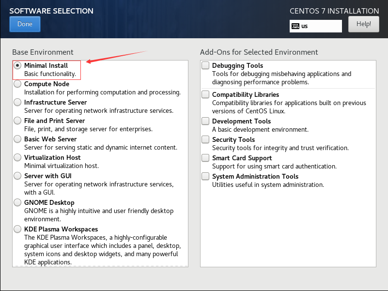

<center><font face="黑体" color="gray" size="5">实现Internet的DNS服务架构</font></center>

<font face="黑体" color="black" size="4">

# 一.准备

## 1.安装最小化系统并进行必要配置

- 安装最小系统


- 配置网络
  - 1.修改centos7,8网卡名为传统网卡名
`sed -i.org '/GRUB_CMDLINE_LINUX/s@"$@ net.ifnames=0 "@' /etc/default/grub`
`grub2-mkconfig -o /etc/grub2.cfg`
`reboot`
  - 2.配置静态网址

    ```py
    vim /etc/sysconfig/network-scripts/ifcfg-eth0
    DEVICE=eth0
    NAME=eth0
    BOOTPROTO=static
    HWADDR=
    IPADDR=192.168.131.
    NETMASK=255.255.255.0
    GATEWAY=192.168.131.2
    ```

  - 3.`reboot`

- 安装必要软件
  - 挂载光盘

  ```py
  mount /dev/sr0 /mnt
  cat > /etc/yum.repo.d/base <<eof
  [base]  
  name=base  
  baseurl=file:///mnt/  
  gpgcheck=0  
  enabled=1
  ```

  - 安装相关软件

  ```py
  yum install httpd|bind vim
  ```

## 2.关闭防火墙

- CentOS6
`chkconfig iptables off`
`service stop iptables`
- CentOS7|8
`systemctl disable firewalld`
`systemctl stop firewalld`

## 3.关闭SElinux

- CentOS6|7|8
`sed -i 's#SELINUX=enforcing#SELINUX=disabled#' /etc/selinux/config &> /dev/null`

## 4.时间同步

### CentOS6作为客户端

- 确认ntpd服务状态和配置文件

```py
rpm -ql ntp
chkconfig ntpd on
service start ntpd
ss -unlp
```

- 编辑/etc/ntpd.conf,注释原来的国外的ntp服务器添加：

```py
server ntp.aliyun.com iburst
server ntp1-7.aliyun.com iburst
```

### CentOS6作为时间同步服务器

- 编辑修改/etc/ntpd.conf

```py
添加:
server 172.20.3.82 iburst
更改:
restrict default nomodify notrap nopeer noquery --> restrict default nomodify
service ntpd start   启动服务
chkconfig ntpd on    开机启动
ss -unl              确认监听udp/123
```

### CentOS7|8作为客户端

- 确认chronyd服务的状态

```py
rpm -ql chrony
yum install chrony
systemctl status chronyd.seervice
systemctl start chronyd.seervice
```

- 编辑/etc/chrony.conf,注释原来的国外的ntp服务器,并添加阿里的公共ntp服务器

```py
添加：
server ntp.aliyun.com iburst
server ntp1.aliyun.com iburst
server ntp2.aliyun.com iburst
server ntp3.aliyun.com iburst
server ntp4.aliyun.com iburst
server ntp5.aliyun.com iburst
server ntp6.aliyun.com iburst
server ntp7.aliyun.com iburst
```

### CentOS7|8作为服务器

- 编辑修改/etc/chronyd.conf

```py
注释server开头的行
添加阿里的公共ntp服务器域名
ntp.aliyun.com iburst

添加本地可连接本机同步的主机
allow 192.168.0.0/16

即使本机时间未和阿里的ntp服务器时间同步，也向本地的其它主机提供时间同步服务
local stratum 10
```

- **此处实验可以使用某台主机同步互联网的时间，其他主机同步该主机时间**

## 5.主机需求及解析区域分配

|主机|地址|
|:---|:---|
DNS客户端|192.168.131.6/24
本地DNS服务器(cache DNS)|192.168.131.8/24
转发目标DNS服务器|192.168.131.18/24
根DNS服务器|192.168.131.28/24
cn域DNS服务器|192.168.131.38/24
suosuoli.cn域主DNS服务器|192.168.131.48/24
suosuoli.cn域从DNS服务器|192.168.131.58/24
www.suosuoli.cn的WEB服务器|192.168.131.68/24

# 二.实现

## 1.实现思路

- 由于该实验涉及到多台DNS服务器的配置，不可随意配置，需要以方便测试和排错为原则来
进行部署实现；此次部署实验大致顺序如下:

```py
1.配置客户端地址并将其DNS服务器指向本地DNS服务器(192.168.131.8)
2.接着配置WEB服务器，并保证客户端可以访问WEB服务器
3.接下来配置suosuoli.cn域的主DNS服务器，并保证客服端通过指定该主服务器能够顺利解析
suosuoli.cn(192.168.131.6:$dig www.suosuoli.cn @192.168.131.48 )
4.接着配置suosuoli.cn域的从DNS服务器，并保证将主DNS服务停止后客服端通过指定该从服
务器能够顺利解析suosuoli.cn(192.168.131.6:$dig www.suosuoli.cn @192.168.131.58 )
5.在主从DNS服务器配置OK后，就可以配置cn域DNS服务器了，配置完成后保证客户端通过指定
从cn域DNS服务器能够解析www.suosuoli.cn(192.168.131.6:$dig www.suosuoli.cn @192.168.131.28 )
6.配置转发目标DNS服务器，同样确保可以通过该转发服务器解析
7.配置本地DNS服务器，此时直接访问www.suosuoli.cn即可(curl www.suosuoli.cn)
```

## 2.实现步骤

### 2.1 客户端网络配置192.168.131.6/24

```py
vim /etc/sysconfig/network-scripts/ifcfg-eth0
NAME=eth0
DEVICE=eth0
BOOTPROTO=static
IPADDR=192.168.131.6
NETMASK=255.255.255.0
DNS1=192.168.8.8
ONBOOT=yes
service network restart | systemctl restart NetworkManager
```

### 2.2 WEB服务器配置192.168.131.68/24

```py
rpm -q httpd || yum install httpd
echo www.magedu.org  > /var/www/html/index.html
service httpd restart | systemctl start httpd
在客户端访问测试
192.168.131.6:$curl 192.168.131.68
```

### 2.3 suosuoli.cn域的主DNS服务器配置192.168.131.48/24

```py
1.安装DNS实现BIND软件
rpm -q bind || yum install bind -y

vim /etc/named.conf
2.注释掉相应配置项,以允许其它主机通过本服务器查询
//  listen-on port 53 { 127.0.0.1; };
//  allow-query     { localhost; };

3.在主配置文件添加选项只允许从服务器进行区域传输
allow-transfer { 192.168.131.58 ; };

3.定义区域数据库类型和文件名
vim /etc/named.rfc1912.zones
zone "suosuoli.cn" {
  type master;
  file "suosuoli.cn.zone";
};

4.定义区域数据库文件suosuoli.cn.zone
vim /var/named/suosuoli.cn.zone
$TTL 1D
@    IN     SOA  master admin.suosuoli.cn. (
                        2019111709   ; serial
                        2D           ; refresh
                        2H           ; retry
                        5D           ; expire
                        2H )         ; minimum
            NS   master
            NS   slave
master      A    192.168.131.48
slave       A    192.168.131.58

5.更改所属组和权限
chgrp named  /var/named/suosuoli.cn.zone
chmod 640    /var/named/suosuoli.cn.zone
service named start | systemctl start named          # 第一次启动服务
rndc reload         # 第一次启动服务后更改配置后使用rndc重新载入配置文件

6.在客户端测试
192.168.131.6:$dig www.suosuoli.cn @192.168.131.48
```

### 2.4 suosuoli.cn域的从DNS服务器配置192.168.131.58/24

```py
1.安装DNS实现BIND软件
rpm -q bind || yum install bind -y
2.vim /etc/named.conf
//  listen-on port 53 { 127.0.0.1; };
//  allow-query     { localhost; };
3.添加配置项，不允许其它主机进行区域传输
allow-transfer { none; };
4.定义区域数据库类型和文件名
vim /etc/named.rfc1912.zones
zone "suosuoli.cn" {
  type slave;
  masters { 192.168.131.48; };
  file "slaves/suosuoli.cn.slave";
};
service named start | systemctl start named
5.检查区域数据库是否生成
ls -l /var/named/slaves/suosuoli.cn.slave

6.在客户端测试(先停止主服务器named)
192.168.131.48:service named stop | systemctl stop named
192.168.131.6:$dig www.suosuoli.cn @192.168.131.58

```

### 2.5 cn域的主DNS服务器配置192.168.131.38/24

```py
yum install bind -y
1.注释两行
//  listen-on port 53 { 127.0.0.1; };
//  allow-query     { localhost; };

2.定义区域数据库类型和文件名
vim /etc/named.rfc1912.zones
zone "cn" {
   type master;
   file "cn.zone";
};

3.编写区域数据库
vim /var/named/org.zone
$TTL 1D
@    IN     SOA  master admin.suosuoli.cn. (
                        2019111709   ; serial
                        2D           ; refresh
                        2H           ; retry
                        5D           ; expire
                        2H )         ; minimum
            NS   master
suosuoli    NS   suousolins1
suosuoli    NS   suousolins2
master      A    192.168.131.38
suousolins1 A 192.168.131.48
suousolins2 A 192.168.131.58

4.权限和所属组配置
chgrp named  /var/named/cn.zone
chmod 640    /var/named/cn.zone

service named start | systemctl start named

5.在客户端测试
192.168.131.6:$dig www.suosuoli.cn @192.168.131.38
```

### 2.6 根域服务器主DNS服务器配置192.168.131.28/24

```py
yum install bind -y
1.注释两行，并直接在主配置文件中定义根域文件名
//  listen-on port 53 { 127.0.0.1; };
//  allow-query     { localhost; };
zone "." IN {
  type master;
  file "root.zone"
};

2.编写区域数据库
vim /var/named/root.zone
@TTL  1D
@    IN     SOA  master admin.suosuoli.cn. (
                        2019111709   ; serial
                        2D           ; refresh
                        2H           ; retry
                        5D           ; expire
                        2H )         ; minimum
        NS    master
cn      NS    cnns
master  A     192.168.131.28
cnns    A     192.168.131.38

3.组和权限设置
chgrp named  /var/named/root.zone
chmod 640    /var/named/root.zone

service named start | systemctl start named

4.在客户端测试
192.168.131.6:$dig www.suosuoli.cn @192.168.131.28
```

### 2.7 转发目标DNS服务器配置192.168.131.18/24

```py
yum install bind -y

1.注释两行
vim /etc/named.conf
// listen-on port 53 { 127.0.0.1; };
// allow-query { localhost; }

2.编写区域数据库文件(在根区域数据库文件的基础上更改)
vim /var/named/named.ca
使用‘;;’两个分号注释掉其它行，添加下面两行
.                       518400    IN        NS        a.root-servers.net.
a.root-servers.net.     3600000   IN        NS        192.168.131.28

service named start | systemctl start named

3.在客户端测试
192.168.131.6:$dig www.suosuoli.cn @192.168.131.18
```

### 2.8 本地DNS服务器配置192.168.131.8/24

```py
yum install bind -y

1.注释两行,并添加转发配置项,接着失能两项DNS安全检查配置项
vim /etc/named.conf
// listen-on port 53 { 127.0.0.1; };
// allow-query { localhost; }
forward only;
forwarders { 192.168.131.18; };

dnssec-enable no;
dnssec-validation no;

service named start | systemctl start named

3.在客户端测试
192.168.131.6:$dig www.suosuoli.cn @192.168.131.8
```

### 2.9 客服端测试

```py
cat /etc/resolv.conf
nameserver 192.168.131.8
dig www.suosuoli.cn
root@localhost ~]# dig www.suosuoli.cn

; <<>> DiG 9.11.4-P2-RedHat-9.11.4-9.P2.el7 <<>> www.suosuoli.cn
;; global options: +cmd
;; Got answer:
;; ->>HEADER<<- opcode: QUERY, status: NOERROR, id: 432453
;; flags: qr rd ra; QUERY: 1, ANSWER: 1, AUTHORITY: 2, ADDITIONAL: 3
;; OPT PSEUDOSECTION:
; EDNS: version: 0, flags:; udp: 4096
;; QUESTION SECTION:
;www.suosuoli.cn.            IN  A
;; ANSWER SECTION:
www.suosuoli.cn.     86181   IN  A   192.168.131.68
;; AUTHORITY SECTION:
suosuoli.cn.     86181   IN  NS  ns2.suosuoli.cn.
suosuoli.cn.     86181   IN  NS  ns1.suosuoli.cn.
;; ADDITIONAL SECTION:
suosuoli.cn.     86181   IN  A  192.168.131.48
suosuoli.cn.     86181   IN  A  192.168.131.58
;; Query time: 1 msec
;; SERVER: 192.168.8.8#53(192.168.8.8)
;; WHEN: Sun Nov 10 10:53:39 CST 2019
;; MSG SIZE  rcvd: 127

curl www.suosuooli.cn
<h1>Welcome!<h1>
```

[关于DNS的介绍](https://computer.howstuffworks.com/dns.htm)

</font>

## 3.Trouble shooting

- 1.解析出错状态分析

```py
SERVFAIL:The nameserver encountered a problem while processing the query. 
  可使用dig +trace排错，可能是网络和防火墙导致 
NXDOMAIN:The queried name does not exist in the zone. 
  可能是CNAME对应的A记录不存在导致 
REFUSED:The nameserver refused the client's DNS request due to policy restrictions. 
  可能是DNS策略导致
```
