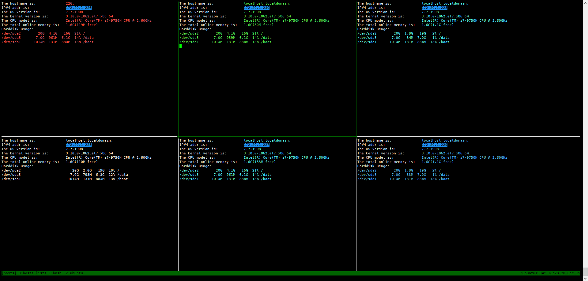
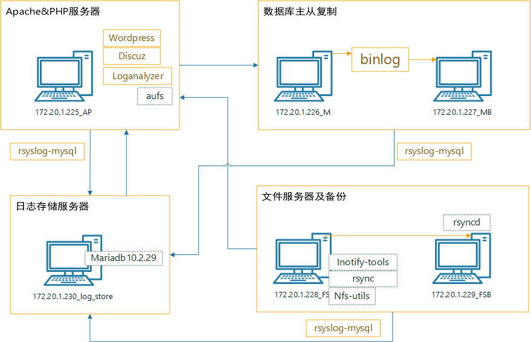

# LAMP 综合实验

## 一.实验目标

实验目标如下：
: 1. 实现 LAMP 架构
: 2. 实现数据库主从复制
: 3. 实现 NFS 服务器存储 wordpress 文件
: 4. 实现备份服务器实时备份 NFS 服务器文件
: 5. 实现日志集中存储
: 6. 实现 loganalyzer 分析展示日志

## 二.实验准备

### 2.1 实验环境

实验环境:
: 虚拟机版本: `VMware Workstation pro 15.0.0`
: Linux 系统版本: `Centos7.7`
: 实验虚拟主机:六台
`172.20.1.225----172.20.1.230`
: 六台主机情况


### 2.2 整体架构



### 2.3 所使用软件包

软件包列表:
: `apr-1.7.0.tar.bz2` --- `172.20.1.225` 编译 httpd 需要的依赖包
: `apr-util-1.6.1.tar.bz2`--- `172.20.1.225` 编译 httpd 需要的依赖包
: `httpd-2.4.41.tar.gz`--- `172.20.1.225` web 服务器安装
: `php-7.3.10.tar.xz`--- `172.20.1.225` web 服务器安装
: `wordpress-5.3-zh_CN.tar.gz`--- `172.20.1.225` web 服务器安装
: `mariadb-10.2.29-linux-systemd-x86_64.tar.gz`--- `172.20.1.[226:227]`
web 服务器的数据存放主机和备份服务器安装
: `inotify-tools`--- `172.20.1.228` nfs 服务器安装，监控共享目录文件
变动，以便通知 rsync 将数据同步到备份服务器
: `rsync` --- `172.20.1.[228:229]` nfs 服务器和备份服务器都要安装
: `nfs-utils`--- `172.20.1.[228,225]` nfs 共享服务器需要安装，其带有
nfs 文件共享服务相关的工具
: `autofs`--- `172.20.1.225` apache 服务器用来自动挂载 nfs 文件系统

### 2.3 思路

- 大致思路是: `配置LAMP --> 完成数据库主从备份 --> 完成nfs共享文件夹挂载到web服务器 --> 完成日志转储到日志存储主机的数据库 --> 测试`

- 需要注意的是，每完成一步需要测试该步是否成功。

- 具体步骤

```ruby
实现LAMP，主从复制
1. 首先在 web 服务器172.20.1.225编译安装httpd和php
2. 配置httpd支持php，并开启opcache等功能
3. 在主数据库主机二进制安装MariaDB，开启二进制日志，创建wordpress的数据库和相应的用户
4. 在主数据库创建一个用于从数据库复制的用户
5. 在从数据库主机二进制安装MariaDB，使用CHANGE MASTER TO指令与主数据库同步
6. 测试数据库同步情况
7. 准备wordpress程序包，解压到web服务器的服务目录，更改web服务器配置并重启
8. 配置wordpress，使其能够连接数据库
9. 测试是否能够正常访问wordpress管理界面

实现nfs服务器的共享文件夹挂载到web服务器的wordpress图片目录下
10. 在nfs服务器安装nfs-utils，创建用于访问共享文件夹的用户和家目录
11. 编辑/etc/exports配置文件，执行exportfs -r将其家目录共享
12. 在web服务器安装nfs-utils，执行`showmount -e nfs服务器ip`查看nfs服务共享的文件夹
13. 在web服务器安装autofs，编辑/etc/auto.master指定自动挂载的方式，并编辑指定的配置文件
来自动挂载nfs共享的文件夹
14. 在nfs服务器和备份服务器安装rsync，在nfs服务器安装inotify-tools
15. 在备份服务器配置/etc/rsyncd.conf 使得rsync以独立服务方式运行，并创建
验证文件(保存的内容为"用户名:密码")
16. 在nfs服务器添加密码文件，同15步中备份服务器验证文件的密码
17. 在nfs服务器编写脚本，将共享文件夹备份到备份服务器

实现日志转存到专门的日志存储服务器，存储于该服务器的数据库中
18. 在日志存储服务器二进制安装MariaDB
19. 在其他主机安装rsyslog-mysql模块，rsyslog用来和mariadb交互的模块
安装rsyslog-mysql模块会自带一个sql语句文件
20. rpm -ql rsyslog-mysql-->复制生成rsyslog要用的表的sql语句到日志存储服务器
21. 应用sql语句生成存储日志的数据库和表，并创建一个用户来给其他主机连接和访问
存储日志的数据库和表
22. 重启相关服务并测试，在其他主机使用logger "logging test message" 测试，
在日志存储服务器查看是否有记录

最终测试
23. 在wordpress上传和下载文件，发布博文，再检查备份数据库的同步情况
nfs共享目录是否更新，日志是否都被存储到日志服务器。
```

## 三.实验步骤

### 3.1 实现 LAMP，数据库主从复制

- 主机`172.20.1.225`安装`httpd`和`php`，均使用编译
  安装，在这里使用事先写好的 ansible 角色安装

- 主机列表

  ```ruby
  root@ubuntu1904:/data/lamp_ansible/roles/httpd_compile#vim /etc/ansible/hosts
  ...# If you have multiple hosts following a pattern you can specify
  # them like this:

  #www[001:006].example.com
  #
  [lamp_lab]
  172.20.1.[225:230]
  [log_slave]
  172.20.1.[225:229]
  ...
  ```

#### 3.1.1 编译安装 httpd

- httpd_compile 角色目录

```ruby
root@ubuntu1904:/data/lamp_ansible/roles/httpd_compile#tree
.
├── default
│   └── main.yml
├── files
│   ├── apr-1.7.0.tar.bz2       # 安装包放ansible主控机
│   ├── apr-util-1.6.1.tar.bz2
│   ├── httpd-2.4.41.tar.gz
│   └── index.html
├── handlers
│   └── main.yml
├── tasks
│   ├── adduser.yml
│   ├── compile.yml
│   ├── config.yml
│   ├── index.yml
│   ├── install_deps.yml
│   ├── install.yml
│   ├── main.yml
│   ├── merge_apr.yml
│   ├── path.yml
│   ├── remove.yml
│   ├── service.yml
│   └── unarchive.yml
├── templates
│   └── httpd.conf.j2
└── vars
    └── main.yml
```

- 各文件代码
  **httpd_compile/tasks/main.yml**

  ```yml
  ---
  - include: adduser.yml
  - include: install_deps.yml

  ## for yum install
  #- include: install.yml

  - include: unarchive.yml
  - include: merge_apr.yml
  - include: compile.yml
  - include: path.yml
  - include: index.yml
  - include: config.yml
  - include: service.yml
  #- include: remove.yml
  ```

  **httpd_compile/tasks/adduser.yml**

  ```yml
  ---
  - name: add apache user
    user: name=apache groups="root,daemon" system=yes shell=/sbin/nologin createhome=no non_unique=no
  ```

  **httpd_compile/tasks/install_deps.yml**

  ```yml
  ---
  # {{ deps }} see ./vars/main.yml
  - name: install some deps and libs
    yum: name={{ deps }}
  ```

  **httpd_compile/tasks/install.yml**

  ```yml
  ---
  - name: install httpd
    yum: name=httpd
  ```

  **httpd_compile/tasks/unarchive.yml**

  ```yml
  ---
  # vars see ./vars/main.yml
  - name: unarchive apr_pkg
    unarchive: src=/data/ansible_exercise/roles/httpd_compile/files/apr-1.7.0.tar.bz2 dest=/data/
  - name: narchive apr_util_pkg
    unarchive: src=/data/ansible_exercise/roles/httpd_compile/files/apr-util-1.6.1.tar.bz2 dest=/data/
  - name: narchive httpd_pkg
    unarchive: src=/data/ansible_exercise/roles/httpd_compile/files/httpd-2.4.41.tar.gz dest=/data/
  ```

  **httpd_compile/tasks/merge_apr.yml**

  ```yml
  ---
  - name: move apr to httpd/srclib/
    shell: mv /data/{{ apr }} /data/{{ httpd }}/srclib/apr
  - name: move apr-util to httpd/srclib/
    shell: mv /data/{{ apr_util }} /data/{{ httpd }}/srclib/apr-util
  ```

  **httpd_compile/tasks/compile.yml**

  ```yml
  ---
  - name: run comfigure script
    shell: chdir=/data/{{ httpd }} ./configure --prefix=/app/httpd24 {{ compile_opt }}
  - name: compile the  httpd
    shell: chdir=/data/{{ httpd }} make -j 6 && make install
    notify: message
  ```

  **httpd_compile/tasks/path.yml**

  ```yml
  ---
  - name: config path variable
    copy: content='PATH=/usr/local/mysql/bin/:/app/httpd24/bin:$PATH' dest=/etc/profile.d/httpd.sh
  ```

  **httpd_compile/tasks/index.yml**

  ```yml
  ---
  - name: index
    copy: src=index.html dest=/data/httpd24/htdocs/
  ```

  **httpd_compile/tasks/config.yml**

  ```yml
  ---
  - name: config
    template: src=httpd.conf.j2 dest=/app/httpd24/conf/httpd.conf backup=yes
    notify: restart
  - name: source path
    shell: . /etc/profile.d/httpd.sh
  ```

  **httpd_compile/tasks/service.yml**

  ```yml
  ---
  - name: start httpd service
    shell: /app/httpd24/bin/apachectl start
  ```

  **httpd_compile/vars/main.yml**

  ```yml
  ---
  apr_pkg: ansible_exercise/roles/httpd_compile/files/apr-1.7.0.tar.bz2
  apr: apr-1.7.0
  apr_util_pkg: ansible_exercise/roles/httpd_compile/files/apr-util-1.6.1.tar.bz2
  apr_util: apr-util-1.6.1
  httpd_pkg: ansible_exercise/roles/httpd_compile/files/httpd-2.4.41.tar.gz
  httpd: httpd-2.4.41
  deps: ["gcc", "pcre-devel", "openssl-devel", "expat-devel"]
  compile_opt: "--enable-so --enable-ssl --enable-cgi --enable-rewrite --with-zlib --with-pcre --enable-modules=most --enable-mpms-shared=all --with-mpm=prefork --with-included-apr"
  ```

  **httpd_compile/files/index.html**

  ```html
  <!DOCTYPE html>
  <head>
    <p1>Hello There!</p1>
  </head>

  <body>
    <a>A test message!!</a>
  </body>
  ```

  **httpd_compile/handlers/main.yml**

  ```yml
  ---
  - name: restart
    shell: /app/httpd24/bin/apachectl stop; /app/httpd24/bin/apachectl start
    #- name: message
    #  shell: echo "Nice everything just fine!!" > /dev/pts/*
    #- name: make
    #  shell: chdir=/data/{{ httpd }} make -j 6 && make install
  ```

  **httpd_compile/templates/httpd.conf.j2**

  ```bash
  root@ubuntu1904:/data/lamp_ansible/roles# cat httpd_compile/templates/httpd.conf.j2  | grep -Ev "*[#]|^$"
  ServerRoot "/app/httpd24"
  Listen 80
  LoadModule mpm_event_module modules/mod_mpm_event.so
  LoadModule authn_file_module modules/mod_authn_file.so
  LoadModule authn_core_module modules/mod_authn_core.so
  LoadModule authz_host_module modules/mod_authz_host.so
  LoadModule authz_groupfile_module modules/mod_authz_groupfile.so
  LoadModule authz_user_module modules/mod_authz_user.so
  LoadModule authz_core_module modules/mod_authz_core.so
  LoadModule access_compat_module modules/mod_access_compat.so
  LoadModule auth_basic_module modules/mod_auth_basic.so
  LoadModule reqtimeout_module modules/mod_reqtimeout.so
  LoadModule filter_module modules/mod_filter.so
  LoadModule mime_module modules/mod_mime.so
  LoadModule log_config_module modules/mod_log_config.so
  LoadModule env_module modules/mod_env.so
  LoadModule headers_module modules/mod_headers.so
  LoadModule setenvif_module modules/mod_setenvif.so
  LoadModule version_module modules/mod_version.so
  LoadModule proxy_module modules/mod_proxy.so
  LoadModule proxy_fcgi_module modules/mod_proxy_fcgi.so
  LoadModule unixd_module modules/mod_unixd.so
  LoadModule status_module modules/mod_status.so
  LoadModule autoindex_module modules/mod_autoindex.so
  <IfModule !mpm_prefork_module>
  	LoadModule cgid_module modules/mod_cgid.so
  </IfModule>
  <IfModule mpm_prefork_module>
  	LoadModule cgi_module modules/mod_cgi.so
  </IfModule>
  LoadModule dir_module modules/mod_dir.so
  LoadModule alias_module modules/mod_alias.so
  <IfModule unixd_module>
  User apache
  Group apache
  </IfModule>
  ServerAdmin stevobs@163.com
  <Directory />
      AllowOverride none
      Require all denied
  </Directory>
  DocumentRoot "/data/httpd24/htdocs"
  <Directory "/data/httpd24/htdocs">
      Options Indexes FollowSymLinks
      AllowOverride all
      Require all granted
  </Directory>
  <IfModule dir_module>
      DirectoryIndex  index.php index.html
  </IfModule>
  <Files ".ht*">
      Require all denied
  </Files>
  ErrorLog "logs/error_log"
  LogLevel warn
  <IfModule log_config_module>
      LogFormat "%h %l %u %t \"%r\" %>s %b \"%{Referer}i\" \"%{User-Agent}i\"" combined
      LogFormat "%h %l %u %t \"%r\" %>s %b" common
      <IfModule logio_module>
        LogFormat "%h %l %u %t \"%r\" %>s %b \"%{Referer}i\" \"%{User-Agent}i\" %I %O" combinedio
      </IfModule>
      CustomLog "logs/access_log" combined
  </IfModule>
  <IfModule alias_module>
      ScriptAlias /cgi-bin/ "/app/httpd24/cgi-bin/"
  </IfModule>
  <IfModule cgid_module>
  </IfModule>
  <Directory "/app/httpd24/cgi-bin">
      AllowOverride None
      Options None
      Require all granted
  </Directory>
  <IfModule headers_module>
      RequestHeader unset Proxy early
  </IfModule>
  <IfModule mime_module>
      TypesConfig conf/mime.types
      AddType application/x-compress .Z
      AddType application/x-gzip .gz .tgz
      AddType application/x-httpd-php .php
      AddType application/x-httpd-php-source .phps
  </IfModule>
  ErrorDocument 500 "The server made a boo boo."
  ErrorDocument 404 /missing.html
  ErrorDocument 404 "/cgi-bin/missing_handler.pl"
  Include conf/extra/httpd-mpm.conf
  <IfModule proxy_html_module>
  Include conf/extra/proxy-html.conf
  </IfModule>
  <IfModule ssl_module>
  SSLRandomSeed startup builtin
  SSLRandomSeed connect builtin
  </IfModule>
  ProxyRequests off
  ProxyPassMatch ^/(.*.php) fcgi://127.0.0.1:9000/data/httpd24/htdocs/$1
  ```

- httpd 角色代码

```ruby
root@ubuntu1904:/data/lamp_ansible#cat role_httpd_compile.yml
---
- hosts: 172.20.1.225
  remote_user: root
  roles:
    - role: httpd_compile
      tags: ["httpd_compile"]
...
```

- 安装

`root@ubuntu1904:/data/lamp_ansible#ansible-playbook role_httpd_compile.yml`

#### 3.1.2 编译安装 php7.4

- php 角色目录

```ruby
root@ubuntu1904:/data/lamp_ansible/roles#tree -f php/
php
├── php/files
│   ├── php/files/Discuz_X3.3_SC_UTF8.zip
│   ├── php/files/loganalyzer-4.1.8.tar.gz
│   ├── php/files/php-7.4.0.tar.xz
│   └── php/files/wordpress-5.3-zh_CN.tar.gz
├── php/handlers
│   └── php/handlers/main.yml
├── php/tasks
│   ├── php/tasks/compile.yml
│   ├── php/tasks/config.yml
│   ├── php/tasks/install_deps.yml
│   ├── php/tasks/main.yml
│   ├── php/tasks/make_sure.yml
│   ├── php/tasks/path.yml
│   ├── php/tasks/unarchive_app.yml
│   └── php/tasks/unarchive.yml
├── php/templates
│   └── php/templates/php.ini.j2
└── php/vars
    └── php/vars/main.yml
```

- 各部分代码

**php/tasks/main.yml**

```yml
---
- include: install_deps.yml
- include: unarchive.yml
- include: compile.yml
- include: path.yml
- include: config.yml
- include: make_sure.yml
```

**php/tasks/install_deps.yml**

```yml
---
- name: install deps and libs
  #yum: name={{ deps74 }}
  yum: name={{ deps73 }}
```

**php/tasks/unarchive.yml**

```yml
---
- name: unarchive php pkg
  #unarchive: src={{ php_pkg74 }} dest=/data/
  unarchive: src={{ php_pkg73 }} dest=/data/
```

**php/tasks/compile.yml**

```yml
---
- name: run configure script ...
  #shell: chdir=/data/{{ php74 }} ./configure {{ compile_opt74 }}
  shell: chdir=/data/{{ php73 }} ./configure {{ compile_opt73 }}
- name: compile php ...
  #shell: chdir=/data/{{ php74 }} make -j 6 && make install
  shell: chdir=/data/{{ php73 }} make -j 6 && make install
```

**php/tasks/unarchive_app.yml**

```yml
---
- name: unarchive wordpress pkg
  unarchive: src={{ wordpress_pkg53 }} dest={{ httpd_htdocs_root }}
- name: change wordpress file folder name
  shell: chdir={{ httpd_htdocs_root }} mv {{ wordpress53 }} wordpress

- name: unzrchive Discuz pkg
  unarchive: src={{ Discuz_pkg34 }} dest={{ httpd_htdocs_root }}
- name: change Discuz file folder name
  shell: chdir= {{ httpd_htdocs_root }} mv {{ Discuz34 }} forum
```

**php/tasks/path.yml**

```yml
---
- name: config path variable
  copy: content='PATH=/app/php74/bin:$PATH' dest=/etc/profile.d/php.sh
- name: source /etc/profile.d/php.sh
  shell: . /etc/profile.d/php.sh
```

**php/tasks/config.yml**

```yml
---
- name: copy php.ini
  #shell: cp /data/{{ php74 }}/php.ini-production /etc/php.ini
  shell: cp /data/{{ php73 }}/php.ini-production /etc/php.ini
- name: copy php-fpm.service
  #shell: cp /data/{{ php74 }}/sapi/fpm/php-fpm.service.in /usr/lib/systemd/system/php-fpm.service
  shell: cp /data/{{ php73 }}/sapi/fpm/php-fpm.service.in /usr/lib/systemd/system/php-fpm.service
- name: copy php-fpm.conf.default
  #shell: chdir=/app/php74/etc cp php-fpm.conf.default php-fpm.conf
  shell: chdir=/app/php73/etc cp php-fpm.conf.default php-fpm.conf
- name: copy www.conf
  shell: chdir=/app/php73/etc/php-fpm.d cp www.conf.default www.conf
```

**php/tasks/make_sure.yml**

```yml
---
- name: make sure php installed
  shell: /app/php73/bin/php --version
```

**php/vars/main.yml**

```yml
---
#
# for php-7.3
deps73: ["gcc", "libxml2-devel", "bzip2-devel", "libmcrypt-devel"]

#
# for php-7.4
deps74:
  [
    "gcc",
    "libxml2-devel",
    "bzip2-devel",
    "libmcrypt-devel",
    "sqlite-devel",
    "oniguruma-devel",
  ]

php_pkg74: php-7.4.0.tar.xz
php_pkg73: php-7.3.10.tar.xz
php74: php-7.4.0
php73: php-7.3.10

#
# for php-7.3
compile_opt73: "--prefix=/app/php73 --enable-mysqlnd --with-mysqli=mysqlnd --with-openssl --with-pdo-mysql=mysqlnd --enable-mbstring --with-freetype-dir --with-jpeg-dir --with-png-dir --with-zlib --with-libxml-dir=/usr --enable-xml --enable-sockets --with-config-file-path=/etc --with-config-file-scan-dir=/etc/php.d --enable-maintainer-zts --disable-fileinfo"

# for php-7.4
compile_opt74: "--prefix=/app/php74 --enable-mysqlnd --with-mysqli=mysqlnd --with-openssl --with-pdo-mysql=mysqlnd --enable-mbstring --with-zlib --enable-xml --enable-sockets --with-config-file-path=/etc --with-config-file-scan-dir=/etc/php.d --enable-maintainer-zts --disable-fileinfo"

# for wordpress-5.3
wordpress_pkg53: wordpress-5.3-zh_CN.tar.gz
wordpress53: wordpress-5.3-zh_CN

# for Discuz3.4
Discuz_pkg34: Discuz_X3.4_SC_UTF8.zip
Discuz34: upload

# for phpMyAdmin-4.9.2
phpmyadmin_pkg49: phpMyAdmin-4.9.2-all-languages.zip
phpmyadmin49: phpMyAdmin-4.9.2-all-languages

# for poweradmin-2.1.7
poweradmin_pkg: poweradmin-2.1.7.tgz
poweradmin: poweradmin-2.1.7

# for loganalyzer-4.1.8
log_analyzer_pkg: loganalyzer-4.1.8.tar.gz
log_analyzer: loganalyzer-4.1.8

# httpd doc root
httpd_www_doc_root: /var/www/html
httpd_default_htdocs_root: /app/httpd24/htdocs
httpd_htdocs_root: /data/httpd24/htdocs
```

- php 角色代码

```yml
root@ubuntu1904:/data/lamp_ansible#cat role_php.yml
---
- hosts: 172.20.1.225
  remote_user: root
  roles:
    - role: php
      tags: php
```

- 安装 php
  `root@ubuntu1904:/data/lamp_ansible#ansible-playbook role_php.yml`

#### 3.1.3 配置 LAMP 并安装 wordpress

1. httpd 配置(172.20.1.225)

```ruby
[root@httpd-php ~]# vim /app/httpd24/conf/httpd.conf
ServerRoot "/app/httpd24"
...
LoadModule proxy_module modules/mod_proxy.so
LoadModule proxy_fcgi_module modules/mod_proxy_fcgi.so
...
<IfModule mime_module>
 ###### manual added ######
    AddType application/x-httpd-php .php
    AddType application/x-httpd-php-source .phps
</IfModule>
...
# User/Group: The name (or #number) of the user/group to run httpd as.
# It is usually good practice to create a dedicated user and group for
# running httpd, as with most system services.
#
User apache
Group apache
DocumentRoot "/data/httpd24/htdocs"
<Directory "/data/httpd24/htdocs">
    Options Indexes FollowSymLinks
    AllowOverride all
    Require all granted
</Directory>
...
<IfModule dir_module>
    DirectoryIndex  index.php index.html
    #DirectoryIndex  index.html index.php
</IfModule>
...
ProxyRequests off
ProxyPassMatch ^/(.*.php) fcgi://127.0.0.1:9000/data/httpd24/htdocs/$1

#### virtual hosts ####
<virtualhost *:80>
servername wordpress.suosuoli.cn
documentroot /data/httpd24/htdocs/wordpress
<directory /data/httpd24/htdocs/wordpress>
require all granted
</directory>
ProxyPassMatch ^/(.*\.php)$ fcgi://127.0.0.1:9000/data/httpd24/htdocs/wordpress/$1
ProxyPassMatch ^/(status|ping)$ fcgi://127.0.0.1:9000/$1
CustomLog "logs/access_wordpress_log" common
</virtualhost>
```

2. php 配置

```ruby
[root@httpd-php ~]# vim /app/php73/etc/php-fpm.d/www.conf
user = apache
group = apache
...
pm.status_path = /status
...
ping.path = /ping
...
ping.response = pong
...
access.log = log/$pool.access.log

[root@httpd-php ~]# vim /etc/php.d/opcache.ini
[opcache]
zend_extension=opcache.so
opcache.enable=1
```

1. 解压`wordpress-5.3-zh_CN.tar.gz`到`/data/httpd24/htdocs/`

### 3.2 实现 NFS 文件共享

### 3.3 实现日志集中存储

### 3.4 Trouble Shooting

## 四.测试

## 五.总结
