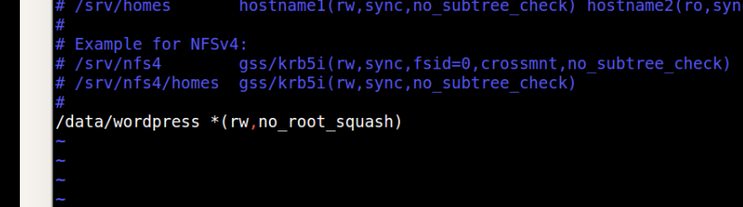

- Nginx+MySQL：172.20.0.105
- Nginx+MySQL：172.20.0.106
  

- 创建数据库，授权

- Nginx 和 PHP 安装
  

默认编译参数即可

新建，修改启动用户

PHP

注意 PHP 的用户 ID 要一样，用于访问 NFS

启动后 php9000port

测试页面

- ipvsadm+keepalived
  

- HAProxy
  

- nfs-server
  
  

- wordpress 配置
  
  随机字符替换
  

- Haproxy 访问 mysql

测试

- wordpress 测试
  
  
- wordpress 直接拷贝到第二 web 主机
  

- nfs
  
  
  
  
  

- Keepalived

- LVS
  lvs-dr.sh --- 在 HAProxy 上执行

  
  

  可以先指向 web 服务器测试一下是否通
  
