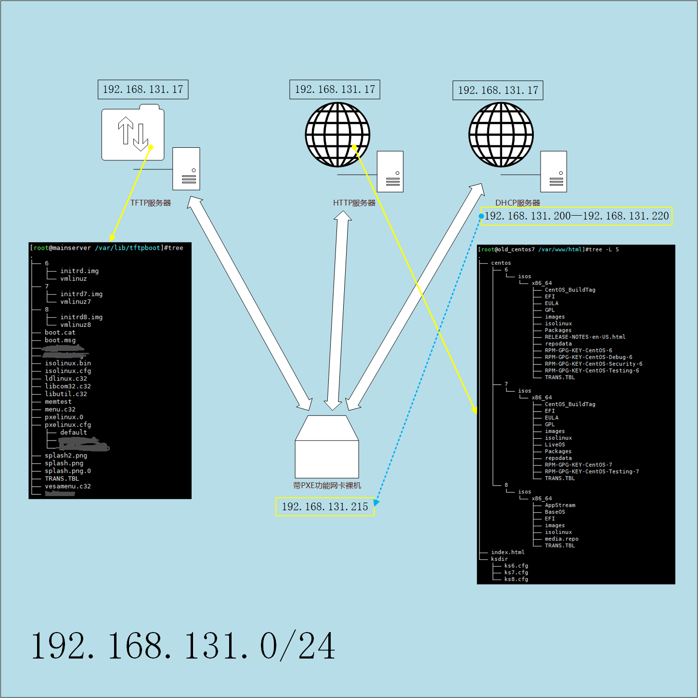
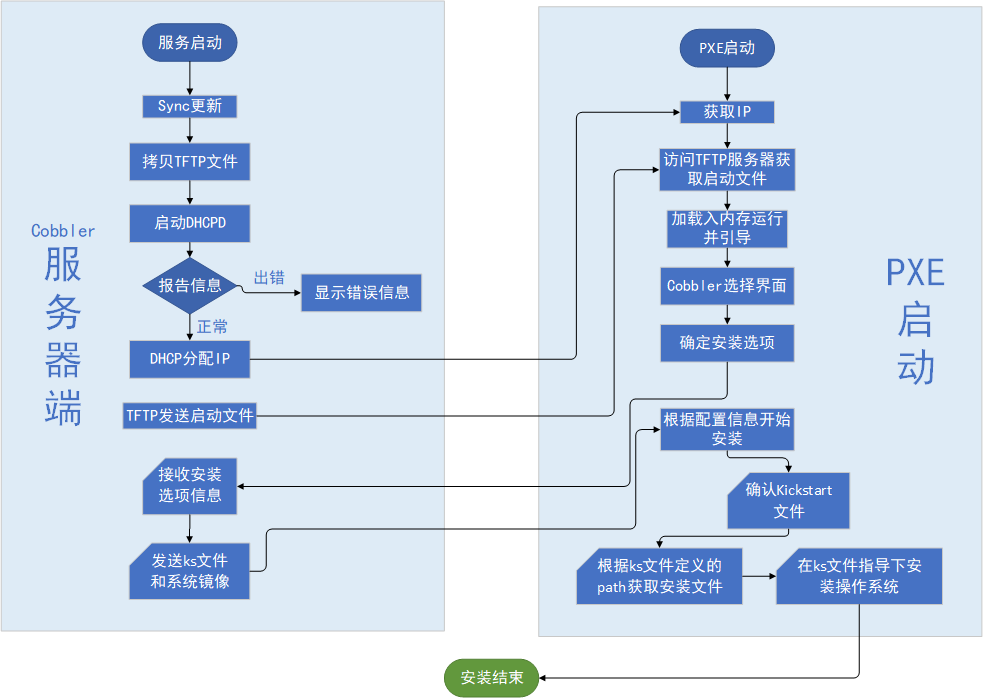
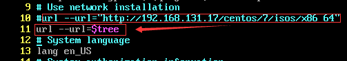
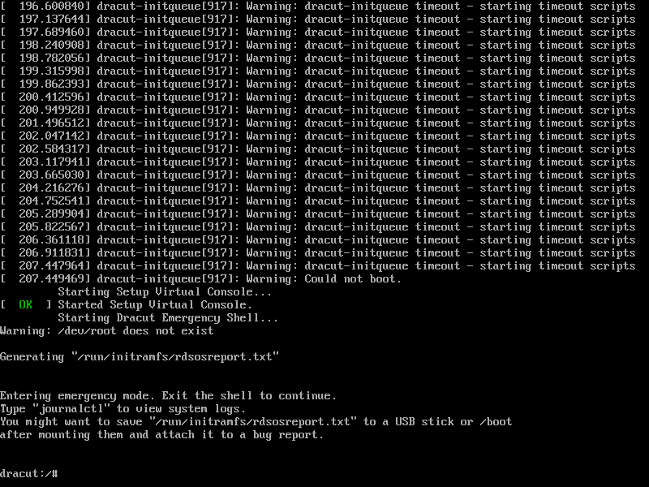
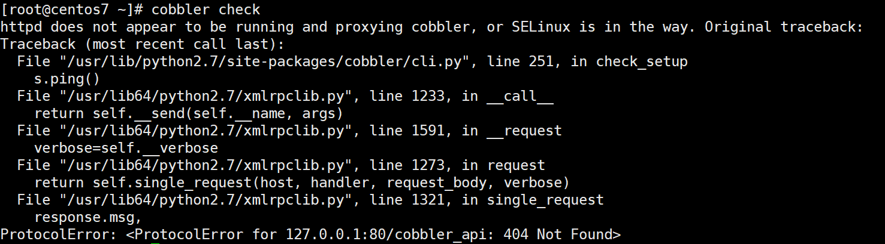

<center><font face="黑体" color="grey" size="6">运维自动化与Cobbler服务部署</font></center>

<font face="黑体" color="grey" size="3">

# 一.Cobbler简介

## 1.1.简介

- Cobbler是一款Linux生态的自动化运维工具，基于Python2开发，用于自动化批量部署安装操作系
统；其提供基于CLI的管理方式和WEB配置界面，其中WEB配置界面是基于Python2和Django框架开
发。另外，cobbler还提供了API，方便二次开发。当然，Cobbler属于C/S模型(客户端/服务器模型)

- Cobbler主要用于快速网络安装linux操作系统，支持众多的Linux发行版如：Red Hat、
Fedora、CentOS、Debian、Ubuntu和SuSE等。

- 在cobbler之前，微软曾开发过另一项类似的基于C/S工作模式的技术PXE(Prebot eXecute 
Environment，预启动执行环境)，其支持通过网络启动操作系统，亦可以让需要安装系统的带支持
PEX技术网卡的裸机通过网络从http服务器下载映像来安装，在启动过程中，客户端需要从dhcp服务器
得到IP地址、掩码、网关以及相关的配置文件路径，再用TFTP（trivial file transfer 
protocol）协议从服务器下载一个引导启动的软件包(类似linux光盘的isolinux文件夹下的文件)并加载
到本机内存中执行，经过启动软件包中配置文件指定的ks应答文件指明服务器中的操作系统位置，进而
找到安装源，并在ks文件的指导下完成操作系统的安装。

- Cobbler实质是PXE的二次封装，将多种安装参数封装到一起，并提供统一的管理方法。

## 1.2.Cobbler的下属服务

- 使用Cobbler安装系统需要一台专门提供各种服务的服务器，提供的服务包括(HTTP/FTP/NFS,
TFTP,DHCP),也可以将这几个服务分别部署到不同服务器。事实上在实际应用中，总是将不同的服务分别
部署到专门的服务器。

- Cobbler是在HTTP、TFTP、DHCP等各种服务的基础上进行相关操作的，实际安装的大体过程类似于基
于PXE的网络安装:客户端(裸机)开机使用网卡引导启动，其请求DHCP分配一个地址后从TFTP服务器获取
启动文件,加载到客户端本地内存中运行，并显示出可安装的系统列表；在人为的选定安装的操作系统类
型后,客服端会到HTTP服务器下载相应的系统安装文件并执行自动安装。

- PXE网络安装示意


## 1.3.工作流程

- Cobbler大致工作流程如下


# 二.Cobbler安装

## 2.1.安装epel源

- Cobbler来源于epel源，在安装cobbler之前需要配置epel源，或者直接使用命令安装epel源：
`[root@mainserver ~]#wget -O /etc/yum.repos.d/ http://mirrors.aliyun.com/repo/epel-7.repo`

## 2.2.安装Cobbler及其相关的服务和组件

- Cobbler下属的服务包括HTTPD,TFTP,DHCP等，如果有web界面要求，还需要安装相关的组件

`[root@mainserver ~]#yum install -y httpd dhcp tftp-server cobbler cobbler-web pykickstart xinetd`

```py
httpd:配合cobbler-web使得cobbler可以通过web网页界面进行配置管理
tftp-server.x86_64 : The server for the Trivial File Transfer Protocol (TFTP)
cobbler-web.noarch : Web interface for Cobbler
pykickstart.noarch : 基于python的管理kickstart文件的库
xinetd.x86_64 : A secure replacement for inetd
```

# 三.Cobbler配置

## 3.1.Cobbler配置文件及各目录情况

- 配置文件

```py
/etc/cobbler/settings : cobbler 主配置文件 
/etc/cobbler/iso/: iso模板配置文件
/etc/cobbler/pxe: pxe模板文件
/etc/cobbler/power: 电源配置文件 
/etc/cobbler/user.conf: web服务授权配置文件 
/etc/cobbler/users.digest: web访问的用户名密码配置文件 
/etc/cobbler/dhcp.template : dhcp服务器的的配置模板
/etc/cobbler/dnsmasq.template : dns服务器的配置模板
/etc/cobbler/tftpd.template : tftp服务的配置模板
/etc/cobbler/modules.conf : cobbler模块的配置文件
```

- 数据目录

```py
/var/lib/cobbler/config/: 用于存放distros，system，profiles 等信息的配置文件
/var/lib/cobbler/triggers/: 用于存放用户定义的cobbler命令
/var/lib/cobbler/kickstarts/: 默认存放kickstart文件
/var/lib/cobbler/loaders/: 存放各种引导程序
```

- 镜像目录

```py
/var/www/cobbler/ks_mirror/: 导入的发行版系统的所有数据
/var/www/cobbler/images/ : 导入发行版kernel和initrd镜像用于远程网络启动
/var/www/cobbler/repo_mirror/: yum 仓库存储目录
```

- 日志目录

```py
/var/log/cobbler/installing: 客户端安装日志 
/var/log/cobbler/cobbler.log : cobbler日志
```

## 3.2.配置及启动cobblerd服务

- 当httpd，tftp及dhcp服务都正常运行后，就可以启动cobblerd服务进行相关的配置了。
- 启动cobblerd
`systemctl start cobbler`
- 检测cobbler的运行环境,并根据提示逐步配置cobbler
`cobbler check`

```py
1.更改/etc/xinetd.d/tftp配置文件
vim /etc/xinetd.d/tftp
disable  =  yes  -->  disable  =  no
systemctl restart xinetd
2.联网下载boot引导程序文件
cobbler get-loaders
3.没有网络情况下拷贝启动文件到TFTP服务文件夹
cp -a /usr/share/syslinux/{pxelinux.0,menu.c32}  /var/lib/tftpboot
4.更改/etc/cobbler/settings配置文件的server项为提供cobblerd服务的主机地址,也就是本机地址
sed -nri 's#server:172.0.0.1#server:192.168.31.17#' /etc/cobbler/settings
更改后的整行内容:server:192.168.131.17
5.更改/etc/cobbler/settings配置文件的next_server项，指明tftp服务器地址，使得客户端能够找
到TFTP服务器
sed -i 's/next_server: 127.0.0.1/next_server: 192.168.56.11/' /etc/cobbler/settings
更改后的整行内容:next_server:192.168.131.17
6.配置相应的选项来使用cobbler管理dhcp服务和tftp服务
manage_dhcp：1
manage_tftpd：1
7.pxe_just_once选项，该选项置1表示在pxe安装块结束时在cobbler系统中做相应的记录，这样会避免如果客户机的BIOS选项中PXE启动处于第一位导致的循环重启；如果第一个启动硬件不是PXE启动那就置0。
pxe_just_once：1  
```

- 配置完成后重启
`systemctl restart cobblerd`

# 四.Cobbler使用

## 4.1用法

- '<>'中的是必须跟的选项，后面'[]'中的是可选项

```py
[root@old_centos7 ~]#cobbler
usage
=====
cobbler <distro|profile|system|repo|image|mgmtclass|package|file> ...
        [add|edit|copy|getks*|list|remove|rename|report] [options|--help]

cobbler <aclsetup|buildiso|import|list|replicate|report|reposync|sync|validateks|version|signature|get-loaders|hardlink> [options|--help]
```

- 可以使用下面的方式得到使用帮助
`[root@old_centos7 ~]cobbler`
`[root@old_centos7 ~]cobbler --help`

```py
[root@old_centos7 ~]#cobbler distro --help
usage
=====
cobbler distro add
cobbler distro copy
cobbler distro edit
cobbler distro find
cobbler distro list
cobbler distro remove
cobbler distro rename
cobbler distro report
[root@old_centos7 ~]#cobbler distro add --help
Usage: cobbler [options]

Options:
  -h, --help            show this help message and exit
  --name=NAME           Name (Ex: Fedora-11-i386)
  --ctime=CTIME
  --mtime=MTIME
  --uid=UID       Owners (Owners list for authz_ownership (space delimited))
......
```

- 例如
`cobbler distro list` 列出当前导入的linux发行版条目
`cobbler distro report` 报告当前所有的linux发行版详细信息
`cobbler profile --name=centos7 --distro=centos7-x86_64 --kickstart=/var/lib/cobbler/kickstarts/ks7.cfg` 将linux发行版系统镜像与其对应的ks文件建立关联

## 4.2配置linux发行版和关联相应的ks文件

### 4.2.1拷贝事先准备好的ks文件

`[root@old_centos7 ~]#cp /var/www/html/ksdir/ks{6,7,8}.ks /var/lib/cobbler/kickstarts`

### 4.2.2将linux发行版导入到cobbler在httpd服务的文件夹下

- cobbler在httpd的服务文件夹位于`/var/www/cobbler/ks_mirror`
`cobbler import --name=centos6 --path=/var/www/html/centos/6/isos/x86_64/ --arch=x86_64`
`cobbler import --name=centos7 --path=/var/www/html/centos/7/isos/x86_64/ --arch=x86_64`
`cobbler import --name=centos8 --path=/var/www/html/centos/8/isos/x86_64/ --arch=x86_64`

### 4.2.3 导入后重启并同步

`systemctl restart cobblerd`
`cobbler sync`

```py
[root@old_centos7 /var/www/cobbler/ks_mirror]#ls
centos6-x86_64  centos-7.5-x86_64  centos7-x86_64  centos8-x86_64  config
# centos-7.5-x86_64 为cobbler默认创建的，里面无镜像
[root@old_centos7 /var/www/cobbler/ks_mirror]#ls -lh centos-7.5-x86_64/
total 0
[root@old_centos7 /var/www/cobbler/ks_mirror]#ls -lh centos6-x86_64/
total 276K
-r--r--r-- 1 root root   14 Jun 29  2018 CentOS_BuildTag
dr-xr-xr-x 3 root root   35 Jun 29  2018 EFI
-r--r--r-- 1 root root  212 Nov 27  2013 EULA
-r--r--r-- 1 root root  18K Nov 27  2013 GPL
dr-xr-xr-x 3 root root   95 Jun 29  2018 images
dr-xr-xr-x 2 root root  198 Jun 29  2018 isolinux
dr-xr-xr-x 2 root root 176K Jun 29  2018 Packages
-r--r--r-- 1 root root 1.4K Jun 29  2018 RELEASE-NOTES-en-US.html
dr-xr-xr-x 2 root root 4.0K Jun 29  2018 repodata
-r--r--r-- 1 root root 1.7K Nov 27  2013 RPM-GPG-KEY-CentOS-6
-r--r--r-- 1 root root 1.7K Nov 27  2013 RPM-GPG-KEY-CentOS-Debug-6
-r--r--r-- 1 root root 1.7K Nov 27  2013 RPM-GPG-KEY-CentOS-Security-6
-r--r--r-- 1 root root 1.7K Nov 27  2013 RPM-GPG-KEY-CentOS-Testing-6
-r--r--r-- 1 root root 3.4K Jun 29  2018 TRANS.TBL
```

### 4.2.4 将linux发行版系统镜像与其对应的ks文件建立关联

`cobbler profile --name=centos6 --distro=centos6-x86_64 --kickstart=/var/lib/cobbler/kickstarts/ks6.cfg` 
`cobbler profile --name=centos7 --distro=centos7-x86_64 --kickstart=/var/lib/cobbler/kickstarts/ks7.cfg` 
`cobbler profile --name=centos8 --distro=centos8-x86_64 --kickstart=/var/lib/cobbler/kickstarts/ks8.cfg` 

- 注意，在导入distro时，cobbler会自动生成distro条目，这些并未和ks文件关联，可以使用
`cobbler profile remove --name=PROFILE_NAME`删除后，再关联ks文件。

### 4.2.5 建立关联后重启并同步

`systemctl restart cobblerd`
`cobbler sync`

### 4.2.6 查看详细信息

`cobbler report`

```py
[root@old_centos7 ~]#cobbler report
distros:
==========
Name                           : centos7-x86_64
Architecture                   : x86_64
TFTP Boot Files                : {}
Breed                          : redhat
Comment                        : 
Fetchable Files                : {}
Initrd                         : /var/www/cobbler/ks_mirror/centos7-x86_64/images/pxeboot/initrd.img
Kernel                         : /var/www/cobbler/ks_mirror/centos7-x86_64/images/pxeboot/vmlinuz
Kernel Options                 : {}
Kernel Options (Post Install)  : {}
Kickstart Metadata             : {'tree': 'http://@@http_server@@/cblr/links/centos7-x86_64'}
Management Classes             : []
OS Version                     : rhel7
Owners                         : ['admin']
Red Hat Management Key         : <<inherit>>
Red Hat Management Server      : <<inherit>>
Template Files                 : {}

Name                           : centos8-x86_64
Architecture                   : x86_64
TFTP Boot Files                : {}
Breed                          : redhat
Comment                        : 
Fetchable Files                : {}
Initrd                         : /var/www/cobbler/ks_mirror/centos8-x86_64/images/pxeboot/initrd.img
Kernel                         : /var/www/cobbler/ks_mirror/centos8-x86_64/images/pxeboot/vmlinuz
Kernel Options                 : {}
Kernel Options (Post Install)  : {}
Kickstart Metadata             : {'tree': 'http://@@http_server@@/cblr/links/centos8-x86_64'}
Management Classes             : []
OS Version                     : rhel8
Owners                         : ['admin']
Red Hat Management Key         : <<inherit>>
Red Hat Management Server      : <<inherit>>
Template Files                 : {}

Name                           : centos6-x86_64
Architecture                   : x86_64
TFTP Boot Files                : {}
Breed                          : redhat
Comment                        : 
Fetchable Files                : {}
Initrd                         : /var/www/cobbler/ks_mirror/centos6-x86_64/images/pxeboot/initrd.img
Kernel                         : /var/www/cobbler/ks_mirror/centos6-x86_64/images/pxeboot/vmlinuz
Kernel Options                 : {}
Kernel Options (Post Install)  : {}
Kickstart Metadata             : {'tree': 'http://@@http_server@@/cblr/links/centos6-x86_64'}
Management Classes             : []
OS Version                     : rhel6
Owners                         : ['admin']
Red Hat Management Key         : <<inherit>>
Red Hat Management Server      : <<inherit>>
Template Files                 : {}


profiles:
Owners                         : ['admin']
Parent Profile                 : 
Internal proxy                 : 
Red Hat Management Key         : <<inherit>>
Red Hat Management Server      : <<inherit>>
Repos                          : []
Server Override                : <<inherit>>
Template Files                 : {}
Virt Auto Boot                 : 1
Virt Bridge                    : xenbr0
Virt CPUs                      : 1
Virt Disk Driver Type          : raw
Virt File Size(GB)             : 5
Virt Path                      : 
Virt RAM (MB)                  : 512
Virt Type                      : xenpv

Name                           : Install_centos6
TFTP Boot Files                : {}
Comment                        : 
DHCP Tag                       : default
Distribution                   : centos6-x86_64
Enable gPXE?                   : 0
Enable PXE Menu?               : 1
Fetchable Files                : {}
Kernel Options                 : {}
Kernel Options (Post Install)  : {}
Kickstart                      : /var/lib/cobbler/kickstarts/ks6.cfg
Kickstart Metadata             : {}
Management Classes             : []
Management Parameters          : <<inherit>>
Name Servers                   : []
Name Servers Search Path       : []
Owners                         : ['admin']
Parent Profile                 : 
Internal proxy                 : 
Red Hat Management Key         : <<inherit>>
Red Hat Management Server      : <<inherit>>
Repos                          : []
Server Override                : <<inherit>>
Template Files                 : {}
Virt Auto Boot                 : 1
Virt Bridge                    : xenbr0
Virt CPUs                      : 1
Virt Disk Driver Type          : raw
Virt File Size(GB)             : 5
Virt Path                      : 
Virt RAM (MB)                  : 512
Virt Type                      : xenpv


systems:
==========

repos:
==========

images:
==========

mgmtclasses:
==========

packages:
==========

files:
==========
```

- 上面信息中有一行如下：
`Kickstart Metadata             : {'tree': 'http://@@http_server@@/cblr/links/centos8-x86_64'}`
- 该行的定义在文件[root@old_centos7 ~]#vim /var/www/cobbler/ks_mirror/config/
centos8-x86_64.repo中,是cobbler自己定义安装源路径的特有语法规定的，因此可以在ks文件中指定安装
源时直接指定为$tree变量。(url --url=$tree)

```py
[root@old_centos7 ~]#vim /var/www/cobbler/ks_mirror/config/centos8-x86_64.repo
[core-0]
name=core-0
baseurl=http://@@http_server@@/cobbler/ks_mirror/centos8-x86_64/AppStream
enabled=1
gpgcheck=0
priority=$yum_distro_priority
```

# 五.测试安装

## 5.1 新建一台虚拟机

- 设置其网络类型为NAT并桥接到和服务器相同的VMnet8,安装centos6时配置内存1G以上，安装centos7和
centos8时配置内存大于1.6G

## 5.2 使用PXE网络引导启动

## 5.3 选择相应版本安装

# 六.优化

## 6.1 菜单优化

- 修改/etc/cobbler/pxe/pxedefault.template模板文件，重启同步

```py
[root@old_centos7 ~]#vim /etc/cobbler/pxe/pxedefault.template
DEFAULT menu
PROMPT 0
MENU TITLE Welcome! | suosuoli.cn      # 自定义项
TIMEOUT 200 
TOTALTIMEOUT 6000
ONTIMEOUT $pxe_timeout_profile

LABEL local
        MENU LABEL (local installation) # 自定义项1
        MENU DEFAULT
        LOCALBOOT -1

$pxe_menu_items

MENU end
[root@old_centos7 ~]#systemctl restart cobblerd
[root@old_centos7 ~]#cobbler sync
```

- 重启同步后cobbler更新文件/var/lib/tftpboot/pxelinux.cfg/default

```py
[root@old_centos7 ~]#vim /var/lib/tftpboot/pxelinux.cfg/default
DEFAULT menu
PROMPT 0
MENU TITLE Welcome! | suosuoli.cn
TIMEOUT 200 
TOTALTIMEOUT 6000
ONTIMEOUT local

LABEL local
        MENU LABEL (local installation)
        MENU DEFAULT
        LOCALBOOT -1
LABEL Install_centos6
        kernel /images/centos6-x86_64/vmlinuz
        MENU LABEL Install_centos6
        append initrd=/images/centos6-x86_64/initrd.img ksdevice=bootif lang=  kssendmac text  ks=http://192.168.131.17/cblr/svc/op/ks/profile/Install_centos6
        ipappend 2

LABEL Install_centos7
        kernel /images/centos7-x86_64/vmlinuz
        MENU LABEL Install_centos7
        append initrd=/images/centos7-x86_64/initrd.img ksdevice=bootif lang=  kssendmac text  ks=http://192.168.131.17/cblr/svc/op/ks/profile/Install_centos7
        ipappend 2

LABEL Install_centos8
        kernel /images/centos8-x86_64/vmlinuz
        MENU LABEL Install_centos8
        append initrd=/images/centos8-x86_64/initrd.img ksdevice=bootif lang=  kssendmac text  ks=http://192.168.131.17/cblr/svc/op/ks/profile/Install_centos8
        ipappend 2


MENU end 
```

## 6.2 使用httpd服务和cobbler-web基于web界面来管理配置cobbler

### 6.2.1 安装cobbler-web

`yum install cobbler-web`

### 6.2.2 重启http服务

`systemctl restart httpd`

### 6.2.3 访问web界面

`https://cobblerserver/cobbler_web`

# 七.Trouble Shooting

- 遇到下面这种情况？

  - 这种情况是ks文件中的安装源路径出错,改为如下：
centos6:`url --url=http://httpserver/ksdir/ks.cfg`或者`url --url=$tree`
centos7:`url --url=http://httpserver/ksdir/ks.cfg`或者`url --url=$tree`
centos8:`url --url=http://httpserver/ksdir/ks.cfg`或者`url --url=$tree`

- 遇到下面这种情况？

  - 这种情况是因为在安装配置cobbler时httpd服务一直在运行中，没有正确的为cobbler提供服务，
因此重启httpd服务就ok了`systemctl restart httpd`

- 遇到下面这种情况？

- httpd服务运行中安装cobbler-web包后无法访问https://cobblerserver/cobbler-web管理界面？

  - 重启httpd服务：`systemctl restart httpd`

- cobbler-web界面的默认账号

```py
login:cobbler
passwd:cobbler
```

- cobbler访问图示


默认账户密码都是:cobbler


 

## :arrow_left:exit
