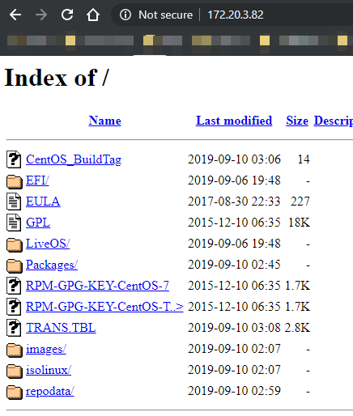

Linux39期第一次阶段考试
一. 解答题( 每题 5分)
1. 请简述一下 Unix 和 Linux 的关系和区别，并说出几个你熟悉的类 Unix 操作系统。

答：Linux起源于Unix，Linux继承了大部分Unix的特点,早起Unix为免费的自由软件，后来收费；
常见的类Unix操作系统有：Solaris、GNU/Linux、伯克利大学的FreeBSD、OpenBSD、用于教学
目的的Minix、QNX等。

2. 在 vmware workstation 中有几种网络模型，他们各自的特点是什么？

答：Vmware Workstation中有三类网络模型：

```bash
1.桥接模型：使用桥接模型时可以通过虚拟机访问互联网，也可以通过互联网访问该虚拟机。
2.NAT模型:使用NAT模型时可以使用虚拟机访问外部互联网，但是无法通过互联网访问该虚拟机。
3.仅主机模型:仅主机模式相当于在物理主机内部使用网桥将各虚拟机连接，各个虚拟机之间可以
通讯，虚拟机和物理主机可以通讯，但是无法与外部互联网进行通讯。
```

3. 为什么说 TCP 协议比 UDP 协议通讯更可靠，并简述 TCP 三次握手和四次挥手的网络连接和断开过程。

答：TCP提供一种面向连接的、可靠的字节服务。两个使用TCP的应用（通常是一个客户和一个服务器）在彼此交换数
据之前必须先建立一个TCP连接。而UDP是一个简单的面向数据报的传输层协议,其只负责尽最大努力送达数据包，并不
需要建立可靠的连接。

- 三次握手：
  - （1）第一次握手：Client将TCP数据包首部标志位SYN置1，随机产生一个序列值seq=x，并将该数据包发送给Server，此时client进入SYN_SENT状态，等待server确认。
  - （2）第二次握手：Server收到数据包后由标志位SYN=1知道Client请求建立连接，Server将标志位SYN和ACK都
置为1，ack=J+1，随机产生一个值seq=K，并将该数据包发送给Client以确认连接请求，Server进入SYN_RCVD状
态。
  - （3）第三次握手：Client收到确认后，检查ack是否为J+1，ACK是否为1，如果正确则将标志位ACK置为1，
ack=K+1，并将该数据包发送给Server，Server检查ack是否为K+1，ACK是否为1，如果正确则连接建立成功，
Client和Server进入ESTABLISHED状态，完成三次握手，随后Client与Server之间可以开始传输数据了。

- 四次挥手：
  - （1）第一次挥手：Client发送一个FIN，用来关闭Client到Server的数据传送，Client进入FIN_WAIT_1状态。
  - （2）第二次挥手：Server收到FIN后，发送一个ACK给Client，确认序号为收到序号+1（与SYN相同，一个FIN占
用一个序号），Server进入CLOSE_WAIT状态。
  - （3）第三次挥手：Server发送一个FIN，用来关闭Server到Client的数据传送，Server进入LAST_ACK状态。
  - （4）第四次挥手：Client收到FIN后，Client进入TIME_WAIT状态，接着发送一个ACK给Server，确认序号为收
到序号+1，Server进入CLOSED状态，完成四次挥手。

4. 请简述将一块 500G 新硬盘插入服务器, 并配置挂载到 /data/log/ 的过程。
答：过程：
```bash
1.识别硬盘
    for i in /sys/class/scsi_host/host*/scan; do echo "- - -" > $i ; done
    [root@centos7 ~]#lsblk
    NAME      MAJ:MIN RM  SIZE RO TYPE MOUNTPOINT
    ...
    sdd         8:48   0  500G  0 disk
    ...
2.分区
    echo -e "n\np\n\n\n+200G\nt\n\n8e\nw\n" |fdisk /dev/sdd1
3.通知内核同步分区
    centos5/7:partprobe
    centos6: partx -a  /dev/sdd1
4.创建文件系统
    mkfs.ext4 /dev/sdd1
5.挂载
    mkdir -p /data/log
    mount /dev/sdd1 /dada/log
```

5. 请分别写出在 CentOS7.6 和 Ubunut1804.3 系统上配置 eth0 网卡的过程，地址为172.20.200.200，配置完
成后可以正常访问百度网站：curl www.baidu.com
答：配置过程如下：

- 配置Centos7

```bash
ifconfig eth0 up
ficonfig eth0 0
ifconfig eth0 172.20.200.200/24
或者:
vim /etc/sysconfig/network-scripts/ifcfg-eth0
    DEVICE=eth0
    HWADDR=0:02:4A:A6:80:46
    IPADDR=172.20.200.200
    NETMASK=255.255.255.0
    GATEWAY=172.20.200.1  
    ONBOOT=yes
    Type=Ethernet
vim /etc/resolv.conf
    search magedu.steve
    nameserver 223.5.5.5
    nameserver 114.114.114.114
```

- 配置Ubuntu1804.3

```bash
vim /etc/netplan/01-netcfg.yaml
network:
    version: 2
    renderer: networkd
    ethernets:
        eth0:
            addresses:
				- 172.20.200.200/24
            gateway4:172.20.200.1
            nameservers:
                search: [mydomain, otherdomain]
                addresses: [144.144.144.144, 8.8.8.8, 202.96.199.133]
```

6. 请写出在 CentOS7.6 操作系统上创建系统用户 apache 的命令，要求其用户 id 和组 id 为 799
答：
`useradd -r -u 799 -g 799 apache`

7. 使用 crontab 实现每周一凌晨 5点 检测一下 /data 路径下是否存在 modify time 为上周或者以前的文件，若有则将其删除。
答：

```bash
vim /data/scripts/rm_oldfiles.sh
...
find /data -type f -mtime +7 -exec {} \;
...
chmod u+x /data/scripts/rm_oldfiles.sh
crontab -e
0 5 * * 1 /data/scripts/rm_oldfiles.sh
```

8. 统计 CentOS7.6 系统下登录失败次数最多的用户名称和对应次数。
答：

```bash
lastb | sed '$d' |sed '$d' | tr -s " " |cut -d" "  -f1 |sort| uniq -c |head -1
```

9. 请简述一下硬链接和软连接的区别和各自的特点
答：
```bash
符号链接(symbolic link)
    1、一个符号链接指向另一个文件的路径
    2、一个符号链接的内容是它引用文件的名称,大小是该文件名的长度
    3、可以对目录进行创建软连接
    4、跨分区
    5、其大小为指向的路径字符串的长度
    6、创建或者删除时不增加或减少目标文件inode的引用计数
硬链接
    1、创建硬链接增加额外的一条记录项来引用文件
    2、其引用同一文件系统上同一个物理文件
    3、每个目录引用相同的inode号
    4、创建时链接数递增
    5、删除文件时递减某文件的链接数;当某文件链接数为零时，该文件被删除,其内容还存在磁盘，相应的数据块被
    标记为空闲，下次有文件写入时自动覆盖。
    6、不能跨越驱动器或分区创建硬链接
```

10. 请简述一下 IP 地址分类和各自的私网或特殊地址范围
答：具体的网络数、所容纳的主机数及私网地址等如下：

```bash
1.A类地址：
  0000 0000 - 0111 1111: 1-127 
  网络数：126, 127 
  每个网络中的主机数：2^24-2 
  默认子网掩码：255.0.0.0 
  私网地址：10.0.0.0 
2.B类地址：
  1000 0000 - 1011 1111：128-191 
  网络数：2^14
  每个网络中的主机数：2^16-2 
  默认子网掩码：255.255.0.0 
  私网地址：172.16.0.0-172.31.0.0 
3.C类地址：
  1100 0000 - 1101 1111: 192-223 
  网络数：2^21 
  每个网络中的主机数：2^8-2 
  默认子网掩码：255.255.255.0 
  私网地址：192.168.0.0-192.168.255.0 
4.D类地址：
  D类地址为组播地址
  1110 0000 - 1110 1111: 224-239 
5.特殊地址
0.0.0.0 
	0.0.0.0不是一个真正意义上的IP地址。它表示所有不清楚的主机和目的网络 
255.255.255.255 
	限制广播地址。对本机来说，这个地址指本网段内(同一广播域)的所有主机 
127.0.0.1～127.255.255.254 
	本机回环地址，主要用于测试。在传输介质上永远不应该出现目的地址为“127.0.0.1”的数据包 
224.0.0.0到239.255.255.255 
	组播地址，224.0.0.1特指所有主机，224.0.0.2特指所有路由器。224.0.0.5指OSPF路由器，地址多用于
    一些特定的程序以及多媒体程序 
169.254.x.x 
	例如：如果Windows主机使用了DHCP自动分配IP地址，而又无法从DHCP服务器获取地 址，系统会为主机分配
    这样的地址
```

11. 请使用文本处理命令打印出 /etc/init.d/functions 的所有函数名称
答：

```bash
sed -nr 's#(.*\(\)).*#\1#p' /etc/init.d/functions
```

12. 请分别简述几种常见的 raid 模式，并简述一下他们各自的特点
答：

```bash
RAID0:
    1.使用条带卷(strip)的方式存储数据在各磁盘中
    2.读、写性能提升
    3.可用空间：空间利用率100%
    4.没有冗余，无容错能力
    5.最少需要2块磁盘(2,3,...,n,...)
RAID1:
    1.使用镜像卷(mirror)的方式存储数据在各磁盘中
    2.读性能提升、写性能略有下降
    3.可用空间：空间利用率1/2N(N=1,2,3...)
    4.有冗余，有容错能力
    5.最少需要2块磁盘(2,4,...,2n,...)
RAID4:
    在RAID1的基础上增加一个校验盘;其它数据盘的异或运算值存于该校验盘
RAID5:
    在RAID4的基础上将校验值均匀分布存于各数据盘的某些位置
    1.读、写性能提升
    2.可用空间：空间利用率(N-1)/N(N=3,4,5...)
    3.有冗余，有容错能力,允许最多一块磁盘损坏
    4.最少需要3块磁盘(3,4,...,n,...)
RAID6:
    在RAID5的基础上新增一块校验盘，将校验值均匀分布存于各数据盘的某些位置
    1.读、写性能提升
    2.可用空间：空间利用率(N-2)/N(N=4,5,6...)
    3.有冗余，有容错能力,允许最多两块磁盘损坏
    4.最少需要4块磁盘(4,5,...,n,...)
RAID10:
    1.读、写性能提升 
    2.可用空间：空间利用率50%
    3.有容错能力：每组镜像最多只能坏一块 
    4.最少磁盘数：4 (4,5,6....)
RAID01:
    多块磁盘先实现RAID0,再组合成RAID1
RAID50:
    多块磁盘先实现RAID5,再组合成RAID0
```

13. 请写出在 CentOS7.6 系统中配置阿里云的 yum base 源和在 Ubuntu1804.3 中配置阿里云的 apt 源
答：

- Centos7.6

```bash
vim /etc/yum.repo.d/aliyun_repo
[ALIYUN]
name=aliyun_repo
baseurl=https://mirrors.aliyun.com/centos/7/os/x86_64/
gpgcheck=1
gpgkey=https://mirrors.aliyun.com/centos/7/os/x86_64/RPM-GPG-KEY-CentOS-7
enabled=1
...
yum clean all
yum repolist
```

- Ubuntu1804.3

```bash
sudo cp /etc/apt/sourcrs.list /etc/apt/sourcrs.list.bak
sudo vim /etc/apt/sourcrs.list
...
deb http://mirrors.aliyun.com/ubuntu/ bionic main restricted universe multiverse
deb-src http://mirrors.aliyun.com/ubuntu/ bionic main restricted universe multiverse
deb http://mirrors.aliyun.com/ubuntu/ bionic-security main restricted universe multiverse
deb-src http://mirrors.aliyun.com/ubuntu/ bionic-security main restricted universe multiverse
deb http://mirrors.aliyun.com/ubuntu/ bionic-updates main restricted universe multiverse
deb-src http://mirrors.aliyun.com/ubuntu/ bionic-updates main restricted universe multiverse
deb http://mirrors.aliyun.com/ubuntu/ bionic-proposed main restricted universe multiverse
deb-src http://mirrors.aliyun.com/ubuntu/ bionic-proposed main restricted universe multiverse
deb http://mirrors.aliyun.com/ubuntu/ bionic-backports main restricted universe multiverse
deb-src http://mirrors.aliyun.com/ubuntu/ bionic-backports main restricted universe multiverse
...
sudo apt-get update
```

14. 在 CentOS7.6 系统中如何查询出 dir 命令是哪个软件包提供的
答：

```
rpm -qf `which dir`
```

二. 扩展题（每题15分）

1. 编写一个 shell 脚本，该脚本可以实现在 CenOS7.6 系统上快速部署一个基于 http 的 yum 私有仓库源，该源
的软件包由对应的系统光盘 dvd1 提供。
答：

```bash
#!/bin/bash
#
#*******************************************************************************
#Author:            steveli
#QQ:                1049103823
#Data:              2019-11-02
#FileName:          httpd_yum.sh
#URL:               https://blog.csdn.net/YouOops
#Description:       httpd_yum.sh
#Copyright (C):     2019 All rights reserved
#*******************************************************************************
#Fontcolor#red(31):green(32):yellow(33):blue(34):purple(35):cyan(36):white(37)
#Backcolor#red(41):green(42):yellow(43):blue(44):purple(45):cyan(46):white(47)             
#*******************************************************************************
#
clear
. /etc/init.d/functions

if [[ ! -e /var/log/httpd ]]; then
mkdir -p /var/log/httpd
fi
if [[ ! -e $HOME/httpd ]]; then
mkdir $HOME/httpd
fi

WORKSPACE="$HOME/httpd"
LOG_FILE="/var/log/httpd"
PREFIX="/app/httpd"
SYSCONFDIR="/etc/httpd"
VERSION=`cat /etc/redhat-release | sed -nr 's/.*([0-9]+)\.[0-9]+\..*/\1/p'`
IP=`ifconfig |sed -nr 's@[^0-9]+([0-9.]+).*@\1@p' |sed -nr '/\b(([1-9]?[0-9]|1[0-9]{2}|2[0-4][0-9]|25[0-5])\.){3}([1-9]?[0-9]|1[0-9]{2}|2[0-4][0-9]|25[0-5])\b/p' |sed '1!d'`
sed -ir 's#SELINUX=enforcing#SELINUX=disabled#' /etc/sysconfig/selinux
    HTTPD_DIR="httpd-2.4.25"
    HTTPD_SRC="httpd-2.4.25.tar.bz2"
    SYSCONFDIR="/etc/httpd/conf"
    cd $WORKSPACE    ##:eg:/root/httpd2
    ## Install develipment tools httpd needed
    echo -e "Trying to install some dev packages..."
	spinner &
    for PKG in gcc make apr-devel apr-util-devel pcre-devel openssl-devel redhat-rpm-config; do
	if ! rpm -qi $PKG &> /dev/null; then
	    yum clean all &> /dev/null
	    yum repolist &> /dev/null
	    yum install $PKG -y

            echo -e "Package $PKG now installed."	
	else
            echo -e "Package $PKG have installed."	
        fi
    done
    # yum install gcc make apr-devel apr-util-devel pcre-devel openssl-devel &> $LOG_FILE/dev.log
    # echo -e "Development tools installed.`success`"
	if [[ $? -eq 0 ]];then
		kill "$!" > /dev/null 2>&1 # kill the spinner
		echo -e "`success`"
	fi
    ## Get source from suosuoli.cn
    echo -e "Getting $HTTPD_SRC from suosuoli.cn ..."
	spinner &
    wget http://suosuoli.cn/suo/sources/$HTTPD_SRC &> $LOG_FILE/wget.log
	if [[ $? -eq 0 ]];then
		kill "$!" > /dev/null 2>&1 # kill the spinner
		echo -e "`success`"
	fi
    tar -xf $HTTPD_SRC &> $LOG_FILE/tar.log 
    cd $WORKSPACE/$HTTPD_DIR   ##:eg:/root/httpd2/httpd-2.4.25
    ## Configuration&&compile&&install 
		echo -e "Runing cofigure script..."
		spinner &
    ./configure --prefix=$PREFIX --sysconfdir=$SYSCONFDIR --enable-ssl &> $LOG_FILE/configure.log
		if [[ $? -eq 0 ]];then
			kill "$!" > /dev/null 2>&1  # kill the spinner
			echo -e "`success`"
		fi
    if [[ $? -eq 0 ]]; then
        	echo -e "Compiling..."
		spinner &
        make -j 2 &> $LOG_FILE/make.log
		if [[ $? -eq 0 ]];then
			kill "$!" > /dev/null 2>&1 # kill the spinner
			echo -e "`success`"
		fi
    fi
    echo -e "Installing..."
        spinner &
    make install &> $LOG_FILE/make_install.log
	if [[ $? -eq 0 ]];then
		kill "$!" >  /dev/null 2>&1 # kill the spinner
		echo -e "`success`"
	fi
    [[ "$?" -eq 0 ]] &&  \
    echo -e "$HTTPD_DIR successfully installed.`success`\n"
    ## Configure PATH variable
    echo "PATH=$PREFIX/bin:$PATH" > /etc/profile.d/httpd.sh
    . /etc/profile.d/httpd.sh
    [[ $? -eq 0 ]] && echo -e "PATH variable configured.`success`"
    ## Configure user&&group for apache
    if ! id apache &> /dev/null; then
	useradd -r -s /sbin/nologin apache
    fi
    #sed -nri 's#^User daemon#User apache#' $SYSCONFDIR/httpd.conf
    #sed -nri 's#^Group daemon#Group apache#' $SYSCONFDIR/httpd.conf
    [[ $? -eq 0 ]] && echo -e "user&&group configured.`success`"
    ## Check if httpd2 can run properly.
    systemctl disable --now firewalld.service &> /dev/null 
    apachectl start  &> /dev/null && echo "Trying to start httpd2..." 2> $LOG_FILE/err0.log
    [[ $? -eq 0 ]] && echo -e "httpd2 is running ... `success`"
    ## Verify if httpd can host the web properly.
    if rpm -qi curl &> /dev/null; then
        if curl www.baidu.com &> /dev/null; then
            curl http://$IP &> /dev/null
            if [[ $? -eq 0 ]]; then
		echo -e "Congratulatons,visit your web at \e[1;32mhttp://$IP!\e[0m`success`"
	    else 
		echo -e "Oh,no.something wrong to visit your website.`failure` \nCheck the log at:$LOG_FILE/install.log!" 2>> $LOG_FILE/err0.log
	    fi
        fi
    else
    yum install curl
    [[ $? -eq 0 ]] && curl http://$IP &> /dev/null
	if [[ $? -eq 0 ]];then 
	     echo -e "Congratulatons,visit your web at \e[1;32mhttp://$IP!\e[0m`success`" 
	else
	     echo -e "Oh,no.something wrong to visit your website. \nCheck the log at:$LOG_FILE/install.log!" 2>> $LOG_FILE/err0.log
	fi
    fi
    ## Genenrate log file
    cat "$LOG_FILE/dev.log" "$LOG_FILE/wget.log" "$LOG_FILE/configure.log" "$LOG_FILE/make.log" "$LOG_FILE/make_install.log" "$LOG_FILE/err0.log" > $LOG_FILE/install.log
    [[ $? -eq 0 ]] && echo -e "Check the brief log at $LOG_FILE/install.log!`success`"
    ## modify httpd.conf
    if [[ -s "$SYSCONFDIR/httpd.conf" ]];then
    	sed -nri -e 's/^User.*/User apache/' -e 's/^Group.*/Group apache/' $SYSCONFDIR/httpd.conf
    	[[ $? -eq 0 ]] && echo "$SYSCONFDIR/httpd.conf modified. `success`"
    else
	echo -e "$SYSCONFDIR/httpd.conf is zero length.Wrong!!`failure`"
    fi
    # Generate yum repo configuration
cat > /etc/yum.repo.d/httpd_yum.repo <<EOF
[HTTPD_YUM]
name=httpd_yum
baseurl=http://172.20.3.82/
gpgcheck=1
gpgkey=http://172.20.3.82/RPM-GPG-KEY-CentOS-7
enabled=1
EOF
# Disable default page.
sed -nri 's/(^[^#].*).*/#\1/p' /etc/httpd/conf.d/welcome.conf
# mount cdrom to the host dir.
mount /dev/sr0 /app/httpd/www/html
yum clean all
yum repolist
```

效果:


2. 编写一个 shell 脚本，实现猜数字游戏:
数字答案为 1 到 100 的随机数，执行脚本后等待用户输入数字，若猜中则结束游戏，未猜中则返回答案和所输入数
字的大小关系，最多可以猜5次，5次均未猜中则结束游戏
答：

```bash
#!/bin/bash
#
#*******************************************************************************
#Author:            steveli
#QQ:                1049103823
#Data:              2019-11-02
#FileName:          guess_num_game.sh
#URL:               https://blog.csdn.net/YouOops
#Description:       guess_num_game.sh
#Copyright (C):     2019 All rights reserved
#*******************************************************************************
#Fontcolor#red(31):green(32):yellow(33):blue(34):purple(35):cyan(36):white(37)
#Backcolor#red(41):green(42):yellow(43):blue(44):purple(45):cyan(46):white(47)
#*******************************************************************************
#
. /etc/init.d/functions
# success
# passed
# wrning
# failure

#COLOR_GREEN="\e[1;32m"
#COLOR_END="\e[0m"
SEED=$[$RANDOM%100+1]

COUNT=0
while :; do
read -p "Please input a num(1-100): "  N
if [[ $COUNT -eq 5 ]]; then
    echo "You've input 5 times, Exiting...`failure`"                                       
    exit
else
    if [[ $N =~ ^[0-9]+$ ]]; then    
       if [[ $N -gt $SEED ]]; then
            echo "Too big." 
        elif [[ $N -lt $SEED ]]; then
            echo "Too small."
        elif [[ $N -eq $SEED ]]; then
            echo "Nice.`success`"
            exit
        fi  
        let COUNT++
    fi  
fi
done
```