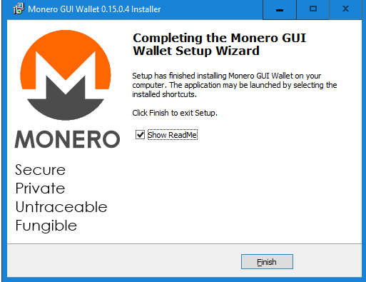
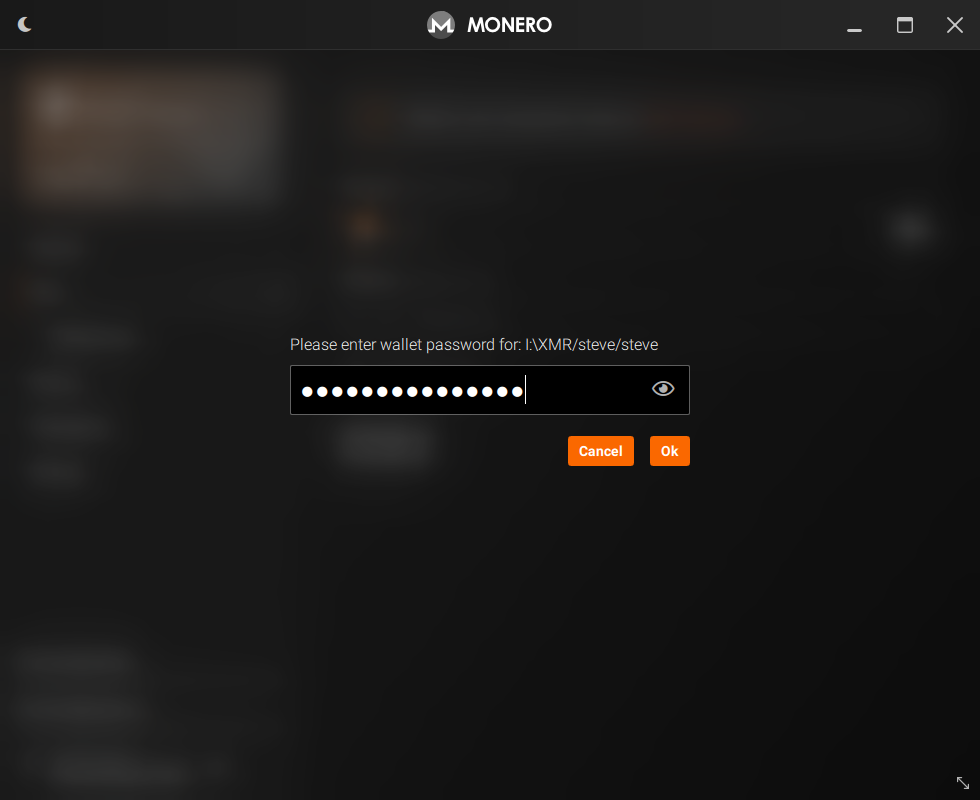
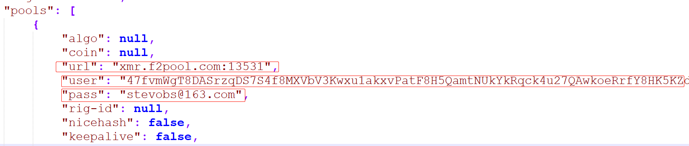
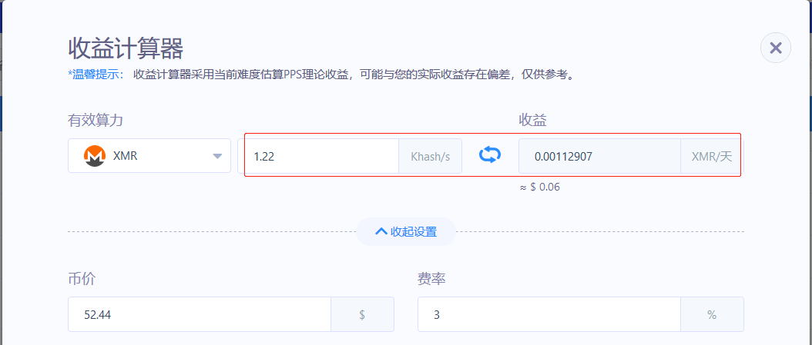

# 第一题答案:
```bash
[root@lab-server2 ~]# cat access.log 
2019/03/12 21:23:25 [info] client: 118.124.94.110 server: www.minerbabe.com, request: "GET /keys/ssh/pb?device_id=4e8227b63&need_update=0 HTTP/1.1", host: "www.minerbabe.com" 
2019/03/12 21:23:25 [error] client: 118.124.94.110 server: www.minerbabe.com, request: "GET /keys/ssh/pb?device_id=4e8227b63&need_update=0 HTTP/1.1", host: "www.minerbabe.com" 
2019/03/12 21:23:25 [error] client: 118.124.94.110 server: www.minerbabe.com, request: "GET /keys/ssh/pb?device_id=4e8227b63&need_update=0 HTTP/1.1", host: "www.minerbabe.com" 
2019/03/12 21:23:25 [info] client: 118.124.94.110 server: www.minerbabe.com, request: "GET /keys/ssh/pb?device_id=4e8227b63&need_update=0 HTTP/1.1", host: "www.minerbabe.com" 
2019/03/12 21:23:25 [error] client: 118.124.94.110 server: www.minerbabe.com, request: "GET /keys/ssh/pb?device_id=4e8227b63&need_update=0 HTTP/1.1", host: "www.minerbabe.com" 
2019/03/12 21:23:25 [error] client: 118.124.94.173 server: www.minerbabe.com, request: "GET /keys/ssh/pb?device_id=2d20b53c5&need_update=0 HTTP/1.1", host: "www.minerbabe.com" 
2019/03/12 21:23:25 [error] client: 118.124.94.173 server: www.minerbabe.com, request: "GET /keys/ssh/pb?device_id=2d20b53c5&need_update=0 HTTP/1.1", host: "www.minerbabe.com" 
2019/03/12 21:23:25 [error] client: 118.124.94.27 server: www.minerbabe.com, request: "GET /keys/ssh/pb?device_id=fa7c727f0&need_update=0 HTTP/1.1", host: "www.minerbabe.com" 
2019/03/12 21:23:25 [error] client: 118.124.94.75 server: www.minerbabe.com, request: "GET /keys/ssh/pb?device_id=e7c5fbd34&need_update=0 HTTP/1.1", host: "www.minerbabe.com" 
2019/03/12 21:23:25 [info] client: 118.124.94.29 server: www.minerbabe.com, request: "GET /keys/ssh/pb?device_id=d4b3050af&need_update=0 HTTP/1.1", host: "www.minerbabe.com" 
```

```bash
[root@lab-server2 ~]# echo " IP                 error_cnt" ; awk '/error/{ip[$5]++}END{for(i in ip){printf("%s %6s\n",i ,ip[i])}}' access.log | sort -k2 -nr 
IP                  error_cnt
118.124.94.110      3
118.124.94.173      2
118.124.94.75       1
118.124.94.27       1
```

# 第二题答案:

脚本思路：
1. 批量分发秘钥到各主机
2. 使用ssh连到远程主机取到磁盘占用最高者
3. 取到的值与阈值90%比较，大于90%则记录该主机和对应的占用数值
4. 将统计日志存放到本机

脚本
```bash
[root@lab-server2 ~]# cat mass_check_disk.sh 
#!/bin/bash
#
# script to get a list of hosts' disk usage.
#

PASS="stevenux"
IP_LIST="
192.168.100.150
192.168.100.152
192.168.100.40
"

if [ ! -e /root/.ssh/id_rsa ]; then
  ssh-keygen -P "" -f "/root/.ssh/id_rsa" 2> /dev/null
fi
rpm -q sshpass &> /dev/null || yum -y install sshpass

if [ -f /opt/disk_full_host.log ]; then
  cp /opt/disk_full_host.{log,bak-`date +%F-%T`}
  rm -f /opt/disk_full_host.log
fi

for host in ${IP_LIST}; do 
    sshpass -p ${PASS} ssh-copy-id ${host} -o StrictHostKeyChecking=no
    if [ $? -eq 0 ]; then
        echo "copy pubkey to ${host} done."
    else
        echo "copy pubkey to ${host} failed."
    fi
done


for host in ${IP_LIST}; do 
    NUM=`ssh root@${host} "df -h|awk -F '[ %]+'  '/\/$/{print $5}'" | awk '{print $5}' |cut -d% -f1`
    if [ $NUM -gt 5 ];then
      echo "Host:${host}  Disk usage:${NUM}" >> /opt/disk_full_host.log
    fi
done
```

运行结果：

```bash
[root@lab-server2 ~]# cat /opt/disk_full_host.log 
Host:192.168.100.150  Disk usage:15
Host:192.168.100.152  Disk usage:17
Host:192.168.100.40  Disk usage:11
```

说明：为了看见效果，此处将阈值调为5%，三台主机的最大磁盘占用分别为15%、%17和%11
如果每台主机的密码不一样，可以将密码和ip使用某种格式保存在存文本中，使用循环读取
密码和ip进行秘钥分发和管理。

# 第三题答案:

## 1. XMR币情况介绍

| 信息       | 说明                              |
| :--------- | :-------------------------------- |
| 英文名     | Monero或者XMR                     |
| 中文名     | 门罗币                            |
| 区块时间   | 1 Minute                          |
| 总发行量   | 1500 0000                         |
| 币发行时间 | 2014-04-18                        |
| 官网       | getmonero.org                     |
| 项目地址   | https://github.com/monero-project |

## 2. 总结

门罗币/XMR是一种数字货币，XMR 是暗网市场的主流支付货币之一，其基于CryptoNote协议，可以有效对抗使用
专用集成电路开发的矿机的算力垄断，并且相对于其它的币种其对使用CPU挖矿较友好。另外，其和比特币以及其
他数字货币的区别是在于其保密性。在XMR币的发行体系中，所有的交易都做了加密处理，任何人无法查到其他人
的交易记录以及账户余额，不像比特币或者以太坊那样是的公开透明，保护了账户拥有者的信息安全。所以，门
罗币被黑客和暗网交易所青睐。同时，门罗币的挖矿算法和比特币等也不同，它使用CryptoNight算法。这个算
法是AES密集型算法，很耗内存，这显著降低了GPU对CPU的优势。所以，用CPU挖矿比GPU挖矿效率还高，这样普
通的PC机也可以进行挖矿了。

**XMR强调隐私技术**：没有任何办法可以公开查看门罗的链上交易信息。替代方案是, 用户可以公开自己的
查看密钥（view key）给特定人关联有限的交易信息。披露的交易范围和信息，用户可以自由界定。

首先门罗使用一次性地址把全部地址隐藏起来，用户接收加密货币的地址相当于一个一次性的保险柜，只有使用
者可以打开，没有人知道这些保险柜归属于谁，有多少被谁掌握，里面有没有可用的门罗币。

同样，门罗币通过隐藏资金来源来隐藏发出人。环形签名在区块链中隐藏了真正的发送方。此外，由于这些输出
未与特定地址相关联，因此观察者无法分辨这些输出与哪个地址相关联。另一面，节点看到交易是从可用的资金
来源发送的，而资金去向却无从考证。隐身地址和环签名一起工作从而有效地隐藏交易信息。

最后，门罗币通过环型机密交易（RingCT）隐藏交易金额。RingCT是基于比特币的机密交易。尽管该技术仅能隐
藏交易金额，而不是全部交易明细。幸运的是，门罗币的另外两个功能可以帮助掩藏接受者和发送者。

**XMR具有公平的工作量证明挖掘算法**：XMR可在CPU和GPU上进行挖掘。它具有自适应的块大小，以适应交易量
中的大峰值，而不会不必要地增长或陷入任意约束中（没有扩容问题，译者注）。门罗币（Monero）支持全节点
修剪功能，可以将旧事务减少到其大小的五分之二（全节点未经裁剪70G）。门罗币的隐私，安全性和扩展性一直
在提高。

门罗币使用场景：暗网交易、日常消费（目前很少），电竞虚拟产品等。

## 3. 注册和使用Wallets

账户信息


下载Windows版的GUI installer
下载速度很慢，可以使用`Internet Download Manager`通过火狐浏览器下载：


安装Monero GUI：




引导界面：


这里我选简单模式，没下载区块到本地：


关于简单模式介绍：


创建一个新wallet:


填写信息：


设置一个Wallet密码：


概览：


提供密码进入wallet：


此时还未启动挖矿程序：


下载挖矿程序：
[下载xmrig-v5.10.0release](https://github.com/xmrig/xmrig/releases)
启动参数修改：


显示挖矿进程连接成功：


4. 使用结论
- 挖币需要用到的几个参数：
1、交易账号
2、钱包地址
3、Payment ID
4、Worker ID
5、邮箱地址
1和2必须，后面的可以不使用。

- 使用Linux来挖矿时可以拉取官方代码，使用cmake编译
- 挖矿参数使用json文件保存，修改该json就可以定义挖矿细节

### 矿池比较

- 哈鱼矿池

2018年新成立的公司，致力于推广区块链的使用。


- 鱼池
综合性矿池，支持众多的币种，教程全面，性能发挥占比高。


矿池比较也可以参考：http://moneropools.com/


### 挖矿收益

查看地址：https://www.f2pool.com/xmr/47fvmWgT8DASrzqDS7S4f8MXVbV3Kwxu1akxvPatF8H5QamtNUkYkRqck4u27QAwkoeRrfY8HK5KZdkd1EocJH4iNsXXTDL


### 挖矿收益计算

此处使用本机的I7 9750H CPU 进行挖矿，未启用N卡，可以从OPENCL和CUDA核心处的`disable`值看出:


算力大概在：1512.8H/s - 1848.8 H/s 之间，本机还运行有虚拟机和其他任务，会出现波动。



