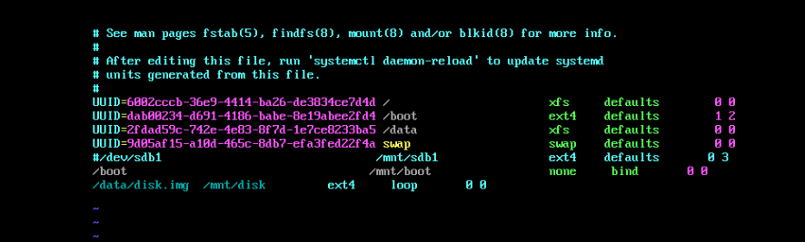
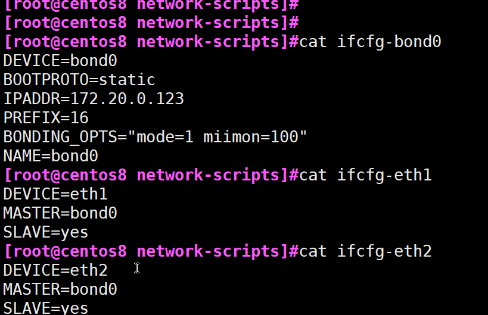
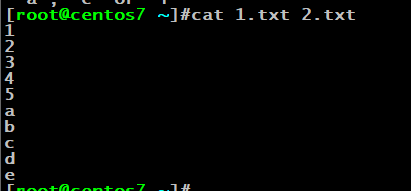

```py
匹配0-999：\<[1-9]?[0-9]{,2}\> 

常用正则:
qq            egrep "[0-9]{5,11}"
id            egrep "(1[1-5]|2[123]|3[1-7]|4(6|[1-4])|5[0-4]|6[1-5]|71|81)[0-9]{4}(19[0-9]{2}|20[0-1][0-9])(0[1-9]|1[0-2])(0[1-9]|[1-2][0-9]|3[01])(([0-9]){4}|[0-9]{3}X)"
mail          egrep "\<([[:alnum:]]|[[:print:]]){,64}@[^-]([[:alnum:]]|[[:print:]]){,254}[^-$]\.[[:alnum:]]{2,}"
someone：grep -E -o "\b[A-Za-z0-9._%+-]+@[A-Za-z0-9.-]+\.[A-Za-z]{2,6}\b" file.txt


mailcode   	  egrep "^(0[1234567]|1[012356]|2[01234567]|3[0123456]|4[01234567]|5[1234567]|6[1234567]|7[012345]|8[013456])[0-9]{4}$"


获取本机ip地址：
ifconfig | grep -Eo '\<(([1-9]?[0-9]|1[0-9]{2}|2[0-4][0-9]|25[0-5])\.){3}([1-9]?[0-9]|1[0-9]{2}|2[0-4][0-9]|25[0-5])\>'

ifconfig ens33 |sed -n -r '/\b(([1-9]?[0-9]|1[0-9]{2}|2[0-4][0-9]|25[0-5])\.){3}([1-9]?[0-9]|1[0-9]{2}|2[0-4][0-9]|25[0-5])\b/p' | sed -r 's/inet[[:space:]]+//' |sed -r 's/[[:space:]]+n.*//' | grep -o '[0-9].*'

ifconfig ens33 |sed -n -r '/\b(([1-9]?[0-9]|1[0-9]{2}|2[0-4][0-9]|25[0-5])\.){3}([1-9]?[0-9]|1[0-9]{2}|2[0-4][0-9]|25[0-5])\b/p' | sed -r 's/[[:space:]]+inet[[:space:]]+//' | cut -d" " -f1

ifconfig ens33 |sed -n -e '2s/^.*i.* //p' -e '2s/ .*$//p'

通用版本：ifconfig |sed -nr 's@[^0-9]+([0-9.]+).*@\1@p' |sed -n -r '/\b(([1-9]?[0-9]|1[0-9]{2}|2[0-4][0-9]|25[0-5])\.){3}([1-9]?[0-9]|1[0-9]{2}|2[0-4][0-9]|25[0-5])\b/p' | sed  '1!d'

ifconfig | sed -rn '2s@[^0-9]+([.0-9]{7,15})(.*)@\1@p'


统计访问nginx的ip排名前十：
法一：cat /home/wwwlogs/access.log |grep -Eo "\<(([1-9]?[0-9]|1[0-9]{2}|2[0-4][0-9]|25[0-5])\.){3}([1-9]?[0-9]|1[0-9]{2}|2[0-4][0-9]|25[0-5])\>"|sort |uniq -c|sort -nr | head -n10
法二：cut -d" " -f1 /home/wwwlogs/access.log | sort | uniq -c | sort -nr | head -n10


自定义命令行提示符：
PS1=\[\e[37;40m\][\[\e[32;40m\]\u\[\e[37;40m\]@\h \[\e[36;40m\]\w\[\e[0m\]]\$

判断系统版本：
[[ `cat /etc/redhat-release | grep -Eo '[0-9]+\.[0-9]+(\.[0-9]{4})+' | cut -d. -f1` =~ 7 ]]  
[[ `cat /etc/redhat-release | grep -Eo '[0-9]+\.[0-9]+(\.[0-9]{4})+' | cut -d. -f1` ==  7 ]] && echo centos7 || echo not centos7

ping某ip是通：
[[ "$1" =~ \<(([1-9]?[0-9]|1[0-9]{2}|2[0-4][0-9]|25[0-5])\.){3}([1-9]?[0-9]|1[0-9]{2}|2[0-4][0-9]|25[0-5])\> ]] && ping -c1 -w2 $1 &> /dev/null && echo ip available || echo not reachable


使用find查找文件时用户需要对目录有读和执行权限
 
取出文件基名和文件名：
文件夹 ：  echo "/etc/rc.d/init.d" |sed -r 's@(.*/)([^/]+)/?@\1@'  
文件基名： echo "/etc/rc.d/init.d" |sed -r 's@(.*/)([^/]+)/?@\2@'  


克隆分区表
dd if=/dev/sdb of=/dev/sdc bs=1 count=66 skip=446 seek=446 

scandisk
echo '- - -' > /sys/class/scsi_host/host2/scan

交换两个数：
a=10;b=20;a=$[a^b];b=$[a^b];a=$[a^b];echo $a $b

```


###############################修改centos7,8网卡名为传统网卡名
sed -i.org '/GRUB_CMDLINE_LINUX/s@"$@ net.ifnames=0 "@' /etc/default/grub
grub2-mkconfig -o /etc/grub2.cfg

################################得到系统主版本


#################################禁用selinux
sed -ir 's@SELINUX=enforcing@SELINUX=disabled@' /etc/selinux/config


查看支持的文件系统
ls /lib/modules/`uname -r`/kernel/fs


对文件在/etc/fatab下就别写uuid了，直接写文件路径

对文件在/etc/fatab下就别写uuid了，直接写文件路径



新增一套配置给eth1


centos6关闭NetworkManager，使用network服务
centos7中主要使用NetworkManager
centos8只使用NetworkManager





批量改文件法一

批量改文件法二
使用rename


动态命令:将命令存储在变量中，直接在命令行引用变量


合并两个文件，



删除了/etc/grub/下的文件：启动这样做


修改内核启动顺序
